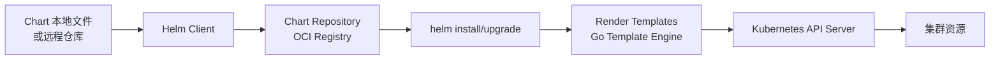
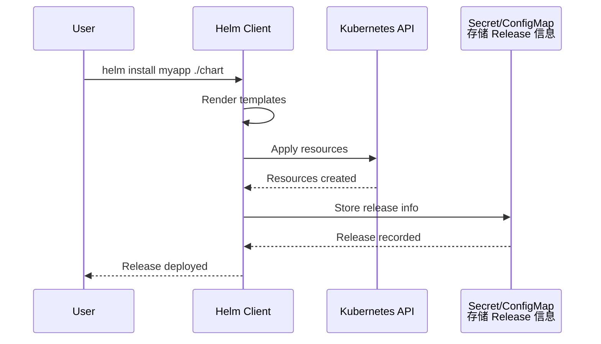
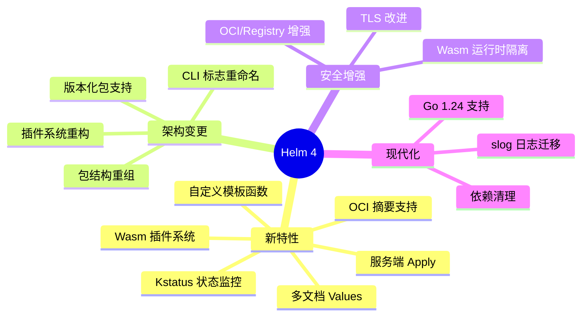
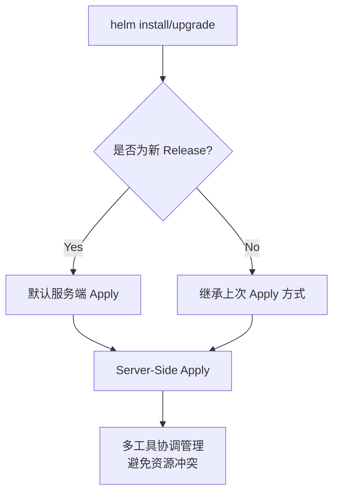

* Do not remove this line (it will not be displayed)
{:toc}


# Helm 是什么

[Helm](https://github.com/helm/helm) is a tool that streamlines installing and managing Kubernetes applications. Think of it like `apt`/`yum`/`homebrew` for Kubernetes. Helm is a tool for managing `Charts`. `Charts` are packages of pre-configured Kubernetes resources.

* `Helm` renders your templates and communicates with the Kubernetes API
* `Helm` runs on your laptop, CI/CD, or wherever you want it to run.
* `Charts` are `Helm` packages that contain at least two things:
  + A description of the package (`Chart.yaml`)
  + One or more templates, which contain Kubernetes manifest files
* `Charts` can be stored on disk, or fetched from remote chart repositories (like Debian or RedHat packages)


Use `Helm` to: (使用场景)

* Find and use [popular software packaged as Helm Charts](https://artifacthub.io/packages/search?kind=0) to run in Kubernetes
* Share your own applications as **Helm Charts**
* Create reproducible builds of your Kubernetes applications
* Intelligently manage your Kubernetes manifest files
* Manage releases of Helm packages


`Helm` 是 `Kubernetes` 的一个**包管理工具** (**The Kubernetes Package Manager**)，用来简化 `Kubernetes` 应用的部署和管理。可以把 `Helm` 比作 `CentOS` 的 `yum` 工具。 使用 `Helm` 可以完成以下事情：

* 管理 `Kubernetes manifest files`
* 管理 `Helm` 安装包 `Charts`
* 基于 `Chart` 的 `Kubernetes` 应用分发


# 基本概念

* `Chart`: 是 **Helm 管理的安装包**，里面包含需要部署的安装包资源。可以把 `Chart` 比作 CentOS `yum` 使用的 `rpm` 文件。每个 `Chart` 包含下面两部分：
  * 包的基本描述文件` Chart.yaml`
  * 放在 `templates` 目录中的一个或多个 `Kubernetes manifest` 文件模板
* `Release`: 是 `Chart` 的**部署实例**，一个 `Chart` 在一个 Kubernetes 集群上可以有多个 `Release`，即这个 `Chart` 可以被安装多次
* `Repository`: `Chart` 的仓库，用于发布和存储 `Chart`

使用 `helm create mychart` 创建一个名为 `mychart` 的示例，再使用 `tree mychart` 命令看一下 chart 的目录结构。


```bash
├── Chart.yaml
├── charts                      # 该目录保存其他依赖的 chart（子 chart）
├── templates                   # chart 配置模板，用于渲染最终的 Kubernetes YAML 文件
│   ├── NOTES.txt               # 用户运行 helm install 时候的提示信息
│   ├── _helpers.tpl            # 用于创建模板时的帮助类
│   ├── deployment.yaml         # Kubernetes deployment 配置
│   ├── ingress.yaml            # Kubernetes ingress 配置
│   ├── service.yaml            # Kubernetes service 配置
│   ├── serviceaccount.yaml     # Kubernetes serviceaccount 配置
│   └── tests
│       └── test-connection.yaml
└── values.yaml                 # 定义 chart 模板中的自定义配置的默认值，可以在执行 helm install 或 helm update 的时候覆盖
```


* `Chart.yaml`：用于描述这个 Chart 的基本信息，包括名字、描述信息以及版本等
* `values.yaml` ：用于存储 templates 目录中模板文件中用到变量的值。
* `charts`：目录里存放这个 chart 依赖的所有子 chart。
* `templates`： 目录里面存放所有 yaml 模板文件。
  + `NOTES.txt`：用于介绍 Chart 帮助信息， `helm install` 部署后展示给用户。例如：如何使用这个 Chart、列出缺省的设置等。
  + `_helpers.tpl`：放置模板助手的地方，可以在整个 chart 中重复使用


# Helm 工作原理

Helm 架构包含三个核心概念：

- **Chart**：包含部署 Kubernetes 应用所需全部资源定义的包（类似 RPM/DEB）
- **Config**：可合并到 Chart 中创建 Release 的配置信息
- **Release**：Chart 与特定 Config 组合形成的运行实例

Helm 由两部分组件构成：

- **Helm Client**（命令行工具）：负责与 Helm Library 交互，发起安装/升级/卸载请求
- **Helm Library**（Go 库）：封装所有 Helm 操作逻辑，与 Kubernetes API Server 通信，完成 Chart 与 Config 的组合构建、资源的安装/升级/卸载

Helm 使用 Kubernetes Secret 存储 Release 信息，无需独立数据库。

资源安装顺序（由 [Using Helm - helm.sh](https://helm.sh/docs/intro/using_helm/) 定义）：

Namespace → NetworkPolicy → ResourceQuota → LimitRange → PodSecurityPolicy → PodDisruptionBudget → ServiceAccount → Secret → ConfigMap → StorageClass → PersistentVolume → PersistentVolumeClaim → CustomResourceDefinition → ClusterRole → ClusterRoleBinding → Role → RoleBinding → Service → DaemonSet → Pod → ReplicationController → ReplicaSet → Deployment → StatefulSet → Job → CronJob → Ingress → APIService → MutatingWebhookConfiguration → ValidatingWebhookConfiguration



# Helm 与 Kubernetes 交互流程

Helm Client 接收用户命令后，先通过 Go Template Engine 渲染 Chart 模板，再与 Kubernetes API Server 交互完成资源创建，最后将 Release 信息持久化到集群内的 Secret/ConfigMap 中。




# [Quickstart Guide](https://helm.sh/docs/intro/quickstart/)

This guide covers how you can quickly get started using `Helm`.


## Prerequisites

The following prerequisites are required for a successful and properly secured use of `Helm`.

1. A Kubernetes cluster
2. Deciding what security configurations to apply to your installation, if any
3. Installing and configuring Helm.

Install Kubernetes or have access to a cluster

* You must have Kubernetes installed. For the latest release of Helm, we recommend the latest stable release of Kubernetes, which in most cases is the second-latest minor release.
* You should also have a local configured copy of `kubectl`.

See the [Helm Version Support Policy](https://helm.sh/docs/topics/version_skew/) for the maximum version skew supported between Helm and Kubernetes.

## Install Helm

Download a binary release of the Helm client. You can use tools like `homebrew`, or look at [the official releases page](https://github.com/helm/helm/releases).

For more details, or for other options, see [the installation guide](https://helm.sh/docs/intro/install/).

## Initialize a Helm Chart Repository

Once you have Helm ready, you can add a chart repository. Check [Artifact Hub](https://artifacthub.io/packages/search?kind=0) for available Helm chart repositories.

```bash
$ helm repo add bitnami https://charts.bitnami.com/bitnami
```


Once this is installed, you will be able to list the charts you can install:

```bash
$ helm search repo bitnami
NAME                             	CHART VERSION	APP VERSION  	DESCRIPTION
bitnami/bitnami-common           	0.0.9        	0.0.9        	DEPRECATED Chart with custom templates used in ...
bitnami/airflow                  	8.0.2        	2.0.0        	Apache Airflow is a platform to programmaticall...
bitnami/apache                   	8.2.3        	2.4.46       	Chart for Apache HTTP Server
bitnami/aspnet-core              	1.2.3        	3.1.9        	ASP.NET Core is an open-source framework create...
# ... and many more
```


## Install an Example Chart

To install a chart, you can run the `helm install` command. Helm has several ways to find and install a chart, but the easiest is to use the `bitnami` charts.

```bash
$ helm repo update              # Make sure we get the latest list of charts
$ helm install bitnami/mysql --generate-name
NAME: mysql-1612624192
LAST DEPLOYED: Sat Feb  6 16:09:56 2021
NAMESPACE: default
STATUS: deployed
REVISION: 1
TEST SUITE: None
NOTES: ...
```


In the example above, the `bitnami/mysql` chart was released, and the name of our new release is `mysql-1612624192`.

You get a simple idea of the features of this MySQL chart by running `helm show chart bitnami/mysql`. Or you could run `helm show all bitnami/mysql` to get all information about the chart.

Whenever you install a chart, a new release is created. So one chart can be installed multiple times into the same cluster. And each can be independently managed and upgraded.

The `helm install` command is a very powerful command with many capabilities. To learn more about it, check out the [Using Helm Guide](https://helm.sh/docs/intro/using_helm/)


## Learn About Releases

It's easy to see what has been released using Helm:

```bash
$ helm list
NAME            	NAMESPACE	REVISION	UPDATED                             	STATUS  	CHART      	APP VERSION
mysql-1612624192	default  	1       	2021-02-06 16:09:56.283059 +0100 CET	deployed	mysql-8.3.0	8.0.23
```


The `helm list` (or `helm ls`) function will show you a list of all deployed releases.

## Uninstall a Release

To uninstall a release, use the `helm uninstall` command:

```bash
$ helm uninstall mysql-1612624192
release "mysql-1612624192" uninstalled
```


This will uninstall `mysql-1612624192` from Kubernetes, which will remove all resources associated with the release as well as the release history.

If the flag `--keep-history` is provided, release history will be kept. You will be able to request information about that release:

```bash
$ helm status mysql-1612624192
Status: UNINSTALLED
...
```


Because Helm tracks your releases even after you've uninstalled them, you can audit a cluster's history, and even undelete a release (with `helm rollback`).

## Reading the Help Text

To learn more about the available Helm commands, use `helm help` or type a command followed by the `-h` flag:

```bash
$ helm get -h
```


# Helm 4 新特性

> Helm 4 是继 Helm 3 之后的重大版本更新，引入了一系列新特性、架构改进和安全增强。
{: .prompt-tip }

## 主要更新摘要



## Breaking Changes

> Helm 4 存在以下 Breaking Changes，升级前请注意：
>
> - **Post-renderers 作为插件实现**：`--post-renderer` 不再支持直接传递可执行文件，需传递插件名称
> - **Registry 登录格式变更**：`helm registry login` 不再接受完整 URL，仅需传入域名
{: .prompt-warning }

## CLI 标志重命名

| 旧标志 | 新标志 | 说明 |
|--------|--------|------|
| `--atomic` | `--rollback-on-failure` | 失败时自动回滚 |
| `--force` | `--force-replace` | 强制替换资源 |

## 服务端 Apply

Helm 4 默认使用**服务端 Apply**（Server-Side Apply），提供更好的冲突解决能力：



## OCI 镜像支持

OCI（Open Container Initiative）是 Docker 提出的容器镜像分发标准，定义了镜像格式和分发 API。Helm 的 OCI 支持意味着 Chart 可以像 Docker 镜像一样存储到 OCI Registry（如 `ghcr.io`、`docker.io`、`Harbor` 等）中，通过镜像摘要（`sha256`）唯一标识版本。

```bash
# 登录 OCI Registry（复用镜像仓库凭证，无需单独配置）
helm registry login registry.example.com

# 通过摘要安装（确保供应链安全，每次获取的 Chart 内容完全一致）
helm install myapp oci://registry.example.com/charts/app@sha256:abc123...

# 推送 Chart 到 OCI Registry
helm push mychart-1.0.0.tgz oci://registry.example.com/charts
```

| 对比项 | 传统 Chart 仓库（HTTP） | OCI Registry |
|--------|------------------------|--------------|
| **认证** | 需单独为 Chart 仓库配置认证 | 复用已有的镜像仓库凭证 |
| **版本标识** | 语义化版本（`1.0.0`） | SHA256 摘要（防篡改） |
| **签名验证** | 需额外工具（如 GPG） | 可结合 Cosign 等工具统一签名 |
| **工具链** | 专用 `helm repo` 命令 | 与镜像管理工具体系统一 |

> OCI 支持使得 Chart 的分发与 Docker 镜像一致，便于统一的镜像仓库管理和签名验证。
{: .prompt-info }

## 多文档 Values

将复杂的配置拆分到多个 YAML 文件：

```bash
# 使用多文档 values
helm install myapp ./mychart -f base.yaml -f dev.yaml
```

## Kstatus 集成

Helm 4 集成 `kstatus` 提供更详细的资源状态监控：

```bash
# 安装后查看详细状态
helm status myapp -v

# 查看资源就绪状态
kubectl rollout status deployment/myapp
```

## Helm 2 / 3 / 4 版本演进

了解 Helm 各版本之间的差异，有助于理解当前架构的设计背景。

### Helm 2 → Helm 3：移除 Tiller

Helm 3 最重要的架构变化是移除 Tiller（服务端组件），解决了 Helm 2 在多租户环境中的权限混乱问题：

| 特性 | Helm 2 | Helm 3 |
|------|--------|--------|
| **Tiller** | 服务端组件，运行在集群内，负责 Release 管理 | 移除 Tiller，Client 直接与 API Server 通信 |
| **Release 存储** | Tiller 的 ConfigMap（集群内） | Kubernetes Secret（集群内） |
| **默认 Chart 仓库** | 内置 `stable` 仓库 | 无默认仓库，需手动添加 |
| **Chart 依赖** | 独立的 `requirements.yaml` | 合并到 `Chart.yaml` 的 `dependencies` |
| **OCI 支持** | 实验性 | 正式支持 |
| **库类型 Chart** | 通过 `requirements.yaml` 引用 | 原生支持 `type: library` |
| **Post-renderer** | 不支持 | Helm 3.1+ 支持，允许在渲染后自定义 manifest |

### Helm 3 → Helm 4：插件重构与 Wasm

Helm 4 是自 2019 年 Helm 3 以来的重大版本，官方称改动幅度小于 Helm 2 到 3 的迁移。v4.0.0 发布于 2025 年 11 月，主要变化包括（来源：[Helm v4.0.0 Release Notes](https://github.com/helm/helm/releases/tag/v4.0.0)）：

| 特性 | Helm 3 | Helm 4 |
|------|--------|--------|
| **插件系统** | 可执行文件插件 | 重构为支持 WebAssembly (Wasm) 插件 |
| **Post-renderer** | `--post-renderer` 传递可执行文件路径 | Post-renderer 须以插件形式传递（`--post-renderer` 改为传插件名） |
| **服务端 Apply** | 默认服务端 Apply（Helm 4 起） | 默认服务端 Apply，继承 Helm 3.10+ 行为 |
| **OCI 镜像支持** | 3.8+ 正式支持 | 继续支持，OCI Registry 登录格式变更（仅传域名） |
| **资源等待** | 基于轮询 | 基于 kstatus 状态监控，更精确的就绪检测 |
| **日志框架** | 标准库 log | 迁移至 slog，支持与现代日志系统集成 |
| **SDK API** | 单一 Chart API 版本 | 更新 SDK，支持多 Chart API 版本（实验性 v3 即将推出） |
| **构建可重现性** | 无内置支持 | Chart Archive 支持可重现构建（`helm package --sign`） |
| **CLI 标志** | `--atomic` / `--force` | `--rollback-on-failure` / `--force-replace`（旧标志保留但标记废弃） |

> Helm 4 与 Kubernetes 的版本兼容性：Helm 4 编译时基于 Kubernetes 1.35，支持 n-3 范围内版本（即 1.35 ~ 1.32）。v4.1.x 基于 Kubernetes 1.35，v4.0.x 基于 Kubernetes 1.34（来源：[Helm Version Support Policy](https://helm.sh/docs/topics/version_skew/)）。


## 升级检查清单

> Helm 4 升级前检查清单：
>
> - [ ] 测试现有 Charts 与 Helm 4 的兼容性
> - [ ] 更新脚本中的 CLI 标志（`--atomic` → `--rollback-on-failure`）
> - [ ] 测试 Post-renderer 工作流
> - [ ] 验证 OCI Registry 认证
> - [ ] 更新 CI/CD 管道配置
{: .prompt-warning }

---

# [Glossary](https://helm.sh/docs/glossary/)

## Chart

A Helm package that contains information sufficient for installing a set of Kubernetes resources into a Kubernetes cluster.

Charts contain a `Chart.yaml` file as well as templates, default values (`values.yaml`), and dependencies.

Charts are developed in a well-defined directory structure, and then packaged into an archive format called a chart archive.

## Chart Archive

A chart archive is a tarred and gzipped (and optionally signed) chart.

## Chart Dependency (Subcharts)

* **Soft dependency**: A chart may simply not function without another chart being installed in a cluster. Helm does not provide tooling for this case. In this case, dependencies may be managed separately.

* **Hard dependency**: A chart may contain (inside of its `charts/` directory) another chart upon which it depends. In this case, installing the chart will install all of its dependencies. In this case, a chart and its dependencies are managed as a collection.

When a chart is packaged (via `helm package`) all of its hard dependencies are bundled with it.

## Chart Version

Charts are versioned according to the [SemVer 2 spec](https://semver.org/). A version number is required on every chart.

## Chart.yaml

Information about a chart is stored in a special file called `Chart.yaml`. Every chart must have this file.

## Helm (and helm)

`Helm` is the package manager for Kubernetes. As an operating system package manager makes it easy to install tools on an OS, Helm makes it easy to install applications and resources into Kubernetes clusters.

While `Helm` is the name of the project, the command line client is also named `helm`. By convention, when speaking of the project, `Helm` is capitalized. When speaking of the client, `helm` is in lowercase.


## Release

When a chart is installed, the Helm library creates a release to track that installation.

A single chart may be installed many times into the same cluster, and create many different releases. For example, one can install three PostgreSQL databases by running `helm install` three times with a different release name.

## Release Number (Release Version)

A single release can be updated multiple times. A sequential counter is used to track releases as they change. After a first `helm install`, a release will have release number 1. Each time a release is upgraded or rolled back, the release number will be incremented.


## Repository (Repo, Chart Repository)

Helm charts may be stored on dedicated HTTP servers called chart repositories (repositories, or just repos).

A chart repository server is a simple HTTP server that can serve an `index.yaml` file that describes a batch of charts, and provides information on where each chart can be downloaded from. (Many chart repositories serve the charts as well as the `index.yaml` file.)

A Helm client can point to zero or more chart repositories. By default, Helm clients are not configured with any chart repositories. Chart repositories can be added at any time using the `helm repo add` command.

## Values (Values Files, values.yaml)

Values provide a way to override template defaults with your own information.

Helm Charts are "parameterized", which means the chart developer may expose configuration that can be overridden at installation time. For example, a chart may expose a username field that allows setting a user name for a service.

These exposed variables are called values in Helm parlance.

Values can be set during `helm install` and `helm upgrade` operations, either by passing them in directly, or by using a `values.yaml` file.

---

# 最佳实践

## Chart 开发规范

### 1. 版本命名

```yaml
# Chart 版本 (SemVer 2)
version: 1.0.0        # 正式发布
version: 1.0.0-alpha  # 预发布
version: 1.0.0+build  # 构建元数据

# 应用版本
appVersion: "1.16.0"  # 对应应用的实际版本
```

### 2. 资源命名


```yaml
# 使用模板函数生成唯一名称
metadata:
  name: {{ include "mychart.fullname" . }}-{{ .Values.env }}

# 避免硬编码
# 错误 name: myapp-prod
# 正确 name: {{ .Release.Name }}-{{ .Values.env }}
```


### 3. 资源限制

> 生产环境必须设置资源限制，避免单个应用耗尽集群资源。
{: .prompt-tip }

```yaml
resources:
  requests:
    memory: "64Mi"  # 调度时分配的最小内存
    cpu: "50m"      # 调度时分配的最小 CPU（1核=1000m）
  limits:
    memory: "128Mi" # 容器可使用的最大内存，超过会被 OOM Kill
    cpu: "200m"     # 容器可使用的最大 CPU，超过会被限流
```

### 4. 健康检查

```yaml
livenessProbe:       # 检测容器是否存活，失败会重启容器
  httpGet:
    path: /health
    port: 8080
  initialDelaySeconds: 30  # 启动后等待 30 秒再开始探测
  periodSeconds: 10        # 每 10 秒探测一次

readinessProbe:       # 检测容器是否就绪，失败会从 Service 摘除流量
  httpGet:
    path: /ready
    port: 8080
  initialDelaySeconds: 5   # 启动后等待 5 秒再开始探测
  periodSeconds: 5         # 每 5 秒探测一次
```

### 5. Pod 安全

```yaml
securityContext:       # 容器级别安全配置
  runAsNonRoot: true   # 禁止以 root 用户运行容器
  runAsUser: 1000      # 指定容器进程运行用户 UID
  fsGroup: 1000        # 容器内文件属组，允许该组写入挂载卷

podSecurityContext:   # Pod 级别安全配置
  seccompProfile:
    type: RuntimeDefault  # 使用容器运行时默认 seccomp 配置文件
```

## Helm Hooks

Helm 提供生命周期钩子，在 Release 安装、升级、卸载、回滚的关键节点执行自定义操作。通过在 Kubernetes资源（如 Job）上添加注解实现：

| 注解 | 执行时机 |
|------|---------|
| `pre-install` / `post-install` | 安装前 / 安装后 |
| `pre-upgrade` / `post-upgrade` | 升级前 / 升级后 |
| `pre-delete` / `post-delete` | 卸载前 / 卸载后 |
| `pre-rollback` / `post-rollback` | 回滚前 / 回滚后 |
| `test` | 执行 `helm test` 时 |

```yaml
# 迁移 Job 示例（pre-upgrade / pre-install 钩子）
apiVersion: batch/v1
kind: Job
metadata:
  name: db-migration
  annotations:
    helm.sh/hook: pre-upgrade,pre-install
    helm.sh/hook-weight: "-1"       # 数值越小越早执行
    helm.sh/hook-delete-policy: before-hook-creation,hook-succeeded  # 执行成功后清理
spec:
  backoffLimit: 0                  # 失败不重试，直接中止操作
```

典型场景：
- **数据库迁移**：升级前执行数据迁移脚本
- **备份**：升级后自动备份数据
- **配置验证**：安装后验证配置正确性

## Helm Chart Tests

Chart 测试是带有 `helm.sh/hook: test` 注解的 Kubernetes Job 资源，用于验证 Chart 安装的正确性：

```yaml
apiVersion: v1
kind: Pod
metadata:
  name: test-connection
  annotations:
    helm.sh/hook: test
spec:
  containers:
    - name: wget
      image: busybox
      command: ['wget', '-q', 'myapp:80/health']
  restartPolicy: Never
```

执行测试：`helm test <release-name>`，测试 Job 会以 exit code 0 表示成功。

## Library Charts

Library Chart 是一种特殊 Chart，不包含 Kubernetes 资源定义，仅提供可复用的模板函数供其他 Chart 引用。通过 `Chart.yaml` 中的 `type: library` 声明：

```yaml
# Chart.yaml
name: mylib
version: 1.0.0
type: library
```

其他 Chart 可通过 `{{ include "mylib.labels" . }}` 引用其 `_helpers.tpl` 中定义的模板函数，避免在多个 Chart 中重复编写相同的标签、选择器等配置。

## 仓库管理

### 使用私有仓库

```bash
# 添加认证信息
helm registry login registry.example.com -u username

# 使用 Secret 存储认证
kubectl create secret docker-registry regcred \
  --docker-server=registry.example.com \
  --docker-username=user \
  --docker-password=pass
```

### Values 合并优先级

Helm 在 `helm install`/`helm upgrade` 时按从低到高优先级合并多个 Values 来源：

1. Chart 内置 `values.yaml`（最低）
2. 通过 `-f` 指定的配置文件（按命令行顺序，左侧先合并）
3. 通过 `--set` / `--set-file` / `--set-string` 指定的参数（最高）

```bash
# 示例：多层叠加配置
helm install myapp ./mychart \
  -f base.yaml \      # 基础配置（最先合并）
  -f prod.yaml \      # 生产环境覆盖（其次合并）
  --set image.tag=v2  # 命令行最高优先级（最后合并）
```

`--set` 指定的布尔值可通过 `--set-json`、`--set-string`、`--set-file` 分别以 JSON 字符串、纯字符串、文件内容形式传入。


```yaml
# Chart.yaml
dependencies:
  - name: postgresql
    version: "12.x.x"       # 语义化版本，Helm 会解析范围
    repository: https://charts.bitnami.com/bitnami  # Chart 仓库地址（必须加 @repo 添加）
    condition: postgresql.enabled  # 条件开关，false 时跳过该依赖
```

```bash
# 更新依赖
helm dependency update ./mychart

# 构建依赖
helm dependency build ./mychart
```

## 安全建议

> 生产环境务必遵循以下安全实践：

1. **使用命名空间隔离**：每个应用使用独立命名空间
2. **限制 RBAC 权限**：使用最小权限原则配置 `ServiceAccount`
3. **启用 Pod 安全策略**：使用 `PodSecurityPolicy` 或 `Pod Security Standards`
4. **定期更新 Chart**：关注安全漏洞和依赖更新
5. **验证 Chart 签名**：使用 `--verify` 验证 Chart 完整性
{: .prompt-warning }


# 常见问题

## 1. Release 名称冲突

```bash
# 错误：名称已被占用
# Error: cannot re-use a name that is still in use

# 解决方案：使用新名称或卸载旧 Release
helm uninstall old-release
helm install new-release ./mychart
```

## 2. 模板渲染失败

```bash
# 使用 --dry-run 调试
helm install --dry-run --debug myapp ./mychart

# 本地渲染模板
helm template myapp ./mychart
```

## 3. 依赖下载失败

```bash
# 更新仓库索引
helm repo update

# 清理并重新添加
helm repo remove bitnami
helm repo add bitnami https://charts.bitnami.com/bitnami
```

## 4. 集群连接问题

```bash
# 验证 kubeconfig
kubectl config current-context
kubectl cluster-info

# 指定 kubeconfig 文件
helm install myapp ./mychart --kubeconfig=/path/to/config
```


# Refer

## 官方文档

- [Helm 官方文档](https://helm.sh/docs/)
- [Helm GitHub 仓库](https://github.com/helm/helm)
- [Helm Architecture](https://helm.sh/docs/topics/architecture) - 架构概览（Chart/Release/Config 三概念、Client/Library 组件、Secret 存储）
- [Using Helm](https://helm.sh/docs/intro/using_helm/) - 核心用法（search/install/upgrade/rollback/uninstall/repo）及资源安装顺序
- [Artifact Hub](https://artifacthub.io/) - Helm Charts 市场
- [Helm 社区](https://github.com/helm/community)
- [快速入门指南](https://helm.sh/docs/intro/quickstart/) - 快速上手 Helm
- [Helm 版本支持策略](https://helm.sh/docs/topics/version_skew/) - Helm 与 Kubernetes 版本兼容性
- [Helm Glossary](https://helm.sh/docs/glossary/)
- [The Chart Best Practices Guide](https://helm.sh/docs/chart_best_practices/)


## 中文参考

- [是时候使用 Helm 了：Helm, Kubernetes 的包管理工具](https://www.kubernetes.org.cn/3435.html) - Kubernetes.io 中文社区
- [Jimmy Song's Blog - Helm 4 发布与插件重构](https://jimmysong.io/zh/blog/helm-4-delivery-and-plugin-rebuild/)

## 进阶阅读

- [Helm Chart 开发指南](https://helm.sh/zh/docs/chart_template_guide/)
- [Helm 插件开发](https://helm.sh/docs/topics/plugins/)
- [Kubernetes Ingress Nginx 管理](https://kubernetes.github.io/ingress-nginx/)
- [Bitnami Charts 仓库](https://github.com/bitnami/charts)

## 相关工具

| 工具 | 用途 |
|------|------|
| [Helmfile](https://github.com/helmfile/helmfile) | 多环境 Helm 部署编排 |
| [Flagger](https://docs.flagger.app/) | 渐进式交付与金丝雀发布 |
| [Argo CD](https://argoproj.github.io/argo-cd/) | GitOps 持续交付 |
| [Flux](https://fluxcd.io/) | 云原生持续交付 |


