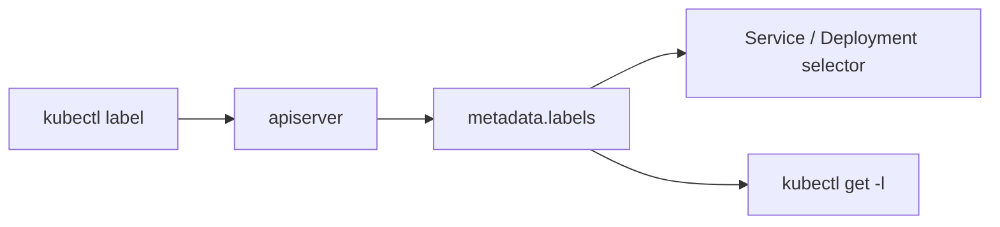
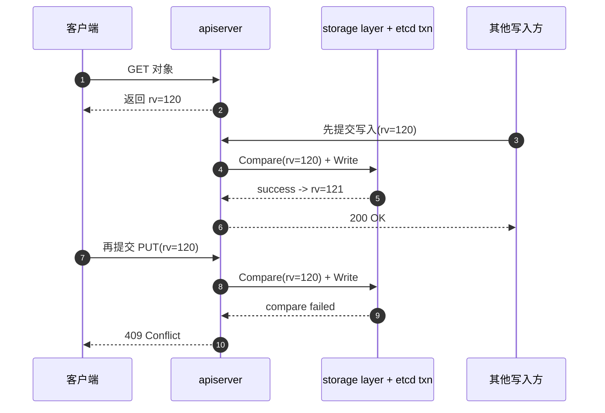
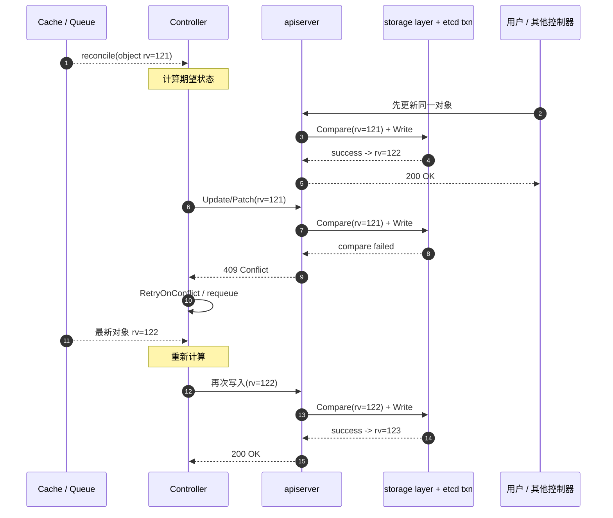
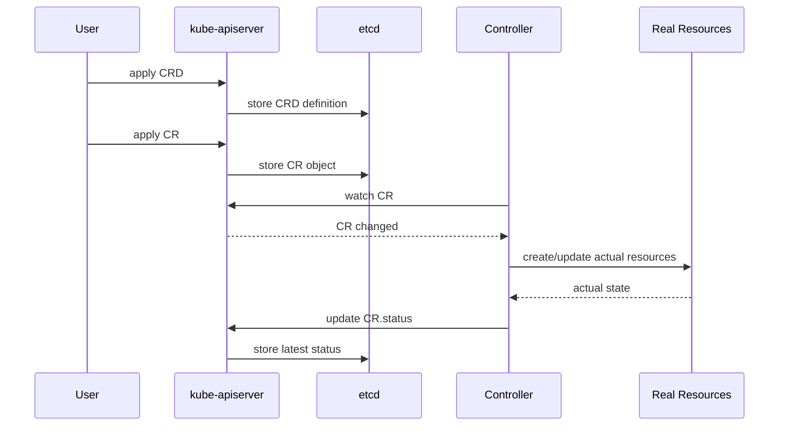

* Do not remove this line (it will not be displayed)
{:toc}


关键字：容器编排，Kubernetes，云原生

这篇文章按照「基础概念 -> 核心对象 -> 存储与资源 -> 安装与工具 -> 实战排障 -> 附录」的顺序重新整理，既可以顺着读，也方便按主题查阅。

如果你是第一次系统学习 Kubernetes，可以按下面这个顺序阅读：

1. 先看「背景介绍」和「基本架构」，建立控制面、节点、Pod 调度的整体认知。
2. 再看「核心对象与网络访问」「存储与持久化」「工作负载、调度与资源管理」，这是日常使用最核心的主体。
3. 接着看「应用配置、健康检查与弹性」以及「身份、权限、网络隔离与可用性」，把“能跑”补成“跑得稳、管得住”。
4. 最后把「安装与工具」「实战排障」「附录」当作速查和经验补充。

# 背景介绍

## 容器编排

容器技术的核心概念是**容器，镜像，仓库**。使用这三大基本要素就可以轻松地完成应用的打包，分发工作，实现“一次分发，到处运行”的梦想。不过，当要在服务器集群里大规模实施的时候，却会发现容器技术的创新只是解决了运维部署工作中的一部分。**除此之外，还包括服务发现，负载均衡，状态监控，健康检查，动态扩缩容等**。

这些容器之上的管理，调度工作，就是所谓的“**容器编排**”（Container Orchestration）。面对单机上的几个容器，“人肉”编排调度还可以应付，但如果面对规模成千上万的容器，处理它们之间的复杂联系就必须依靠计算机了，而目前计算机用来调度管理的“事实标准”，就是 [Kubernetes](https://kubernetes.io/docs/tutorials/kubernetes-basics/)。

## Kubernetes

作为世界上最大的搜索引擎，Google 拥有数量庞大的服务器集群，为了提高资源利用率和部署运维效率，专门开发了一个集群管理系统 [Borg](https://kubernetes.io/blog/2015/04/borg-predecessor-to-kubernetes/)。根据 Kubernetes 官方博客的介绍，Google 在内部已经运行容器化工作负载超过十年，从 Web 前端、状态服务，到 Bigtable、Spanner，再到 MapReduce 这类批处理框架，几乎所有核心系统都运行在容器之上。Kubernetes 并不是凭空出现的新系统，而是**直接承袭 Borg 经验**做出来的开源化产品，很多早期 Kubernetes 开发者本身就来自 Borg 项目。

从设计继承关系上看，Kubernetes 的一些核心抽象也能清楚看到 Borg 的影子：

* **Pod**：对应 Borg 中类似的 `alloc` 思路，强调“把需要协同运行的容器作为一个调度单元”。
* **Service**：继承了 Borg 里对服务发现和负载均衡的长期实践经验。
* **Label / Selector**：比 Borg 里的 Job / Task 分组方式更灵活，但设计动机是一致的，都是为了更方便地描述、筛选和批量管理一组工作负载。
* **IP-per-Pod**：Kubernetes 让每个 Pod 拥有独立 IP，背后也是对 Borg 时代端口管理复杂度的一次经验性改进。

在 2014 年，因为之前在发表 MapReduce，BigTable，GFS 时吃过亏，被 Yahoo 开发的 Hadoop 占领了市场，所以 Google 决定借着 Docker 的“东风”，在发表论文的同时，把 C++ 开发的 Borg 系统用 Go 语言重写并开源，于是 `Kubernetes` 就这样诞生了。然后，在 2015 年，Google 又联合 Linux 基金会成立了 CNCF (Cloud Native Computing Foundation，云原生基金会)，并把 Kubernetes 捐献出来作为种子项目。有了 Google 和 Linux 这两大家族的保驾护航，再加上宽容开放的社区，Kubernetes 仅用了两年的时间就打败了同期的竞争对手 `Apache Mesos` 和 `Docker Swarm`，成为了这个领域的唯一霸主。

简单来说，Kubernetes 就是一个生产级别的容器编排平台和集群管理系统，不仅能够创建，调度容器，还能够监控，管理服务器，从而可以具备运维海量计算节点，即云计算的能力。

结合 [Kubernetes 官网](https://kubernetes.io/) 的定义来看，它是一个用于自动化部署、扩缩容和管理容器化应用的开源系统，会把构成应用的一组容器组织成更易于管理和服务发现的逻辑单元，并吸收 Google 大规模生产实践以及社区中的成熟经验。


从官网强调的能力来看，Kubernetes 的优势主要体现在以下几个方面：

* Planet Scale
  + 继承超大规模容器调度经验，集群规模扩大时不需要线性增加运维团队规模。
* Never Outgrow
  + 无论是本地测试还是企业级生产环境，都可以用一致的方式去部署和管理应用。
* Run Anywhere
  + 作为开源平台，它既能运行在本地机房，也能运行在混合云、公有云环境里，方便按需迁移工作负载。

> Borg 系统的名字来自于《星际迷航》（Star Trek）里的外星人种族，Kubernetes 在开发之初为了延续与 Borg 的关系，使用了一个代号 Seven of Nine ，即 Borg 与地球文明之间联络人的名字，隐喻从内部系统到开源项目，所以 Kubernetes 的标志有七条轮辐。Kubernetes 这个词来自希腊语，意思是“舵手”，“领航员”，可以理解成是操控着满载集装箱（容器）大船的指挥官。Kubernetes 有时候会缩写成 “k8s”，这个是因为 k 和 s 之间有 8 个字符，类似的还有 i18n (internationalization)

# Kubernetes 的基本架构

操作系统用来管理软件和硬件。Kubernetes 可以说是一个集群级别的操作系统，主要功能就是资源管理和作业调度。操作系统的一个重要功能就是**抽象**，从繁琐的底层事务中抽象出一些简洁的概念，然后基于这些概念去管理系统资源。

Kubernetes 采用了现今流行的“控制面 / 数据面”（Control Plane / Data Plane）架构，集群里的计算机被称为“节点”（Node），可以是实机也可以是虚机，少量的节点用作控制面来执行集群的管理维护工作，其他的大部分节点都被划归数据面，用来跑业务应用。

控制面的节点在 Kubernetes 里叫做 Master Node，一般简称为 Master，它是整个集群里最重要的部分，可以说是 Kubernetes 的大脑和心脏。

数据面的节点叫做 Worker Node，一般就简称为 Worker 或者 Node，相当于 Kubernetes 的手和脚，在 Master 的指挥下干活。

Node 的数量非常多，构成了一个资源池，Kubernetes 就在这个池里分配资源，调度应用。因为资源被“池化”了，所以管理也就变得比较简单，可以在集群中任意添加或者删除节点。

**Kubernetes 的大致工作流程：**

* 每个 Node 上的 kubelet 会定期向 apiserver 上报节点状态，apiserver 再存到 etcd 里。
* 每个 Node 上的 kube-proxy 实现了 TCP/UDP 反向代理，让容器对外提供稳定的服务。
* scheduler 通过 apiserver 得到当前的节点状态，调度 Pod，然后 apiserver 下发命令给某个 Node 的 kubelet，kubelet 调用 container-runtime 启动容器。
* controller-manager 也通过 apiserver 得到实时的节点状态，监控可能的异常情况，再使用相应的手段去调节恢复。

> 补充：
> 1. 相比早期的架构，目前 Kubernetes 在控制面里多出了一个 cloud-controller-manager，顾名思义，是用来与特定云厂商连接进而控制 Kubernetes 对象的。
> 2. 为了确保控制面的高可用，Kubernetes 集群里都会部署多个 Master 节点，数量一般会是奇数（3/5/7），这是由 etcd 的特性决定的。
> 3. etcd 由 CoreOS 公司开发，基于类 Paxos 的 Raft 算法实现数据一致性。


## 内部结构

Kubernetes 的节点内部也具有复杂的结构，是由很多的模块构成的，这些模块又可以分成**组件（Component）**和**插件（Addon）**两类。

### Master 的组件

Master 里有 4 个组件，分别是 `apiserver`、`etcd`、`scheduler`、`controller-manager`。


* apiserver 是 Master 节点，同时也是整个 Kubernetes 系统的唯一入口，它对外公开了一系列的 RESTful API，并且加上了验证、授权等功能，所有其他组件都只能和它直接通信，可以说是 Kubernetes 里的联络员。
* etcd 是一个高可用的分布式 Key-Value 数据库，用来持久化存储系统里的各种资源对象和状态，相当于 Kubernetes 里的配置管理员。注意它只与 apiserver 有直接联系，也就是说任何其他组件想要读写 etcd 里的数据都必须经过 apiserver。
* scheduler 负责容器的编排工作，检查节点的资源状态，把 Pod 调度到最适合的节点上运行，相当于部署人员。因为节点状态和 Pod 信息都存储在 etcd 里，所以 scheduler 必须通过 apiserver 才能获得。
* controller-manager 负责维护容器和节点等资源的状态，实现故障检测、服务迁移、应用伸缩等功能，相当于监控运维人员。同样地，它也必须通过 apiserver 获得存储在 etcd 里的信息，才能够实现对资源的各种操作。

这 4 个组件也都被容器化了，运行在集群的 Pod 里，可以用 kubectl 来查看它们的状态：

```text
$ kubectl get pod -n kube-system
NAME                               READY   STATUS             RESTARTS          AGE
coredns-64897985d-256jm            0/1     CrashLoopBackOff   320 (4m29s ago)   23h
etcd-minikube                      1/1     Running            0                 23h
kube-apiserver-minikube            1/1     Running            0                 23h
kube-controller-manager-minikube   1/1     Running            0                 23h
kube-proxy-hvmcp                   1/1     Running            0                 23h
kube-scheduler-minikube            1/1     Running            0                 23h
storage-provisioner                1/1     Running            1 (23h ago)       23h
```


> 注意：命令行里要用 -n kube-system 参数，表示检查 kube-system 名字空间里的 Pod

### Node 的组件

Node 里的 3 个组件，分别是 kubelet、kube-proxy、container-runtime

* kubelet 是 Node 的代理，负责管理 Node 相关的绝大部分操作，Node 上只有它能够与 apiserver 通信，实现状态报告、命令下发、启停容器等功能，相当于是 Node 上的一个“小管家”。
* kube-proxy 的作用有点特别，它是 Node 的网络代理，只负责管理容器的网络通信，简单来说就是为 Pod 转发 TCP/UDP 数据包，相当于是专职的“小邮差”。
* container-runtime 是容器和镜像的实际使用者，在 kubelet 的指挥下创建容器，管理 Pod 的生命周期，是真正干活的“苦力”。

很多人第一次看到这里时，都会自然产生一个问题：**为什么 `kubelet` 和 `kube-proxy` 要拆成两个独立组件，而不是做成一个统一模块？**

如果从架构设计的角度来看，这其实不是“把功能拆碎了”，而是刻意把 Node 上两条完全不同的控制链路分开了。

一条是**工作负载执行链路**，也就是“怎样把 Pod 真正跑起来”。这条链路由 `kubelet` 主导，它要和 apiserver 同步期望状态，再去协调容器运行时、镜像拉取、Volume 挂载、探针执行、Pod 生命周期和状态回报。换句话说，`kubelet` 关注的是“进程和 Pod 能不能正确运行”。

另一条是**服务转发链路**，也就是“流量怎样稳定地找到 Pod”。这条链路由 `kube-proxy` 主导，它关注的是 Service、Endpoints / EndpointSlice，以及 iptables / IPVS / nftables 这些四层转发规则。它并不负责把 Pod 创建出来，而是负责在 Pod 已经存在的前提下，让网络访问能够正确落到后端实例上。

把这两条链路拆开，首先是为了维持清晰的**职责边界**。如果把 `kubelet` 和 `kube-proxy` 合成一个模块，那么同一个进程就要同时处理容器、存储、探针、状态同步和网络转发，既耦合了生命周期管理，也耦合了网络编排，复杂度会明显上升。Kubernetes 的设计一直强调控制器按职责拆分，节点侧也延续了这个思路。

其次，拆分能够带来更好的**故障隔离**。`kube-proxy` 出问题，通常先影响的是 Service 转发；`kubelet` 出问题，影响的是 Pod 创建、探针执行和状态回报。两者独立后，故障域会更清楚，排障路径也更直接。实践里常见的判断方式就是：Pod 起不来先看 `kubelet`，Service 不通先看 `kube-proxy`。如果把它们揉成一个大模块，日志、指标和故障影响面都会混在一起。

再往前看一步，这种拆分也让 Kubernetes 保持了更好的**演进能力**。`kubelet` 基本是每个节点都必须存在的执行代理，但 `kube-proxy` 并不是唯一答案。很多集群已经开始用 eBPF 方案替代它，例如 Cilium 的 kube-proxy replacement。也就是说，`kubelet` 更像是节点执行面的核心基座，而 `kube-proxy` 更像是 Service 数据面的一个可替换实现。仅从这一点看，它们也不适合被焊死成一个不可分割的统一服务。

另外，两者的**权限模型和实现依赖**也不一样。`kubelet` 需要接触容器运行时、文件系统、卷、镜像，强依赖 CRI、CSI、CNI 等节点执行链路；`kube-proxy` 更依赖 Linux 网络栈以及 iptables / IPVS / nftables 等机制，核心能力在于修改和维护网络规则。虽然两者都属于高权限组件，但它们的风险边界并不相同，拆开后更容易做审计、收敛影响范围，也更符合模块化设计。

所以，从设计思路上可以把它们概括成一句话：`kubelet` 管的是“**进程和 Pod**”，`kube-proxy` 管的是“**流量和 Service**”。它们天然就是两个子系统，分开实现比做成一个“大而全”的节点代理更合理。

**这 3 个组件中只有 kube-proxy 被容器化了，而 kubelet 因为必须要管理整个节点，容器化会限制它的能力，所以它必须在 container-runtime 之外运行。minikube ssh 登录到节点，可以用 `docker ps | grep kube-proxy` 看到 kube-proxy，而 kubelet 用 `docker ps` 是找不到的，需要用操作系统的 `ps` 命令查看**。

> 注意：因为 Kubernetes 的定位是容器编排平台，所以它没有限定 container-runtime 必须是 Docker，完全可以替换成任何符合标准的其他容器运行时，例如 containerd、CRI-O 等


### 插件（Addons）

只要服务器节点上运行了 apiserver、scheduler、kubelet、kube-proxy、container-runtime 等组件，就可以说是一个功能齐全的 Kubernetes 集群了。不过就像 Linux 一样，操作系统提供的基础功能虽然“可用”，但想达到“好用”的程度，还是要再安装一些附加功能，这在 Kubernetes 里就是插件（Addon）。

由于 Kubernetes 本身的设计非常灵活，所以就有大量的插件用来扩展、增强它对应用和集群的管理能力。minikube 也支持很多的插件，使用命令 `minikube addons list` 就可以查看插件列表：


通常必备的插件有 DNS 和 Dashboard。只要在 minikube 环境里执行一条简单的命令 `minikube dashboard`，就可以自动用浏览器打开 Dashboard 页面，而且还支持中文。


# 核心对象与网络访问

这一节先看 Service。它是 Kubernetes 里最基础也最常用的网络抽象之一，后面的 Ingress 排障和工作负载发布都会频繁用到它。

Service 是 Kubernetes 的一种抽象：一个 Pod 的逻辑分组，一种可以访问它们的策略，通常称为微服务。这一组 Pod 能够被 Service 访问到，通常是通过 Label Selector 实现。

## Service 类型

* `ClusterIP`: 提供一个集群内部的虚拟 IP 以供 Pod 访问 (Service 默认类型)

* `NodePort`: Pod 在调度到的 Node 上打开一个端口以供外部访问

* `LoadBalancer`: 在 NodePort 的基础上，借助 cloud provider 创建一个外部负载均衡器，并将请求转发到 NodePort

* `ExternalName`: 把集群外部的服务引入到集群内部来，在集群内部直接使用


关于 Service 的更详细说明，还可以参考 [Kubernetes Handbook 中的 Service 章节](https://jimmysong.io/kubernetes-handbook/concepts/service.html)。

## Namespace、Label、Annotation 与 Selector

英文原文：

* [Namespaces | Kubernetes](https://kubernetes.io/docs/concepts/overview/working-with-objects/namespaces/)
* [Labels and Selectors | Kubernetes](https://kubernetes.io/docs/concepts/overview/working-with-objects/labels/)
* [Annotations | Kubernetes](https://kubernetes.io/docs/concepts/overview/working-with-objects/annotations/)

这几个概念看起来零散，但它们其实是 Kubernetes 日常使用中最底层的一套“组织方法”：

* **Namespace**：做资源隔离与命名空间划分。
* **Label**：给对象打“可筛选”的标签。
* **Annotation**：给对象附加“不参与筛选”的元数据。
* **Selector**：按照 Label 去选出一组对象。

### Namespace 是什么

Namespace 可以理解成“**同一个物理集群里的多个虚拟隔间**”。

官方文档强调了几件事：

* 大多数常见资源（例如 Pod、Service、Deployment）都是 **namespaced** 的。
* 资源名称只需要在**同一个 namespace 内唯一**，不同 namespace 可以重名。
* 并不是所有资源都属于某个 namespace，例如 `Node`、`PersistentVolume`、`StorageClass` 这类通常是**集群级资源**。
* Namespace 更适合用于**团队 / 项目 / 环境隔离**，而不是仅仅为了区分同一应用的不同版本；后者通常更适合用 **Label**。

在现代 Kubernetes 集群里，常见的初始 namespace 通常有：

* `default`
* `kube-system`
* `kube-public`
* `kube-node-lease`

实践上，生产环境一般不建议长期把所有业务都直接放在 `default` namespace 里。

### Label、Annotation 和 Selector 的关系

官方文档对 Label 的定义很经典：**Label 是附着在对象上的 key/value 对，用于表达对用户有意义的标识属性，但不会直接改变 Kubernetes 核心语义。**

可以这样理解：

* **Label**
  + 用于“归类”和“筛选”。
  + 适合表达 `app=web`、`env=prod`、`tier=backend` 这类属性。
* **Annotation**
  + 用于记录附加信息，但**不用于筛选对象**。
  + 适合表达构建版本、发布链接、负责人、运维说明、工具写入的额外信息等。
* **Selector**
  + 用于根据 Label 匹配对象。
  + `Service`、`Deployment`、`DaemonSet`、`Job` 等对象都大量依赖 selector 来圈定自己要作用的一组 Pod。

官方文档还专门提醒：**非标识性信息应该优先放在 annotations，而不是 labels。**

一个简单例子：

```yaml
apiVersion: v1
kind: Pod
metadata:
  name: web-0
  namespace: prod
  labels:
    app: web
    tier: frontend
    env: prod
  annotations:
    owner: "team-platform"
    release.kubernetes.io/version: "2026.04.15"
spec:
  containers:
  - name: nginx
    image: nginx:1.27
```

### Selector 最常见的两种写法

官方文档说明，label selector 主要有两种：

* **等值匹配**
  + 例如：`app=web,tier=frontend`
* **集合匹配**
  + 例如：`env in (prod,staging)`
  + 例如：`tier notin (batch)`
  + 例如：`partition`

要点：

* 多个条件之间默认是 **AND** 关系。
* 没有直接的 **OR** 操作符。
* `matchLabels` 本质上可以看成是 `matchExpressions` 的简写形式。

例如：

```yaml
selector:
  matchLabels:
    app: web
  matchExpressions:
  - key: env
    operator: In
    values: ["prod", "staging"]
```

### 日常实践建议

为了让资源更容易被理解、查询和工具识别，官方还给了一组推荐标签，常见前缀是 `app.kubernetes.io/*`，例如：

* `app.kubernetes.io/name`
* `app.kubernetes.io/instance`
* `app.kubernetes.io/component`
* `app.kubernetes.io/part-of`
* `app.kubernetes.io/version`

经验上可以记住这几条：

* **Namespace 负责“隔间”**，Label 负责“贴标签”，两者不要混用。
* **凡是要被 Service / Controller 选中的对象，Label 设计要稳定、清晰。**
* **不要让不同控制器的 selector 在同一 namespace 内意外重叠**，否则容易产生管理冲突。
* **Label 放可检索属性，Annotation 放说明性元数据。**

### 用 kubectl label 管理标签

前面介绍了 Label 的用途与设计原则；在集群里真正「贴标签、改标签、撕标签」，最常用的是 **`kubectl label`**。它通过 API 直接修改对象的 `metadata.labels`，不必为了改一两个标签而编辑整份 YAML 再 `kubectl apply`。

官方参考：[kubectl label](https://kubernetes.io/docs/reference/kubectl/generated/kubectl_label/)

#### 命令形式

给 Kubernetes 资源（如 Namespace、Deployment、Pod 等）打标签，统一使用：

```bash
kubectl label <资源类型> <资源名称> <标签键>=<标签值>
```

其他常用变体：

```bash
kubectl label <资源类型> <资源名称> <标签键>-              # 删除标签
kubectl label <资源类型> <资源名称> <标签键>=<标签值> --overwrite  # 覆盖已有标签
kubectl label <资源类型> -l <selector> <标签键>=<标签值>     # 按 selector 批量
kubectl label -f manifest.yaml <标签键>=<标签值>           # 从清单文件打标
```

* `<资源类型>`：如 `namespace`、`deployment`、`pod`、`service`、`node` 等（支持缩写，如 `ns`、`deploy`、`po`、`svc`）。
* `<资源名称>`：对象名称；配合 `-l` 或 `--all` 时可批量操作。
* **namespaced 资源**（Deployment、Pod 等）在非 `default` 命名空间时，需加 **`-n <命名空间>`**；Namespace 本身是集群级对象，不需要 `-n`。
* `<标签键>=<标签值>`：新增标签；同一 key 已存在且值不同时，须加 **`--overwrite`**。
* `<标签键>-`：删除该 key（末尾 `-` 表示 remove）。



#### 给 Namespace 打标签

Namespace 是**集群级资源**，命令中不需要 `-n`：

```bash
kubectl label namespace <namespace名称> <标签键>=<标签值>
```

**示例**：给 `demo-ns` 命名空间添加 `tbus2-injection=enabled` 标签：

```bash
kubectl label namespace demo-ns tbus2-injection=enabled
```

这类标签常用于准入控制、策略引擎或运维工具按 namespace 维度筛选，例如只对打了 `tbus2-injection=enabled` 的 namespace 注入 sidecar。

#### 给 Deployment 打标签

Deployment 属于 **namespaced 资源**，在 `default` 以外命名空间时要指定 `-n`：

```bash
kubectl label deployment <deployment名称> <标签键>=<标签值> [-n <命名空间>]
```

**示例**：在 `default` 命名空间下，给 `my-app` Deployment 添加 `version=v1` 标签：

```bash
kubectl label deployment my-app version=v1
```

若 Deployment 在 `demo-ns` 命名空间：

```bash
kubectl label deployment my-app version=v1 -n demo-ns
```

> 注意：`kubectl label deployment ...` 修改的是 **Deployment 对象自身** 的 `metadata.labels`，不会自动同步到其管理的 Pod。若要让 Pod 带上相同标签，通常应在 Deployment 的 `spec.template.metadata.labels` 中声明，或单独对 Pod 执行 `kubectl label`。
{: .prompt-info }

#### 覆盖已有标签

标签键已存在且要改成新值时，加上 **`--overwrite`**：

```bash
kubectl label namespace demo-ns tbus2-injection=enabled --overwrite
kubectl label deployment my-app version=v2 -n demo-ns --overwrite
```

不加 `--overwrite` 时，apiserver 会拒绝覆盖并提示标签已存在。

#### 删除标签

使用 **`标签键-`**（key 后加 `-`）删除，不要漏掉末尾的 `-`：

```bash
# 删除 namespace 上的标签
kubectl label namespace demo-ns tbus2-injection-

# 删除 deployment 上的标签
kubectl label deployment my-app version- -n demo-ns
```

#### 验证标签

打标、改标或删标后，用 `kubectl get ... --show-labels` 确认：

```bash
kubectl get namespace demo-ns --show-labels
kubectl get deployment my-app -n demo-ns --show-labels
```

按标签筛选列表时，使用 **`-l` / `--selector`**：

```bash
kubectl get namespace -l tbus2-injection=enabled
kubectl get deployment -n demo-ns -l version=v1
```

#### 其他常见操作（Pod 等）

```bash
# 给单个 Pod 打标签
kubectl label pod nginx-7d4b8c9f4-xk2lm env=prod -n prod

# 按 label selector 批量打标签
kubectl label pods -l app=web release=v20260520 -n prod --overwrite

# 给某 namespace 下全部 Deployment 打标签（影响面大，生产慎用）
kubectl label deployment --all tier=backend -n prod --overwrite
```

`kubectl get` 的 **`-l`** 负责筛选，**`--show-labels`** 在列表中打印标签列；与 `kubectl label` 配合，是日常运维里最顺手的一组组合。

#### 与 kubectl annotate 的区分

| 操作 | 命令 | 作用字段 | 能否被 Selector 使用 |
|------|------|----------|----------------------|
| 管理可筛选标签 | `kubectl label` | `metadata.labels` | 是 |
| 管理说明性元数据 | `kubectl annotate` | `metadata.annotations` | 否 |

凡是要被 Service、Deployment、DaemonSet 等 **selector** 匹配的属性，应通过 `kubectl label` 维护，而不是 `kubectl annotate`。

#### 使用建议与注意事项

> 不要随意修改已被 Controller 用作 **selector** 的标签。例如 Deployment 靠 `app=web` 管理 Pod，若用 `kubectl label` 改掉 Pod 上的 `app`，该 Pod 会从 ReplicaSet 管理中脱离，Deployment 可能再创建新 Pod，导致副本数异常或 Service 找不到后端。
{: .prompt-warning }

此外还可以记住：

* **标签键值规范**：key 可有 DNS 子域前缀（如 `example.com/name`），名称部分建议不超过 63 个字符；value 允许为空字符串。详见官方 [Labels — Syntax and character set](https://kubernetes.io/docs/concepts/overview/working-with-objects/labels/#syntax-and-character-set)。
* **区分 Pod 标签与控制器 selector**：改 Pod 上的 label 不等于改 Deployment 的 `spec.selector`；后者在多数工作负载里创建后不可变，应在清单或 Helm/Kustomize 中规划好。
* **声明式 vs 命令式**：生产环境长期存在的标签更宜写在 Git 管理的 YAML 里；`kubectl label` 适合排障、临时归类、一次性批量运维脚本。

经验上可以记一句：**查询用 `kubectl get -l`，匹配逻辑写在 YAML 的 selector 里，运行中的批量贴标用 `kubectl label`。**

## Ingress 与集群外 HTTP/HTTPS 流量入口

英文原文：[Ingress | Kubernetes](https://kubernetes.io/docs/concepts/services-networking/ingress/)

如果说 `Service` 主要解决的是**集群内部访问 Pod**，那么 `Ingress` 更常用来解决**集群外部如何通过域名 / 路径访问集群里的 HTTP/HTTPS 服务**。

官方文档对 Ingress 的概括是：

* 它是一个 **API 对象**，用于管理对集群内 Service 的外部访问，通常是 HTTP。
* 它可以提供**负载均衡**、**SSL/TLS 终止**、**基于域名的虚拟主机**、**基于路径的路由**等能力。
* 只有创建 `Ingress` 资源还不够，**必须有 Ingress Controller** 来真正实现流量接入。

可以把它和 `Service` 简单对比一下：

* `Service`：解决“流量如何到达一组 Pod”。
* `Ingress`：解决“外部用户访问哪个域名 / 路径时，应该进入哪个 Service”。
* 非 HTTP/HTTPS 协议的暴露，通常还是依赖 `NodePort` 或 `LoadBalancer` 类型的 `Service`。

一个最小化例子如下：

```yaml
apiVersion: networking.k8s.io/v1
kind: Ingress
metadata:
  name: web-ingress
spec:
  ingressClassName: nginx
  rules:
  - host: demo.example.com
    http:
      paths:
      - path: /
        pathType: Prefix
        backend:
          service:
            name: web
            port:
              number: 80
```

这个例子的意思是：

* 访问 `demo.example.com/`
* 由对应的 Ingress Controller 接管
* 再转发到集群中的 `web:80` 这个 Service

补充两点实践经验：

* `Ingress` API 目前是 **stable**，但官方已经说明它进入了 **frozen** 状态，后续新能力主要会进入 **Gateway API**。
* 对大多数日常业务来说，理解 `Service + Ingress Controller + Ingress 规则` 这三者之间的关系，就已经足够覆盖绝大多数入口流量场景。


# 存储与持久化

英文原文：[Persistent Volumes | Kubernetes](https://kubernetes.io/docs/concepts/storage/persistent-volumes/)

这一节聚焦 Kubernetes 里的持久化存储模型，也就是 PV / PVC / StorageClass 这一套机制。

Kubernetes 里的卷（Volume）默认大多跟着 Pod 生命周期走，Pod 删除后，卷里的数据往往也不再可用。**PersistentVolume（PV）** 和 **PersistentVolumeClaim（PVC）** 这套机制，就是为了把“**存储资源**”和“**业务 Pod**”解耦，让 Pod 可以重建、迁移、滚动更新，而数据依然保留下来。

可以先用一句话理解它们的角色：

* **PV**：集群里的“存储资源对象”，由管理员预先准备，或者由系统动态创建。
* **PVC**：用户对存储资源发起的“申请单”，声明自己要多大容量、什么访问模式、什么存储类。
* **StorageClass**：一类存储的“规格说明书”，描述这类卷由哪个 provisioner 创建、用什么参数创建、是否允许扩容等。

## PV / PVC 的生命周期

官方文档把 PV / PVC 的交互过程概括成一个简单生命周期：**Provisioning -> Binding -> Using -> Reclaiming**。

### 1. Provisioning（供给）

PV 的供给有两种方式：

* **静态供给（Static provisioning）**
  + 集群管理员预先创建一批 PV，等用户来申请。
* **动态供给（Dynamic provisioning）**
  + 当现有静态 PV 都不匹配某个 PVC 时，如果该 PVC 指定了可用的 `StorageClass`，集群就可以按需自动创建一个新的 PV。

现代 Kubernetes 集群里，更常见的通常是**动态供给**：

* 用户主要写 PVC。
* 管理员主要配置 StorageClass。
* 真正的底层存储卷由 provisioner 按需创建。

补充两个细节：

* 如果 PVC 的 `storageClassName` 显式写成 `""`，等价于**禁用动态供给**，只允许去匹配已有 PV。
* 如果集群里存在默认 `StorageClass`，而 PVC 没写 `storageClassName`，Admission Controller 可能会自动把默认类填上。

### 2. Binding（绑定）

当用户创建 PVC 后，控制面会尝试为它找到一个匹配的 PV，并把两者绑定起来。匹配时主要看：

* 请求容量
* 访问模式（access modes）
* 存储类（`storageClassName`）
* 卷模式（`volumeMode`）

要点：

* 绑定关系是**一对一**、**排他**的。
* 用户拿到的 PV 可以比请求的更大，但不会比请求的小。
* 如果暂时没有匹配的 PV，PVC 会一直 Pending，直到有合适卷出现，或者动态供给创建成功。

### 3. Using（使用）

Pod 本身不直接“找 PV”，而是通过 **PVC** 来使用存储。Pod 在 `volumes` 里引用一个 claim，集群再根据这个 claim 找到背后的 PV 并挂载进 Pod。

官方文档还特别提醒了一点：

* Pod 和它引用的 PVC 必须在**同一个 namespace**。

最常见的 Pod 挂载写法：

```yaml
apiVersion: v1
kind: Pod
metadata:
  name: mypod
spec:
  containers:
  - name: myfrontend
    image: nginx
    volumeMounts:
    - mountPath: /var/www/html
      name: mypd
  volumes:
  - name: mypd
    persistentVolumeClaim:
      claimName: myclaim
```

### 4. Reclaiming（回收）

当 PVC 被删除后，PV 后续怎么处理，取决于 **`persistentVolumeReclaimPolicy`**。

当前常见策略有：

* `Retain`
  + 保留卷和数据，等待人工处理。
  + 适合重要数据、数据库、手工迁移数据等场景。
* `Delete`
  + 删除 Kubernetes 中的 PV 对象，同时删除底层存储资源（前提是对应插件支持）。
  + 动态供给出来的卷通常会继承其 `StorageClass` 的回收策略，而 `StorageClass` 默认往往是 `Delete`。
* `Recycle`
  + 做一次基础清理后重新放回可用池。
  + 官方已明确标注为**废弃（deprecated）**；现在更推荐动态供给。

这也是为什么生产里常常需要特别留意 `StorageClass` 的默认回收策略，否则删一个 PVC 可能就把真实磁盘一起删了。

## PV、PVC、StorageClass 之间怎么配合

可以这样理解三者关系：

* **PVC** 代表“我想要什么”
* **PV** 代表“集群里现在有什么”
* **StorageClass** 代表“如果现在没有，应该按什么规格新建一个”

一个典型动态供给场景里：

1. 管理员先创建好 `StorageClass`
2. 开发 / 运维创建 PVC
3. provisioner 根据 `storageClassName` 动态创建 PV
4. PVC 与新 PV 自动绑定
5. Pod 通过 PVC 使用这个卷

## 最小示例

### 示例 1：静态 PV + PVC

下面这个例子适合讲清楚机制本身。这里用的是 `hostPath`，只适合**单机 / 本地实验**，不适合多节点生产环境。

```yaml
apiVersion: v1
kind: PersistentVolume
metadata:
  name: pv-hostpath-demo
spec:
  capacity:
    storage: 5Gi
  accessModes:
  - ReadWriteOnce
  volumeMode: Filesystem
  persistentVolumeReclaimPolicy: Retain
  storageClassName: ""
  hostPath:
    path: /data/pv-demo
---
apiVersion: v1
kind: PersistentVolumeClaim
metadata:
  name: pvc-hostpath-demo
spec:
  accessModes:
  - ReadWriteOnce
  volumeMode: Filesystem
  storageClassName: ""
  resources:
    requests:
      storage: 2Gi
```

这个例子里：

* PV 预先存在，容量是 `5Gi`
* PVC 请求 `2Gi`
* 双方都显式写了 `storageClassName: ""`，表示只走静态绑定，不触发动态供给
* 绑定成功后，PVC 独占这个 PV

### 示例 2：动态供给 PVC

如果集群里已经配置好了 `StorageClass`，用户通常只需要写 PVC：

```yaml
apiVersion: v1
kind: PersistentVolumeClaim
metadata:
  name: claim1
spec:
  accessModes:
  - ReadWriteOnce
  storageClassName: fast
  resources:
    requests:
      storage: 30Gi
```

这里的意思是：

* 我要一个 `30Gi` 的卷
* 访问模式是 `ReadWriteOnce`
* 存储规格使用 `fast` 这个 `StorageClass`

如果当前没有静态 PV 匹配，系统就会尝试按 `fast` 对应的 provisioner 动态创建一个新 PV。

## Access Modes（访问模式）

访问模式用于描述一个 PV / PVC 想要或支持怎样被挂载。官方文档当前列出了 4 种主流模式：

* `ReadWriteOnce`（RWO）
  + 以读写方式挂载到**单个节点**。
  + 注意它并不等于“全局只有一个 Pod 能写”；同一节点上的多个 Pod 仍可能一起访问同一个卷。
* `ReadOnlyMany`（ROX）
  + 以只读方式挂载到多个节点。
* `ReadWriteMany`（RWX）
  + 以读写方式挂载到多个节点。
* `ReadWriteOncePod`（RWOP）
  + 以读写方式挂载到**整个集群中的单个 Pod**。
  + 官方文档显示其在 Kubernetes **1.29** 起为 **Stable**。
  + 目前仅支持 **CSI volumes**。

这里有两个很容易误解的点：

* Kubernetes 主要用访问模式来做 **PV / PVC 匹配**。
* 除了 `ReadWriteOncePod` 这种更强约束外，`RWO / ROX / RWX` 并不天然等价于底层一定会强制只读或单写，最终还要看具体存储实现。

## Volume Modes（卷模式）

PV / PVC 还可以声明卷是如何被消费的：

* `Filesystem`
  + 最常见。卷会以文件系统形式挂载到容器里。
* `Block`
  + 原始块设备。不会自动套一层文件系统，适合对块设备有特殊需求的应用。

绝大多数常规应用使用 `Filesystem` 就够了；只有数据库、中间件或特殊存储软件明确需要原始块设备时，才会考虑 `Block`。

## Reclaim Policy、Phase 与日常排查

### Reclaim Policy

上面讲了回收策略，本质上回答的是“PVC 没了之后，这个 PV 和底层盘怎么办”。

经验上可以这样记：

* **重要数据优先 `Retain`**
* **临时性业务 / 自动化环境常见 `Delete`**
* **`Recycle` 基本不用**

### Phase

官方文档里，PV 常见 phase 有：

* `Available`
  + 空闲，还没绑定给任何 PVC
* `Bound`
  + 已绑定
* `Released`
  + PVC 已删除，但卷还没真正回收
* `Failed`
  + 自动回收失败

排查时最常看的就是：

```bash
kubectl get pv
kubectl get pvc -A
kubectl describe pv <pv-name>
kubectl describe pvc <pvc-name>
```

## 扩容 PVC

官方文档里，**PVC 扩容**现在已经是很常用的能力，但前提是对应 `StorageClass` 开启了：

* `allowVolumeExpansion: true`

一个最小 `StorageClass` 片段示意：

```yaml
apiVersion: storage.k8s.io/v1
kind: StorageClass
metadata:
  name: example-vol-default
provisioner: vendor-name.example/magicstorage
allowVolumeExpansion: true
```

扩容时的关键原则：

* **改 PVC，不改 PV**
* 如果底层驱动支持，Kubernetes 会去扩现有卷，而不是新建一个卷来替代它
* 对文件系统卷，文件系统本身也要支持扩容，例如 XFS、Ext3、Ext4

一个常见误区是：直接手工把 PV 的 size 改大。官方文档明确提醒，这样可能会阻止 PVC 自动扩容流程。

## 预绑定（Pre-binding）与卷复用

这是偏进阶但很实用的一点。

如果你希望某个 PVC **绑定到指定 PV**，可以在 PVC 中写：

* `spec.volumeName`

反过来，如果你想先把某个 PV **预留给指定 PVC**，则可以在 PV 上设置：

* `spec.claimRef`

这种做法在下面两类场景里特别常见：

* 复用 `Retain` 策略保留下来的旧卷
* 做数据迁移、恢复、手工接管存量存储

## 和 StatefulSet 的关系

你前面看到 `StatefulSet` 常配 `volumeClaimTemplates`，其本质就是：

* StatefulSet 不直接给每个副本写死 PV
* 而是为每个副本自动创建**独立 PVC**
* 每个 PVC 再绑定到自己的 PV

这样 `web-0`、`web-1`、`web-2` 这些 Pod 才能拥有各自稳定、独立、可重建后的持久化存储。

## Persistent Volumes 小结

如果只记 5 句话，可以记这几个：

1. **PVC 是申请，PV 是资源，StorageClass 是动态供给模板。**
2. **Pod 通过 PVC 用卷，而不是直接用 PV。**
3. **动态供给是现代 Kubernetes 最常见的用法。**
4. **重要数据一定先看清楚 reclaim policy，尤其别误删 `Delete` 类型的卷。**
5. **StatefulSet 的持久化能力，底层就是 PVC / PV 这套机制。**


# 工作负载、调度与资源管理

理解完架构、网络访问和持久化存储之后，接下来再看 Kubernetes 里最常见的工作负载控制器，以及与之紧密相关的调度、驱逐和资源管理。

## Deployment、StatefulSet 与更新策略

英文原文：

* [Deployments | Kubernetes](https://kubernetes.io/docs/concepts/workloads/controllers/deployment/)
* [StatefulSets | Kubernetes](https://kubernetes.io/docs/concepts/workloads/controllers/statefulset/)

这两个对象都属于 Kubernetes 的 **Workload Controller**：都会根据模板去维护一组 Pod，但它们解决的问题不一样。

### Deployment 是什么，适合什么场景

官方文档对 Deployment 的定义是：它为 Pod 和 ReplicaSet 提供**声明式更新**（declarative updates）。可以把它理解成 Kubernetes 中最常见的“无状态应用发布器”。

Deployment 典型适用于：

* Web 服务、API 服务、网关、Worker 这类**副本之间可互换**的无状态应用。
* 需要**扩缩容**、**滚动升级**、**回滚**、**暂停/恢复发布**的场景。
* 应用升级时，不要求每个 Pod 具有固定名字、固定网络身份、固定持久卷。

常见关键字段：

* `spec.replicas`：期望副本数。
* `spec.selector`：选择哪些 Pod 归这个 Deployment 管。
* `spec.template`：Pod 模板；真正触发“发版”的核心通常就是改这里，比如镜像版本、环境变量、标签、资源限制等。
* `spec.strategy`：Deployment 的更新策略。
* `spec.minReadySeconds`：Pod Ready 多久后才算 Available。
* `spec.progressDeadlineSeconds`：滚动发布多久没进展就判定发布失败。
* `spec.revisionHistoryLimit`：保留多少个旧 ReplicaSet 以供回滚。

### Deployment 的更新策略：`spec.strategy`

Deployment 使用 `spec.strategy` 控制 Pod 如何从旧版本替换成新版本，其中 `spec.strategy.type` 只有两个内建值：

* `RollingUpdate`
  + 默认值。Kubernetes 会一边缩旧 ReplicaSet，一边扩新 ReplicaSet，逐步完成升级。
* `Recreate`
  + 先删除所有旧 Pod，再创建新 Pod。实现简单，但通常会带来明显中断。

#### 1. `Recreate`

当 `spec.strategy.type == Recreate` 时，现有 Pod 会先被全部终止，然后才创建新版本 Pod。

适合场景：

* 新旧版本**绝对不能同时存在**。
* 应用升级过程中有**强互斥**约束，例如协议不兼容、共享文件/锁冲突、单实例模式等。

要注意：

* 它更容易带来**短暂不可用**。
* 对普通无状态 Web 服务，通常更常用的是 `RollingUpdate`。

#### 2. `RollingUpdate`

当 `spec.strategy.type == RollingUpdate` 时，Deployment 会逐步替换 Pod。这是生产中最常见的 Deployment 更新方式。

滚动更新过程主要由两个参数控制：

* `spec.strategy.rollingUpdate.maxUnavailable`
  + 更新过程中，**最多允许多少个 Pod 不可用**。
  + 可以写绝对值，也可以写百分比，例如 `1`、`25%`。
  + 百分比换算为绝对值时，Deployment 按**向下取整**计算。
  + 默认值是 `25%`。
  + 如果 `maxSurge` 为 `0`，这个值不能也为 `0`。
* `spec.strategy.rollingUpdate.maxSurge`
  + 更新过程中，**最多允许比期望副本数多出来多少个 Pod**。
  + 也可以写绝对值或百分比。
  + 百分比换算为绝对值时，Deployment 按**向上取整**计算。
  + 默认值也是 `25%`。
  + 如果 `maxUnavailable` 为 `0`，这个值不能也为 `0`。

这两个参数可以这样理解：

* `maxUnavailable` 控制“升级时你最多愿意损失多少可用实例”。
* `maxSurge` 控制“升级时你最多愿意临时多花多少资源”。

举个最常见的例子：

```yaml
apiVersion: apps/v1
kind: Deployment
metadata:
  name: web
spec:
  replicas: 4
  selector:
    matchLabels:
      app: web
  template:
    metadata:
      labels:
        app: web
    spec:
      containers:
      - name: web
        image: nginx:1.27
  strategy:
    type: RollingUpdate
    rollingUpdate:
      maxUnavailable: 1
      maxSurge: 1
```

上面的意思是：

* 期望副本数是 `4`。
* 升级过程中，最多允许 `1` 个旧 Pod 先下线。
* 同时最多允许临时多跑 `1` 个新 Pod。
* 所以升级时总体 Pod 数通常在 `3` 到 `5` 之间波动。

#### 3. `minReadySeconds`、`progressDeadlineSeconds`、`revisionHistoryLimit`

除了 `maxUnavailable` 和 `maxSurge`，Deployment 发布时还经常会配下面几个字段：

* `spec.minReadySeconds`
  + 新 Pod 在 Ready 之后，还要持续稳定这么久，才会被算作 Available。
  + 对启动后还需要预热、建缓存、预建连接池的应用比较有用。
* `spec.progressDeadlineSeconds`
  + 如果发布超过这个时间还没有推进成功，Deployment 会把状态标成 `ProgressDeadlineExceeded`。
  + 官方要求它大于 `minReadySeconds`。
* `spec.revisionHistoryLimit`
  + 决定保留多少个历史 ReplicaSet，方便 `kubectl rollout undo` 回滚。
  + 默认一般是 `10`。

示例：

```yaml
apiVersion: apps/v1
kind: Deployment
metadata:
  name: api
spec:
  replicas: 3
  minReadySeconds: 10
  progressDeadlineSeconds: 600
  revisionHistoryLimit: 10
  selector:
    matchLabels:
      app: api
  template:
    metadata:
      labels:
        app: api
    spec:
      containers:
      - name: api
        image: myrepo/api:v2
```

#### 4. 关于 Canary / Blue-Green 的一句话

原生 Deployment 内建的 `strategy.type` 只有 `Recreate` 和 `RollingUpdate`。如果你想做更典型的 **Canary** 或 **Blue-Green**，通常不是改一个字段就完成，而是通过：

* 多个 Deployment 并存，
* 再配合 Service / Ingress / Gateway 做流量切换，
* 或者使用 Argo Rollouts、Flagger 这类渐进发布工具。

Kubernetes 官方文档也提到，若想做 canary，可以为不同版本分别创建多个 Deployment。

### StatefulSet 是什么，适合什么场景

官方文档指出，StatefulSet 用来管理**有状态应用**。和 Deployment 一样，它也是维护一组 Pod；但与 Deployment 不同，StatefulSet 会给每个 Pod 保留**粘性身份（sticky identity）**，Pod 不是彼此可互换的。

StatefulSet 中每个 Pod 通常具有：

* **稳定的 ordinal 序号**，例如 `web-0`、`web-1`、`web-2`。
* **稳定的网络身份**，通常依赖 Headless Service。
* **稳定的存储**，通常通过 `volumeClaimTemplates` 关联到各自的 PVC / PV。

官方文档明确提到，StatefulSet 适合下面这些需求：

* Stable, unique network identifiers
* Stable, persistent storage
* Ordered, graceful deployment and scaling
* Ordered, automated rolling updates

如果你的应用不需要稳定身份、稳定存储、顺序部署/删除/扩缩容，那么 Deployment 往往更合适。

StatefulSet 还有两个很重要的特点：

* 它通常需要你**自己创建一个 Headless Service** 来负责 Pod 的网络身份。
* 删除或缩容 StatefulSet 时，**关联卷默认不会自动删除**，因为数据安全通常比“自动清理”更重要。

在实践里，`spec.serviceName: mysql` 指向的通常就是一个 Headless Service，例如：

```yaml
apiVersion: v1
kind: Service
metadata:
  name: mysql
spec:
  clusterIP: None
  selector:
    app: mysql
  ports:
  - port: 3306
    targetPort: 3306
```

一个最小化例子：

```yaml
apiVersion: apps/v1
kind: StatefulSet
metadata:
  name: mysql
spec:
  serviceName: mysql
  replicas: 3
  selector:
    matchLabels:
      app: mysql
  template:
    metadata:
      labels:
        app: mysql
    spec:
      containers:
      - name: mysql
        image: mysql:8.4
  volumeClaimTemplates:
  - metadata:
      name: data
    spec:
      accessModes: ["ReadWriteOnce"]
      resources:
        requests:
          storage: 10Gi
```

### StatefulSet 的部署和扩缩容顺序

StatefulSet 默认强调“顺序性”：

* 创建 Pod 时，按 `0 -> 1 -> 2 -> ...` 顺序启动。
* 删除 Pod 时，按 `N-1 -> ... -> 1 -> 0` 逆序删除。
* 前一个 Pod 没 Ready，后一个 Pod 通常不会继续推进。

这非常适合 MySQL、Kafka、ZooKeeper、Etcd、Redis Sentinel/Cluster 这类**成员身份固定**、**对启动顺序和网络身份敏感**的系统。

### StatefulSet 的更新策略：`spec.updateStrategy`

StatefulSet 与 Deployment 不同，它用的是 `spec.updateStrategy` 字段，而不是 `spec.strategy`。

`spec.updateStrategy.type` 有两个值：

* `RollingUpdate`
  + 默认值。自动进行滚动更新。
* `OnDelete`
  + 不自动更新。你改了 `spec.template` 以后，必须手动删除旧 Pod，StatefulSet 控制器才会按新模板把 Pod 重建出来。

#### 1. `OnDelete`

`OnDelete` 适合这些场景：

* 你希望把更新节奏完全交给人工控制。
* 每个副本要在特定窗口单独升级，例如先切主、再升级从库。
* 应用升级前后要配合额外运维动作，而不希望控制器自动连续推进。

示例：

```yaml
spec:
  updateStrategy:
    type: OnDelete
```

这时即使你改了镜像版本，现有 Pod 也不会自动更新；需要你手工执行类似：

```bash
kubectl delete pod mysql-2
kubectl delete pod mysql-1
kubectl delete pod mysql-0
```

控制器才会按新模板重建这些 Pod。

#### 2. `RollingUpdate`

`RollingUpdate` 是 StatefulSet 默认更新策略。与 Deployment 最大的不同在于，它更强调**顺序**和**身份稳定**：

* 控制器会按 **ordinal 从大到小** 更新 Pod，也就是通常先更新 `web-2`，再 `web-1`，最后 `web-0`。
* 每更新完一个 Pod，都会等待它 Running、Ready；如果配置了 `minReadySeconds`，还会继续等到满足该时间，再继续更新前一个 Pod。

示例：

```yaml
spec:
  updateStrategy:
    type: RollingUpdate
```

#### 3. `partition`：分段滚动更新

StatefulSet 的一个很有用的字段是：

* `spec.updateStrategy.rollingUpdate.partition`

它的意思是：**只更新 ordinal 大于等于 partition 的那些 Pod**。

例如：

```yaml
spec:
  replicas: 3
  updateStrategy:
    type: RollingUpdate
    rollingUpdate:
      partition: 2
```

对于 `web-0`、`web-1`、`web-2` 这 3 个 Pod：

* `web-2` 会更新；
* `web-0`、`web-1` 不会更新；
* 即使你把 `web-0`、`web-1` 删除掉，它们也会按**旧版本模板**被重建。

这个特性很适合：

* 先升级高序号副本做灰度验证。
* 分批次发布。
* 用于有状态服务的小范围 canary。

#### 4. `maxUnavailable`：限制更新期间的不可用副本数

从官方文档当前版本来看，StatefulSet 也支持：

* `spec.updateStrategy.rollingUpdate.maxUnavailable`

它用于控制 StatefulSet 更新期间，最多允许多少个 Pod 不可用：

* 可以写绝对值或百分比。
* 百分比换算时按**向上取整**计算。
* 这个值不能为 `0`。
* 默认值是 `1`。
* 在官方文档当前版本中，它处于 **Beta**，且默认开启。

示例：

```yaml
spec:
  updateStrategy:
    type: RollingUpdate
    rollingUpdate:
      maxUnavailable: 1
```

对强调严格顺序和强一致性的系统，通常还是建议保守一点，不要把这个值设得太大。

### `podManagementPolicy` 与更新行为的关系

StatefulSet 还有一个容易和更新策略混在一起看的字段：

* `spec.podManagementPolicy`

它不是“更新策略”本身，但会影响 StatefulSet 在创建、删除、扩缩容时的顺序性：

* `OrderedReady`
  + 默认值。严格按顺序推进。
* `Parallel`
  + 放宽顺序要求，允许并行创建/删除 Pod。

官方文档提到：当 `podManagementPolicy=Parallel` 且 `rollingUpdate.maxUnavailable > 1` 时，StatefulSet 在滚动更新中可以一次终止并创建多个 Pod，这会更快，但不一定适合要求严格顺序的应用。

### Deployment 和 StatefulSet 应该怎么选

可以先用一句话区分：

* **Deployment**：副本可互换，面向无状态服务。
* **StatefulSet**：副本不可互换，面向有状态服务。

经验上可以这样选：

* 业务 Pod 只是“多起几个一样的实例”：
  + 优先 Deployment。
* Pod 需要固定名字、固定 DNS、固定卷：
  + 优先 StatefulSet。
* 升级时希望尽量无损、流量平滑切换：
  + 通常选 Deployment + `RollingUpdate`。
* 升级时必须按成员顺序一个一个来：
  + 通常选 StatefulSet + `RollingUpdate`。
* 升级节奏必须人工确认：
  + 通常选 StatefulSet + `OnDelete`，或者 Deployment 结合暂停/恢复发布。

## DaemonSet：为每个节点运行一份 Pod

英文原文：[DaemonSet | Kubernetes](https://kubernetes.io/docs/concepts/workloads/controllers/daemonset/)

`DaemonSet` 也是 Kubernetes 的核心工作负载控制器之一，只是它解决的问题和 `Deployment`、`StatefulSet` 完全不同。

官方文档对它的定义很明确：**DaemonSet 会确保全部（或一部分）节点上都运行一个 Pod 副本。**

典型场景包括：

* 节点日志采集，例如 Fluent Bit、Vector
* 节点监控，例如 node-exporter
* 集群网络组件
* 节点存储代理

可以把它和前面的控制器简单对比：

* **Deployment**：按“副本数”维持一组 Pod。
* **StatefulSet**：按“有状态副本集合”维持一组 Pod。
* **DaemonSet**：按“节点集合”维持 Pod，目标通常是**每个符合条件的节点一个**。

一个最小化例子：

```yaml
apiVersion: apps/v1
kind: DaemonSet
metadata:
  name: node-exporter
spec:
  selector:
    matchLabels:
      app: node-exporter
  template:
    metadata:
      labels:
        app: node-exporter
    spec:
      containers:
      - name: node-exporter
        image: prom/node-exporter:v1.8.1
        ports:
        - containerPort: 9100
```

DaemonSet 的几个关键行为：

* 新增符合条件的节点时，DaemonSet 会自动在新节点上创建 Pod。
* 节点被移除时，对应 Pod 也会被回收。
* 可以结合 `nodeSelector`、`nodeAffinity`、`tolerations` 控制“哪些节点需要运行这份 Pod”。

这在实际集群里非常常见，例如：

* 只让 GPU 插件跑在 GPU 节点上。
* 让某个节点代理同时容忍 control-plane 节点的 taint。

更新方面，DaemonSet 也支持 `spec.updateStrategy`，最常见的是：

* `RollingUpdate`
* `OnDelete`

经验上可以这样记：

* **凡是“每台节点都要装一个代理”的东西，优先想到 DaemonSet。**
* **DaemonSet 关注的是节点覆盖，而不是业务副本扩缩容。**

## [调度、抢占和驱逐](https://kubernetes.io/zh-cn/docs/concepts/scheduling-eviction/)

在 Kubernetes 中：

* **调度**（`Scheduling`）确保 Pod 匹配到合适的节点，以便 kubelet 能够运行它们。
* **抢占**（`Preemption`）终止低优先级的 Pod 以便高优先级的 Pod 可以调度运行的过程。
* **驱逐**（`Eviction`）是在资源匮乏的节点上，主动让一个或多个 Pod 失效的过程。

## [Pod 与容器的资源管理](https://kubernetes.io/zh-cn/docs/concepts/configuration/manage-resources-containers/)

英文原文：[Resource Management for Pods and Containers](https://kubernetes.io/docs/concepts/configuration/manage-resources-containers/)。下面是对该概念页的要点整理，与上文的**调度**、**驱逐**直接相关：调度器主要依据 **request** 决定 Pod 能否放到某节点；节点资源紧张时，超出 request 的工作负载更容易被**驱逐**。

### request 与 limit

为容器声明资源时，常见字段是 CPU 与内存；还可声明大页（`hugepages-<size>`）等。

* **request（请求）**：调度器用它判断「节点是否装得下」；kubelet 也会为容器**至少保留**与 request 相当的资源供其使用。
* **limit（上限）**：kubelet（经容器运行时）强制执行；在 Linux 上通常由 **cgroup** 落实。

行为差异简述：

* 节点上若仍有空闲资源，容器**可以**比自己的 **memory/cpu request** 用得多（在未被 limit 或其他机制拦住的前提下）。
* **CPU limit**：通过**节流**（throttling）硬性限制，容器不能长期超过 limit。
* **memory limit**：内核在内存压力下通过 **OOM** 终止进程；因此 limit 更多是**被动**生效，容器可能在触限后短暂仍存活，直到压力导致被杀。若只设了 limit、没有 request，且没有准入默认值，Kubernetes 会把 **limit 复制为 request**。

### 资源类型与「计算资源」

CPU、内存各是一种**资源类型**；大页是 Linux 特性，例如 `hugepages-2Mi`。大页**不能超卖**（与可超卖的 cpu/memory 不同）。CPU、内存这类可度量、可申请的统称**计算资源**（compute resources），与 **Pod、Service** 这类可通过 API 读写的 **API 资源**不是同一概念。

容器上可写的字段包括（节选）：

* `spec.containers[].resources.requests/limits` 下的 `cpu`、`memory`、`hugepages-*` 等。

对某一资源，**整个 Pod 的 request/limit** 可理解为各容器同类型 request/limit 的**总和**（用于心算容量与排查）。

### Pod 级资源声明（PodLevelResources）

自 Kubernetes **1.34** 起为 **Beta**（特性门控 `PodLevelResources`，默认开启）：除容器级外，可在 **`spec.resources`** 上为 Pod 声明整体的 CPU/内存/hugepages 的 request 与 limit，便于多容器场景下做**整体预算**，并让容器在 Pod 边界内共享空闲资源。字段形如 `spec.resources.requests.cpu` 等（与容器级字段对照官方示例）。

### 容器级与 Pod 级 YAML 示例

#### 容器级资源示例

官方文档里的典型例子是：一个 Pod 中有两个容器，每个容器都单独声明自己的 request 和 limit；从 Pod 视角看，总 request / limit 就是这两个容器的求和。

```yaml
apiVersion: v1
kind: Pod
metadata:
  name: frontend
spec:
  containers:
  - name: app
    image: images.my-company.example/app:v4
    resources:
      requests:
        memory: "64Mi"
        cpu: "250m"
      limits:
        memory: "128Mi"
        cpu: "500m"
  - name: log-aggregator
    image: images.my-company.example/log-aggregator:v6
    resources:
      requests:
        memory: "64Mi"
        cpu: "250m"
      limits:
        memory: "128Mi"
        cpu: "500m"
```

这个例子里：

* 整个 Pod 的 CPU request 可理解为 `250m + 250m = 500m`
* 整个 Pod 的 CPU limit 可理解为 `500m + 500m = 1`
* 整个 Pod 的 memory request 可理解为 `64Mi + 64Mi = 128Mi`
* 整个 Pod 的 memory limit 可理解为 `128Mi + 128Mi = 256Mi`

#### Pod 级资源示例

如果启用了 `PodLevelResources`，可以先给 Pod 设一个整体预算，再按需给部分容器单独声明资源。没有单独声明的容器，则在 Pod 总体资源边界内共享剩余资源。

```yaml
apiVersion: v1
kind: Pod
metadata:
  name: pod-resources-demo
  namespace: pod-resources-example
spec:
  resources:
    limits:
      cpu: "1"
      memory: "200Mi"
    requests:
      cpu: "1"
      memory: "100Mi"
  containers:
  - name: pod-resources-demo-ctr-1
    image: nginx
    resources:
      limits:
        cpu: "0.5"
        memory: "100Mi"
      requests:
        cpu: "0.5"
        memory: "50Mi"
  - name: pod-resources-demo-ctr-2
    image: fedora
    command:
    - sleep
    - inf
```

这个模型适合多容器 Pod，尤其是在你很难精确拆分每个容器资源、但又想先给整个 Pod 一个总预算时。

### 单位与常见笔误

* **CPU**：`1` 表示 1 核（物理或虚拟）；可用小数或毫核，如 `500m` = `0.5` 核。精度不能细于 **`1m`**（`0.001` 核）。
* **内存**：按字节计，可用 `E/P/T/G/M/k` 或 `Ei/Pi/Ti/Gi/Mi/Ki` 等后缀。注意 **`M` 与 `m`**：`400m` 表示毫字节级（几乎为 0），通常应写 **`400Mi`** 或 **`400M`**。

### 调度与 kubelet 如何生效

* **调度**：对每个资源类型，已调度容器的 **request 之和**须小于节点可分配容量（`allocatable`）；即使当前实际用量很低，只要 request 放不下，Pod 仍会 **Pending**（避免后续流量高峰时节点被打满）。
* **运行期**：kubelet 把 request/limit 交给容器运行时；CPU limit 决定时间片内的上限；CPU request 在争抢时近似**权重**；内存 request 主要用于调度，在 cgroup v2 上运行时也可能用于设置 `memory.min` / `memory.low` 等提示；超过 **memory limit** 时由 OOM 子系统处理，常表现为容器内进程被杀、**OOMKilled**、退出码 **137** 等。

**原地调整资源**：自 **1.35** 起 **In-place resize** 为 **Stable**，可在不重建 Pod 的情况下调整容器的 CPU/内存 request/limit（通过 Pod 的 `/resize` 子资源；容器上可配 `resizePolicy`）。更通用的做法是改 Deployment/StatefulSet 的模板让控制器**滚动替换** Pod。

### 资源监控

官方文档提到，kubelet 会把 Pod 的资源使用情况上报为 Pod 状态的一部分；如果集群里安装了可选监控组件，那么你还可以通过 **Metrics API** 或监控系统来读取资源使用量。

常见实践是：

* 用 `kubectl top pod` / `kubectl top node` 做快速检查。
* 用 metrics-server、Prometheus、Grafana 做持续监控和告警。
* 排查内存问题时，区分 `usage`、`working set`、`rss` 等指标口径。

关于 `container_memory_working_set_bytes` 与 `kubectl top` 的关系，本文后面的“补充说明”小节里有更细的说明。

### memory-backed `emptyDir`

* 未为 **`emptyDir` 设置 `sizeLimit`** 时，其可能消耗到 Pod 的 **memory limit**；若未设 memory limit，风险是占满节点内存，且调度只看 **request**，易造成节点 OOM。生产上建议为相关 Pod 设合理 limit、或用 **ResourceQuota**、**LimitRange**、**ValidationAdmissionPolicy** 等约束。
* **kubelet 将 memory-backed 的 tmpfs `emptyDir` 计入容器内存**，而非仅算本地临时存储额度。
* 使用它时还要额外注意：卷里的文件几乎完全由应用自己管理，Kubernetes 和操作系统不会像处理进程工作内存那样自动帮你回收这些文件占用的空间；因此它虽然快，但容量小、成本高，使用过量会影响整个 Pod，甚至整个节点。

### 本地临时存储（Local ephemeral storage）

官方文档已把这部分单独拆出来讲，但它仍然和 Pod 资源管理紧密相关。kubelet 在启用本地临时存储容量隔离时，会统计 Pod 使用的临时存储，包括：

* 容器可写层（rootfs）与相关镜像层写入
* 本地磁盘上的 `emptyDir`
* Pod 自身日志
* 诸如 `/etc/hosts` 这类由 Kubernetes 注入到 Pod 的系统文件

在资源模型里，可以通过下面两个字段管理容器的本地临时存储：

* `spec.containers[].resources.requests.ephemeral-storage`
* `spec.containers[].resources.limits.ephemeral-storage`

简单理解：

* `ephemeral-storage request` 参与调度，决定节点是否“装得下”这个 Pod。
* `ephemeral-storage limit` 参与运行期约束；当 Pod 或容器的本地临时存储使用量超出允许范围时，kubelet 可能触发驱逐。

一个最小示例：

```yaml
apiVersion: v1
kind: Pod
metadata:
  name: frontend
spec:
  containers:
  - name: app
    image: images.my-company.example/app:v4
    resources:
      requests:
        ephemeral-storage: "2Gi"
      limits:
        ephemeral-storage: "4Gi"
    volumeMounts:
    - name: ephemeral
      mountPath: /tmp
  volumes:
  - name: ephemeral
    emptyDir:
      sizeLimit: 500Mi
```

要注意两点：

* `tmpfs` 类型的 `emptyDir` 仍然按**内存**计，不按本地临时存储计。
* 如果 kubelet 没正确测量本地临时存储，超出 limit 时也可能不会按预期触发驱逐；但节点整体磁盘空间紧张时，仍然可能因为本地存储压力触发 Pod 驱逐。

### 扩展资源（Extended resources）

扩展资源是 **`kubernetes.io` 域名空间之外**的完整资源名，用来表达 Kubernetes 内建 CPU / memory / hugepages 之外的资源，例如 FPGA、特殊网卡、许可证额度、外部设备等。

官方文档把它拆成两步：先**宣告**，再**消费**。

#### 1. 管理 / 宣告扩展资源

对节点级扩展资源，运维可以在 Node 的 `status.capacity` 上宣告新资源；kubelet 会异步更新到 `status.allocatable`，调度器实际以 `allocatable` 为准。

例如，给某个节点宣告 5 个 `example.com/foo`：

```bash
curl --header "Content-Type: application/json-patch+json" \
  --request PATCH \
  --data '[{"op": "add", "path": "/status/capacity/example.com~1foo", "value": "5"}]' \
  http://k8s-master:8080/api/v1/nodes/k8s-node-1/status
```

如果是设备类资源，更常见的方式是通过 **Device Plugin** 暴露；如果是集群级扩展资源，也可以借助 scheduler extender / DRA 等机制处理。

#### 2. 消费扩展资源

用户侧的写法和 CPU / memory 很像，但有几个重要限制：

* 扩展资源**不能超卖**。
* 资源名通常写在 `spec.containers[].resources.limits` 中；若同时写 request 和 limit，则两者必须一致。
* API server 只接受**整数意义**的数量，不能写成 `0.5` 这类小数。
* Pod 只有在 CPU、memory 以及扩展资源 request **全部满足**时，才会被调度成功；否则会一直处于 `Pending`。

例如：

```yaml
apiVersion: v1
kind: Pod
metadata:
  name: my-pod
spec:
  containers:
  - name: my-container
    image: myimage
    resources:
      requests:
        cpu: 2
        example.com/foo: 1
      limits:
        example.com/foo: 1
```

### PID 限制

PID（进程号）限制允许 kubelet 约束单个 Pod 最多可消耗多少个进程。它不是 CPU / memory 那样的 Pod spec 资源字段，而是 kubelet 层面的保护措施，主要用来防止某个 Pod 因 fork 风暴或异常进程膨胀把整台节点的 PID 耗尽。更多细节见官方 [PID Limiting](https://kubernetes.io/docs/concepts/policy/pid-limiting/) 文档。

### 排查提示

* Pod 长期 **Pending**，事件为 **FailedScheduling** / **insufficient cpu** 等：加节点、释放 request、确认 request 不大于任一节点的 **allocatable**、检查 **taints/tolerations**。用 `kubectl describe nodes` 查看 **Allocated** 与 **Allocatable**。
* 容器频繁重启且 **Reason: OOMKilled**：检查应用是否泄漏或 **memory limit** 过低，必要时提高 limit 与 request。

### CPU 装箱率、内存装箱率分别指什么

先把话说在前面：**「装箱率」没有全国统一公式**，团队要先说好：算哪些 Pod、算哪些机器、和监控里的「使用率」是不是同一套算法。**下面这套是集群里很常见的一种算法**，用来和「集群 CPU / 内存使用率」对照着看。

**集群层：在说什么？（只算跑业务的机器）**

* 数机器时，一般**只算跑工作负载的节点**，**不算** Master / 控制面（或你们约定：**打了 `NoSchedule`、不参与业务调度的节点也不算**）。
* **集群 CPU 装箱率** =（**所有 Pod 在 YAML 里申请的 CPU 加起来**）÷（**这些业务节点一共有多少 CPU 核**）。
  **人话**：调度器按 **request** 帮你在集群里「占座位」——这个比例就是「**占了多少比例的 CPU 座位**」。若它和「**集群实际 CPU 使用率**」**差不多**，说明**占座和真干活比较匹配**，空座浪费少；差很多时，多半是**申请普遍偏大或偏小**。
* **集群内存装箱率** =（**所有 Pod 申请的内存加起来**）÷（**业务节点总内存**）。
  **人话**同上：**申请**和**监控里看到的实际占用**越接近越好。内存还要盯 **OOM、被驱逐**，不能只看比例漂亮。

**怎么比才不会比错（先看这几条）**

1. **分子：到底加哪些 Pod？**
   * 要不要算上 `kube-system`、监控、网关？**全算**和**只算业务**数字差很多，**一张表里只能选一种，别混着比**。
   * **还没调度成功的 Pod**（Pending）：不占机器，但若算进分子，表示「想占多少」；只算**已经跑到节点上的**，才是「机器上已占多少」。团队定一种即可。
   * **一个 Pod 里好几个容器**：要按 **Kubernetes 规则**加总（别漏了 sidecar），和集群里真实调度一致。

2. **分母：哪些机器、用哪个数？**
   * 工作节点列表要说死，**多算一台、少算一台，分母就歪了**。
   * 机器**标称总核数 / 总内存**（`Capacity`）和 **扣掉系统预留后的可调度量**（`Allocatable`）**不是一回事**。
     **装箱率**和**使用率**要比，就**两边用同一种分母**：要么都用「标称」，要么都用「可调度」，**不要一个用 A、一个用 B**。

3. **「使用率」在监控里指啥？**
   * **CPU**：看**整机**还是**只看容器**、看**某一秒**还是**5 分钟平均**，结果都不一样；要比就和装箱率**同一套监控、同一时间**。
   * **内存**：缓存算不算「已用」、看 **RSS** 还是 **working set**，差别也很大。**两边对「什么叫使用量」不一致时，「越接近越好」只能当粗参考**。

4. **时间要对齐**
   * 发版、扩缩容会改 **request**；流量会变 **使用率**。**别拿**昨晚的数和**今天下午峰值**硬比。

5. **「差不多」不是数学定理**
   * 有的业务**经常突刺**，**使用率长期低于申请**也正常；有的**批处理**会短时间反过来。要结合**延迟、报错、Pod 是否 Pending、是否 OOM**一起看。
   * **CPU** 上，大家**实际用掉的 CPU** 加起来，有时可以**比各自 request 加起来还多**（机器有空闲、又没触顶时），所以**别一见数字差大就说「一定浪费」**。

**装箱率和使用率：谁大谁小，说明啥？**

**前提**：同一批机器、同一时间段、同一种分母算法；否则**大与小没法解释**。

---

**CPU：装箱率 > 使用率**

* **人话**：**「申请占的座」比「实际在用」更「满」**——在总量上，**申请占比**高于**实际使用占比**。
* **常见情况**：申请**写大了**（按峰值、或老配置没改）；**流量低谷**（夜里、周末）**用得少**，申请还没缩；或者**故意多申请**（要稳、要隔离、要留突发）。
* **不一定是浪费**：业务稳、延迟 OK，**高一点**可以接受。若**长期**一直高很多、机器又贵，再考虑**慢慢把申请调小**（结合监控、VPA 建议等）。

**CPU：装箱率 < 使用率**

* **人话**：**实际用掉的 CPU 占比**，比**「申请占座」的占比**还要**高**。
* **CPU 可以「多抢」**：机器有富余时，进程**可以比自己的 request 用更多 CPU**，所以**这种情况很常见**。若你看的是**整机 CPU**，还会算上**系统进程**，**使用率**也容易显得**偏高**。
* **要盯**：有没有被**限流**（throttling）、延迟有没有变差。若**长期**装箱率明显低、**限流又很重**，多半是**申请写小了**，该加 **request/limit** 或**加节点**。

---

**内存：装箱率 > 使用率**

* **人话**：**「申请占的内存」**，在总量上，比**监控里看到的「使用量」占比**更高。
* **常见情况**：申请**偏大**；**流量低**时实际用得少；或者**监控里的「使用量」没算缓存**，而申请是按进程内存算的，**看起来会差一截**。
* **内存不能像 CPU 那样随便挤**：长期**申请多、用得少**，主要是**钱和调度座位**的问题（新 Pod 不好排）；若**很少 OOM**，可以**试着把申请调小一点**。

**内存：装箱率 < 使用率**

* **人话**：**监控里「用掉」的内存占比**，比**「申请占座」**还高。
* **要更小心**：往往说明**申请偏紧**，真实占用已经**经常超过**你为调度写的 request，**OOM、被节点赶出去**的风险更大。
* 也可能是**统计口径不一致**（例如「使用率」里算了一大块缓存）。**先把两边「什么叫使用量」说清**再下结论。
* 若口径一致且长期如此：**优先**加大 **request/limit**、**查内存泄漏**、**确认监控是不是 working set**，别把「危险」当成「健康」。

> **多提一句「可调度」**：调度器能不能塞进新 Pod，看的是 **`allocatable`**（扣掉 kube 和系统预留后，还能给 Pod 的），一般**比机器标称的核数 / 内存要小一点**。你们做「还能不能调度」的分析，分母用 **allocatable 之和**更准；做「买了多少机器、对账成本」，用**标称总算**更直观。**两套数别在同一张表里混着比。**

**单台机器、或按「可调度量」算的装箱率**

* 也可以看**某一台节点**上：request 加起来占该节点 **allocatable** 多少——就是**这台机器座位被占多满**。接近 **100%** 时，新 Pod 容易 **Pending**；长期很低，可能是**机器买大了**或**申请写虚了**。调度上怎样减少碎片，见 [Resource bin packing](https://kubernetes.io/docs/concepts/scheduling-eviction/resource-bin-packing/)。

**另一个常用看法：实际用量 ÷ 自己的 request**

* **CPU**：实际用了多少 ÷ 自己申请了多少。长期**远小于 1**：申请偏松；长期**顶着 limit**：看要不要加压或放宽。
* **内存**：实际工作集 ÷ 申请。用来检查**申请离真实占用有多远**；**不是**越高越好（太低容易 OOM）。

**为啥 CPU、内存要分开想？**

* **CPU**：不够用时可以**排队、限流**，一般不会直接「炸进程」。
* **内存**：不够时容易 **OOM、驱逐**；**申请**要尽量贴近真实长期用量，**别长期把整台机器座位占满**，留一点调度余地。

### 实际场景下的最佳实践（简要）

1. **先讲好「怎么算」，再谈优化**：报表里**装箱率**和**使用率**一套口径；**调度够不够**再单独看 **request / allocatable**。研发侧还可以看「**实际用量 / request**」做调参。
2. **用监控说话**：按 **P95 / P99 延迟和资源曲线**定申请，别只按瞬时峰值写满（除非必须 **Guaranteed**）。可配合 **VPA（建议模式）、`kubectl top`、Prometheus** 定期看。
3. **CPU**：延迟能接受时，**适当提高**「占座率」可以减少空转；用 **limit** 防邻居抢光；**限流**多了再考虑加申请或加机器。
4. **内存**：**申请**贴近长期工作集 + 留一点余量；**不要**长期把容量占满；重要服务配好 **limit** 和 **PDB**；Java、带缓存的应用要分清 **working set** 和 **RSS**。
5. **集群与配额**：**自动扩缩容 / 节点池**给新 Pod 留余地；**ResourceQuota、LimitRange** 防止某个命名空间把资源占光。
6. **碎片**：有时**全集群看起来还有空**，但**某一台机器**已经塞不进新 Pod，要靠调度策略、副本打散、[topology spread](https://kubernetes.io/docs/concepts/scheduling-eviction/topology-spread-constraints/) 等缓解。


# 应用配置、健康检查与弹性

前面几节已经覆盖了 Service、持久化存储、Deployment / StatefulSet、调度和资源管理。为了更完整地掌握 Kubernetes 的核心功能，这里再补上 5 组日常高频能力：**配置管理、运行时信息注入、健康检查、批处理任务、自动伸缩**。

## ConfigMap 与 Secret {#configmap-and-secret}

英文原文：

* [ConfigMaps | Kubernetes](https://kubernetes.io/docs/concepts/configuration/configmap/)
* [Secrets | Kubernetes](https://kubernetes.io/docs/concepts/configuration/secret/)

这两个对象都用于把“**配置数据**”从镜像和 Pod 模板里拆出来，但用途不同：

* **ConfigMap**：保存**非敏感配置**，例如环境变量、开关、业务参数、配置文件内容等。
* **Secret**：保存**敏感数据**，例如密码、Token、证书、私钥、镜像拉取凭据等。

官方文档特别强调了两点：

* `ConfigMap` 适合存放**非机密信息**，可通过环境变量、命令行参数或 Volume 的形式给 Pod 使用。
* `Secret` 专门用于保存敏感数据，但它**默认并不是天然加密安全**的，生产环境还应结合 **RBAC**、**etcd encryption at rest**、最小权限控制等措施一起使用。

最常见的使用方式有两类：

* **环境变量注入**
* **挂载成文件**

一个最小化示例如下：

```yaml
apiVersion: v1
kind: ConfigMap
metadata:
  name: app-config
data:
  APP_ENV: "prod"
  LOG_LEVEL: "info"
---
apiVersion: v1
kind: Secret
metadata:
  name: app-secret
type: Opaque
stringData:
  DB_PASSWORD: "change-me"
---
apiVersion: v1
kind: Pod
metadata:
  name: config-demo
spec:
  containers:
  - name: app
    image: nginx:1.27
    envFrom:
    - configMapRef:
        name: app-config
    - secretRef:
        name: app-secret
```

如果想把配置文件形式注入到容器里，也可以通过 `volumeMounts + configMap/secret volume` 的方式挂载。

实践上可以记住下面几点：

* **业务配置优先放 ConfigMap**，不要把配置写死在镜像里。
* **敏感信息放 Secret**，不要混在 ConfigMap 里。
* `ConfigMap` 不适合放超大文件，官方文档提到其数据大小**不能超过 1 MiB**。
* 如果配置更新后应用需要重读，是否自动生效取决于你的注入方式和应用自身实现；很多场景下仍然需要**滚动重启 Pod**。

如果你想把这一部分单独展开学习，可进一步阅读 [Kubernetes ConfigMap 完全指南]()。

## Downward API：把 Pod 自身信息注入容器

英文原文：[Downward API | Kubernetes](https://kubernetes.io/zh/docs/concepts/workloads/pods/downward-api/)

`Downward API` 的作用，是把 Kubernetes 里“**当前 Pod / 容器自己的运行时信息**”直接注入到容器里，让应用**不用主动调用 Kubernetes API** 就能拿到这些值。

这个能力很适合下面这些场景：

* 应用启动时需要知道自己的 `Pod name`、`namespace`、`Pod IP`
* 程序要把自身标签、注解写进日志或监控维度
* 应用需要根据容器的 `request / limit` 做一些初始化配置
* 你想让应用尽量少依赖 Kubernetes Client 或 API Server

官方文档指出，Downward API 主要有两种使用方式：

* **作为环境变量注入**
* **作为 `downwardAPI` 卷中的文件挂载**

它背后常见的两个引用方式是：

* `fieldRef`
  + 读取 **Pod 级字段**
* `resourceFieldRef`
  + 读取 **容器资源字段**，例如 request / limit

### 常见可注入字段

最常用的字段可以分成 3 类来记：

* **Pod 元信息**
  + `metadata.name`
  + `metadata.namespace`
  + `metadata.uid`
  + `metadata.labels['<KEY>']`
  + `metadata.annotations['<KEY>']`
* **运行节点 / 网络信息**
  + `spec.serviceAccountName`
  + `spec.nodeName`
  + `status.podIP`
  + `status.hostIP`
* **容器资源信息**
  + `requests.cpu`
  + `requests.memory`
  + `limits.cpu`
  + `limits.memory`

补充两点很实用的区别：

* `spec.nodeName`、`status.podIP`、`status.hostIP` 这类字段，常用于**环境变量注入**。
* `metadata.labels`、`metadata.annotations` 的“全部内容”，更适合通过 **`downwardAPI` 卷文件**的方式挂载出来。

### 最小示例

下面这个例子同时演示了：

* 用 `fieldRef` 注入 Pod 名、命名空间、Pod IP、节点名
* 用 `resourceFieldRef` 注入容器的 CPU / 内存 request
* 用 `downwardAPI` 卷把全部 labels / annotations 挂载成文件

```yaml
apiVersion: v1
kind: Pod
metadata:
  name: downward-api-demo
  labels:
    app: demo
    env: prod
  annotations:
    owner: team-platform
spec:
  containers:
  - name: app
    image: nginx:1.27
    resources:
      requests:
        cpu: "250m"
        memory: "128Mi"
      limits:
        cpu: "500m"
        memory: "256Mi"
    env:
    - name: POD_NAME
      valueFrom:
        fieldRef:
          fieldPath: metadata.name
    - name: POD_NAMESPACE
      valueFrom:
        fieldRef:
          fieldPath: metadata.namespace
    - name: POD_IP
      valueFrom:
        fieldRef:
          fieldPath: status.podIP
    - name: NODE_NAME
      valueFrom:
        fieldRef:
          fieldPath: spec.nodeName
    - name: CPU_REQUEST
      valueFrom:
        resourceFieldRef:
          resource: requests.cpu
    - name: MEMORY_LIMIT
      valueFrom:
        resourceFieldRef:
          resource: limits.memory
    volumeMounts:
    - name: podinfo
      mountPath: /etc/podinfo
      readOnly: true
  volumes:
  - name: podinfo
    downwardAPI:
      items:
      - path: "labels"
        fieldRef:
          fieldPath: metadata.labels
      - path: "annotations"
        fieldRef:
          fieldPath: metadata.annotations
```

这样在容器内就可以直接拿到：

* 环境变量：`POD_NAME`、`POD_NAMESPACE`、`POD_IP`、`NODE_NAME`
* 文件：
  + `/etc/podinfo/labels`
  + `/etc/podinfo/annotations`

### 使用建议

可以把 `Downward API` 理解成“**读取自己，不读取别人**”：

* 它不是一个通用 Kubernetes 查询接口。
* 只能拿到官方开放的那部分字段。
* 如果你要列出别的 Pod、读取别的对象、做跨 namespace 查询，还是要回到 Kubernetes API + ServiceAccount / RBAC。

实践上建议记住这几条：

* **应用只需要知道自身身份信息时，优先考虑 Downward API，而不是直接接 Kubernetes SDK。**
* **想拿单个字段时，用环境变量最直接；想拿整组 labels / annotations 时，用 `downwardAPI` 卷更自然。**
* **想让程序感知 request / limit，可以用 `resourceFieldRef`，这对 JVM、Go 服务或自定义内存配置脚本都很实用。**

## Pod 健康检查：liveness、readiness、startup probes

英文原文：[Liveness, Readiness, and Startup Probes | Kubernetes](https://kubernetes.io/docs/concepts/configuration/liveness-readiness-startup-probes/)

Probe 是 Kubernetes 实现“**自愈**”和“**流量保护**”的关键机制之一。

三种探针的职责一定要分清：

* **liveness probe**：判断容器是不是“卡死了 / 活着但不再工作了”。连续失败时，kubelet 会**重启容器**。
* **readiness probe**：判断容器是不是已经**可以接收流量**。失败时，Pod 会从匹配的 Service 后端里**临时摘掉**。
* **startup probe**：判断应用是不是已经**真正启动完成**。它常用于启动很慢的应用，在 startup probe 成功前，liveness / readiness 不会生效。

最常见的探测方式有：

* `httpGet`
* `tcpSocket`
* `exec`

一个常见示例如下：

```yaml
apiVersion: v1
kind: Pod
metadata:
  name: probe-demo
spec:
  containers:
  - name: app
    image: nginx:1.27
    ports:
    - containerPort: 80
    startupProbe:
      httpGet:
        path: /
        port: 80
      failureThreshold: 30
      periodSeconds: 10
    readinessProbe:
      httpGet:
        path: /
        port: 80
      initialDelaySeconds: 3
      periodSeconds: 5
    livenessProbe:
      httpGet:
        path: /
        port: 80
      initialDelaySeconds: 10
      periodSeconds: 10
```

这几个参数最常用：

* `initialDelaySeconds`：容器启动后，延迟多久开始探测。
* `periodSeconds`：探测间隔。
* `timeoutSeconds`：单次探测超时时间。
* `failureThreshold`：连续失败多少次判定失败。
* `successThreshold`：连续成功多少次判定恢复（常见于 readiness）。

实践建议：

* **readiness probe 更偏向“能不能接流量”**，不要简单等同于进程是否存活。
* **liveness probe 更偏向“是否需要重启”**，不要把临时性依赖抖动直接当成 liveness 失败条件。
* 启动慢的 Java、模型加载类、缓存预热类应用，优先考虑**加 startup probe**，避免还没起来就被 liveness 杀掉。

## Job 与 CronJob

英文原文：

* [Jobs | Kubernetes](https://kubernetes.io/docs/concepts/workloads/controllers/job/)
* [CronJob | Kubernetes](https://kubernetes.io/docs/concepts/workloads/controllers/cron-jobs/)

前面讲的 `Deployment`、`StatefulSet` 更偏向“**常驻运行**”的服务型工作负载；而 `Job`、`CronJob` 则用于“**运行完就结束**”的任务型工作负载。

可以这样理解：

* **Job**：一次性任务，运行完成后结束，例如数据修复、离线处理、批量导入。
* **CronJob**：按计划周期性触发 Job，例如每天备份、定时对账、每小时报表汇总。

官方文档对 Job 的定义很直接：它代表**运行到完成为止的一次性任务**。Job 会创建一个或多个 Pod，并在失败时按策略重试，直到满足完成条件。

一个最小 Job 示例：

```yaml
apiVersion: batch/v1
kind: Job
metadata:
  name: hello-job
spec:
  backoffLimit: 3
  template:
    spec:
      restartPolicy: Never
      containers:
      - name: hello
        image: busybox:1.36
        command: ["sh", "-c", "echo hello kubernetes"]
```

几个很常用的字段：

* `backoffLimit`：失败后最多重试多少次。
* `parallelism`：并行运行多少个 Pod。
* `completions`：总共需要成功完成多少次。
* `ttlSecondsAfterFinished`：完成后保留多久再自动清理。

一个最小 CronJob 示例：

```yaml
apiVersion: batch/v1
kind: CronJob
metadata:
  name: hello-cronjob
spec:
  schedule: "*/5 * * * *"
  concurrencyPolicy: Forbid
  successfulJobsHistoryLimit: 3
  failedJobsHistoryLimit: 1
  jobTemplate:
    spec:
      template:
        spec:
          restartPolicy: Never
          containers:
          - name: hello
            image: busybox:1.36
            command: ["sh", "-c", "date; echo periodic task"]
```

其中最值得记住的几个点是：

* `schedule`：Cron 表达式。
* `concurrencyPolicy`：是否允许并发运行，常见值有 `Allow`、`Forbid`、`Replace`。
* `suspend`：是否暂停调度。
* `successfulJobsHistoryLimit` / `failedJobsHistoryLimit`：保留多少历史任务。

## Horizontal Pod Autoscaler（HPA）

英文原文：[Horizontal Pod Autoscaling | Kubernetes](https://kubernetes.io/docs/concepts/workloads/autoscaling/horizontal-pod-autoscale/)

HPA 用来根据负载**自动调整副本数**，常见目标对象是 `Deployment` 和 `StatefulSet`。

官方文档的核心定义是：

* HPA 会根据观察到的指标，自动更新目标工作负载的副本数。
* 横向伸缩的意思是“**增加或减少 Pod 数量**”，而不是给单个 Pod 增大 CPU / 内存。

它最常见的工作方式是：

* 从 `metrics.k8s.io`、`custom.metrics.k8s.io` 或 `external.metrics.k8s.io` 读取指标。
* 根据“当前指标值 / 目标指标值”的比例，计算新的期望副本数。

官方文档给出的基本公式可以概括成：

```text
desiredReplicas = ceil(currentReplicas * currentMetricValue / desiredMetricValue)
```

一个基于 CPU 使用率的最小示例如下：

```yaml
apiVersion: autoscaling/v2
kind: HorizontalPodAutoscaler
metadata:
  name: web-hpa
spec:
  scaleTargetRef:
    apiVersion: apps/v1
    kind: Deployment
    name: web
  minReplicas: 2
  maxReplicas: 10
  metrics:
  - type: Resource
    resource:
      name: cpu
      target:
        type: Utilization
        averageUtilization: 70
```

这里有几个非常容易忽略的关键点：

* 想用 HPA 的 CPU 利用率模式，**Pod 里的容器必须设置 CPU request**；否则利用率没法计算，HPA 不会对这个指标生效。
* HPA 常依赖 `metrics-server` 提供资源指标，集群里如果没有对应指标源，HPA 也没法正常工作。
* HPA 和滚动发布会同时影响副本数，生产环境里建议明确 `minReplicas`、`maxReplicas` 和 `behavior`，避免抖动。
* 官方文档建议：如果某个 `Deployment` / `StatefulSet` 交给 HPA 管理，最好不要在持续 `apply` 的 manifest 里把 `spec.replicas` 固定死，否则手工应用配置时可能把当前副本数又改回去。

把它和前面的资源管理联系起来看，会更容易理解：

* **request / limit** 决定单个 Pod 的资源边界与调度基础。
* **HPA** 决定当负载变化时，需要多少个 Pod。
* 两者配合，才是 Kubernetes 最常见的“弹性伸缩”基本盘。


# 身份、权限、网络隔离与可用性

如果把前面的内容看成“怎么把应用跑起来”，那么这一节更关注“**谁能访问什么**、**流量能不能互通**、**集群维护时业务能不能稳住**”。

## ServiceAccount 与 RBAC

英文原文：

* [Service Accounts | Kubernetes](https://kubernetes.io/docs/concepts/security/service-accounts/)
* [Using RBAC Authorization | Kubernetes](https://kubernetes.io/docs/reference/access-authn-authz/rbac/)

### ServiceAccount 是什么

可以把 `ServiceAccount` 理解成 **Pod 在 Kubernetes API 里的身份**。

官方文档指出：

* `ServiceAccount` 为 Pod 中运行的进程提供身份标识。
* 它是 **namespaced** 的对象。
* 每个 namespace 通常都会自动有一个叫 `default` 的 ServiceAccount。

也就是说：

* **人**访问集群，通常对应用户身份、OIDC、证书等。
* **Pod** 访问集群，通常对应 ServiceAccount。

一个 Pod 如果需要调用 Kubernetes API，例如读取 ConfigMap、查询同 namespace 下的 Pod、更新某些状态，就通常会通过 ServiceAccount 来完成身份认证。

如果某个 Pod **完全不需要访问 Kubernetes API**，实践里也常见下面这种做法，关闭自动挂载令牌：

```yaml
spec:
  automountServiceAccountToken: false
```

### RBAC 是什么

RBAC（Role-Based Access Control，基于角色的访问控制）是 Kubernetes 最常用的授权模型。

官方文档提到，RBAC API 里最核心的 4 类对象是：

* `Role`
* `ClusterRole`
* `RoleBinding`
* `ClusterRoleBinding`

可以这样区分：

* **Role**
  + namespace 范围内的权限规则。
* **ClusterRole**
  + 集群范围的权限规则，也可被 namespace 内的绑定复用。
* **RoleBinding**
  + 把某个 Role / ClusterRole 绑定给某个主体，在 namespace 内生效。
* **ClusterRoleBinding**
  + 在集群范围内绑定权限。

常见主体（subject）包括：

* `ServiceAccount`
* `User`
* `Group`

一个最小例子：让某个 Pod 只读当前 namespace 下的 Pod 和 ConfigMap。

```yaml
apiVersion: v1
kind: ServiceAccount
metadata:
  name: app-reader
  namespace: demo
---
apiVersion: rbac.authorization.k8s.io/v1
kind: Role
metadata:
  name: app-reader-role
  namespace: demo
rules:
- apiGroups: [""]
  resources: ["pods", "configmaps"]
  verbs: ["get", "list", "watch"]
---
apiVersion: rbac.authorization.k8s.io/v1
kind: RoleBinding
metadata:
  name: app-reader-binding
  namespace: demo
subjects:
- kind: ServiceAccount
  name: app-reader
  namespace: demo
roleRef:
  apiGroup: rbac.authorization.k8s.io
  kind: Role
  name: app-reader-role
```

然后在 Pod 或 Deployment 里显式指定：

```yaml
spec:
  serviceAccountName: app-reader
```

实践建议：

* **不要默认让所有业务都用 `default` ServiceAccount。**
* **尽量按最小权限原则授权**，只给它真正需要的 `verbs/resources`。
* **权限对象和业务对象一样，也应该纳入 GitOps / IaC 管理。**

## NetworkPolicy：控制 Pod 之间能否互相通信

英文原文：[Network Policies | Kubernetes](https://kubernetes.io/docs/concepts/services-networking/network-policies/)

`NetworkPolicy` 是 Kubernetes 里做**网络隔离**的核心对象，主要工作在 **L3/L4** 层，也就是 IP / 端口层面。

可以先把它理解成一句话：

* **Service** 决定“怎么访问到 Pod”
* **NetworkPolicy** 决定“哪些流量允许访问 Pod”

官方文档里有几个特别关键的点：

* NetworkPolicy 是否真正生效，取决于你的 **网络插件（CNI）是否支持**。
* 默认情况下，Pod 对 ingress / egress 通常是**非隔离**的。
* 一旦某个 Pod 被至少一条 NetworkPolicy 针对某个方向（ingress 或 egress）选中，它在该方向上就会变成“**只允许策略中显式放行的流量**”。
* 多条策略是**叠加求并集**关系，而不是互相覆盖。

一个最常见的起手式，是“默认拒绝某个 namespace 里的所有入站流量”：

```yaml
apiVersion: networking.k8s.io/v1
kind: NetworkPolicy
metadata:
  name: default-deny-ingress
  namespace: demo
spec:
  podSelector: {}
  policyTypes:
  - Ingress
```

再进一步，可以只允许同 namespace 中带特定标签的 Pod 访问：

```yaml
apiVersion: networking.k8s.io/v1
kind: NetworkPolicy
metadata:
  name: allow-web-to-api
  namespace: demo
spec:
  podSelector:
    matchLabels:
      app: api
  policyTypes:
  - Ingress
  ingress:
  - from:
    - podSelector:
        matchLabels:
          app: web
    ports:
    - protocol: TCP
      port: 8080
```

实践里可以记住下面几点：

* **没上 NetworkPolicy 的集群，很多 Pod 默认是“彼此可达”的。**
* **先做 default deny，再一点点按业务关系放行**，通常比一开始全开放更稳。
* 如果你创建了策略却完全没效果，第一反应先查 **CNI 是否支持 NetworkPolicy**。

## PodDisruptionBudget（PDB）

英文原文：[Disruptions | Kubernetes](https://kubernetes.io/docs/concepts/workloads/pods/disruptions/)

`PodDisruptionBudget` 的目标不是处理“程序自己挂了”这种故障，而是约束**自愿中断（voluntary disruptions）**时，系统一次最多能影响多少个 Pod。

常见的自愿中断包括：

* `kubectl drain` 做节点维护
* 集群升级
* 节点池缩容
* 人工驱逐 Pod

PDB 最常用的两个写法是：

* `minAvailable`
* `maxUnavailable`

例如下面这个例子表示：匹配到的应用在自愿中断过程中，最多允许 1 个 Pod 不可用。

```yaml
apiVersion: policy/v1
kind: PodDisruptionBudget
metadata:
  name: web-pdb
spec:
  maxUnavailable: 1
  selector:
    matchLabels:
      app: web
```

也可以写成“至少保证 2 个可用”：

```yaml
spec:
  minAvailable: 2
```

理解 PDB 时，最容易混淆的几点是：

* **PDB 约束的是自愿中断，不是节点宕机这类非自愿中断。**
* 它主要通过 **Eviction API** 发挥作用，因此像 `kubectl drain` 这类操作通常会尊重 PDB。
* PDB 不是用来替代 `readinessProbe`、副本数设计、跨节点打散的；它只是“维护窗口里别一下子赶掉太多 Pod”的最后一道保护。

实践建议：

* 对关键在线服务，通常应结合 **多副本 + PDB + readinessProbe + 反亲和/拓扑打散** 一起用。
* 副本数本来就只有 `1` 的服务，PDB 的保护能力天然有限，此时更应该从架构层面考虑高可用。


# 安装与工具

官方工具安装入口可参考：[Install Tools | Kubernetes](https://kubernetes.io/zh-cn/docs/tasks/tools/)

这一节保留了几种常见的本地实验方式，以及一份历史环境的安装记录。涉及具体版本号的输出主要用于说明思路，实际使用时请以当前版本为准。

## 常见入门方式

官方文档里常见的入门方式主要有下面几种：

* 方案 1：minikube
  + https://kubernetes.io/docs/setup/minikube/
* 方案 2：microk8s
  + https://microk8s.io/
* 方案 3：Kubernetes on Ubuntu
  + https://kubernetes.io/docs/getting-started-guides/ubuntu/
* 方案 4：kubeadm
  + https://www.digitalocean.com/community/tutorials/how-to-create-a-kubernetes-1-11-cluster-using-kubeadm-on-ubuntu-18-04
* 方案 5：Kubernetes + VirtualBox + Vagrant
  + [kubernetes-vagrant-centos-cluster](https://github.com/rootsongjc/kubernetes-vagrant-centos-cluster)
  + [How to Install Vagrant on Ubuntu 18.04](https://linuxize.com/post/how-to-install-vagrant-on-ubuntu-18-04/)

## kubectl

kubectl 是 Kubernetes 的命令行工具，使得可以对 Kubernetes 集群运行命令。可使用 kubectl 来部署应用、监测和管理集群资源以及查看日志。关于 kubectl 的更多用法可参考：https://kubernetes.io/zh-cn/docs/reference/kubectl/

## minikube

minikube 是一个工具，能在本地运行 Kubernetes。 minikube 在本地的个人计算机（包括 Windows、macOS 和 Linux PC）运行一个单节点的 Kubernetes 集群，以便来尝试 Kubernetes 或者开展每天的开发工作。[开始使用](https://minikube.sigs.k8s.io/docs/start/)

> minikube is local Kubernetes, focusing on making it easy to learn and develop for Kubernetes.
>
> All you need is Docker (or similarly compatible) container or a Virtual Machine environment, and Kubernetes is a single command away: **minikube start**

minikube 集成了 Kubernetes 的绝大多数功能特性，不仅有核心的容器编排功能，还有丰富的插件，例如：Dashboard，Ingress，Istio 等。从而可通过 minikube 来学些 Kubernetes。

### 搭建 minikube 环境

minikube 支持 Mac，Windows，Linux 这三种主流平台，可以在 https://minikube.sigs.k8s.io 官网找到详细的安装说明。

> 说明：minikube 不包含在系统自带的 apt/yum 软件仓库里，只能自己去网上找安装包。不过因为它是用 Go 语言开发的，整体就是一个二进制文件，没有多余的依赖，所以安装过程非常简单，只需要用 curl 或者 wget 下载就行。下载的时候，需要注意计算机的硬件架构，Intel 芯片要选择带 amd64 后缀，Apple M1 芯片要选择 arm64 后缀，如果选错了就会因为 CPU 指令集不同而无法运行。

安装脚本：

```bash
#!/bin/bash

curl -Lo minikube https://storage.googleapis.com/minikube/releases/latest/minikube-linux-amd64
sudo install minikube /usr/local/bin/
echo "done"
```


安装完成：

```text
$ ls -lh `which minikube`
-rwxr-xr-x 1 root root 73M Aug 25 09:44 /usr/local/bin/minikube

$ minikube version
minikube version: v1.26.1
commit: 62e108c3dfdec8029a890ad6d8ef96b6461426dc
```


不过 minikube 只能够搭建 Kubernetes 环境，要操作 Kubernetes，还需要另一个专门的客户端工具 kubectl。所以，在 minikube 环境里，会用到两个客户端：minikube 管理 Kubernetes 集群环境，kubectl 操作实际的 Kubernetes 功能。kubectl 是一个与 Kubernetes、minikube 彼此独立的项目，所以不包含在 minikube 里，但 minikube 提供了安装它的简化方式，只需执行下面的这条命令，就会把与当前 Kubernetes 版本匹配的 kubectl 下载下来，存放在内部目录（例如 .minikube/cache/linux/arm64/v1.23.3），然后就可以使用它来对 Kubernetes“发号施令”了。

```bash
#!/bin/bash

minikube kubectl
echo "done"
```


使用命令 minikube start 会从 Docker Hub 上拉取镜像，以当前最新版本的 Kubernetes 启动集群。不过为了保证实验环境的一致性，可以在后面再加上一个参数 --kubernetes-version，明确指定要使用 Kubernetes 版本。

```text
#!/bin/bash
# start_minikube.sh

minikube start --kubernetes-version=v1.23.3
echo "done"
```


```text
$ ./start_minikube.sh
* minikube v1.26.1 on Centos 7.2 (amd64)
* Automatically selected the docker driver
! For improved Docker performance, Upgrade Docker to a newer version (Minimum recommended version is 20.10.0, minimum supported version is 18.09.0, current version is 18.09.7)
* Using Docker driver with root privileges
* Starting control plane node minikube in cluster minikube
* Pulling base image ...
* Downloading Kubernetes v1.23.3 preload ...
    > preloaded-images-k8s-v18-v1...:  400.43 MiB / 400.43 MiB  100.00% 7.40 Mi
    > gcr.io/k8s-minikube/kicbase:  386.60 MiB / 386.61 MiB  100.00% 5.16 MiB p
    > gcr.io/k8s-minikube/kicbase:  0 B [_______________________] ?% ? p/s 1m8s
! minikube was unable to download gcr.io/k8s-minikube/kicbase:v0.0.33, but successfully downloaded gcr.io/k8s-minikube/kicbase:v0.0.33 as a fallback image
* Creating docker container (CPUs=2, Memory=7900MB) ...
* Preparing Kubernetes v1.23.3 on Docker 20.10.17 ...
  - Generating certificates and keys ...
  - Booting up control plane ...
  - Configuring RBAC rules ...
* Verifying Kubernetes components...
  - Using image gcr.io/k8s-minikube/storage-provisioner:v5
* Enabled addons: storage-provisioner, default-storageclass
* kubectl not found. If you need it, try: 'minikube kubectl -- get pods -A'
* Done! kubectl is now configured to use "minikube" cluster and "default" namespace by default
done
```


```text
$ docker image ls
REPOSITORY                                     TAG                 IMAGE ID            CREATED             SIZE
gcr.io/k8s-minikube/kicbase                    v0.0.33             b7ab23e98277        3 weeks ago         1.14GB
```


> 注意：由于国内网络环境的原因，下载 gcr.io 的镜像比较困难，minikube 提供了特殊的启动参数 --image-mirror-country=cn --registry-mirror=xxx --image-repository=xxx 等，如果遇到问题可以尝试下。例如：minikube start --image-mirror-country='cn' --kubernetes-version=v1.23.3 --force

现在 Kubernetes 集群就已经在本地运行了，可以使用下面命令来查看集群的状态：

```bash
$ minikube status
minikube
type: Control Plane
host: Running
kubelet: Running
apiserver: Running
kubeconfig: Configured
```


```bash
$ minikube node list
minikube        192.168.49.2
```


可以看到，Kubernetes 集群里现在只有一个节点，名字就叫 minikube，类型是 Control Plane，里面有 host、kubelet、apiserver 三个服务，IP 地址是 192.168.49.2。

可以用命令 minikube ssh 登录到这个节点上，虽然它是虚拟的，但用起来和实机也没什么区别：

```bash
$ minikube ssh
Last login: Thu Aug 25 02:04:57 2022 from 192.168.49.1
docker@minikube:~$ pwd
/home/docker
```


接下来就可以使用 kubectl 来操作一下，初步体会 Kubernetes 这个容器编排系统。

> 注意：因为使用 minikube 自带的 kubectl 有一点形式上的限制，要在前面加上 minikube 的前缀

```text
$ minikube kubectl -- version
Client Version: version.Info{Major:"1", Minor:"23", GitVersion:"v1.23.3", GitCommit:"816c97ab8cff8a1c72eccca1026f7820e93e0d25", GitTreeState:"clean", BuildDate:"2022-01-25T21:25:17Z", GoVersion:"go1.17.6", Compiler:"gc", Platform:"linux/amd64"}
Server Version: version.Info{Major:"1", Minor:"23", GitVersion:"v1.23.3", GitCommit:"816c97ab8cff8a1c72eccca1026f7820e93e0d25", GitTreeState:"clean", BuildDate:"2022-01-25T21:19:12Z", GoVersion:"go1.17.6", Compiler:"gc", Platform:"linux/amd64"}
```


为了避免这个不大不小的麻烦，建议使用 Linux 的 alias 功能，为它创建一个别名，写到当前用户目录下的 .bashrc 里：

```bash
alias kubectl="minikube kubectl --"
```


之后就可以直接使用 kubectl 命令了。

```text
$ kubectl version --short
Client Version: v1.23.3
Server Version: v1.23.3
```


下面在 Kubernetes 里运行一个 Nginx 应用，命令与 Docker 一样，也是 run，不过形式上有点区别，需要用 --image 指定镜像，然后 Kubernetes 会自动拉取并运行：

```text
$ kubectl run ngx --image=nginx:alpine
pod/ngx created
$ kubectl get node
NAME       STATUS   ROLES                  AGE   VERSION
minikube   Ready    control-plane,master   23h   v1.23.3
$ kubectl get pod
NAME   READY   STATUS    RESTARTS   AGE
ngx    1/1     Running   0          3s
$ kubectl delete pod ngx
pod "ngx" deleted
$ kubectl get pod
No resources found in default namespace.
```


> 注意：通过 kubectl get node 查看 Kubernetes 的节点状态，可以看到当前的 minikube 集群里只有一个 Master，那 Node 怎么不见了？这是因为 Master 和 Node 的划分不是绝对的。当集群的规模较小，工作负载较少的时候，Master 也可以承担 Node 的工作，搭建的 minikube 环境，它就只有一个节点，这个节点既是 Master 又是 Node。

## 使用 Vagrant + VirtualBox 搭建多节点环境

除了 minikube 这种单节点本地环境，也可以使用 [kubernetes-vagrant-centos-cluster](https://github.com/rootsongjc/kubernetes-vagrant-centos-cluster) 在本地快速拉起一个多节点 Kubernetes 集群，适合做 PoC、Demo，或者顺带体验 Istio 这类 service mesh。

> 说明：下面这组输出是较早期的实验记录，版本号偏老，主要保留多节点环境的搭建思路。

安装完成后，可以先用下面这些命令确认集群状态：

```text
root@ubuntu-s-8vcpu-32gb-sfo2-01:~# kubectl get nodes
NAME    STATUS   ROLES    AGE   VERSION
node1   Ready    <none>   1h    v1.11.0
node2   Ready    <none>   1h    v1.11.0
node3   Ready    <none>   1h    v1.11.0

root@ubuntu-s-8vcpu-32gb-sfo2-01:~# kubectl get namespaces
NAME          STATUS   AGE
default       Active   1h
kube-public   Active   1h
kube-system   Active   1h

root@ubuntu-s-8vcpu-32gb-sfo2-01:~# kubectl cluster-info
Kubernetes master is running at https://172.17.8.101:6443
Heapster is running at https://172.17.8.101:6443/api/v1/namespaces/kube-system/services/heapster/proxy
CoreDNS is running at https://172.17.8.101:6443/api/v1/namespaces/kube-system/services/kube-dns:dns/proxy
Grafana is running at https://172.17.8.101:6443/api/v1/namespaces/kube-system/services/monitoring-grafana/proxy
InfluxDB is running at https://172.17.8.101:6443/api/v1/namespaces/kube-system/services/monitoring-influxdb:http/proxy

To further debug and diagnose cluster problems, use 'kubectl cluster-info dump'.


root@ubuntu-s-8vcpu-32gb-sfo2-01:~# kubectl get pods -n kube-system
NAME                                              READY   STATUS    RESTARTS   AGE
coredns-549f985987-kw5rx                          1/1     Running   0          1h
coredns-549f985987-vqgks                          1/1     Running   0          1h
heapster-v1.5.0-76c9b966c-4dh9p                   4/4     Running   0          50m
kubernetes-dashboard-574589d477-vbs6s             1/1     Running   0          1h
monitoring-influxdb-grafana-v4-5bbb9b766d-8x8bz   2/2     Running   0          52m
traefik-ingress-controller-n2gt6                  1/1     Running   0          1h
```


## kubectl 常用命令

下面这些命令更适合作为速查表，和前面的安装内容放在一起会更方便复用。

> kubectl [command] [TYPE] [NAME] [flags]


```bash
kubectl help

kubectl version
kubectl version --short
kubectl cluster-info

kubectl get nodes
kubectl get namespaces

# 获取 namespace 下 nodes 信息
kubectl get nodes --namespace dev-test-gerry -o wide

# 获取 namespace 下 pods 信息
kubectl get pods --namespace dev-test-gerry -o wide

# 获取 namespace 下 某个 pod 的 container 信息
kubectl get pods deploy-redis1-7ffdbff548-2k4sf --namespace dev-test-gerry -o jsonpath='{.spec.containers[*].name}'

kubectl describe nodes --namespace dev-test-gerry
kubectl describe pods --namespace dev-test-gerry
kubectl describe pods deploy-redis1-7ffdbff548-2k4sf --namespace dev-test-gerry

kubectl logs deploy-redis1-7ffdbff548-2k4sf --namespace dev-test-gerry

kubectl get services --namespace dev-test-gerry

kubectl get deployments --namespace dev-test-gerry

# 管理资源标签（详见上文「用 kubectl label 管理标签」）
kubectl label namespace <ns-name> <key>=<value>
kubectl label namespace demo-ns tbus2-injection=enabled --overwrite
kubectl label deployment <name> <key>=<value> -n <namespace>
kubectl label deployment my-app version=v1 -n demo-ns
kubectl label namespace demo-ns <key>-
kubectl label deployment my-app version- -n demo-ns
kubectl get namespace demo-ns --show-labels
kubectl get deployment my-app -n demo-ns --show-labels
kubectl label pod <pod-name> env=prod -n <namespace>
kubectl label pods -l app=web tier=frontend -n <namespace> --overwrite
kubectl get pods -n <namespace> -l app=web,env=prod --show-labels

# 查询 namespace 下 pods 的容器镜像
kubectl get pods --namespace dev-test-gerry -o jsonpath="{.items[*].spec.containers[*].image}"
kubectl get pods --namespace dev-test-gerry -o go-template --template="{{range .items}}{{range .spec.containers}}{{.image}} {{end}}{{end}}"

# 查询所有 namespace 下 pods 的容器镜像
kubectl get pods --all-namespaces -o jsonpath='{range .items[*]}{"\n"}{.metadata.name}{":\t"}{range .spec.containers[*]}{.image}{", "}{end}{end}' |\ sort

# 登录 Pod
kubectl exec -it <pod-name> -n <namespace> -- /bin/bash

# 查看 Pod 中的容器列表
kubectl get pod <pod-name> -n <namespace> -o jsonpath='{.spec.containers[*].name}'

# 登录到指定容器
kubectl exec -it <pod-name> -n <namespace> -c <container-name> -- /bin/bash
kubectl exec -it deploy-redis1-7ffdbff548-2k4sf -c container-redis-default --namespace dev-test-gerry bash


# 删除异常 Pod
kubectl delete pods $pod-name -n dev --grace-period=0 --force

# 根据 Pod IP 查询 Pod
## 全集群搜索
kubectl get pods --all-namespaces -o wide | grep "$PodIP"
## JSON 格式查询
kubectl get pods --all-namespaces -o json | jq -r '.items[] | select(.status.podIP=="$PodIP") | .metadata.namespace + "/" + .metadata.name'
## 字段选择器
kubectl get pods --all-namespaces --field-selector status.podIP="$PodIP"


# 清理 Evicted 状态的 Pod
kubectl get pods --namespace autoworlds | grep Evicted | awk '{print $1}' | xargs kubectl delete pod --namespace autoworlds
kubectl get pods --namespace autoworlds | grep Evicted | awk '{print $1}' | xargs -I {} kubectl delete pod --namespace autoworlds {} --force --grace-period=0 # 强制删除

```



# 实战排障

前面的概念和工具准备好之后，这里给一段更贴近真实场景的网络排障记录。

## 问题场景

将一个 OMS 后端服务部署在 Kubernetes 集群上，如何配置网络通信，实现用户通过云下浏览器访问云上的 OMS 服务。

网络拓扑如下：

```text
外部用户浏览器 / curl
        |
        v
DNS
<你的域名>
        |
        v
CLB VIP
80 / 443
        |
        v
Ingress 规则
host/path 匹配
        |
        v
Service
jmesh-namesvr-oms:9200
        |
        v
Pod
9.165.174.104:8081
        |
        v
oms-backend
```

简化后的交互链路可以理解为：

```text
用户
 -> 域名
 -> CLB
 -> Ingress
 -> Service jmesh-namesvr-oms:9200
 -> Endpoint 9.165.174.104:8081
 -> oms-backend
```

> 注意：OMS 原始首页访问路径是 `/`，因此 Ingress 中的访问路径也要配置为 `/`，保证请求命中应用实际使用的根路径。

```text
/                      -> 前端页面
/assets/*              -> 前端静态资源
/backend/api/v1/health -> 后端健康检查
```

示例 ingress 配置：

```yaml
    - domain: mesh.jlib.woa.com
      path: /
      services:
      - serviceName: jmesh-namesvr-oms
        serviceNamespace: jmesh-namesvr
        servicePort: 9200
        isDirectConnect: true
```

## 综合排查思路

当服务 `jmesh-namesvr-oms` 无法正常访问时，通常可以按下面这个顺序定位：

1. `kubectl get svc -o wide`：确认服务是否存在，以及端口和选择器是否符合预期。
2. `kubectl get endpoints`：检查后端 Pod 的 IP 列表是否为空，若为空则说明服务当前没有可用后端。
3. `kubectl get pods -l <selector> --show-labels`：验证被选择器匹配到的 Pod 是否正常运行，标签是否一致。
4. `kubectl describe svc`：查看服务详情和相关事件，进一步缩小问题范围。

这些命令基本构成了 Kubernetes Service 排障时最常见的一条检查链路。

### 1. 确认应用本身没问题

```text
$ curl -sf http://localhost:8081/backend/api/v1/health
{"code":200,"message":"OMS Backend is running","storage":"etcd","timestamp":"2024-01-01T00:00:00Z"}

$ netstat -lnt | grep 8081
tcp6       0      0 :::8081                 :::*                    LISTEN
```

### 2. 确认 Service 层正常

```bash
kubectl get svc -n jmesh-namesvr jmesh-namesvr-oms -o wide
kubectl get endpoints -n jmesh-namesvr jmesh-namesvr-oms
kubectl describe svc -n jmesh-namesvr jmesh-namesvr-oms

# 可以直接验证 Service 和后端 Pod 是否正常
# 把本机的 9200 端口，临时转发到 Kubernetes 集群里 jmesh-namesvr-oms 这个 Service 的 9200 端口
# 这个转发只在 kubectl port-forward 命令运行期间有效，Ctrl+C 就断开了
kubectl -n jmesh-namesvr port-forward svc/jmesh-namesvr-oms 9200:9200
```

另开一个终端：

```bash
# 通过上面 port-forward 判断问题是在 应用 / Service，还是在 Ingress / NodePort / 外部网络
curl -sv http://127.0.0.1:9200/backend/api/v1/health
curl -sv http://127.0.0.1:9200/
# or
root:~$ nc -vz 127.0.0.1 9200
127.0.0.1 (127.0.0.1:9200) open

root:~$ printf 'GET /backend/api/v1/health HTTP/1.1\r\nHost: 127.0.0.1\r\nConnection: close\r\n\r\n' | nc 127.0.0.1 9200
HTTP/1.1 200 OK
Content-Type: application/json; charset=utf-8
Date: Wed, 01 Apr 2026 02:54:58 GMT
Content-Length: 99
Connection: close

{"code":200,"message":"OMS Backend is running","storage":"etcd","timestamp":"2024-01-01T00:00:00Z"}
```

更细一点的 `kubectl` 检查步骤如下。

> 1. kubectl get svc -n jmesh-namesvr jmesh-namesvr-oms -o wide

作用：获取命名空间 `jmesh-namesvr` 中名为 `jmesh-namesvr-oms` 的 Service 详细信息，并通过 `-o wide` 额外展示 Cluster IP、外部 IP、端口映射、选择器等字段。

输出示例：

```text
root:~$ kubectl get svc -n jmesh-namesvr jmesh-namesvr-oms -o wide
NAME                TYPE       CLUSTER-IP      EXTERNAL-IP   PORT(S)          AGE   SELECTOR
jmesh-namesvr-oms   NodePort   9.165.175.237   <none>        9200:31457/TCP   10m   app.kubernetes.io/instance=jmesh-namesvr-oms,app.kubernetes.io/name=jmesh-namesvr-oms
```

使用场景：

* 快速查看服务的 IP、端口和选择器，确认 Service 是否已正确创建。
* 验证 Service 类型（ClusterIP、NodePort、LoadBalancer 等）和外部访问方式。
* 通过选择器为后续排查 Pod 是否匹配提供依据。

> 2. kubectl get endpoints -n jmesh-namesvr jmesh-namesvr-oms

作用：获取与服务 `jmesh-namesvr-oms` 关联的 `Endpoints` 资源。它记录了当前真实承接流量的后端 Pod IP 和端口列表，由 Kubernetes 根据 Service 的选择器自动维护。

输出示例：

```text
root:~$ kubectl get endpoints -n jmesh-namesvr jmesh-namesvr-oms
NAME                ENDPOINTS            AGE
jmesh-namesvr-oms   9.165.169.113:8081   15m
```

使用场景：

* 检查服务后端是否存在健康 Pod；若 `ENDPOINTS` 为空，流量无法被正常转发。
* 确认 Pod IP 和端口是否与预期一致，定位服务不可达问题。
* 验证 Service 的选择器是否正确匹配到了 Pod。

> 3. kubectl get pods -n jmesh-namesvr -l app.kubernetes.io/name=jmesh-namesvr-oms --show-labels

作用：列出命名空间 `jmesh-namesvr` 下所有带有 `app.kubernetes.io/name=jmesh-namesvr-oms` 标签的 Pod，并通过 `--show-labels` 展示完整标签，便于与 Service selector 做比对。

输出示例：

```text
root:~$ kubectl get pods -n jmesh-namesvr -l app.kubernetes.io/name=jmesh-namesvr-oms --show-labels
NAME                                 READY   STATUS    RESTARTS   AGE   LABELS
jmesh-namesvr-oms-8489564d64-bgzgk   1/1     Running   0          15m   app.kubernetes.io/instance=jmesh-namesvr-oms,app.kubernetes.io/name=jmesh-namesvr-oms,io.tencent.bcs.clusterid=BCS-K8S-26067,io.tencent.bcs.controller.name=jmesh-namesvr-oms,io.tencent.bcs.controller.type=Deployment,io.tencent.bcs.namespace=jmesh-namesvr,io.tencent.paas.projectid=4d7b969b89c94ebcbac2338e2f5ff845,io.tencent.paas.source_type=helm,pod-template-hash=8489564d64
```

使用场景：

* 确认被 Service 选择器命中的 Pod 是否处于 `Running` 状态，`READY` 是否正常。
* 查看 Pod 的详细标签并与 Service selector 做逐项比对。
* 当 `Endpoints` 为空时，快速确认到底是没 Pod、标签不匹配，还是 Pod 本身异常。

> 4. kubectl describe svc -n jmesh-namesvr jmesh-namesvr-oms

作用：以详细描述的方式展示服务 `jmesh-namesvr-oms` 的完整信息，包括元数据、选择器、端口、Endpoints 和事件（Events）等，是定位异常行为时最常用的命令之一。

输出示例：

```text
root:~$ kubectl get pods -n jmesh-namesvr -l app.kubernetes.io/name=jmesh-namesvr-oms --show-labels
NAME                                 READY   STATUS    RESTARTS   AGE   LABELS
jmesh-namesvr-oms-8489564d64-bgzgk   1/1     Running   0          15m   app.kubernetes.io/instance=jmesh-namesvr-oms,app.kubernetes.io/name=jmesh-namesvr-oms,io.tencent.bcs.clusterid=BCS-K8S-26067,io.tencent.bcs.controller.name=jmesh-namesvr-oms,io.tencent.bcs.controller.type=Deployment,io.tencent.bcs.namespace=jmesh-namesvr,io.tencent.paas.projectid=4d7b969b89c94ebcbac2338e2f5ff845,io.tencent.paas.source_type=helm,pod-template-hash=8489564d64
root:~$
root:~$ kubectl describe svc -n jmesh-namesvr jmesh-namesvr-oms
Name:                     jmesh-namesvr-oms
Namespace:                jmesh-namesvr
Labels:                   app.kubernetes.io/instance=jmesh-namesvr-oms
                          app.kubernetes.io/managed-by=Helm
                          app.kubernetes.io/name=jmesh-namesvr-oms
                          app.kubernetes.io/version=1.0.0
                          helm.sh/chart=jmesh-namesvr-oms-1.0.0
                          io.tencent.bcs.clusterid=BCS-K8S-26067
                          io.tencent.bcs.controller.name=jmesh-namesvr-oms
                          io.tencent.bcs.controller.type=Service
                          io.tencent.bcs.namespace=jmesh-namesvr
                          io.tencent.paas.creator=gerryyang
                          io.tencent.paas.projectid=4d7b969b89c94ebcbac2338e2f5ff845
                          io.tencent.paas.source_type=helm
                          io.tencent.paas.updator=gerryyang
Annotations:              io.tencent.bcs.clusterid: BCS-K8S-26067
                          io.tencent.paas.creator: gerryyang
                          io.tencent.paas.updator: gerryyang
                          io.tencent.paas.version: 1.0.0
                          meta.helm.sh/release-name: jmesh-namesvr-oms
                          meta.helm.sh/release-namespace: jmesh-namesvr
Selector:                 app.kubernetes.io/instance=jmesh-namesvr-oms,app.kubernetes.io/name=jmesh-namesvr-oms
Type:                     NodePort
IP:                       9.165.175.237
Port:                     service  9200/TCP
TargetPort:               8081/TCP
NodePort:                 service  31457/TCP
Endpoints:                9.165.169.113:8081
Session Affinity:         None
External Traffic Policy:  Cluster
Events:
  Type    Reason           Age   From                Message
  ----    ------           ----  ----                -------
  Normal  EnsuringService  16m   service-controller  Deleted Loadbalancer
```

使用场景：

* 查看服务配置细节，包括选择器、端口映射、会话亲和性等信息。
* 查看与 Service 相关的事件，例如负载均衡器变更、异常告警等。
* 当服务行为异常时，作为 `get` 命令之后的深入检查入口。

### 3. 检查 Ingress 资源是否正确指向 OMS Service

重点看下面几个字段：

* host 是否为你的目标域名
* path 是否符合预期
* backend service 是否是 `jmesh-namesvr-oms`
* backend service port 是否是 `9200`
* ingress class / annotations 是否与 BCS CLB 控制器匹配

如果使用的是标准 Kubernetes Ingress（`networking.k8s.io/v1`），可以这样查：

```bash
kubectl get ingress -n jmesh-namesvr
kubectl describe ingress -n jmesh-namesvr <ingress-name>
kubectl get ingress -n jmesh-namesvr <ingress-name> -o yaml
```

如果使用的是 BCS 自定义 Ingress CRD（`networkextension.bkbcs.tencent.com/v1`），可以这样查：

```bash
# 用带 group 的资源名查
root:~$ kubectl get ingresses.networkextension.bkbcs.tencent.com -n dev
NAME      AGE
jlibwoa   515d
```

```bash
# 查单个对象
kubectl get ingresses.networkextension.bkbcs.tencent.com -n dev jlibwoa -o yaml
```

```bash
# 查看这个 group 下有哪些资源
root:~$ kubectl api-resources --api-group=networkextension.bkbcs.tencent.com
NAME           SHORTNAMES   APIGROUP                             NAMESPACED   KIND
ingresses      bcsingress   networkextension.bkbcs.tencent.com   true         Ingress
listeners                   networkextension.bkbcs.tencent.com   true         Listener
portbindings                networkextension.bkbcs.tencent.com   true         PortBinding
portpools                   networkextension.bkbcs.tencent.com   true         PortPool
```

# 扩展：API 扩展与控制器

这一部分放一些更偏进阶和扩展的话题，例如 API 并发控制、controller 收敛机制、CRD / 自定义 controller 的设计与实现。它们对理解 Kubernetes 的工作方式很有帮助，但不一定是第一次读这篇文章时必须马上消化的主线内容。

## apiserver 如何安全地操作 etcd

前面说过，Kubernetes 里几乎所有组件都要通过 `apiserver` 才能访问 `etcd`。这么设计当然有统一认证、授权、准入控制等原因，但还有一个很关键的架构动机：**并发控制不能靠某个进程自己“管住自己”，而必须收敛到整个集群共享的一套写入规则上**。

这一点在生产环境里尤其明显，因为控制面通常会部署多个 `apiserver` 实例。如果并发安全只靠某一个 `apiserver` 进程内的锁，那么它最多只能约束自己，拦不住另一个 `apiserver` 同时去改同一个对象。也正因为如此，Kubernetes 采用的是一套分层设计：

* 在 **API 语义层**，由 `apiserver` 对外提供 `metadata.resourceVersion` 这套乐观并发控制语义。
* 在 **存储层**，由 `etcd` 的 MVCC 和事务 Compare-And-Swap 能力做最终裁决。

可以把它概括成一句话：**`apiserver` 负责定义规则，`etcd` 负责原子裁决。**

官方 [API Concepts](https://kubernetes.io/docs/reference/using-api/api-concepts/) 文档明确说明：客户端如果使用 `PUT` 覆盖更新对象，应该带上自己读取到的 `resourceVersion`。如果这段时间对象已经被其他人改过，客户端带来的 `resourceVersion` 就过期了，`apiserver` 会返回 **`409 Conflict`**，用来避免“我基于旧数据把别人新改动覆盖掉”的 lost update 问题。

不过，`resourceVersion` 对客户端来说只是一个**不透明的版本标记**。真正到了存储层，`apiserver` 会把它转换成底层存储可以理解的版本语义。[`k8s.io/apiserver/pkg/storage`](https://pkg.go.dev/k8s.io/apiserver/pkg/storage) 的 `Versioner` 文档就提到，`ParseResourceVersion()` 会把 API 层的 `resourceVersion` 转成后端存储使用的版本值；而在默认的 etcd 存储实现里，这背后依赖的就是 etcd 的版本 / revision 机制。

这里有一个很容易混淆、但非常重要的细节：**从实现上看，`kube-apiserver` 默认使用 etcd 时，`resourceVersion` 往往就是对底层 etcd revision 语义的一层封装；但从 API 契约上看，客户端并不应该把两者当作“公开保证完全相同的同一个字段”。** 换句话说，`resourceVersion` 是 Kubernetes API 层的并发与一致性令牌，而 `mod_revision` 是 etcd 存储层的键元数据；两者故意不做成同一个公开概念，就是为了把 API 契约和底层存储实现解耦。Kubernetes 官方文档强调，客户端应该把 `resourceVersion` 原样传回服务器，而不要依赖它的内部编码方式。也正因为如此：

* 对内置资源和 CRD 来说，`resourceVersion` 通常可以近似理解成底层存储版本，默认实现里它和 etcd revision 关系非常紧密。
* 但在 API 语义上，客户端应当把它看成 Kubernetes 暴露出来的版本标识，而不是直接把它当成 etcd revision 使用。
* 官方只保证**同一个 API group、同一种 resource type** 里的 `resourceVersion` 有可比性；不要拿 `Pod` 的 `resourceVersion` 去和 `Deployment` 的直接比较。
* 如果资源来自 extension API server / aggregation layer，那么 `resourceVersion` 甚至不一定是十进制数字，因此更不能假设它必然等同于 etcd revision。
* 另外，单个对象上的 `metadata.resourceVersion` 更像“这个对象当前的存储版本”；而列表结果里的 `List.metadata.resourceVersion` 则表示“这次集合读取所对应的版本点”，语义也不完全一样。

etcd 的 [事务 API](https://etcd.io/docs/v3.6/learning/api/) 支持对 key 的版本、`mod_revision`、值等做原子比较：比较成功才执行写入，比较失败就整笔事务失败。因此，当两个写请求并发修改同一个对象时，真正提供“硬保证”的不是 `apiserver` 的本地锁，而是 etcd 的 **MVCC + 原子事务**。这也是为什么 Kubernetes 可以在多 `apiserver` 副本同时工作的情况下，仍然保证对象不会被无序覆盖。

与此同时，`apiserver` 的 storage layer 也不只是“做一次 CAS 就结束”。[`storage.Interface`](https://pkg.go.dev/k8s.io/apiserver/pkg/storage) 里的 `GuaranteedUpdate` 文档说明：在更新函数重试时，输入对象会在每轮重试前被重置成数据库里的当前内容，然后再重新执行更新逻辑。这意味着 storage layer 自己也会吸收一部分底层竞态。但要注意，这种**内部重试**主要是为了解决存储层面的短暂冲突，并不会破坏 Kubernetes 对外暴露的 API 语义。如果客户端明确拿着一个已经过期的 `resourceVersion` 来更新对象，那么语义上就应该收到 `409 Conflict`，而不是被悄悄改写成“帮你自动覆盖成功”。

下面这张图可以把这条链路看得更直观一些：



从这个流程可以看出，Kubernetes 的并发控制并不是“先保证每次读出来的一定是最新，再保证绝不会冲突”，而是更偏向一种**乐观并发**思路：允许你先读，允许你基于当前认知去改，但在真正提交的最后一步，一定要用底层原子事务确认“这个对象从你读完到现在有没有被别人改过”。如果改过，就拒绝这次写入，让上层重新读取最新状态再决定下一步。

## Controller / Operator 遇到冲突时是怎么收敛的

理解了上面的写入语义之后，再来看 `controller` / `operator` 的行为就会顺很多。Kubernetes 控制器本质上不是“事件来了就直接改一下对象”的脚本，而是一个**不断对齐期望状态和实际状态的收敛循环**。

[controller-runtime](https://pkg.go.dev/sigs.k8s.io/controller-runtime) 的文档里特别强调了两点：

* Controller 不是直接处理事件，而是把事件转换成 `reconcile request` 放进工作队列里。
* 默认的 split client 通常是**从本地 cache 读、直接向 apiserver 写**，并且**不保证**写入之后立刻就能从 cache 里读到新值。

这意味着 controller / operator 天然就要接受一个现实：**自己看到的对象，很可能已经不是“此时此刻集群里绝对最新”的版本了。** 但这并不会破坏一致性，因为最后那一跳写入仍然会经过前面说的 `resourceVersion` / etcd txn 保护。

实际发生并发冲突时，常见流程往往是这样的：

1. Controller 从本地 cache 里读到对象，版本是 `rv=121`。
2. 它根据当前观察到的状态计算“下一步想怎么改”。
3. 就在它准备写回去之前，另一个 controller、用户或 webhook 已经把这个对象更新到了 `rv=122`。
4. 当前 controller 再拿着 `rv=121` 去 `Update` / `Patch`，就会收到 `409 Conflict`。
5. 随后它会重新获取最新对象，重新计算自己真正想保留的改动，再发起下一轮写入。

在 Go 客户端里，这种写法通常会直接使用 [`client-go/util/retry`](https://pkg.go.dev/k8s.io/client-go/util/retry) 里的 `RetryOnConflict()`：每次冲突后重新 `Get` 最新对象、重新修改、重新提交。如果不是在一个很紧凑的本地重试循环里处理，controller 也可以直接返回错误或 `requeue`，让工作队列稍后再跑一轮 `reconcile`。无论是哪一种方式，核心思想都是一样的：**冲突后不要拿着旧对象硬写，而是基于最新状态重新计算。**

这也是为什么好的 controller / operator 逻辑通常要满足两个特点：

* **幂等（idempotent）**：同样的 `reconcile` 多执行几次，结果应该一致。
* **level-based**：根据“当前最新状态”推导目标状态，而不是依赖某个旧事件里的增量信息反复回放。

下面这张图更贴近 controller / operator 的真实工作方式：



从控制器设计的角度看，这套机制非常重要，因为它把“冲突处理”从“谁先写谁赢”的混乱状态，变成了“谁冲突谁重算，再按最新状态收敛”的稳定过程。多次事件可以被工作队列折叠，cache 可以有短暂延迟，controller 甚至可以被中断后重跑，但只要每一轮 `reconcile` 都是基于最新对象重新计算，最终仍然会收敛到期望状态。

实践里，为了进一步降低冲突概率，controller / operator 通常还会尽量缩小自己的写入范围：

* 只修改自己真正负责的字段，而不是整对象覆盖。
* 能写 `status` 子资源就不要顺手改 `spec`。
* 对声明式控制器，尽量使用更细粒度的 `Patch` 或 `Server-Side Apply`，避免把不属于自己的字段也一起带回去。

所以，如果你从架构上回头再看这件事，就会发现 Kubernetes 并发安全的关键并不是“绝不允许读到旧数据”，而是：**允许上层在一个动态变化的系统里乐观地工作，但把最终一致性的闸门收在 `apiserver -> storage layer -> etcd txn` 这条提交路径上；一旦冲突，就通过 409、重读、重算、重试，把系统重新拉回可收敛的轨道。**

## PUT / PATCH / Server-Side Apply 的冲突差异

如果把并发冲突再往 API 使用层面看，`PUT`、普通 `PATCH` 和 `Server-Side Apply` 的“冲突长相”其实并不一样。官方在 [API Concepts](https://kubernetes.io/docs/reference/using-api/api-concepts/) 和 [Server-Side Apply](https://kubernetes.io/docs/reference/using-api/server-side-apply/) 里给出的建议，大致可以整理成下面三类：

* **`PUT`（整体替换）**：最典型的 read-modify-write。客户端通常先 `GET`，再带着对象当前的 `resourceVersion` 回写；如果对象在中途被别人改过，Kubernetes 会稳定地返回 `409 Conflict`。它的优点是语义直接，缺点是最容易和无关字段变动发生冲突，也更容易因为本地对象不完整而意外丢字段。
* **普通 `PATCH`（这里主要指 JSON Patch / Merge Patch）**：它只提交差异，而不是整对象回写，所以当别人的改动发生在**不相关字段**时，你往往不需要像 `PUT` 那样频繁重试。官方文档也明确提到，如果你需要有效避免 lost update，仍然应该把请求做成**依赖现有 `resourceVersion` 的条件更新**；其中 JSON Patch 还可以用 `test` 操作表达更细粒度的前置条件。换句话说，普通 `PATCH` 的冲突控制更“按需开启”。
* **`Server-Side Apply`（SSA）**：它的重点不是“对象版本是否变了”，而是“你想改的字段现在归谁管理”。如果你试图修改一个被其他 field manager 持有、且值不同的字段，SSA 会直接报冲突；如果你明确知道这个字段应该由自己接管，则可以选择 force 覆盖。官方文档还特别指出：对 controller 来说，SSA 往往不需要先读对象，也不要求显式指定 `resourceVersion`，但它不适合那种“必须先读取当前值，再基于当前值做计算”的更新场景。

如果只想记一个实践结论，可以这样理解：

* **`PUT`** 主要防的是“整对象覆盖时的版本冲突”。
* **普通 `PATCH`** 主要适合“只改局部字段，尽量减少与无关变动相撞”。
* **`Server-Side Apply`** 主要解决“多方协作时字段所有权和声明式意图冲突”。

## CRD（CustomResourceDefinition）是什么

CRD 的全称是 **CustomResourceDefinition**。它的作用可以用一句话概括：**把你自己的业务对象注册到 Kubernetes API 里，这样集群就能像管理 `Pod`、`Service`、`Deployment` 一样管理你的业务资源。**

Kubernetes 原生已经内置了很多资源类型，例如：

* `Pod`
* `Service`
* `Deployment`

而通过 CRD，你也可以定义自己的资源类型，例如：

* `MiniGameApp`
* `DataSyncJob`
* `Tenant`
* `BackupPolicy`

从效果上看，CRD 做的事情并不是“帮你自动实现业务逻辑”，而是先给 Kubernetes 增加一种**新的 API 资源类型**。一旦这个资源类型被注册进 apiserver，集群就会像对待内置资源一样对待它：

* 可以 `kubectl get`、`describe`、`watch`
* 可以走统一的认证、授权、审计链路
* 可以通过 YAML / JSON 声明式创建
* 对象会经由 apiserver 持久化到 etcd
* 可以被 controller / operator 持续观察并驱动实际动作

你也可以把它理解得更直白一点：**CRD 让 Kubernetes 学会“认识一种新对象”。**

但光有 CRD 还不够。如果你希望这个对象真的去驱动业务行为，通常还要再配一个 controller：

* **CRD**：定义“用户可以声明什么”
* **Controller**：负责“把这个声明变成现实”

一句话总结：

* **CRD = 在 Kubernetes 里注册一种你自己的 API 资源类型**

这也是为什么很多人会把 CRD 理解成“给 Kubernetes 增加一门业务语言”。比如，原生 Kubernetes 并不知道“小游戏应用”“租户”“备份策略”这些业务概念是什么；但一旦你定义了 `MiniGameApp`、`Tenant`、`BackupPolicy` 这样的 CRD，集群就具备了表达这些业务对象的能力。

不过这里要特别区分两件事：

* **CRD 负责定义对象长什么样**，也就是 API 形状、字段、版本、校验规则。
* **Controller / Operator 负责让这个对象真的产生业务效果**。

换句话说，**只有 CRD 没有 controller** 时，你只是把一个对象存进了 Kubernetes；它可以被创建、查询、监听，但不会自动“做事”。真正让 `MiniGameApp` 变成 Deployment、Service、Ingress，让 `BackupPolicy` 触发备份任务，让 `DataSyncJob` 去跑同步流程的，仍然是后面的 controller。

从用法上看，CRD 最适合下面这类场景：

* 你希望把一组底层资源封装成一个更贴近业务的高层对象。
* 你希望用户通过一个统一的 API 来表达意图，而不是手工拼很多 Deployment / Service / Secret。
* 你希望这类业务能力具备声明式、可观测、可版本演进的接口。

如果只是写一个很简单的自动化脚本，或者只是监听现有资源做一点联动修补，那么未必一定要上 CRD；但如果你想把能力沉淀成平台 API，让别人可以像 `kubectl apply -f` 一个 Deployment 那样去声明一个业务对象，CRD 往往就是最自然的入口。

一个最小化的 CRD 大致长这样：

```yaml
apiVersion: apiextensions.k8s.io/v1
kind: CustomResourceDefinition
metadata:
  name: minigameapps.apps.example.com
spec:
  group: apps.example.com
  names:
    kind: MiniGameApp
    plural: minigameapps
    singular: minigameapp
    shortNames:
      - mga
  scope: Namespaced
  versions:
    - name: v1alpha1
      served: true
      storage: true
      schema:
        openAPIV3Schema:
          type: object
          properties:
            spec:
              type: object
              properties:
                image:
                  type: string
                replicas:
                  type: integer
```

这个定义本身的含义并不复杂：

* `group`、`version`、`kind` 决定了资源的 API 身份。
* `plural` 决定了 `kubectl get minigameapps` 里的资源名。
* `scope` 决定它是 namespaced 资源还是 cluster-scoped 资源。
* `schema` 用来定义字段结构、类型和基础校验规则。

定义好 CRD 之后，用户就可以像操作原生对象一样创建实例：

```yaml
apiVersion: apps.example.com/v1alpha1
kind: MiniGameApp
metadata:
  name: battle-demo
spec:
  image: registry.example.com/minigame:v1
  replicas: 2
```

这时候 `MiniGameApp` 就已经是 Kubernetes API 中的一个合法对象了。但它到底会不会自动生成 Deployment、Service，是否支持灰度发布、配置注入、健康检查联动，这些都要看你后面有没有为它配套实现 controller。

所以，从设计关系上可以把它总结成一句话：

* **CRD 解决的是“如何把业务对象纳入 Kubernetes API”**
* **Controller 解决的是“如何把这个业务对象收敛成真实运行结果”**

把三者放在一起看，关系大致就是下面这样：



这张图可以这样理解：

* **CRD** 先把一种“新资源类型”注册进 Kubernetes API。
* **CR** 是这个资源类型的某个具体实例，也就是用户真正提交的业务对象。
* **Controller** 持续 watch 这些实例对象，把 `spec` 里的业务意图变成真实资源，并把观测结果回写到 `status`。

一句话总结三者关系：

* **CRD**：告诉 Kubernetes “有这么一种新资源”
* **CR**：用户对这类资源的一次具体声明
* **Controller**：负责把这份声明落实成真实状态

你也可以把它类比成：

* **CRD = 数据库表结构**
* **CR = 表里的一条记录**
* **Controller = 消费这条记录并执行业务逻辑的后台程序**

## 什么情况下需要业务自定义 Controller

并不是所有自动化需求都值得单独写一个 controller。更准确地说，**当你的业务能力需要被持续观察、持续纠偏、持续收敛时，controller 才真正有价值。**

如果一个需求只是在部署前把 YAML 渲染出来，或者只是一次性执行几个脚本步骤，那么 Helm、CI/CD、Job、CronJob、Webhook 甚至普通运维脚本往往就够了；这类场景的重点通常是“执行一次”。而 controller 更适合那种重点在于“**系统运行期间要一直盯着，并在偏离时自动拉回去**”的场景。

实践里，下面这些情况通常很适合考虑业务自定义 controller：

* **你需要把一组底层资源封装成一个业务对象**
  例如用户只想声明一个 `MiniGameApp`、`Tenant`、`DataSyncJob`，而不想手工维护背后的 Deployment、Service、Ingress、Secret、HPA 等一串资源。

* **你需要一个长期存在的控制循环，而不是一次性动作**
  例如数据库主从切换、备份策略执行、证书续期、租户配额校正、跨集群同步，这些事情不是“跑一次就结束”，而是系统状态变化后还要继续跟进。

* **你需要把外部系统纳入 Kubernetes 的声明式管理**
  例如用户在集群里声明一个 `BackupPolicy`，controller 去调用对象存储、数据库、云厂商 API；或者声明一个 `Tenant`，controller 自动创建 namespace、quota、RBAC、网络策略等资源。

* **你希望业务状态能通过 Kubernetes API 统一暴露**
  例如用户想直接 `kubectl get myapps` 就看到 Ready / Failed / Reconciling 这些状态，而不是去翻外部系统日志。controller 可以把观测结果写回 `status`，把“当前系统做到哪一步了”也纳入 API。

* **你需要在并发变化和异常恢复下仍然稳定收敛**
  如果你的业务过程会遇到重试、部分成功、对象删除、外部依赖暂时失败、controller 重启恢复等情况，那么 controller 这种幂等、可重复执行的控制循环模型会比脚本式自动化更稳。

反过来说，下面这些场景通常**不必急着上自定义 controller**：

* 只是把现有 Kubernetes 资源做参数化封装，Helm / Kustomize 就能解决。
* 只是一次性初始化动作，用 Job、脚本、CI/CD 就足够。
* 没有长期状态要维护，也不需要 `status` 回写和持续纠偏。
* 业务边界还不清晰，今天想管 Deployment，明天又想顺手把数据库、备份、租户、监控全塞进去。

所以，一个很实用的判断标准是：

* **如果你的需求本质上是“生成资源”**，先想想 Helm / 模板 / Pipeline。
* **如果你的需求本质上是“持续确保某种业务状态成立”**，那就值得认真考虑 controller。

## 如果要实现一个业务自定义 Controller

理解了上面的控制循环之后，如果你真的要为某个业务场景写一个自定义 controller，最推荐的实现路径通常是：**基于 `controller-runtime` 编写控制逻辑，必要时配合 CRD，把业务期望状态显式建模成 Kubernetes API。** Kubernetes 官方把这种“CRD + 自定义控制器”的扩展方式称为 [Operator pattern](https://kubernetes.io/docs/concepts/extend-kubernetes/operator/)；而在工程实践里，最常用的脚手架则是官方维护的 [Kubebuilder](https://kubebuilder.io/quick-start)。

在开始写代码之前，先做一个最重要的判断：

* 如果你的自动化只是围绕现有资源工作，例如“监听 Deployment / Secret / Ingress，然后补一些默认配置、做一些联动修正”，那么**不一定非要定义 CRD**，直接写一个只 watch 内置资源的 controller 也完全可以。
* 如果你希望把业务能力包装成一个明确的、可声明式管理的 API，例如“创建一个 `MyApp` 就自动生成 Deployment / Service / Ingress / HPA / Secret”，那么更推荐 **CRD + Controller**。这也是最典型的 operator 形态。

如果走推荐的 `Kubebuilder + controller-runtime` 路线，实践上可以按下面这些步骤落地：

1. **先定义清楚控制目标**
想清楚你的 controller 到底负责把什么“期望状态”收敛成什么“实际状态”。一个好的 controller 通常只负责一类清晰的业务边界，例如“数据库实例生命周期”“业务应用发布对象”“证书续期”“定时任务编排”，而不是同时包办太多职责。

2. **决定根对象是不是要做成 CRD**
如果用户需要通过一个统一对象来表达意图，就把这个对象做成 CRD；如果只是给现有资源补自动化，则可以直接以 Deployment、Secret、ConfigMap 等现有资源作为观察对象。

3. **用 Kubebuilder 初始化项目并生成脚手架**
   官方 Quick Start 给出的最小流程非常直接：

   ```bash
   mkdir -p ~/projects/my-controller
   cd ~/projects/my-controller
   kubebuilder init --domain example.com --repo example.com/my-controller
   kubebuilder create api --group apps --version v1alpha1 --kind MyApp
   ```

   执行完之后，常见的几个关键文件会自动生成：

   * `api/v1alpha1/myapp_types.go`：定义 `Spec` / `Status`，也是你设计业务 API 的核心入口。
   * `internal/controller/myapp_controller.go`：实现 `Reconcile()`，也就是控制循环的主体。
   * `config/samples/`：放示例 CR，便于本地调试。
   * `config/rbac/`：controller 所需权限。
   * `config/manager/`：controller 运行方式与镜像部署配置。

4. **先把 API 设计好，再写控制逻辑**
   如果你定义了 CRD，`Spec` 应该只放“用户希望系统达到什么状态”，`Status` 则表达“系统当前观察到什么状态”。通常建议至少把下面几类信息设计进去：

   * `spec`：用户输入，例如镜像、版本、副本数、端口、外部依赖引用等。
   * `status.conditions`：是否 Ready、是否正在 Reconciling、失败原因是什么。
   * `status.observedGeneration`：标记 controller 已经处理到了哪个声明版本。
   * 必要时开启 `status` 子资源，这样 controller 可以单独更新状态而不误改 `spec`。

   改完 API 之后，按 Kubebuilder 的约定执行 `make manifests`，生成 CRD 与 RBAC 等清单。

5. **按“读取 -> 对比 -> 调整 -> 回写状态”的方式实现 `Reconcile()`**
   Kubebuilder 在 [CronJob controller 教程](https://book.kubebuilder.io/cronjob-tutorial/controller-implementation) 里展示的思路非常值得直接借鉴。一个业务 controller 的 `Reconcile()` 通常可以遵循这样的结构：

   * 读取根对象；如果对象不存在，直接返回。
   * 如果对象正在删除，先处理 `finalizer`，做外部清理，再移除 finalizer。
   * 读取当前依赖资源，例如 Deployment、Service、Secret、Job、Ingress 等。
   * 根据 `spec` 计算“理想状态”。
   * 比较理想状态和实际状态，必要时创建、更新或删除子资源。
   * 回写 `status` 和 `conditions`。
   * 如果还有异步过程未完成，返回 `requeueAfter` 或等待下一次事件触发。

   这一段最核心的原则不是“把所有逻辑一次写完”，而是**保证每次 `Reconcile()` 都可以重复执行，并且始终基于最新状态重新收敛**。

6. **把 watch、owner reference、index 和 RBAC 配好**
   这是很多 controller 第一次写时最容易漏的地方：

   * 对自己创建的子资源，尽量设置 `ownerReferences`，这样垃圾回收和事件回流会更自然。
   * 用 `Owns()` / `Watches()` 明确声明你关心哪些资源变化会触发重试。
   * 如果 `Reconcile()` 里经常按字段反查对象，考虑加 field index，避免每次全表扫描。
   * RBAC 只授予 controller 真正需要的最小权限，尤其要区分 `spec` 更新、`status` 更新和最终删除权限。

7. **本地先跑通，再上集群**
   Kubebuilder 官方的本地调试路径也很清楚：

   ```bash
   make install
   make run
   kubectl apply -k config/samples/
   ```

   这套流程的好处是 controller 进程直接跑在本机前台，日志和断点调试都更方便。等逻辑稳定之后，再构建镜像并部署到集群：

   ```bash
   make docker-build docker-push IMG=<registry>/my-controller:tag
   make deploy IMG=<registry>/my-controller:tag
   ```

8. **上线前重点检查这几个工程细节**
   * `Reconcile()` 是否幂等，重复跑会不会产生副作用。
   * 是否正确处理了 `finalizer`、删除路径和外部资源回收。
   * 是否只在对象真实变化时才写回，避免无意义 update 引发自激增风暴。
   * `status.conditions` 是否足够清晰，方便排障。
   * 是否处理了并发冲突、重复事件、cache 延迟和 controller 重启后的恢复。

如果只想要一个最实用的入门顺序，我会建议按这个路线学习：

1. 先读 Kubernetes 官方的 [Operator pattern](https://kubernetes.io/docs/concepts/extend-kubernetes/operator/)，理解为什么要把业务自动化做成控制循环。
2. 再跟着 Kubebuilder 的 [Quick Start](https://kubebuilder.io/quick-start) 跑通一个最小项目。
3. 然后重点读 Kubebuilder 的 [CronJob controller 实现教程](https://book.kubebuilder.io/cronjob-tutorial/controller-implementation)，把 `Reconcile()` 的结构和思路吃透。
4. 真正做业务项目时，先从一个很小的 CRD 和一个简单的子资源开始，不要一上来就把 Deployment、Service、Ingress、HPA、Secret、证书、备份、灰度发布全塞进一个 controller 里。

一句话总结：**自定义 controller 的本质，不是“监听事件后写几段回调”，而是把业务规则建模成一个可重复执行、可恢复、可收敛的控制循环；如果希望把这套能力做成平台能力，最稳妥的工程路径通常就是 Kubebuilder + controller-runtime。**


# 附录

这一节放一些适合查阅的补充材料，包括零散技巧、问题摘录和参考链接。

## 补充说明

### kubectl completion (补全功能)

参考`kubectl completion -h`

```bash
source <(kubectl completion bash)
```


### container_memory_working_set_bytes 当前工作集使用量 (limit 限制时 OOM 判断依据)

> [Linux中进程内存及cgroup内存统计差异](https://goframe.org/pages/viewpage.action?pageId=157646868)

`container_memory_working_set_bytes` 是 Kubernetes 中用于监控容器内存使用情况的一个重要指标。它表示容器当前活跃使用的内存量，不包括缓存，是容器真实使用的内存量。这个指标在 Kubernetes 中被广泛用于资源限制和 OOM（Out Of Memory） killer 的判断依据。具体来说，`container_memory_working_set_bytes` 的计算方式通常是 `memory.usage_in_bytes - total_inactive_file`，**即总内存使用量减去不活跃的文件缓存**。**这个值反映了容器当前不能被回收的内存部分，因此是 OOM killer 在决定是否终止容器时的重要参考指标**。

> 如何计算 container_memory_working_set_bytes 内存使用量？

执行 `kubectl top pod` 命令得到的结果，并不是容器服务中 container_memory_usage_bytes 指标的内存使用量，而是指标 container_memory_working_set_bytes 的内存使用量，计算方法如下：

* **container_memory_usage_bytes** = container_memory_rss + container_memory_cache + kernel memory
* `container_memory_working_set_bytes` = **container_memory_usage_bytes** - total_inactive_file（未激活的匿名缓存页）


**在容器内**，计算某个容器的内存使用情况：

```bash
#!/bin/bash

memory_stat_file="/sys/fs/cgroup/memory/memory.stat"

total_rss=$(grep "total_rss " ${memory_stat_file} | awk '{print $2}')
total_cache=$(grep "total_cache " ${memory_stat_file} | awk '{print $2}')
total_shmem=$(grep "total_shmem " ${memory_stat_file} | awk '{print $2}')
total_inactive_file=$(grep "total_inactive_file " ${memory_stat_file} | awk '{print $2}')

container_memory_working_set_bytes=$((total_rss + total_cache + total_shmem - total_inactive_file))

container_memory_working_set_MB=$(echo "scale=2; ${container_memory_working_set_bytes}/1048576" | bc)

echo "Container memory working set: ${container_memory_working_set_MB} MB"
```


**在容器宿主机上**，通过 cgroup_id 计算所属的 cgroup（控制组）的内存使用情况：


```bash
#!/bin/bash

if [ -z "$1" ]; then
  echo "Usage: $0 <container_name>"
  exit 1
fi

container_name="$1"
container_id=$(docker ps | grep $container_name | awk '{print $1}')

if [ -z "$container_id" ]; then
  echo "Container not found: $container_name"
  exit 1
fi

cgroup_id=$(docker inspect $container_id | grep CgroupParent | awk -F '"' '{print $4}')

memory_stat_file="/sys/fs/cgroup/memory/${cgroup_id}/memory.stat"

total_rss=$(grep "total_rss " ${memory_stat_file} | awk '{print $2}')
total_cache=$(grep "total_cache " ${memory_stat_file} | awk '{print $2}')
total_shmem=$(grep "total_shmem " ${memory_stat_file} | awk '{print $2}')
total_inactive_file=$(grep "total_inactive_file " ${memory_stat_file} | awk '{print $2}')

container_memory_working_set_bytes=$((total_rss + total_cache + total_shmem - total_inactive_file))

container_memory_working_set_MB=$(echo "scale=2; ${container_memory_working_set_bytes}/1048576" | bc)

echo "Container memory working set: ${container_memory_working_set_MB} MB"
```


> 案例：为什么 `kubectl top` 显示 5Gi，而进程 RSS 只有几百 MiB？
>
> 参考原问题：[Memory usage discrepancy: cgroup memory.usage_in_bytes vs. RSS inside docker container](https://stackoverflow.com/questions/50865763/memory-usage-discrepancy-cgroup-memory-usage-in-bytes-vs-rss-inside-docker-con)

这个现象非常常见，核心原因通常不是“监控错了”，而是**你比较的根本不是同一种口径**。

可以先把几个指标拆开看：

* `kubectl top pod`
  + 更接近 `container_memory_working_set_bytes`
  + 也就是 **总使用量 - 不活跃文件缓存**
* `memory.usage_in_bytes`
  + 更接近 cgroup 看到的**总内存使用量**
  + 在 cgroup v1 里还可能包含 page cache、部分 kernel memory 等
* `RSS`
  + 更接近进程常驻内存
  + 它并**不等于**容器在 cgroup 视角下的全部内存占用

所以出现下面这种情况并不矛盾：

```text
kubectl top           ≈ 5039Mi
memory.usage_in_bytes ≈ 5064Mi
进程 RSS              ≈ 681MiB
```

一个更容易记住的理解方式是：

* `RSS` 只看进程自己“驻留在内存里的那部分”
* `memory.usage_in_bytes` 看的是 cgroup 这整个容器控制组“占了多少”
* `working_set` 则是“占了多少里，当前更难被回收的那部分”

因此：

* **`kubectl top` 和 `memory.usage_in_bytes` 接近**，通常说明不活跃文件缓存不大。
* **`kubectl top` 明显高于进程 RSS**，通常说明差值里还有 page cache、shared memory，或者在某些环境里还有 kernel memory 等被 cgroup 计入的部分。

排查这类问题时，最值得同时看的字段是：

* `/sys/fs/cgroup/memory/memory.usage_in_bytes`
* `/sys/fs/cgroup/memory/memory.stat` 里的：
  + `total_rss`
  + `total_cache`
  + `total_shmem`
  + `total_inactive_file`
* Prometheus / cAdvisor 里的：
  + `container_memory_usage_bytes`
  + `container_memory_working_set_bytes`
  + `container_memory_rss`

如果是 cgroup v1 环境，还可以额外检查：

* `/sys/fs/cgroup/memory/memory.kmem.usage_in_bytes`

用一个简化公式来记：

```text
container_memory_working_set_bytes
≈ memory.usage_in_bytes - total_inactive_file
```

这也是为什么很多场景里，`kubectl top` 会更接近“真实内存压力”，而不是单纯的进程 RSS。

### 实战结论

1. 不要拿 `kubectl top` 和 `ps aux` 的 RSS 直接做一一对比，它们本来就不是同一口径。
2. 排查 OOM 风险时，通常比起单看 RSS，更应该同时看 `working_set`、`rss`、`limit` 和 `OOMKilled` 事件。
3. 不要把 Prometheus / cAdvisor 指标理解成“kubelet 直接按这个值杀进程”；真正的 OOM 仍然是内核 / cgroup 在内存压力下触发的。
4. 如果 `working_set` 长期逼近 limit，而应用又频繁 `OOMKilled`，这通常比“RSS 看起来不高”更值得优先处理。


## 常见问题（FAQ）

### `kube-proxy` 和 `kubelet` 的可靠性是如何保证的？

参考原问题：[How does kubernetes guarantee reliability of kube proxy and kubelet?](https://stackoverflow.com/questions/57177943/how-does-kubernetes-guarantee-reliability-of-kube-proxy-and-kubelet)

可以从下面几个角度理解：

* **节点维度**：`kubelet` 和 `kube-proxy` 本身并不是“永不故障”的单点组件，而是跟随每个节点存在。某一台机器上的 `kubelet` 或 `kube-proxy` 异常，通常先影响的是这一个节点。
* **集群维度**：Kubernetes 的容错思路是让应用以**多副本**运行，并由调度器把副本分散到不同节点上。这样即使某个节点失效，其他节点上的副本仍然可以继续提供服务。
* **控制面维度**：生产环境通常会把控制面做成 **High Availability**，也就是多台 Master / Control Plane 节点协同工作，从而降低控制面的单点风险。
* **托管服务维度**：公有云上的托管 Kubernetes 服务，通常默认就会为控制面提供高可用能力。

一句话总结：Kubernetes 保障可靠性的重点，不是确保某个 `kubelet` / `kube-proxy` 永远不出问题，而是通过**多节点、多副本、高可用控制面**来吸收局部故障。


### Kubernetes 能像 Docker 一样直接 stop / pause 一个 Pod 吗？

参考原问题：[How to stop/pause a pod in kubernetes](https://stackoverflow.com/questions/54821044/how-to-stop-pause-a-pod-in-kubernetes)

通常**不能**。Kubernetes 没有一个通用命令，可以像 Docker 那样把一个 Pod “暂停后保留当前运行状态，稍后再恢复”。

更常见的做法是：

* 如果这个 Pod 背后是 `Deployment`、`StatefulSet`、`ReplicaSet` 之类的控制器，通常把副本数缩到 `0`，等需要时再扩回去。
* 这本质上是“让工作负载暂时不再运行”，而不是“冻结当前 Pod 的进程状态”。

常见命令示例：

```bash
kubectl scale --replicas=0 deployment/<your-deployment>
kubectl scale --replicas=0 statefulset/<your-statefulset>

# 恢复时再扩回目标副本数
kubectl scale --replicas=3 deployment/<your-deployment>
kubectl scale --replicas=3 statefulset/<your-statefulset>
```

如果想查看更多用法，可以直接查看：

```bash
kubectl scale --help
```

如果是一个没有控制器托管的裸 Pod，那么 Kubernetes 也没有“暂停再恢复”的标准操作。你可以删除它，然后依靠原始 manifest 重新创建，但这同样不是 pause / resume：

```bash
kubectl delete -n default pod <your-pod-name>
```


## 参考资料

* [Kubernetes 官网](https://kubernetes.io/zh-cn/)
* https://kubernetes.io/zh-cn/docs/concepts/
* https://kubernetes.io/docs/concepts/overview/working-with-objects/namespaces/
* https://kubernetes.io/docs/concepts/overview/working-with-objects/labels/
* https://kubernetes.io/docs/concepts/overview/working-with-objects/annotations/
* https://kubernetes.io/docs/concepts/services-networking/ingress/
* https://kubernetes.io/docs/concepts/services-networking/network-policies/
* https://kubernetes.io/docs/concepts/storage/persistent-volumes/
* https://kubernetes.io/docs/concepts/configuration/configmap/
* https://kubernetes.io/docs/concepts/configuration/secret/
* https://kubernetes.io/zh/docs/concepts/workloads/pods/downward-api/
* https://kubernetes.io/docs/concepts/configuration/liveness-readiness-startup-probes/
* https://kubernetes.io/docs/concepts/workloads/controllers/deployment/
* https://kubernetes.io/docs/concepts/workloads/controllers/statefulset/
* https://kubernetes.io/docs/concepts/workloads/controllers/daemonset/
* https://kubernetes.io/docs/concepts/workloads/controllers/job/
* https://kubernetes.io/docs/concepts/workloads/controllers/cron-jobs/
* https://kubernetes.io/docs/concepts/workloads/autoscaling/horizontal-pod-autoscale/
* https://kubernetes.io/docs/concepts/security/service-accounts/
* https://kubernetes.io/docs/reference/access-authn-authz/rbac/
* https://kubernetes.io/docs/concepts/workloads/pods/disruptions/
* https://github.com/kubernetes/kubernetes
* https://kubernetes.io/blog/2015/04/borg-predecessor-to-kubernetes/
* [15 years of experience of running production workloads at Google](https://queue.acm.org/detail.cfm?id=2898444)
* [Kubernetes 和 Mesos 有啥区别，我该使用哪个好?](https://www.zhihu.com/question/53751176)
* [Setting the right requests and limits in Kubernetes](https://learnk8s.io/setting-cpu-memory-limits-requests)
* [jimmysong-istio-handbook](https://jimmysong.io/istio-handbook/setup/quick-start.html)
