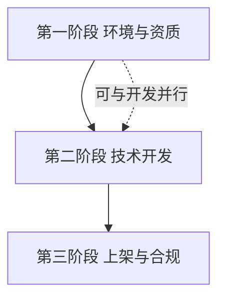
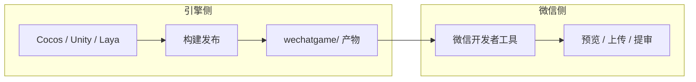

* Do not remove this line (it will not be displayed)
{:toc}

> 本文是**个人学习笔记**，归纳微信小游戏的产品形态、个人开发者能力边界、引擎构建与上架合规要点；**不能替代**微信公众平台与开放文档的现行规则。正文用 `[[n]](#ref-n)` 引用资料，**完整 URL 仅在文末 [Reference 参考](#reference) 列出**。  
> 文中 **提示块**（Tip / Info / Warning / Danger）、表格与 **Mermaid** 图均为 Chirpy 主题支持的写法，可与站内 [Chirpy 主题使用指南]() 对照。

# 前言 {#intro}

个人向技术笔记，按「产品形态 → 开发能力 → 发布接入 → 引擎构建」串起来写。主干依据下面四份官方文档整理（检索日期 2026-04-19；规则以后台与文档最新版为准）：

* 微信小游戏设计指南 [[1]](#ref-1)：体验、传播与创收侧的产品建议  
* 微信小游戏开发指南 [[2]](#ref-2)：能力地图与左侧目录中的各能力说明  
* 小游戏接入指南 [[4]](#ref-4)：类目与发布流程、环节并行关系  
* Cocos Creator 3.8：发布到微信小游戏 [[17]](#ref-17)：从 Creator 构建到微信开发者工具的运行与资源策略  

# 阅读地图 {#reading-map}

| 你想… | 建议从这里读起 |
| :--- | :--- |
| 快速建立概念 | [什么是微信小游戏](#what-is-minigame)、[核心特点](#core-features) |
| 确认个人能不能做、怎么变现 | [个人开发者能做什么](#personal-scope)、[开发者生态](#ecosystem) |
| 从 0 到提审的时间线 | [三阶段全流程速览](#personal-developer-phases)、[第三阶段：上架](#phase-release) |
| 引擎与包体 | [第二阶段：技术开发](#phase-dev)、[Cocos 发布与资源](#cocos-publish) |
| 产品与传播 | [从官方设计指南补几条](#design-tips) |
| 踩坑与自检 | [开发时最容易踩的几个坑](#pitfalls)、[落地顺序](#timeline-my) |
| 仅查链接 | 文末 [Reference 参考](#reference) |

> **怎么读本篇**：右侧目录可跳转；**先看「阅读地图」再按需跳章节**，比从头到尾线性读更省时间。
{: .prompt-info }

## 术语与缩写 {#glossary}

| 缩写 / 术语 | 含义（笔记语境） |
| :--- | :--- |
| **IAA** | In-App Advertising，以**广告**为主的变现（流量主等） |
| **IAP** | In-App Purchase，小游戏内**虚拟支付**（道具等），与个人主体能力见正文 |
| **UV** | 独立访客；流量主等条件里常出现 |
| **开放数据域** | 微信中与好友排行等相关的隔离运行环境，与主包、引擎文档配合阅读 [[2]](#ref-2) [[17]](#ref-17) |
| **主包** | 首包体积受平台限制（如 4MB），构建产物见 `wechatgame/`{: .filepath} 等 |

# 什么是微信小游戏 {#what-is-minigame}

可以把它理解成：**跑在微信里的轻量级游戏**，继承小程序「**即点即玩、无需下载安装、用完即走**」的形态；在平台分类上，按 微信小游戏接入指南 [[4]](#ref-4) 的表述，它是**小程序的一个类目**——用户在公众平台完成小程序注册后，选择「游戏」类目即可开发与调试小游戏。  

常见入口包括：微信内搜索游戏名、`微信 > 发现 > 游戏`、聊天列表**下拉**出现最近使用等（下文「用户通常怎么找到并打开小游戏」再展开）。  

微信小游戏设计指南 [[1]](#ref-1) 与 开发指南 [[2]](#ref-2) 里对它的概括可以合在一起理解：

* 无需下载、安装与卸载，即点即玩，**节省手机存储**，形态轻便；  
* 依托微信社交关系链，便于邀请好友、排行、围观等同玩、传播；  
* 相对手游 App 更偏碎片化、轻量使用，但也不排除玩法偏重度、追求沉浸与长线目标的小游戏。  

它和独立 App 的差别，不只是「免安装」，更在于运行与分发都发生在微信内：关系链、搜索、会话分享、发现页等入口与平台规则是一体的，产品设计时要和这些能力一起考虑（设计指南里对传播、留存、界面基准等有专门章节，后文会摘要点）。

# 微信小游戏的几个核心特点 {#core-features}

我把它的优势归成三点：

## 1. 即开即玩

不需要安装，**不占安装包体积**，对轻度、休闲、碎片化玩法尤其友好；和「用完即走」的小程序体验一致，用户决策成本更低。

## 2. 社交传播天然强

邀请好友、排行、群传播、分享海报这些能力都更自然，冷启动也比独立 App 轻一些。

## 3. 开发门槛相对友好

逻辑层以 **JavaScript / TypeScript** 等前端技术为主流；也可以用 **Cocos Creator、Unity、LayaAir** 等引擎导出到微信小游戏运行环境（不是原生 APK / IPA）。

# 近期常见的热门类型

榜单变化很快，不必死盯名次。除了自己刷微信里的榜单，我也会偶尔扫一眼站外聚合（仅作**题材与命名参考**，**不是**微信官方唯一数据源）：

* 应用宝 · 微信小游戏排行榜 [[15]](#ref-15)  
* Microsoft Store · 游戏 [[16]](#ref-16)（偏 PC / 微软生态休闲品类，与微信内热度**不对等**，用来拓宽对「休闲玩法」的观感）  

下面按**类型**归纳近期常见例子（与后文「个人能做什么」结合看——**一个人能否做完**比是否上榜更重要）：

* 益智消除类：`羊了个羊：星球`、`抓大鹅`、`国王的密室消除`
* 跑酷 / 休闲类：`汤姆猫跑酷`（示例）
* 棋牌竞技类：`腾讯欢乐斗地主`、`天天象棋`、`欢乐麻将`
* 策略塔防类：`塔防精灵`、`咸鱼之王`、`口袋奇兵`
* 经营模拟类：`叫我大掌柜`、`QQ经典农场`

如果是个人开发者，我更建议看「一个人能不能做完」。从这个角度讲，轻度休闲、益智消除、单局玩法明确的小项目更适合作为第一款作品。

# 用户通常怎么找到并打开小游戏

小游戏入口不复杂，常见方式有三种：

1. **直接搜索**：在微信顶部搜索框输入游戏名称（如「跳一跳」或你的产品名）。
2. **发现页**：进入 `微信 > 发现 > 游戏`，在页面中切到 **「小游戏」** 相关入口（具体文案以当前客户端为准）。
3. **下拉**：在聊天列表页向下拉，可看到最近用过与收藏的小程序 / 小游戏。

对开发者来说，游戏名称很重要。可搜索、可记忆、少撞名，都会直接影响后续传播。

# 开发者生态（引擎、变现与社区） {#ecosystem}

从开发者视角，微信侧已经搭了一条完整链路，个人入门通常只抓三件事：

* **引擎与导出**：Unity、Cocos Creator、LayaAir 等均可走各自官方文档构建到微信小游戏；个人向更常选 Cocos（见后文「第二阶段」）。  
* **变现**：  
  * **广告（IAA / 流量主）**：个人主体可重点考虑，需满足平台开通条件（如 UV 等，以后台为准）。  
  * **内购（IAP / 虚拟支付）**：不仅涉及主体类型，还可能牵涉**版号、类目、资质**等——个人主体通常**无法**直接走虚拟支付进件，别用独立 App 的经验硬套。  
* **交流与政策**：技术问题、案例与规则更新，可常逛 微信开放社区 · 小游戏专区 [[11]](#ref-11)。

# 个人开发者能做什么，不能做什么 {#personal-scope}

我最关心的是个人主体到底能做到什么程度。先说结论：

* **个人开发者可以做微信小游戏，也可以发布。**
* **但个人开发者更适合走 IAA（广告变现）路线，而不是 IAP（内购支付）路线。**

| 项目 | 个人主体 | 个体工商户 / 企业主体 |
| --- | --- | --- |
| 注册并开发微信小游戏 | 支持 | 支持 |
| 广告变现（IAA） | 支持 | 支持 |
| 虚拟支付（IAP） | 不支持 | 支持 |
| 开放类目范围 | 有限制 | 更完整 |

> 个人向项目请默认按 **IAA + 允许类目** 规划；虚拟支付、版号与 IAP 相关细则见 [[7]](#ref-7) 及后台，勿与独立 App 经验混用。
{: .prompt-warning }

## 1. 个人主体不适合走内购路线

微信官方“虚拟支付进件”页面写得很明确：**开通条件是“主体类型为个体工商户或企业已认证小游戏”**。这意味着纯个人主体并不能直接走小游戏虚拟支付 2.0。

所以个人开发者更现实的路径还是：

* 做轻量游戏；
* 通过广告组件变现；
* 先把留存、时长和广告位设计跑通。

## 2. 个人主体的游戏类目有明确限制

微信官方“类目设置”页面也明确写了：**个人主体暂不支持选择文化互动、角色类和牌类三种类目。**

这基本决定了个人开发者不适合上来就做：

* 角色扮演类；
* 棋牌牌类；
* 文化互动类相关项目。

第一款项目更适合放在：

* 休闲益智；
* 消除；
* 跑酷；
* 轻策略；
* 轻经营；
* 轻度塔防。

## 3. 个人开发者最现实的变现方式是广告

官方广告文档也给得很清楚，小游戏可以接入：

* Banner 广告
* 激励视频广告
* 插屏广告
* 原生模板广告

而且官方给出了流量主开通条件。比较常见的一条是：

* 小程序累计独立访客（UV）大于 500；
* 无刷量行为，且没有严重违规记录。

换句话说，个人开发者完全可以先做一款广告变现的小项目，先验证玩法和留存。

# 如何开发并上架自己的小游戏

从个人开发者视角看，整个过程可以拆成三个阶段：

* 资质和环境准备  
* 技术开发与调试  
* 审核、备案和上线  

**几条跨阶段的关键建议**（提审前自检）：  

1. **名称**：起名前先在微信里搜一搜；与软著、后台、素材**强一致**，避免侵权与驳回。  
2. **合规展示**：在显著位置提供 **适龄提示**、**《健康游戏忠告》** 等（配置入口与版式以 IAA 发布指引 [[5]](#ref-5) 与后台当时要求为准）。  
3. **内容安全**：只要存在昵称、聊天、UGC 图片等，就要按 安全指南 [[8]](#ref-8) 做检测与策略，别全靠前端「自觉」。  

下面分阶段写细节；想先扫一眼全流程的，也可直接看下一节「个人开发者三阶段全流程速览」。

# 个人开发者三阶段全流程速览 {#personal-developer-phases}

这是「学习笔记式」总览，后文各章是对同一流程的展开。

{: .nolineno }

## 第一阶段：环境与资质（磨刀不误砍柴工）

* 在 微信公众平台 [[13]](#ref-13) 注册**小程序**，一级类目走 **游戏**（选错很痛）。  
* 尽早准备 **软著**（个人上架几乎绕不开；《计算机软件著作权登记证书》等以实际审核要求为准）。可自行在 中国版权保护中心 [[14]](#ref-14) 申请，也可委托代办——**周期与费用随政策与市场变化**，以办理时为准。  
* 安装 微信开发者工具 [[10]](#ref-10) + 引擎（个人向多选 **Cocos Creator**）。  

## 第二阶段：技术开发（从零到一）

* 用引擎完成玩法与资源，**构建发布 → 微信小游戏**，填 **AppID**，在微信开发者工具里真机预览。  
* 按需接入：登录与用户信息、分享、排行榜（常配合开放数据域）、**云开发** 存分 / 存档等。  

## 第三阶段：上架与合规

* **微信认证**、**小程序备案** 为发布前置条件（见 接入指南 [[4]](#ref-4)）。  
* 后台提交资质与游戏介绍等材料；在开发者工具 **上传** 代码，再在公众平台 **提交审核**。  
* 审核通过后再 **发布**；时长与环节依赖 IAA / IAP 路径及类目，别拿独立 App 的「几天上线」硬对标。  

# 第一阶段：环境与资质准备

这一阶段不产出游戏内容，但会直接决定后面是否卡在提审。

## 1. 注册账号

首先去微信公众平台注册账号，选择类型为**小程序**。

有一点要先确认：

* 小游戏账号的一级类目就是“游戏”；
* 如果注册时选错，后续不能自由改成小游戏；
* 官方类目设置页面明确写了，小游戏账号只有“游戏”这个一级类目，选错通常只能重新注册。

所以一开始就要把路线选对。

> **一级类目选「游戏」且注册为小游戏路线**，选错往往只能重新注册；与「先随便建小程序再改」的直觉相反。
{: .prompt-danger }

## 2. 尽早确定名称、简称、头像

名称 / 简称 / 头像设置本身就是正式发布流程的一部分，而且可以和开发并行推进。

我的做法会是：

* 起名前先在微信里实际搜一遍；
* 尽量避免和已有产品撞名；
* 如果涉及品牌、IP、公众人物合作，提前准备授权材料；
* 游戏名称、软著名称、后台名称尽量保持一致。

名称不一致是资质审核里的高频驳回项。

## 3. 提前准备软著和相关资质材料

这是个人开发者最容易轻视、也最容易拖时间的一块。

从官方的 IAA 资质审核页和社区“小游戏资质提交审核指引”来看，资质审核会重点关注：

* 游戏名称是否一致；
* 主体信息是否一致；
* 软著 / 授权材料是否合规；
* 签字、签章、日期是否完整；
* 授权链路是否完整。

社区指引里明确列出了常见资质材料示例，包括：

* 《计算机软件著作权登记证书》
* 《产品合规报告》
* 《产品运营报告》
* 《著作权授权书》
* 《商标授权书》

官方 IAA 资质审核页还特别说明了：在某些场景下，需要提交《计算机软件著作权登记证书》或其他授权材料，例如：

* 游戏名称含英文；
* 游戏名称带“软件”字样；
* 涉及品牌、公众人物合作等情况。

我的倾向不是“等后台提示了再补”，而是直接把软著和合规材料按必备项准备。

纯个人开发者可以先按下面这个清单理解：

* 身份信息与主体认证材料
* 软著
* 游戏自审 / 合规类材料
* 如涉及 IP / 商标 / 联名，准备完整授权书

### 个人主体与企业主体：资质与能力（速查）

| 维度 | 个人开发者 | 企业 / 个体工商户（常见） |
| --- | --- | --- |
| 入门门槛 | 相对较低，无需营业执照 | 需营业执照等主体材料 |
| 虚拟支付（IAP） | 当前政策下**不适用**进件条件 | 满足认证等条件后可按指引申请 |
| 开放类目 | **文化互动、角色类、牌类**等对个人有限制（以后台为准） | 相对完整，仍受类目与内容约束 |
| 常见必备材料 | 身份证、软著、自审 / 合规类材料等 | 营业执照、软著、自审材料等；涉及 IAP 还可能涉及**版号等前置资质**（以主管与平台当时规则为准） |
| 变现侧重 | **广告（IAA）** 更现实 | 广告 + 虚拟支付等组合空间更大 |

上表是**笔记向归纳**，签约、开票、税务与版号政策请以主管机关与微信公众平台最新说明为准。

## 4. 微信认证与小程序备案

小游戏接入指南 [[4]](#ref-4) 在注意事项里写得很清楚：

* **小游戏发布前，必须先完成微信认证**
* **小游戏发布前，必须先完成备案流程**

这两条是发布前提；具体办理顺序与 IAA / IAP 指引里的节点对应关系，仍以 接入指南 [[4]](#ref-4) 及 IAA / IAP 子指引 [[5]](#ref-5) 为准。备案不要拖到临发版再补。

## 5. 适龄提示要提前考虑

IAA 发布流程把“适龄提示设置”放进了正式节点。我更倾向于在设计阶段就把这些展示位预留出来：

* 适龄提示
* 健康游戏忠告
* 用户协议 / 隐私说明
* 客服与反馈入口

这些东西越晚补，越容易显得拼凑。

# 第二阶段：技术开发与工具选择 {#phase-dev}

微信小游戏不是原生 APK / IPA，更像是在微信定义的运行环境里交付一个项目包，所以技术选型很关键。

{: .nolineno }

## 1. 推荐引擎怎么选

### Cocos Creator

如果只从个人开发者角度出发，Cocos Creator 还是最顺手的入口：

* 国内小游戏生态里资料多；
* 编辑器直观，做 UI、场景、动画比较顺手；
* 2D 和轻度休闲玩法很合适；
* 支持直接构建发布到微信小游戏；
* 社区和现成案例多。

### Unity

如果本身就是 Unity 开发者，或者项目确实偏 3D、物理、复杂表现，当然也可以继续用 Unity。但如果是第一次做微信小游戏，我不建议一上来就选 Unity 做重 3D 项目，原因很直接：

* 学习和适配成本更高；
* 包体、性能、内存和兼容问题会更敏感；
* 提审和调优周期通常更长。

### LayaAir

LayaAir 也是常见选项。如果团队本来就在用，可以继续沿用；如果是单人从零开始，我还是会优先 Cocos Creator。

## 2. 微信开发者工具是必备工具

无论是原生写逻辑，还是通过引擎导出，最后都离不开 **微信开发者工具**：

* 导入项目
* 编译调试
* 真机预览
* 上传代码
* 提交审核

我的顺序会是：

1. 先装微信开发者工具
2. 再装游戏引擎
3. 先跑通一个最小 Demo
4. 再开始做自己的项目

## 3. 个人开发者最推荐的技术路线

如果只考虑第一款项目，我会这样搭：

* 引擎：`Cocos Creator`
* 语言：`TypeScript`
* 后端：优先微信云开发 / 云托管，尽量减少自建服务复杂度
* 玩法：轻度、短局、低门槛
* 变现：先只考虑 `IAA` 广告

原因也很简单：

* 工程复杂度可控；
* 迭代速度快；
* 更容易先把第一版做出来；
* 更符合个人开发者的时间和资源限制。

## 4. 先过一遍官方开发指南的“能力地图”

只看“能不能跑起来”很容易把小游戏理解成一个 JavaScript 壳子。微信小游戏开发指南 [[2]](#ref-2) 首页用「能力地图」把常用能力归类，完整列表在文档左侧目录。官方列出的几大块包括（措辞贴近文档）：

* 用户信息  
* 好友关系  
* 转发分享  
* 游戏基础能力  
* 连接服务端  
* 商业化  
* 缓存  
* PC 适配  
* 测试  
* 性能  
* 运营  
* 安全  
* 数据与监控  

落到个人项目里，我仍会按自己的习惯再拆一层去理解：

* 用户信息：登录态、用户信息、隐私与合规  
* 好友关系：关系链、开放数据域、排行榜  
* 转发分享：转发、分享海报、动态消息等  
* 游戏基础能力：交互、音频、视频  
* 服务端连接：网络、自有后端、云开发、云托管  
* 商业化：广告、虚拟支付（主体与类目允许的前提下）  
* 本地能力：文件系统、缓存策略  
* 测试与性能：多端表现、启动与运行性能、线上问题排查  
* 运营与监控：游戏圈、数据与告警  
* 安全：内容安全、防抄袭、防外挂、防违规  

这也意味着，一个能长期运营的小游戏，不只是把核心玩法写出来就够了，还要想清楚：

* 有没有登录和数据存档；
* 有没有排行和分享；
* 有没有监控和异常排查；
* 有没有安全与内容审核；
* 有没有留存和商业化设计。

第一次做的话，我会把这些能力拆成三层：

* 第一层：先做能玩，保证核心玩法跑通；
* 第二层：补登录、排行榜、云存档、分享；
* 第三层：补广告、监控、安全、留存运营。

## 5. Cocos Creator 3.8 发布到微信小游戏 {#cocos-publish}

下面与 Cocos Creator 3.8：发布到微信小游戏 [[17]](#ref-17) 对齐，只记对决策影响大的句子和选项。

### 运行环境与引擎帮你做了什么

文档里的定位很清楚：**微信小游戏运行环境是在小程序环境之上扩展的**，微信团队用自研实现封装了 **WebGL 等接口**，渲染能力比纯小程序更强，但**不能等同为桌面浏览器**。  
引擎侧会做的事包括：适配微信小游戏 API（纯游戏逻辑一般不用为平台改一套代码）、提供构建发布流程并唤起开发者工具、以及远程资源的加载与缓存版本管理（细节见文档中的缓存管理器说明）。

### 发布流程（最小闭环）

1. 安装 微信开发者工具 [[10]](#ref-10)。  
2. 在编辑器 `Cocos Creator / File -> 偏好设置 -> 外部程序` 里填好微信开发者工具路径。  
3. 在微信公众平台取小游戏 `AppID`。  
4. `菜单栏 -> 项目 -> 构建发布`，发布平台选 **微信小游戏**，按需填 通用构建选项 [[18]](#ref-18) 与下文「微信小游戏特有」选项。  
5. 点击 **构建**；完成后在 `build` 下生成 `wechatgame`（以任务名为准），内含 `game.json`、`project.config.json`。  
6. 点击构建任务上的 **运行** 唤起微信开发者工具；若报错 `Please ensure that the IDE has been properly installed`，先**手动打开一次**微信开发者工具再重试。

### 主包、引擎与构建选项里值得勾的项

* **主包**：`初始场景分包` 可把首场景依赖放进内置 bundle `start-scene`，减轻首屏加载；**资源服务器地址** 对应把 `remote` 传到 CDN / 静态服务器（构建后手动上传）。  
* **引擎设置**：物理系统、WebGL 2.0、`CLEANUP_IMAGE_CACHE`、Wasm 物理与 **引擎原生代码分包** 等在同一面板里，按项目 2D/3D 与包体权衡。  
* **构建选项（微信特有）**：`AppID` 必填（面板默认的测试 `appid` 仅作验证）；`设备方向` 写入 `game.json`；需要好友榜等可 **生成开放数据域工程模板**；包体吃紧可看 **分离引擎**（微信小游戏引擎插件 [[19]](#ref-19)）、**引擎原生代码分包**；性能可看文档中的 高性能模式 [[9]](#ref-9) 说明再决定是否开启。

### 资源管理与平台限制（文档原意摘要）

* **主包总大小不超过 4MB**（代码 + 资源）；超出部分走远程。  
* **包内资源**：文档说明小游戏对包内资源**不是严格的按需流式加载**，更接近**先加载包内资源再进游戏**的行为特征，因此主包要极简。  
* **远程**：脚本不能从远程拉取；远程资源的下载、缓存与版本号，Creator 已提供 缓存管理器 [[20]](#ref-20) 路径，按文档配置即可。  
* **平台能力**：用户、社交、支付等仍以 **微信原生 SDK** 为准，引擎不管业务侧对接，需自己在逻辑里调用。  
* **WebAssembly**：使用 Wasm 时注意微信客户端与**基础库版本**要求；文档提醒 **微信小游戏引擎插件目前仅支持 `js` 模式** 等约束，与「分离引擎」方案一起读。  
* **不支持 WebView**（与 H5 页内嵌一套 WebView UI 的设想要避开）。

> **主包 4MB 是硬约束**（代码 + 资源）；首包要当「启动器」设计，重资源走远程 + [[20]](#ref-20)，勿按浏览器「边下边玩」默认假设来估时。
{: .prompt-tip }

第一款项目里，我会优先控制这些：

* 首个版本小包体、少资源、快启动；  
* 首场景只放必要资源，其余走远程 + 缓存；  
* 需要开放数据域、分包、引擎插件时，直接打开 Cocos 与微信对应子文档对照，避免凭浏览器经验猜行为。

# 从官方设计指南补几条最实用的产品建议 {#design-tips}

我前面主要在讲开发和接入，但小游戏其实很依赖产品设计。微信小游戏设计指南 [[1]](#ref-1) 从玩法/剧情/美术/音乐、新手引导、界面布局，到传播（多人玩法、排行榜、分享卡片）、留存目标、广告与虚拟支付等都有章节。下面只摘和个人开发者最相关的几条，避免重复整本指南。

## 1. 先把玩法讲清楚，再谈玩法做大

设计指南把小游戏体验拆成了目标、规则、反馈系统、自愿参与。这个拆法很基础，但很实用。第一版至少要保证：

* 玩家知道自己要做什么；
* 玩家知道怎样算赢、怎样算输；
* 玩家每次操作都能得到及时反馈；
* 玩家愿意自发再来一局。

这些没稳定之前，不用急着上复杂数值和长线系统。

同一套 设计指南 [[1]](#ref-1) 在「界面布局」里还给了**竖屏设计稿基准**（例如以 **750×1334** 为参考分辨率再做多机型缩放）和**拇指热区**上的分区思路。做 UI 与主操作区排布时，最好先对照文档里的示意图定骨架，再迭代视觉。

## 2. 新手引导要“边玩边学”，不要一上来灌一屏文字

官方设计指南对新手引导给了很明确的方向：

* 引导要渐进，不要一次把所有规则全讲完；
* 尽量用演示和实际操作去教，而不是大段文字说明；
* 教程入口要能重新找到；
* 告知必要规则即可，不要把所有技巧都塞给玩家。

小游戏用户耐心更短，前 10 秒没看懂就很容易直接退出。所以我更看重：

* 第一局就能学会核心操作；
* 第一局结束前能感受到一次正反馈；
* 失败后立刻知道“为什么失败”和“下一次怎么改”。

## 3. 微信小游戏的传播设计，不是简单做个分享按钮

传播设计的重点也不只是“能分享”，而是“分享后有没有人点”和“点进去是不是内容一致”。

几个特别值得记住的点：

* 多人玩法、组队、对抗、观战、回顾，这些都比单纯弹分享更容易传播；
* 排行榜是小游戏很重要的传播抓手，好友榜、世界榜、群榜都能激活动力；
* 分享节点要少而精，不要到处弹；
* 不要强制分享，也不要用破坏平衡的奖励去逼分享；
* 分享卡片的文案和图片要和落地内容一致，避免“点进去就秒退”。

落到执行层面，大概就是：

* 优先做“超越好友”“刷新纪录”“邀请一起玩”这类天然可分享节点；
* 分享文案尽量口语化、情绪化，而不是官方口吻；
* 分享图里最好有玩家自己的成绩、角色或进度，增强代入感；
* 不要把关闭按钮藏起来，也不要让用户误触分享。

## 4. 留存设计要有不同周期的目标

官方设计指南提到，小游戏应该给用户设置不同周期的目标，例如：

* 单次游玩的即时目标；
* 每日目标；
* 每周目标；
* 长期目标。

这一点对个人开发者尤其重要。很多独立小游戏第一版只有“能玩”，但没有“明天为什么还要回来”的理由。哪怕系统很轻，也至少可以设计：

* 今日挑战；
* 连续登录奖励；
* 每周排行榜；
* 收集进度；
* 隐藏彩蛋或特殊成就。

设计指南还提到可以通过游戏圈、客服和用户反馈渠道去维护玩家关系。上线不是结束，而是开始理解玩家。

## 5. 广告设计最好服务于体验，而不是打断体验

设计指南里对于广告创收给的建议，比“接广告赚钱”更具体。尤其是激励视频，官方列出的几个典型场景都非常适合小游戏：

* 通关后领取更高倍奖励；
* 失败后再获得一次机会；
* 关卡卡住时换一个提示或道具；
* 用观看广告替代部分虚拟货币消耗。

这里对应的原则很明确：**广告最好嵌在玩家已经产生明确动机的节点上**。

我会优先这样放：

* Banner 广告尽量放在结算、暂停、非核心操作区，不要压主操作区；
* 激励视频优先放在“复活、加倍奖励、提示帮助、补充资源”这些节点；
* 不要把广告频率拉太满，短期也许 eCPM 好看，长期留存会掉得更快。

# 第三阶段：上架流程 {#phase-release}

把官方流程和个人开发实操合起来，大致就是下面这条线：

1. 注册小程序账号
2. 设置名称 / 简称 / 头像
3. 设置类目
4. 完成微信认证
5. 设置适龄提示
6. 提交资质审核
7. 提交游戏内容介绍审核
8. 提交小程序备案
9. 提交版本审核
10. 审核通过后正式发布

## 1. 先理解 IAA 和 IAP 是两条不同发布路径

官方接入指南把小游戏发布分成两种：

* **IAA 游戏**：通过广告变现
* **IAP 游戏**：通过虚拟支付变现

官方给出的参考时长是：

* 不开通虚拟支付的 IAA 游戏：预计 `13 - 37` 个工作日
* 开通虚拟支付的 IAP 游戏：预计 `9 - 22` 个工作日

个人开发者大多还是走 IAA 这条线。

> **端到端耗时**以接入指南给出的 **IAA / IAP 工作日区间**为准（前文数字），勿只凭「备案几天」「审核几天」的道听途说做排期；认证、备案为发布前提 [[4]](#ref-4) [[5]](#ref-5)。
{: .prompt-info }

## 2. 有些流程可以并行，不需要傻等

小游戏接入指南 [[4]](#ref-4) 里为提高上线效率，明确写了可以多线并行的几类事（原文结构如下，类目例外以文档为准）：

* **名称 / 简称 / 头像、类目设置、微信认证** 可以并行；  
* **版本审核** 与 **资质审核** 可以并行，但 **棋牌 - 牌类、文化互动** 等类目除外（这类往往要先走完资质相关节点，以 IAA 指引为准）；  
* **游戏开发** 与上述流程均可同时进行——流程影响的是**发布**，不挡住**开发**。  

认证与备案仍是发布前的硬性条件，不要理解成「可以不做」。并行真正的含义是：

* 不要等软著下来才开始写代码；  
* 不要等开发收尾才第一次看备案与类目；  
* 后台设置、材料与版本迭代尽量穿插推进，而不是线性傻等。

## 3. IAA 路线的发布思路

官方 IAA 发布指引里，我主要记了几点：

* 游戏开发可以和审核流程同步进行；
* 不同二级类目，审核顺序会略有区别；
* 文化互动类目的版本审核必须在资质审核之后；
* **备案、认证** 须在发布前按指引完成；与「版本审核 / 资质审核」的先后关系以 IAA 指引 [[5]](#ref-5) 与后台为准，不要自行假设可以跳过。

普通休闲类、益智类项目在流程上会顺一点。

### 简版步骤与时间观感（仅作预期管理）

若把上架想成「后台操作 + 材料 + 审核」几条线，民间常见观感大致是（**非承诺**，以实际为准）：

1. 注册 微信公众平台 [[13]](#ref-13) 小程序（类目选游戏）。  
2. 完善名称、头像、简介等，并与软著等**保持一致**。  
3. 完成**微信认证**与**小程序备案**（备案周期随管线和材料波动，常见会听到「约数周」量级，勿卡死某一天数）。  
4. 在后台按指引提交**资质**、**游戏介绍**等材料。  
5. 开发者工具**上传**代码 → 后台**提交版本审核**（首版也常听到「约数日」量级，仍以后台与类目为准）。  
6. 审核通过后**发布**。  

整体上，接入指南 [[4]](#ref-4) 对 **IAA** 与 **IAP** 给出了**端到端工作日区间**（前文已写），比单独猜「备案几天、审核几天」更稳。

# 我的落地顺序 {#timeline-my}

## 第一周：先跑通最小闭环

第一周的目标不是做完游戏，而是先跑通环境：

* 注册账号并拿到 AppID
* 安装微信开发者工具
* 安装 Cocos Creator
* 新建一个最小项目
* 构建发布到微信小游戏
* 导入开发者工具
* 真机预览成功

## 第二周：做一个可玩的核心玩法

第二周只盯一件事：**核心循环有没有意思**。比如：

* 一局时长是否合理
* 新手是否 10 秒内能理解玩法
* 是否有明确目标和反馈
* 是否能自然失败再来一局

## 第三周到第四周：接入平台能力

核心玩法稳定后，再逐步加：

* 登录与基础用户信息
* 好友分享
* 简单排行榜
* 云存档 / 云开发
* 广告组件

## 最后阶段：准备提审和上线

最后再回头把这些检查一遍：

* 名称是否和资质材料一致
* 类目是否和实际玩法一致
* 是否完成微信认证
* 是否完成备案
* 是否已经提交资质审核
* 是否补齐适龄提示、健康忠告、协议说明等展示信息
* 是否准备好了游戏介绍、截图、头像、简介

# 开发时最容易踩的几个坑 {#pitfalls}

这部分主要记几个我觉得最容易踩的坑。

> 有 **UGC**（昵称、聊天、上传图等）就必须把内容安全当**必选项**，接入 [[8]](#ref-8)；不要指望「上线后再说」。
{: .prompt-warning }

## 1. 类目选错

类目不是随便选的。官方类目页明确说了：

* 小游戏一级类目只能是“游戏”
* 二级类目要和实际内容一致
* 个人主体不能选文化互动、角色类、牌类

如果类目和实际内容不符，版本提审时就很容易被驳回。

## 2. 名称、软著、主体信息不一致

这是官方资质审核和社区指引里都反复强调的高频问题。

尤其是下面几类不一致最危险：

* 游戏名和软著名不一致
* 游戏名和提审名称不一致
* 授权链路里的主体不一致
* 文档里一会儿写“个人”，一会儿写“我司”

这些问题往往不是技术问题，却会直接拖慢上线节奏。

## 3. 没做内容安全

如果你的游戏里存在任何 UGC 场景，比如：

* 用户昵称
* 自定义头像
* 聊天文本
* 图片上传
* 语音内容

那就不要把“内容安全”当成可选项。微信官方安全指南里写得非常明确：

* UGC 内容不可信；
* 在展示前要经过内容安全审查；
* 即便接入安全接口，也不建议完全依赖机器审核，关键环节仍建议人工复核。

所以只要你的游戏有玩家生成内容，就应该尽早把内容安全接进去。

## 4. 后端过度相信前端

这是个老问题，官方安全指南也反复强调：

* 前后端每次数据交互都要鉴权；
* 后端不能信任前端提交的数据；
* 敏感权限、奖励发放、核心数值都要在服务端校验。

排行榜、奖励发放、道具结算、活动领取这类逻辑，只靠前端控制，后面很容易被刷。

## 5. 一开始就做太重

这可能是个人开发里最常见的问题。微信小游戏看起来门槛低，但如果上来就想做：

* 重数值系统
* 强社交公会
* 大量养成内容
* 大体量 3D 表现
* 完整剧情和长线活动

那很容易做着做着发现：

* 工程量爆炸；
* 包体和性能很难控；
* 资料准备和审核也更复杂；
* 一个人根本压不住开发、运营、审核三条线。

对个人开发者来说，**能上线一款完整的小项目，远比长期停留在一个大计划里更重要。**

# 一点个人判断

如果只站在个人独立开发视角看，我现在更认可下面这条路线：

* 先做轻项目，不做大项目；
* 先走广告变现，不考虑内购；
* 先选允许的休闲类目，不碰受限类目；
* 先跑通 Cocos Creator -> 微信开发者工具 -> 真机预览 -> 上传审核 的最小闭环；
* 先把提审资料和名称一致性处理好，再谈后续长期运营。

第一款产品最好满足：

* 单局时间短，3 分钟内能完成一轮体验
* 玩法规则简单，10 秒内能理解
* 不依赖重度后端
* 不依赖复杂 UGC
* 可以自然接入激励视频广告
* 不碰角色、牌类、文化互动等个人主体受限类目

# 参考项目与学习路径

如果只是想尽快做出第一个小 demo，我更建议先从参考项目入手，而不是一上来就空白开题。对个人开发者来说，比较稳的路径是：**先看官方最小示例，再看 Cocos 社区里结构清晰的完整工程。**

## 1. 官方入门级项目

官方示例的价值不在于“能不能直接商用”，而在于它最适合理解微信小游戏原生能力。

* wechat-miniprogram/minigame-demo [[23]](#ref-23)
  这是我最推荐先看的官方项目。它本身就是微信小游戏组件 / API / 云开发示例，覆盖了渲染、开放能力、广告、网络、存储、多线程等内容。早期很多人会从“飞机大战”这类 Canvas 入门项目理解小游戏主循环，这个仓库比单一示例更完整，适合作为现在的官方起点。
* wechat-miniprogram/minigame-canvas-engine [[24]](#ref-24)
  这个仓库更适合补“开放数据域”和 Canvas 2D 渲染相关知识。做好友排行榜、分数展示这类能力时，很值得顺手看一遍。

我自己会把官方项目主要当成两类材料来用：

* 学原生 API：登录、分享、图片音频加载、Canvas 渲染、开放数据域；
* 学平台接法：云开发、分数存储、好友关系、广告组件。

如果你只是想确认“微信原生小游戏到底怎么跑起来”，优先看官方示例是最省时间的。

## 2. 引擎实战项目

个人开发如果首选 Cocos Creator，那第二步最好看能直接打开运行的现成项目。

* cocos/cocos-example-projects [[25]](#ref-25)
  这是 Cocos 官方维护的示例工程集合，更偏“功能案例”而不是完整小游戏，但很适合补项目结构和引擎能力。
* cocos-creator-demo [[26]](#ref-26)
  这是一个比较适合个人开发者拆着看的 demo 组织，里面能看到不少体量不大的小游戏工程，比如：
  cocos-happymatch [[27]](#ref-27)、
  cocos_2048 [[28]](#ref-28)、
  cocos-flappy-bird [[29]](#ref-29)。
  这类项目的好处是玩法单纯、代码量不大，适合拆解学习。
* potato47/so-many-games [[30]](#ref-30)
  这是一个很典型的“小游戏合集”项目，一个场景一个玩法，适合快速翻看不同玩法的最小实现。里面包括 2048、跳一跳、拼图、贪吃蛇、俄罗斯方块等，比较适合练手和拆逻辑。
* cocos-creator/cocos-tutorial-duang-sheep [[31]](#ref-31)
  这个教程仓库更接近“带着做”的风格。虽然项目本身不新，但拿来理解物理反馈、碰撞和完整工程组织仍然有参考价值。

如果只是做第一款 demo，我会优先选这几类题材：

* 消除类：更适合练关卡组织、数据结构、UI 适配；
* 2048 / 拼图类：更适合练规则循环和状态管理；
* 跑酷 / Flappy Bird 类：更适合练输入、节奏、碰撞反馈；
* 多玩法合集：更适合快速找手感，先做出一个“能跑”的版本。

## 3. 社区项目怎么用

社区项目真正有价值的地方，不是直接复制代码，而是用来回答几个很具体的问题：

* 这个玩法最小可运行版本需要哪些模块？
* UI、逻辑、资源是怎么拆分的？
* 引擎层代码和业务逻辑有没有分开？
* 哪些地方是平台相关代码，哪些地方是纯玩法代码？

你提到的 `Taro-MeiHuan-Game`、`Small-Games` 这类项目，我也会把它们当成“拆解参考”去看，重点看关卡组织、UI 适配、逻辑与渲染分离，而不是默认它们可以直接复用到新项目里。

## 4. 教程文章和资源站怎么用

除了源码，我自己也会留几类教程入口（链接见 [Reference 参考](#reference)）：

* 微信小游戏开发官方指南 [[2]](#ref-2)：适合查平台能力和环境配置；
* Cocos Creator 发布到微信小游戏 [[17]](#ref-17)：适合查构建、导出和包体问题；
* Cocos 官方教程仓库和社区教程：适合看完整工程；
* Cocos Store [[22]](#ref-22)：适合搜现成案例，尤其是免费资源和极简 demo。

其中 Cocos Store 我更建议当成“找题材参考”的地方来用，而不是一上来就买整套商业项目。先看免费案例和小工程，更容易建立自己的项目判断。

## 5. 一个小提醒

无论从 GitHub 还是 Cocos Store 找项目，第一件事都不是下载运行，而是先确认：

* 用的是哪一代引擎，`Cocos Creator 2.x` 还是 `3.x`
* 工程能否被当前编辑器直接打开
* 是否依赖旧版插件、旧版构建模板或已经失效的平台接口

版本不匹配是最常见的坑。很多项目不是逻辑有问题，而是工程年代太早，直接打开就会报错。所以看参考项目时，先判断“值不值得继续花时间”，比直接开始改代码更重要。

# Reference 参考 {#reference}

正文中的 `[[n]](#ref-n)` 对应下列条目；**URL 仅在本节列出**，便于校对与更新。未在正文出现的编号（如 API、广告、虚拟支付等）仍保留作延伸阅读。

## 微信开放文档与平台

1. **微信小游戏设计指南**  
   <https://developers.weixin.qq.com/minigame/design/>
2. **微信小游戏开发指南**  
   <https://developers.weixin.qq.com/minigame/dev/guide/>
3. **微信小游戏 API 参考**  
   <https://developers.weixin.qq.com/minigame/dev/api/>
4. **小游戏接入指南**  
   <https://developers.weixin.qq.com/minigame/introduction/guide/>
5. **小游戏接入指南 · IAA 发布指引**  
   <https://developers.weixin.qq.com/minigame/introduction/guide/iaa>
6. **微信小游戏 · 广告能力**  
   <https://developers.weixin.qq.com/minigame/dev/guide/open-ability/ad/ad.html>
7. **微信小游戏 · 虚拟支付进件**  
   <https://developers.weixin.qq.com/minigame/dev/guide/open-ability/virtual-payment/virtual-payment2.html>
8. **微信小游戏安全指南**  
   <https://developers.weixin.qq.com/minigame/dev/guide/security/security.html>
9. **微信小游戏 · 高性能模式**  
   <https://developers.weixin.qq.com/minigame/dev/guide/performance/perf-high-performance.html>
10. **微信开发者工具下载**  
   <https://developers.weixin.qq.com/miniprogram/dev/devtools/download.html>
11. **微信开放社区 · 小游戏专区**  
   <https://developers.weixin.qq.com/community/minigame>
12. **小游戏资质提交审核指引（社区文档）**  
   <https://developers.weixin.qq.com/community/minigame/doc/0008282466cfb096eb679e9b551408>
13. **微信公众平台**  
   <https://mp.weixin.qq.com/>

## 第三方榜单与工具站

14. **中国版权保护中心**  
   <https://www.ccopyright.com.cn/>
15. **应用宝 · 微信小游戏排行榜**  
   <https://sj.qq.com/wechat-game>
16. **Microsoft Store · 游戏**  
   <https://apps.microsoft.com/games?hl=zh-CN&gl=CN>

## Cocos Creator 与 Unity 文档

17. **Cocos Creator 3.8 · 发布到微信小游戏**  
   <https://docs.cocos.com/creator/3.8/manual/zh/editor/publish/publish-wechatgame.html>
18. **Cocos Creator · 通用构建选项**  
   <https://docs.cocos.com/creator/3.8/manual/zh/editor/publish/build-options.html>
19. **Cocos Creator · 微信小游戏引擎插件**  
   <https://docs.cocos.com/creator/3.8/manual/zh/editor/publish/wechatgame-plugin.html>
20. **Cocos Creator · 缓存管理器**  
   <https://docs.cocos.com/creator/3.8/manual/zh/asset/cache-manager.html>
21. **Unity User Manual**  
   <https://docs.unity3d.com/Manual/index.html>
22. **Cocos Store**  
   <https://store.cocos.com/>

## 开源仓库（示例与学习）

23. **GitHub: wechat-miniprogram/minigame-demo**  
   <https://github.com/wechat-miniprogram/minigame-demo>
24. **GitHub: wechat-miniprogram/minigame-canvas-engine**  
   <https://github.com/wechat-miniprogram/minigame-canvas-engine>
25. **GitHub: cocos/cocos-example-projects**  
   <https://github.com/cocos/cocos-example-projects>
26. **GitHub: cocos-creator-demo**  
   <https://github.com/cocos-creator-demo>
27. **GitHub: cocos-happymatch**  
   <https://github.com/cocos-creator-demo/cocos-happymatch>
28. **GitHub: cocos_2048**  
   <https://github.com/cocos-creator-demo/cocos_2048>
29. **GitHub: cocos-flappy-bird**  
   <https://github.com/cocos-creator-demo/cocos-flappy-bird>
30. **GitHub: potato47/so-many-games**  
   <https://github.com/potato47/so-many-games>
31. **GitHub: cocos-tutorial-duang-sheep**  
   <https://github.com/cocos-creator/cocos-tutorial-duang-sheep>

# 小结 {#summary}

- **定位**：小游戏是小程序类目，**即点即玩**、强社交；个人向优先 **IAA** 与允许类目，见 [#personal-scope](#personal-scope)。  
- **工程**：引擎构建 → `wechatgame/`{: .filepath} → 微信开发者工具；**主包 4MB** 与远程资源策略见 [#cocos-publish](#cocos-publish)。  
- **发布**：认证、备案与 IAA/IAP 节奏以 [[4]](#ref-4) 为准；名称、软著、类目**一致**比单纯会写玩法更决定能否上线。  
- **资料**：正文 `[[n]](#ref-n)` 与文末 [Reference](#reference) 同步更新即可；排版扩展（提示块、Mermaid）见 [Chirpy 主题使用指南]()。

# 结尾

如果现在就开始，我会先做下面这件小事：

1. 下载 `Cocos Creator`
2. 新建一个最简单的 Demo
3. 构建为微信小游戏
4. 用微信开发者工具导入并真机预览
5. 再决定要不要正式做第一款产品

先把这条链路跑通，后面很多问题都会立刻具体起来。

> **学习路径建议**：先装 **Cocos Creator**，用自带模板跑通 **Hello World → 构建微信小游戏 → 微信开发者工具真机预览**，再决定要不要立项第一款产品；比空读一周文档更有效。
{: .prompt-tip }

对个人开发者来说，微信小游戏当然不是零门槛，但它确实是一条比原生手游、独立客户端产品更容易起步的路径。真正的关键不只是会不会写代码，而是能不能：

* 选对题目；
* 控制范围；
* 提前处理合规；
* 先把第一款产品完整做出来。

这也是我现阶段对微信小游戏个人开发的核心判断。
