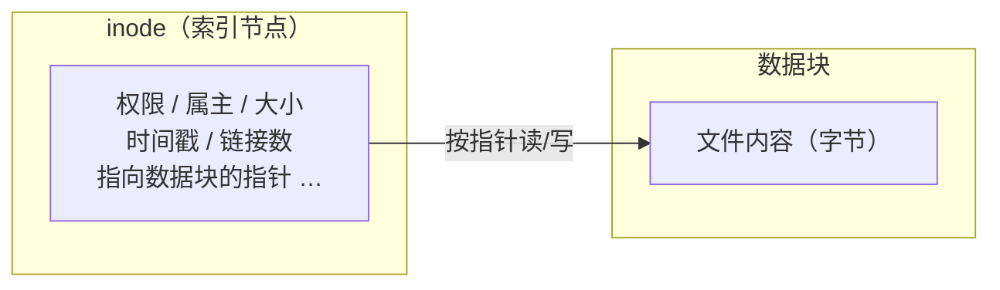
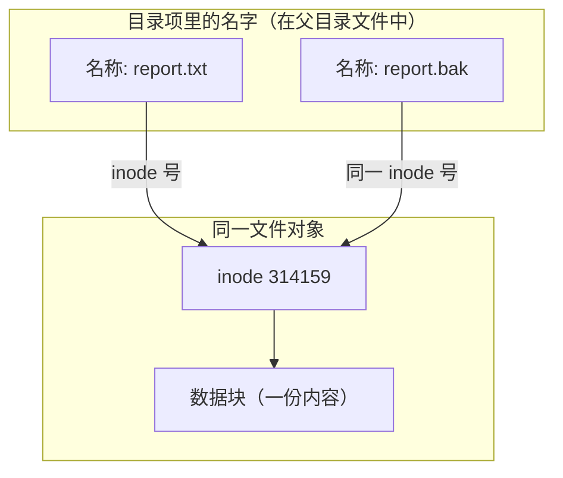
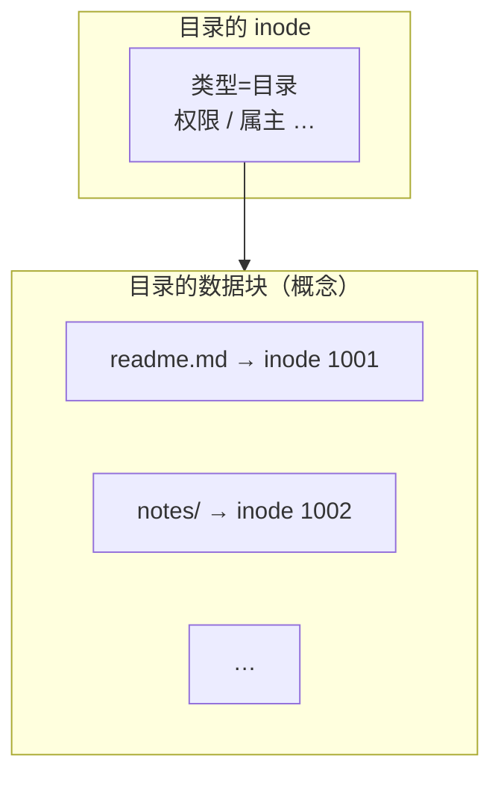
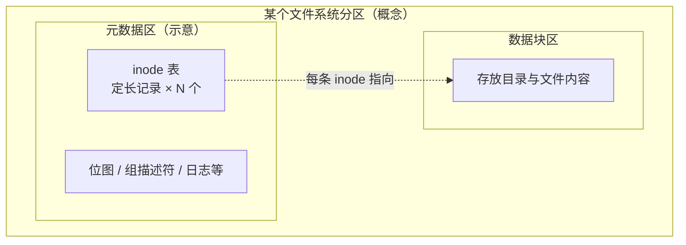
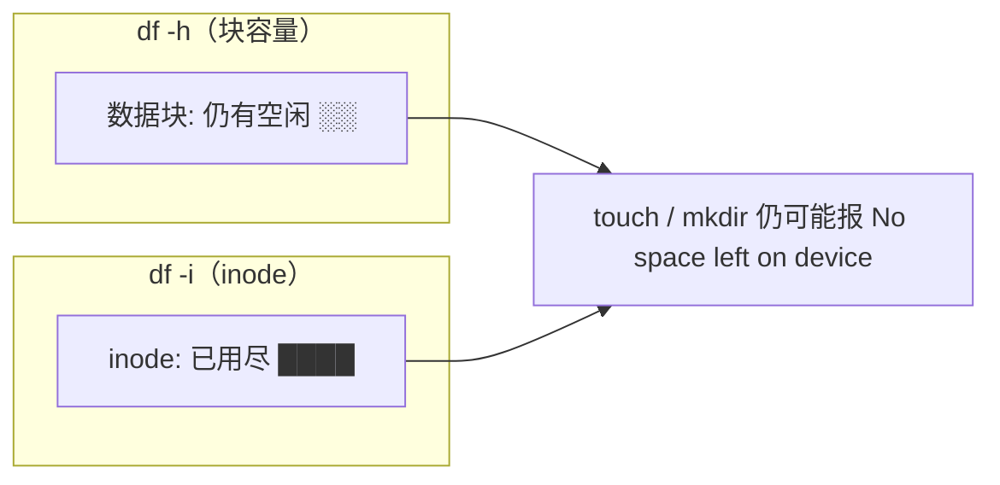
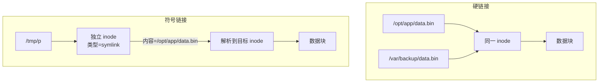

* Do not remove this line (it will not be displayed)
{:toc}

在类 Unix 系统里，你在终端里看到的「文件名、权限、大小、时间」等信息，并不和文件内容堆在同一块区域里：**内容在数据块里，描述文件本身的元数据则集中在 inode（index node，索引节点）里**。理解 inode，有助于解释硬链接为何不能跨分区、`df -i` 报满时磁盘却还有空间、以及目录权限里 `x` 为何如此关键。

较早的笔记 [Linux in Action — inode 小节](#linux-inode-notes)。

**阅读线索**：先弄清「数据块 / inode / 目录项」分工与 inode 里有哪些字段（文中配有 **Mermaid 示意图**）→ 再讲 **目录文件** 如何存文件名、**路径如何解析到 inode** → 然后落到 **磁盘上的 inode 表大小、`df -i` 与耗尽** → 最后 **硬链接、软链接** 与日常推论。文末 **「图示补充」** 说明如何自制 SVG/PNG 替换或并存。页面侧栏/文内的 **TOC** 与上述块顺序一致，可按需跳读。

# inode 是什么

从存储层次看：硬盘以扇区（sector）为物理最小单位（常见 512 字节），操作系统读写时往往按更大的 **块（block）** 聚合，常见为 4KB。文件的字节内容存放在这些块里；而 **谁拥有这个文件、权限、大小、时间戳、数据块在磁盘上的索引** 等，则记录在 inode 中。因此常说：**除文件名以外，与文件相关的大部分信息都在 inode 里**（文件名放在目录项里，见下文）。这一分层在 [阮一峰：理解 inode](https://www.ruanyifeng.com/blog/2011/12/inode.html) 里有很直观的「扇区—块—inode—数据」叙述。

从内核与手册的角度，每个文件对应一个 inode；应用可通过 `stat(2)` / `statx(2)` 取得与 inode 对应的元数据字段，手册 [`inode(7)`](https://man7.org/linux/man-pages/man7/inode.7.html) 逐项说明了这些字段的含义。

[Red Hat 博文](https://www.redhat.com/en/blog/inodes-linux-filesystem) 则强调：**inode 是「某个已挂载文件系统」内部的标识**，不同文件系统各自维护 inode 表；inode 号在同一文件系统内唯一，在不同文件系统间可以重复，因此 **硬链接不能跨越文件系统边界**（与 [`inode(7)`](https://man7.org/linux/man-pages/man7/inode.7.html) 的表述一致）。

下图概括 **「元数据在 inode、正文在数据块」** 的关系；**文件名不在此图中**，它存放在 **目录项** 里（后文「目录是一种特殊文件」）。



# 词源与 POSIX 术语（摘要）

英文 **inode** 一般读作 **index node（索引节点）** 的缩写。据 [Wikipedia: inode](https://en.wikipedia.org/wiki/Inode) 引用的 Dennis Ritchie 说明，早期 UNIX 里目录项只保存 **文件名** 和一个整数 **i-number（索引号）**；打开文件时用 i-number 到磁盘上已知的 **i-list** 里取出对应的 **i-node**，因此 **i** 多半就是 **index** 的含义。文献里也常见「inode 是 index node 的缩写」这类表述（同条目中引 Maurice J. Bach）。

**POSIX** 不把「inode」写进 C API 名字，但约定每个文件在 **其所在文件系统内** 有一个 **file serial number（文件序列号）**，通常就是实现里的 inode 号；再与 **含有该文件的设备的 device ID** 组合，可在整台机器上区分不同卷上的「同号」文件。用户空间看到的 `st_ino` / `st_dev` 与这一模型一致（仍见 [Wikipedia: inode — POSIX inode description](https://en.wikipedia.org/wiki/Inode#POSIX_inode_description)）。

实现层面：Linux 内核里与文件对象对应的数据结构常称 **`struct inode`**；BSD 传统里在 VFS 层更常听到 **vnode**（**v** 表示 virtual file system 层），语义上与「已解析到的文件节点」相近，并不改变「目录项指向 inode、inode 描述内容与元数据」这一大图。

# inode 里通常有什么

一句话概括（与 [阮一峰：理解 inode](https://www.ruanyifeng.com/blog/2011/12/inode.html) 一致）：**除了文件名以外的、用来描述「这个文件对象」的信息，都放在 inode 里**——包括类型、权限、属主、大小、时间戳、硬链接数、数据块位置等。使用 `ls -li` 时，**第一列是 inode 号**，**最后一列是文件名**（来自目录项）；中间权限、链接数、属主、大小、时间等字段都来自 inode。plain `ls -l` 只是少了一列 inode 号，**文件名仍来自目录项**，不是从 inode 里读出来的。

下面按 [`inode(7)`](https://man7.org/linux/man-pages/man7/inode.7.html) / `stat(2)` 的常见字段归纳（具体文件系统可能多几项或少几项，例如 birth time）：

| 含义 | `stat` 结构里常见成员 | 你在意什么 |
| :--- | :--- | :--- |
| 所在设备 | `st_dev` | 哪块盘/哪个挂载上的文件系统 |
| inode 编号 | `st_ino` | 在该文件系统内的唯一编号 |
| 类型 + 权限 + setuid 等 | `st_mode` | 是普通文件、目录、软链还是设备；`rwx` 与 `s`/`t` 位 |
| 硬链接数 | `st_nlink` | 有多少个目录项指向同一 inode |
| 属主 / 属组 | `st_uid` / `st_gid` | 用户名、组名可由 `/etc/passwd` 等解析 |
| 设备文件时的设备号 | `st_rdev` | 字符/块设备的主次设备号 |
| 逻辑大小 | `st_size` | 字节数；对软链常是目标路径字符串长度 |
| 建议 I/O 块大小 | `st_blksize` | 高效读写的块大小提示 |
| 已分配块数 | `st_blocks` | 占用的 512 字节块数（单位见手册与实现） |
| 最后访问时间 | `st_atime` | atime |
| 最后修改内容时间 | `st_mtime` | mtime |
| 最后改 inode 元数据时间 | `st_ctime` | ctime（改属主、权限等也会变） |
| 数据块索引 | （内核/驱动使用） | 正文或内联数据在哪里 |

另外，**极小的内容**有时可 **内联（inline）** 进 inode 里为数据块预留的指针区域，从而少一次读盘：例如经典 ext 系对很短符号链接的 **fast symbolic link**，以及 ext4 可选的 `inline_data` 等（见 [Wikipedia: inode — Inlining](https://en.wikipedia.org/wiki/Inode#Inlining)）。因此「元数据在 inode、正文永远在独立块里」在工程上不能当成绝对规则。

## 为什么 inode 里不存文件名

不是疏忽，而是 **刻意拆分角色**：

1. **一个 inode 可以对应多个名字（硬链接）**。若文件名写在 inode 里，就无法表达「同一文件、两个合法路径」；实际是 **多个目录项** 各自保存一段 **文件名 + 同一个 inode 号**，共同指向 **同一个** inode。
2. **名字是相对「在哪个目录里」而言的**。同一 inode 在不同目录下的名字可以不同；名字属于 **父目录的数据**（目录文件里的一行行 dirent），不属于「被命名的那个文件对象」自身。
3. **早期 UNIX 模型**就是：目录项 ≈ 「名字 + i-number」，打开时用 i-number 去 inode 表里取元数据（见上文「词源」一节）。这样查找路径时，只在各级目录里做 **名字 → inode 号** 的匹配，inode 只描述 **对象本体**。

因此：**文件名在目录里，inode 描述「这个对象是谁、多大、谁有权、数据在哪」**（与 [Wikipedia: inode — Details](https://en.wikipedia.org/wiki/Inode#Details) 一致）。

**硬链接**时，多个目录项指向 **同一 inode**，图中表现为两条边汇入同一节点（与后文「硬链接与符号链接」一致）。



## 查看某个文件的 inode 信息：命令示例

下面以 **GNU coreutils** 环境（常见 Linux 发行版）为例；`stat(1)` 的格式串见 `man stat`。

**1. 默认输出（最省事）**——字段与 inode 元数据一一对应，**不含「解释路径」以外的隐藏信息**；路径是你命令里传的，不是从 inode 读出来的：

```bash
stat /etc/passwd
```

典型会包含：`Device`、`Inode`、`Links`、`Access`、`Uid`、`Gid`、`Access/Modify/Change` 时间、`Size`、`IO Block` 等（locale 不同文案可能略异）。

**2. 自定义一行输出（脚本友好）**：

```bash
stat -c 'path=%n inode=%i size=%s mode=%a links=%h uid=%u gid=%g' /etc/passwd
```

常用占位符：`%n` 路径，`%i` inode 号，`%s` 大小，`%a` 人类可读权限数字（如 644），`%A` `rwx` 权限，`%h` 硬链接数，`%U`/`%G` 用户名/组名，`%x`/`%y`/`%z` 访问/修改/改状态时间。

**3. 只看 inode 号（与 `ls -i` 对照）**：

```bash
stat -c '%i' /etc/passwd
ls -i /etc/passwd
```

**4. 长列表里隐含 inode 元数据**（第一列 inode 需 `-i`）：

```bash
ls -li /etc/passwd
```

**5. 需要 birth time（若文件系统支持）** 可用 `statx` 系接口；命令行可试：

```bash
stat --format='birth=%w' /path/to/file    # %w 在不支持时可能为 `-`
```

**6. 已知 inode 号、想找到路径**（在目录树下搜索，适合删怪名文件等场景）：

```bash
find /tmp -xdev -inum 1234567 -ls
```

`-xdev` 避免跨文件系统（inode 号只在单卷内唯一）。

若你关心 **磁盘上 ext 系 inode 的原始记录**（调试/取证），可在卸载或只读前提下用 `debugfs` 等工具，日常排障用 `stat` / `ls` 即可。

# 目录是一种特殊文件

目录在实现上常视为「目录项的列表」：每项包含 **文件名** 与对应的 **inode 号**。因此：

- `ls` 列出的是目录文件里的名字；`ls -i` 可连同 inode 号一起列出。
- **目录的读权限 `r`**：允许列出文件名（目录项中的名字部分）。
- **目录的执行权限 `x`**：允许「穿过」该目录去解析其中的名字，从而访问子项的 inode（没有 `x` 往往无法 `cd` 或打开子路径）。这与「详细信息在 inode 里」是一致的——没有执行位，你可能读得到一串名字，却无法继续 `stat` 到目标 inode。

目录本身也是一个 **inode + 若干数据块**；其数据块里排布的是 **目录项**（名字 ↔ inode 号），而不是普通文件的「正文」。



# inode 号与文件名：打开文件时发生了什么

**内核以 inode 号（结合设备号）识别文件，而不是文件名**；文件名是便于人类使用的标签。路径解析完成后，打开描述符往往只与 **inode** 绑定，因此通常 **不能** 从「已打开的文件」可靠反推出当初用的是哪一个路径——`getcwd(3)` 等要从当前目录向上扫描父目录、在目录项里匹配 inode 号来 **拼** 路径（内核还会用 dentry 缓存加速；见 [Wikipedia: inode — inode number conversion and file directory path retrieval](https://en.wikipedia.org/wiki/Inode#inode_number_conversion_and_file_directory_path_retrieval)）。打开文件的典型逻辑可以概括为（与 [阮一峰：理解 inode](https://www.ruanyifeng.com/blog/2011/12/inode.html) 一致）：

1. 在目录中根据 **文件名 → inode 号** 解析出目标 inode；
2. 读取 inode 中的元数据与块指针；
3. 按块读/写实际数据。

对路径 `/home/u/a.txt`，内核在每一级 **目录的数据块** 里做 **名字 → inode 号** 的查找，最后得到目标文件的 inode，再读其元数据与数据块。下图是 **逻辑顺序** 的简化（真实实现还有 dentry 缓存、挂载点等细节）。


与 **普通文件** 的 inode 号、`stat` 长格式字段相关的命令见上文「查看某个文件的 inode 信息」中的 `stat`、`ls -i`、`ls -li`。此处仅补充 **查看目录自身** 的 inode（避免 `ls` 列出的是目录「里面」的条目而非目录本身）：

```bash
ls -idl /path/to/dir
```

与 [Red Hat 博文](https://www.redhat.com/en/blog/inodes-linux-filesystem) 中的 `ls -idl` 用法一致。

# inode 数量与空间：`df -i`

## 单条 inode 多大、inode 表占多少盘

磁盘上除了 **数据区**（存文件内容），通常还有 **元数据区**，其中一块用来放 **inode 表**：每个已分配或预留的「文件槽位」对应 **一条定长的 inode 记录**（存放权限、时间戳、块指针等，见前文表格）。这条记录在磁盘上的长度叫 **Inode size**，常见为 **128 字节或 256 字节**（视文件系统与创建时的选项而定），与「文件逻辑大小 `st_size`」不是一回事——后者是文件内容有多长，前者是 **描述这个文件对象** 的元数据结构在盘上占多少字节。

创建文件系统（`mkfs.ext4`、`mke2fs` 等）时，工具会按容量和 **inode 密度** 的启发式规则决定 **一共准备多少个 inode**（例如历史上常见「每 1KB～2KB 卷容量给一个 inode」一类的比例，具体以手册与默认值为准；[Red Hat 博文](https://www.redhat.com/en/blog/inodes-linux-filesystem) 也提到量级上「约每 16KB 容量对应一个 inode」这类经验比例，**以你机器上实际格式化参数为准**）。因此：

- **inode 表占用的磁盘空间** ≈ 「inode 个数 × 每条 inode 记录大小」再加上可能的索引/对齐开销；
- 卷总容量里，除了数据块，还要扣掉 inode 表、位图、日志等开销，**不是 100% 都能当用户数据用**。

经典 ext 系布局可粗看成「一块盘上既有 **inode 表区域**，也有 **数据块区域**」（实际还有超级块、块组描述符、位图等，下图仅突出与本文最相关的两块）。



在 **ext2/ext3/ext4** 上查看 **Inode size**、**Inode count** 等（需对 **块设备** 有读权限，勿对正在读写的生产卷贸然操作）：

```bash
sudo dumpe2fs -h /dev/sdXN | egrep 'Inode count|Inode size|Block count'
```

阮一文中的示例类似：`sudo dumpe2fs -h /dev/… | grep "Inode size"`。不同发行版设备名可能是 `/dev/nvme0n1p2` 等，把路径换成你的分区即可。

## 每个文件都要占一个 inode：用光 inode 时「有空间却建不了文件」

**在典型 Unix 文件语义下，每一个独立的文件系统对象（普通文件、目录、符号链接、设备节点等）都要消耗至少一个 inode。** 硬链接是多个目录项共用一个 inode，不额外增加 inode；软链接自己是单独文件，会占自己的 inode。

因此会出现 [阮一峰：理解 inode](https://www.ruanyifeng.com/blog/2011/12/inode.html) 里强调的情况：**inode 已经用光，但数据区还有大量空闲块**，此时再在 **该文件系统上** `touch`、`vim` 保存新文件、`mkdir` 等需要 **分配新 inode** 的操作会失败。常见报错仍是 **`No space left on device`**（`ENOSPC`），容易误以为磁盘满了——实际上应同时看 **`df -h`** 与 **`df -i`**：若 `IUse%` 为 100% 而容量仍有余，就是 **inode 耗尽** 而非数据块耗尽。

典型诱因：**海量小文件**（邮件队列、CI 缓存、`node_modules`、会话文件、Sharded 存储等），每个文件哪怕只有几字节，也要 **一个 inode + 至少若干元数据/数据开销**。

**`df -h` 与 `df -i` 要对照看**：下图表示一种常见错位——块空间仍有余，但 inode 配额已用尽，此时新建文件仍会失败。



查看某挂载点的 inode 总量与使用情况：

```bash
df -i /path   # 或 df -i /dev/sdXN
```

[Red Hat 博文](https://www.redhat.com/en/blog/inodes-linux-filesystem) 中的示例输出可读作：`IUsed` / `IFree` / `IUse%` 与容量无关，单独反映 inode 资源。排查与容量相关问题务必 **`df -h` 与 `df -i` 一起看**。

缓解思路（仅列方向，实施前需评估业务与备份）：删掉不需要的小文件或整目录、迁走到别的卷、在 **新建文件系统** 时调大 inode 比例或换用更适应海量小文件的文件系统；**已存在的卷** 上 ext4 **不能** 在线把 inode 总数改大，往往需要迁移或重建文件系统——故 **规划阶段** 就要对「小文件密度」有数。

## 固定 inode 表与动态元数据

不少 **传统** Unix 文件系统在创建文件系统时就划定 **固定大小的 inode 表**，因此 inode 上限与「还能不能建小文件」在运维上很实在。另一类设计（如 [Wikipedia](https://en.wikipedia.org/wiki/Inode#Details) 中列举的 XFS、JFS、btrfs、ZFS/OpenZFS、ReiserFS、APFS 等）用 B 树等结构 **动态维护等价元数据**，不一定再有一块字面意义上的「inode 表」，但仍要能为每个文件对象保存同样的信息；**动态分配**可以缓解「空间还有但 inode 光了」的问题，具体仍取决于文件系统与版本，排障时仍以 `df -i` 为准。

# 硬链接与符号链接

- **硬链接**：多个 **目录项中的不同文件名** 指向 **同一个 inode**；`st_nlink` 递增。删除其中一个名字只减少链接数；**链接数减到 0** 时，目录里已没有任何名字指向该 inode，这类对象有时称为 **unlinked（已解除链接）** 的文件：若仍有进程持有打开的文件描述符（包括正在执行的程序镜像），内核通常会 **推迟** 真正回收数据块，直到最后一个引用关闭（与 [Wikipedia: inode — inode persistence and unlinked files](https://en.wikipedia.org/wiki/Inode#inode_persistence_and_unlinked_files) 一致）。无打开引用时，inode 与数据块可被回收。因为 inode 号仅在同一文件系统内唯一，**硬链接不能跨挂载点/分区**（[`inode(7)`](https://man7.org/linux/man-pages/man7/inode.7.html)）。
- **符号链接**：自身是一个独立文件（自有 inode），内容多为目标路径字符串；删除目标后链接会悬空。不会增加目标 inode 的链接数。

**对照图**（同一目标文件 `data.bin`）：左为 **硬链接**（两个路径共享 inode）；右为 **符号链接**（链接自己是独立 inode，里面是路径文本，需再次解析）。



创建方式：

```bash
ln target name          # 硬链接
ln -s target name       # 符号链接
```

目录的链接数：新建目录时 `.` 与 `..` 会使计数呈现固定规律（子目录数 + 2），阮一文中有归纳，日常用 `ls -ld` 观察即可。

# 若干实践上的推论

1. **重命名、同文件系统内移动**：通常只改目录项里的名字或位置，**inode 号不变**（跨设备移动则往往是复制+删除，inode 会变）。
2. **无法删除的怪异文件名**：若 shell 展开困难，可通过 `ls -i` 找到 inode，再用 `find` 等按 inode 删除（具体命令视环境而定，阮一文有思路）。
3. **正在运行的程序与更新**：进程打开文件后依赖的是 inode 描述符；同名文件被替换为新 inode 时，已打开的旧 inode 仍可继续访问旧内容——这是无停机更新的一种常见底层原因（阮一文从 inode 角度做过说明）。这与上面「unlinked 但仍占用空间」同属 **按 inode 生命周期与引用计数管理存储** 这一脉络（[Wikipedia](https://en.wikipedia.org/wiki/Inode#Simplified_library_installation_with_inode_file_systems) 也从共享库替换角度讨论过类似机制）。

以上现象都建立在 **「目录映射名字 → inode，inode 映射数据」** 这一模型上。

# 小结

- **inode** = 文件在某一文件系统内的元数据与数据块索引；**文件名** 存在于目录项中。
- **唯一性** 是「设备 + 文件系统 + inode 号」层面的；跨文件系统则 inode 号可能重复，故硬链接不跨卷。
- **盘上 inode 记录** 有固定 **Inode size**（常见 128/256 字节）；**每个文件对象通常占一个 inode**，故会出现 **inode 100% 用尽而 `df -h` 仍有余量、无法新建文件** 的情况；报错可能是 `ENOSPC`，需用 **`df -i`** 与 **`df -h`** 对照判断。

# 图示补充：自制静态图（可选）

文中 **Mermaid** 图在构建时会由主题加载脚本渲染（本帖 front matter 已设 `mermaid: true`）。若你希望 **印刷级示意图**、更贴近 ext4 块组的真实布局、或统一视觉风格，可自行导出 **SVG/PNG** 放到仓库并改用 `` 引用。

## 建议存放路径与内容要点

| 建议文件名 | 建议画什么（与正文对应） |
| :--- | :--- |
| `assets/images/2026-03/inode-vs-data-blocks.svg` | 与开篇 Mermaid 同主题：左侧 inode 框、右侧数据块、箭头「指针」；可加上 **无文件名** 的标注。 |
| `assets/images/2026-03/inode-disk-layout-ext4.svg` | 比文中分区示意图更细：超级块、块组、inode 表、inode 位图、数据块位图、数据块（可参考 [Wikipedia: inode](https://en.wikipedia.org/wiki/Inode) 或内核文档示意图 **自行重绘** 以避免版权争议）。 |
| `assets/images/2026-03/hardlink-vs-symlink.svg` | 硬链接「两箭头合一 inode」与软链「经路径二次解析」对比，适合放大放在「硬链接与符号链接」一节。 |
| `assets/images/2026-03/df-h-vs-df-i.svg` | 两个仪表盘或条形图：`Use%` 未满 vs `IUse%` 100%，配文 **ENOSPC**。 |

插入 Markdown 示例（路径按你实际文件调整）：

```markdown

*图：元数据在 inode，正文在数据块；文件名在目录项（图中可单独标出）。*
```

## 推荐做法（任选）

1. **[Mermaid Live Editor](https://mermaid.live/)**
   把本文某一 ```mermaid 代码块粘贴进去，**Export SVG/PNG**，再存到 `assets/images/2026-03/`，把图换成 `` 并保留简短说明文字。
2. **命令行导出**（需 Node）：安装 `@mermaid-js/mermaid-cli` 后，将 `.mmd` 存盘执行 `mmdc -i fig.mmd -o fig.svg`；工具说明见官方文档。本站旧文 [我的 Jekyll 项目]() 里也提到过 Mermaid Live / CLI，可作环境参考。
3. **Excalidraw / draw.io / Keynote / OmniGraffle**
   手绘风格或几何框图，导出 **SVG**（矢量放大清晰）或 **2× PNG**（防糊）。
4. **从教材图改造**
   以 [Understanding the Linux Kernel](https://www.oreilly.com/library/view/understanding-the-linux/0596005652/)、[TLPI 相关章节](https://man7.org/tlpi/) 的图为 **结构参考**，用自家素材重画，避免直接截取有版权限制的插图。

插入静态图后，可在对应 Mermaid 块下方加一行「*亦可参见上图静态版。*」或删除 Mermaid 以免重复，按你的版式偏好即可。

# 参考

- [阮一峰：理解 inode](https://www.ruanyifeng.com/blog/2011/12/inode.html)
- [Red Hat: Inodes and the Linux filesystem](https://www.redhat.com/en/blog/inodes-linux-filesystem)
- [Linux man-pages: inode(7)](https://man7.org/linux/man-pages/man7/inode.7.html)
- [Wikipedia: inode](https://en.wikipedia.org/wiki/Inode)
