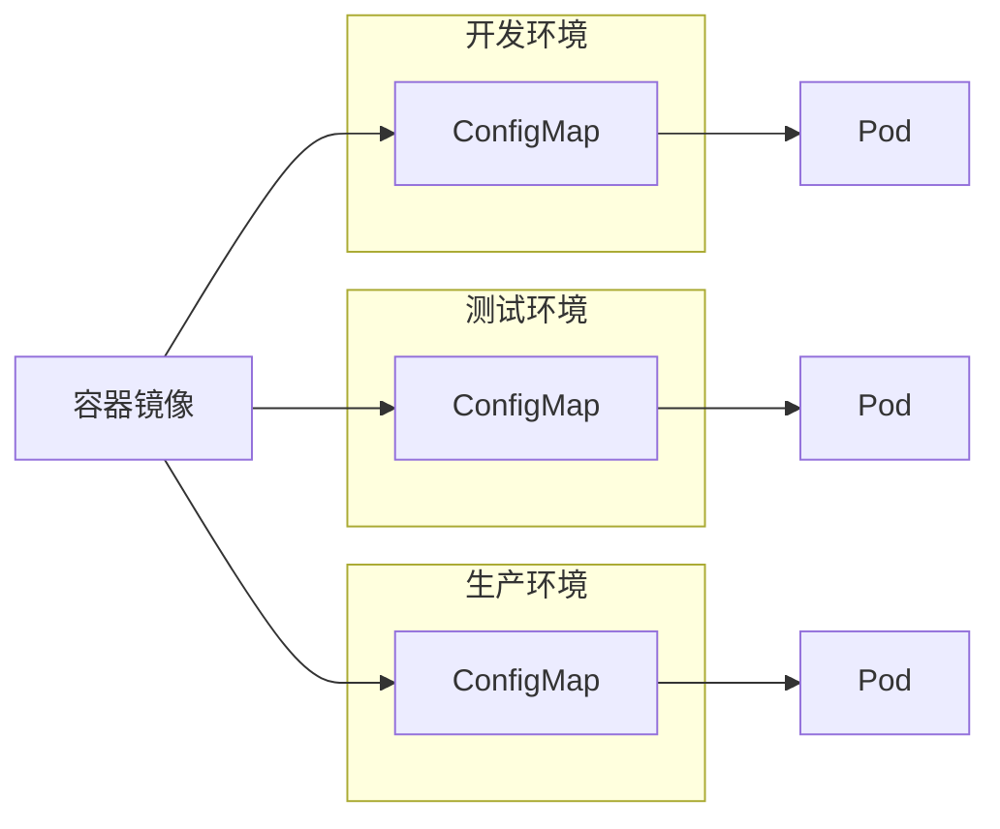
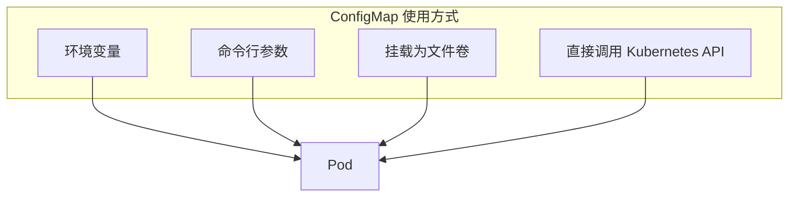
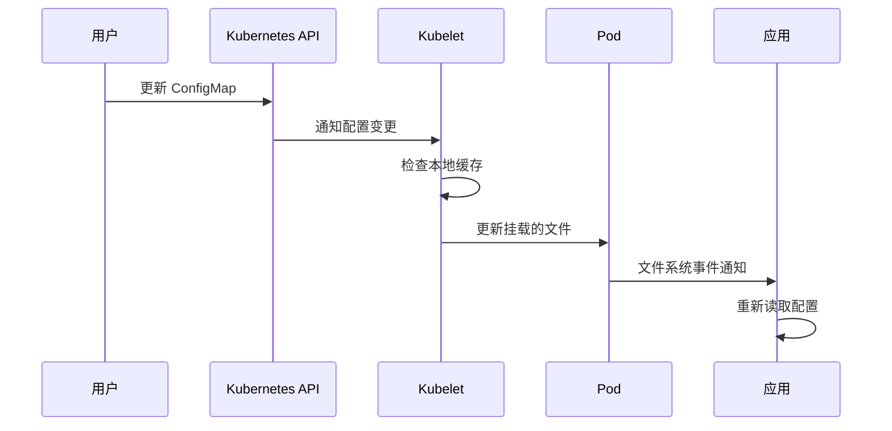
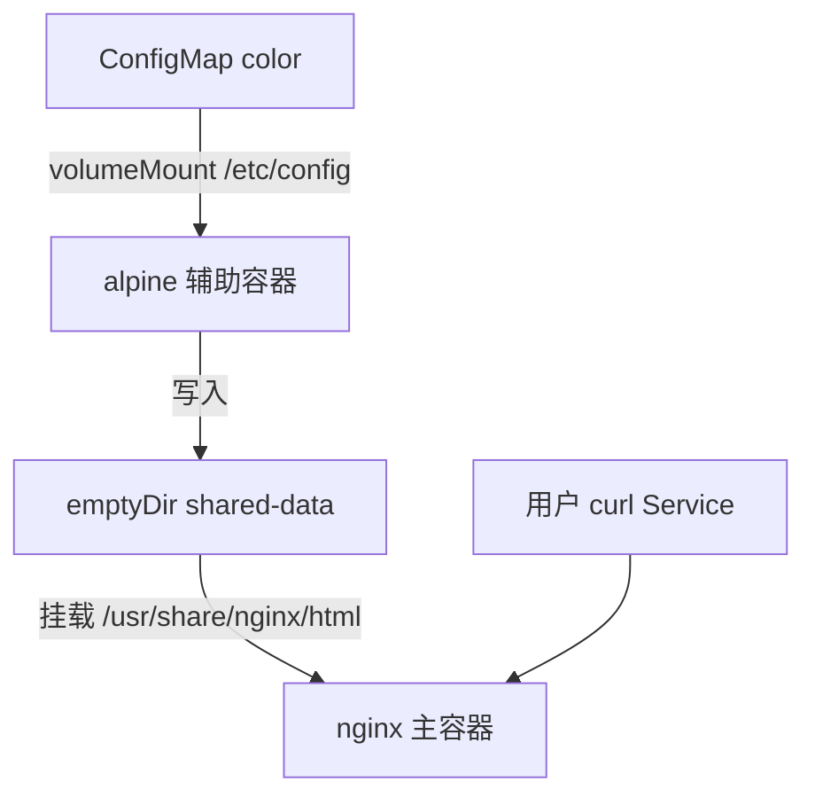
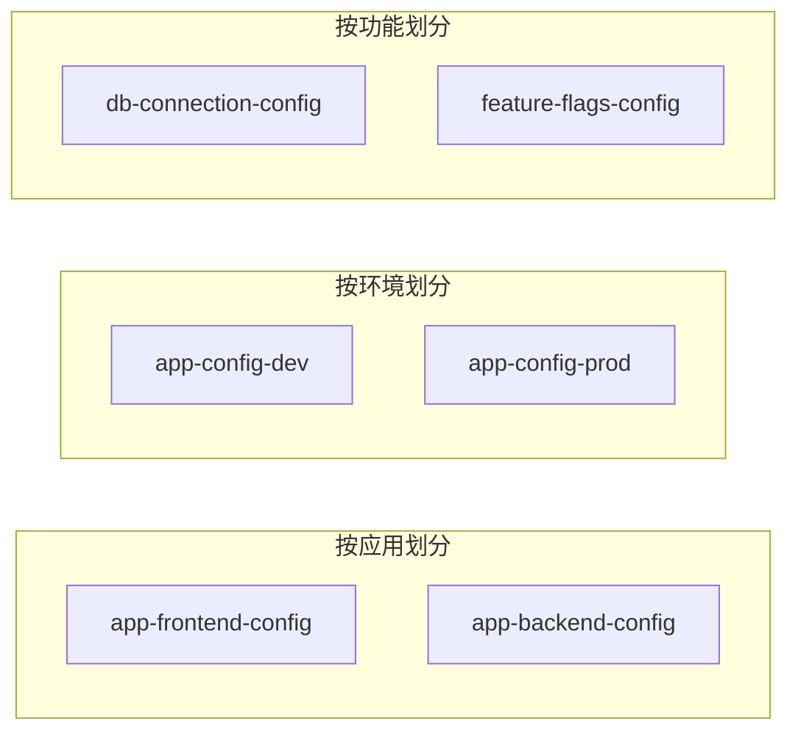

* Do not remove this line (it will not be displayed)
{:toc}

## 概述

> 本文与站内 [Kubernetes in Action — ConfigMap 与 Secret](#configmap-and-secret) 互为补充：该文侧重集群视角下的配置分离；本文按官方 [Concepts](https://kubernetes.io/docs/concepts/configuration/configmap/)、[Tasks](https://kubernetes.io/docs/tasks/configure-pod-container/configure-pod-configmap/) 与 [Tutorial](https://kubernetes.io/docs/tutorials/configuration/updating-configuration-via-a-configmap/) 展开原理、实操与更新行为。
{: .prompt-info }

本文将从以下几个方面对 Kubernetes ConfigMap 进行全面解析：

- 原理与核心概念
- 创建与使用方法
- 使用示例（含动态更新演练）
- 更新机制与 kubelet 行为
- 最佳实践与注意事项
- 常见问题排查

## 什么是 ConfigMap {#what-is-configmap}

> ConfigMap 是 Kubernetes 中用于存储非敏感配置数据的 API 对象，以键值对的形式保存数据。
>
> ConfigMap 允许你将配置数据从容器镜像中解耦出来，**从而使应用程序具有更好的可移植性**。
{: .prompt-tip }

### 为什么需要 ConfigMap

在软件开发中，我们常常需要根据不同环境（开发、测试、生产）使用不同的配置。传统的做法是将配置硬编码在镜像中，或者通过环境变量传递。ConfigMap 提供了一种更加优雅的解决方案：



如上图所示，同一个容器镜像可以配合不同的 ConfigMap 使用，适配不同环境的配置需求，无需重新构建镜像。

### ConfigMap 与 Secret 的区别

| 特性 | ConfigMap | Secret |
|------|-----------|--------|
| 用途 | 非敏感配置 | 敏感数据 |
| 存储 | 明文存储 | Base64 编码（可加密） |
| 加密 | 不提供 | 支持静态加密 |
| 数据类型 | 键值对 | 键值对 |
| 大小限制 | 1 MiB | 1 MiB |

> 警告：ConfigMap 不提供保密或加密功能。如果要存储敏感数据（如密码、API 密钥），请使用 Secret 或其他第三方工具来保护数据安全。
{: .prompt-warning }

## ConfigMap 的结构 {#configmap-structure}

一个 ConfigMap 的典型结构如下：

```yaml
apiVersion: v1
kind: ConfigMap
metadata:
  name: game-demo
  namespace: default
data:
  # 类似属性的键；每个键映射到一个简单值
  player_initial_lives: "3"
  ui_properties_file_name: "user-interface.properties"

  # 文件类键
  game.properties: |
    enemy.types=aliens,monsters
    player.maximum-lives=5
  user-interface.properties: |
    color.good=purple
    color.bad=yellow
    allow.textmode=true
binaryData:
  # 二进制数据（Base64 编码）
  template: RGVtbwo=
```

### 关键字段说明

- **`data`**：存放 UTF-8 字符串格式的键值对
- **`binaryData`**：存放 Base64 编码的二进制数据
- **`immutable`**（v1.21+）：设置为 `true` 可创建不可变 ConfigMap

> 信息：每个 ConfigMap 的名称必须是有效的 DNS 子域名，由字母、数字、连字符 `-`、下划线 `_` 和点 `.` 组成。
{: .prompt-info }

## 创建 ConfigMap {#creating-configmap}

有多种方式可以创建 ConfigMap，以下介绍几种常用的方法。

### 使用 kubectl create configmap

```bash
# 从字面量创建
kubectl create configmap my-config --from-literal=key1=value1 --from-literal=key2=value2

# 从文件创建
kubectl create configmap my-config --from-file=path/to/file.properties

# 从目录创建
kubectl create configmap my-config --from-file=path/to/config/

# 从环境变量文件创建
kubectl create configmap my-config --from-env-file=path/to/.env
```

### 使用 YAML 清单创建

这是最推荐的方式，便于版本控制和 GitOps 工作流：

```yaml
apiVersion: v1
kind: ConfigMap
metadata:
  name: webapp-config
  namespace: default
data:
  DATABASE_URL: "mongodb://db-service:27017/myapp"
  API_ENDPOINT: "https://api.example.com/v2"
  LOG_LEVEL: "info"
  app-settings.json: |
    {
      "theme": "dark",
      "cacheTimeoutSeconds": 300,
      "maxItemsPerPage": 50
    }
```

### 使用 Kustomize 创建

```yaml
# kustomization.yaml
apiVersion: kustomize.config.k8s.io/v1beta1
kind: Kustomization
configMapGenerator:
- name: my-config
  literals:
  - key1=value1
  - key2=value2
  files:
  - config.properties
```

```bash
kubectl apply -k .
```

## Pod 使用 ConfigMap 的方式 {#pod-consume-configmap}

Pod 使用 ConfigMap 主要有四种方式：



### 方式一：环境变量

#### 导入所有键值对

使用 `envFrom` 可以将 ConfigMap 中的所有键值对导入为环境变量：

```yaml
apiVersion: v1
kind: Pod
metadata:
  name: demo-pod
spec:
  containers:
    - name: app
      image: busybox:latest
      command: ["/bin/sh", "-c", "printenv"]
      envFrom:
        - configMapRef:
            name: my-config
```

#### 导入单个键值

使用 `configMapKeyRef` 可以选择性地导入特定的键：

```yaml
apiVersion: v1
kind: Pod
metadata:
  name: demo-pod
spec:
  containers:
    - name: app
      image: nginx
      env:
        - name: LOG_LEVEL
          valueFrom:
            configMapKeyRef:
              name: my-config
              key: log_level
        - name: DATABASE_URL
          valueFrom:
            configMapKeyRef:
              name: my-config
              key: database_url
```

### 方式二：命令行参数

通过环境变量引用，可以将 ConfigMap 的值传递给命令行参数：

```yaml
apiVersion: v1
kind: Pod
metadata:
  name: demo-pod
spec:
  containers:
    - name: app
      image: nginx
      command: ["nginx", "-g", "daemon off;", "-c", "$(NGINX_CONFIG_PATH)"]
      env:
        - name: NGINX_CONFIG_PATH
          valueFrom:
            configMapKeyRef:
              name: nginx-config
              key: nginx.conf.path
```

### 方式三：挂载为文件卷

这是最推荐的方式，支持动态更新：

```yaml
apiVersion: v1
kind: Pod
metadata:
  name: demo-pod
spec:
  containers:
    - name: app
      image: nginx
      volumeMounts:
        - name: config
          mountPath: /etc/config
          readOnly: true
  volumes:
    - name: config
      configMap:
        name: my-config
        items:
          - key: "game.properties"
            path: "game.properties"
          - key: "user-interface.properties"
            path: "user-interface.properties"
```

挂载后，ConfigMap 中的每个键都会成为 `/etc/config` 目录下的一个文件。

### 方式四：通过 Kubernetes API 访问

应用程序可以直接调用 Kubernetes API 来读取 ConfigMap，这种方式支持实时更新：

```javascript
// 示例：使用 Kubernetes Client 库读取 ConfigMap
const k8s = require('@kubernetes/client-node');

const kc = new k8s.KubeConfig();
kc.loadFromDefault();

const k8sApi = kc.makeApiClient(k8s.CoreV1Api);
const configMap = await k8sApi.readNamespacedConfigMap('my-config', 'default');
```

## ConfigMap 更新机制 {#configmap-updates}

> 重要：理解 ConfigMap 的更新机制对于避免生产环境问题至关重要。
{: .prompt-info }

### 不同使用方式的更新行为

| 使用方式 | 是否自动更新 | 更新延迟 | 需要重启 |
|----------|--------------|----------|----------|
| 环境变量 | 否 | - | 是 |
| 命令行参数 | 否 | - | 是 |
| 文件卷挂载 | 是 | kubelet 同步周期 + 缓存延迟 | 否 |

### 文件卷挂载的更新流程



> 信息：使用 `subPath` 挂载的 ConfigMap 不会自动接收更新。
{: .prompt-warning }

### 更新示例演示（交叉引用官方 Tutorial）

官方教程 [Updating Configuration via a ConfigMap](https://kubernetes.io/docs/tutorials/configuration/updating-configuration-via-a-configmap/) 用同一 `ConfigMap`（如 `color: red → blue`）对比三种消费方式，结论与上表一致：

| 场景 | 行为 | 典型做法 |
|------|------|----------|
| 卷挂载 + 多容器共享 `emptyDir` | 文件内容随 ConfigMap 更新；辅助容器重写 HTML，Nginx 直接提供 | 无需重启 Pod，延迟 ≈ kubelet 同步周期 + 缓存 |
| 卷挂载 + Sidecar（Init 容器 `restartPolicy: Always`） | Sidecar 先于主容器启动，持续根据 `/etc/config` 写共享卷 | 适合「主容器只读静态文件」模式 |
| 环境变量 | **不会**随 ConfigMap 更新 | `kubectl rollout restart deployment/<name>` 或重建 Pod |

下面摘录 Tutorial 中「双容器 + 卷挂载」的核心思路（与 [Configure a Pod to Use a ConfigMap](https://kubernetes.io/docs/tasks/configure-pod-container/configure-pod-configmap/) 一致）：



1. `kubectl create configmap color --from-literal=color=red`
2. Deployment 中 Nginx 与 Alpine 共享 `emptyDir`；Alpine 循环读取 `/etc/config/color` 并写入 `index.html`
3. `kubectl edit configmap color` 将 `color` 改为 `blue`
4. 持续 `curl` Service，可观察到输出从 `red` 变为 `blue`，**无需** `rollout restart`

> **注意**：若主容器用 `subPath` 挂载 ConfigMap 的单个键，该挂载点**不会**接收后续更新（见 [Mounted ConfigMaps](https://kubernetes.io/docs/concepts/configuration/configmap/#mounted-configmaps-are-updated-automatically)）。
{: .prompt-warning }

### kubelet 变更检测策略

卷挂载的 ConfigMap 由 kubelet 周期性同步；kubelet 通过本地缓存读取当前 ConfigMap 值，策略由 [KubeletConfiguration](https://kubernetes.io/docs/reference/config-api/kubelet-config.v1beta1/) 的 `configMapAndSecretChangeDetectionStrategy` 控制：

| 策略 | 含义 |
|------|------|
| `Watch`（默认） | 监视 API 变更，延迟较低 |
| `CacheTTL` | 基于 TTL 的缓存 |
| `Get` | 每次同步直接请求 API Server，缓存延迟为 0 |

总延迟约为 **kubelet sync 周期 + 缓存传播延迟**。生产环境若对「热更新」敏感，应在应用侧实现 reload（inotify / 定期轮询）或配合 [Reloader](https://github.com/stakater/Reloader) 等控制器。

### 与 Deployment / Helm 协同

- **环境变量注入的配置**：修改 ConfigMap 后应对 workload 执行 `kubectl rollout restart deployment/<name>`（或更新 Pod 模板触发滚动更新）。
- **Helm Chart**：常见模式是在 `templates/configmap.yaml` 中渲染 `values.yaml`，再被 Deployment 以卷或 `envFrom` 引用；升级 Release 时会替换 ConfigMap 对象。详见 [Helm in Action — Values](#values-values-files-valuesyaml)。

## 不可变 ConfigMap {#immutable-configmap}

> Kubernetes v1.21+ 支持不可变 ConfigMap，提供更好的安全性和性能。
{: .prompt-info }

### 创建不可变 ConfigMap

```yaml
apiVersion: v1
kind: ConfigMap
metadata:
  name: immutable-config
data:
  config.json: |
    {"setting": "value"}
immutable: true
```

### 不可变 ConfigMap 的优势

1. **安全性**：防止意外或恶意修改
2. **性能**：减少 kube-apiserver 的负载，关闭对 ConfigMap 的监视
3. **可靠性**：避免应用程序因配置变更而中断

### 何时使用不可变 ConfigMap

- 配置在应用生命周期内不会改变
- 需要防止生产环境配置被意外修改
- 大规模集群（数万个 ConfigMap 到 Pod 的挂载）

## 最佳实践 {#best-practices}

### 1. 命名规范

```bash
# 推荐：包含应用名、环境和版本
app-frontend-prod-v1
app-backend-staging-v2

# 避免
myconfig
config
data
```

### 2. 组织结构



### 3. 大小限制

> 警告：ConfigMap 总大小不能超过 **1 MiB**。如果需要存储更大数据，考虑：
> - 拆分为多个 ConfigMap
> - 使用 PersistentVolume
> - 使用分布式存储服务
{: .prompt-warning }

### 4. 环境特定配置

```yaml
# 开发环境
apiVersion: v1
kind: ConfigMap
metadata:
  name: myapp-config-dev
data:
  DATABASE_HOST: "localhost"
  LOG_LEVEL: "debug"

---
# 生产环境
apiVersion: v1
kind: ConfigMap
metadata:
  name: myapp-config-prod
data:
  DATABASE_HOST: "db.prod.svc.cluster.local"
  LOG_LEVEL: "error"
```

### 5. 版本控制和 GitOps

```bash
# 目录结构示例
├── base/
│   ├── configmap.yaml
│   └── deployment.yaml
└── overlays/
    ├── development/
    │   └── kustomization.yaml
    └── production/
        └── kustomization.yaml
```

### 6. 键名与环境变量合法性

ConfigMap 的键若不符合 [Pod 环境变量命名规则](https://kubernetes.io/docs/tasks/inject-data-application/define-environment-variable-container/#using-environment-variables-inside-of-your-config)（字母、数字、`_`，且不以数字开头），使用 `envFrom` 时该键会被**静默忽略**，Pod 仍可能启动。排查：

```bash
kubectl get events --field-selector reason=InvalidEnvironmentVariableNames
```

### 7. RBAC 权限控制

```yaml
apiVersion: rbac.authorization.k8s.io/v1
kind: Role
metadata:
  name: configmap-reader
rules:
- apiGroups: [""]
  resources: ["configmaps"]
  verbs: ["get", "list", "watch"]
---
apiVersion: rbac.authorization.k8s.io/v1
kind: RoleBinding
metadata:
  name: configmap-reader-binding
subjects:
- kind: ServiceAccount
  name: default
  namespace: default
roleRef:
  kind: Role
  name: configmap-reader
  apiGroup: rbac.authorization.k8s.io
```

## 常见问题 {#troubleshooting}

### 问题 1：环境变量未生效

```bash
# 检查 Pod 事件
kubectl describe pod <pod-name>

# 检查 ConfigMap 内容
kubectl get configmap <configmap-name> -o yaml

# 检查环境变量
kubectl exec <pod-name> -- printenv | grep <key>
```

### 问题 2：挂载的文件未更新

1. 确认不是使用 `subPath` 挂载
2. 检查 kubelet 日志
3. 确认缓存类型配置

```bash
# 手动刷新 kubelet 缓存（需要重启 kubelet）
sudo systemctl restart kubelet
```

### 问题 3：ConfigMap 大小超限

```bash
# 检查 ConfigMap 大小
kubectl get configmap <name> -o json | jq '.data | length'
kubectl get configmap <name> -o json | jq -r '.data | to_entries | .[] | "\(.key): \(.value | length)"'
```

### 问题 4：无效的环境变量名

> 警告：如果 ConfigMap 中的键不符合环境变量命名规则，这些键将被忽略，不会传递给容器。
{: .prompt-warning }

```bash
# 查看相关事件
kubectl get events --field-selector reason=InvalidEnvironmentVariableNames
```

## 完整示例 {#complete-example}

下面是一个前后端应用的完整配置示例：

### 创建 ConfigMap

```yaml
# webapp-config.yaml
apiVersion: v1
kind: ConfigMap
metadata:
  name: webapp-config
  labels:
    app: webapp
    environment: production
data:
  DATABASE_URL: "postgresql://db:5432/webapp"
  REDIS_URL: "redis://cache:6379"
  LOG_LEVEL: "info"
  FEATURE_NEW_UI: "true"
  nginx.conf: |
    worker_processes auto;
    error_log /var/log/nginx/error.log warn;
    events {
        worker_connections 1024;
    }
```

### 在 Deployment 中使用

```yaml
# webapp-deployment.yaml
apiVersion: apps/v1
kind: Deployment
metadata:
  name: webapp
spec:
  replicas: 3
  selector:
    matchLabels:
      app: webapp
  template:
    metadata:
      labels:
        app: webapp
    spec:
      containers:
        - name: webapp
          image: webapp:1.0.0
          ports:
            - containerPort: 8080
          env:
            - name: DATABASE_URL
              valueFrom:
                configMapKeyRef:
                  name: webapp-config
                  key: DATABASE_URL
            - name: LOG_LEVEL
              valueFrom:
                configMapKeyRef:
                  name: webapp-config
                  key: LOG_LEVEL
          volumeMounts:
            - name: nginx-config
              mountPath: /etc/nginx/conf.d
              readOnly: true
            - name: app-config
              mountPath: /app/config
              readOnly: true
      volumes:
        - name: nginx-config
          configMap:
            name: webapp-config
            items:
              - key: nginx.conf
                path: default.conf
        - name: app-config
          configMap:
            name: webapp-config
            items:
              - key: FEATURE_NEW_UI
                path: feature.flags
              - key: REDIS_URL
                path: redis.txt
```

## 总结 {#summary}

ConfigMap 是 Kubernetes 中管理配置的核心资源，具有以下关键特性：

1. **解耦配置与代码**：实现多环境部署
2. **多种使用方式**：环境变量、命令行参数、文件卷
3. **动态更新**：文件卷挂载支持自动更新
4. **不可变性**：可选地创建不可变配置，提高安全性和性能
5. **大小限制**：最大 1 MiB

### 快速参考

| 操作 | 命令 |
|------|------|
| 创建 | `kubectl create configmap <name> --from-literal=key=value` |
| 查看 | `kubectl get configmap <name> -o yaml` |
| 编辑 | `kubectl edit configmap <name>` |
| 删除 | `kubectl delete configmap <name>` |

## 参考资源 {#references}

### 官方文档（建议阅读顺序）

1. [ConfigMap | Concepts](https://kubernetes.io/docs/concepts/configuration/configmap/) — 动机、对象结构、四种消费方式、不可变 ConfigMap
2. [Configure a Pod to Use a ConfigMap | Tasks](https://kubernetes.io/docs/tasks/configure-pod-container/configure-pod-configmap/) — `kubectl create`、目录/文件/字面量、环境变量与卷挂载示例
3. [Updating Configuration via a ConfigMap | Tutorial](https://kubernetes.io/docs/tutorials/configuration/updating-configuration-via-a-configmap/) — 卷挂载热更新 vs 环境变量需重启、Sidecar 模式
4. [Secret](https://kubernetes.io/docs/concepts/configuration/secret/) — 敏感数据应使用 Secret
5. [The Twelve-Factor App — Config](https://12factor.net/config) — 配置与代码分离的设计哲学

### 站内交叉引用

- [Kubernetes in Action — ConfigMap 与 Secret](#configmap-and-secret)
- [Helm in Action — Values / Chart 模板](#values-values-files-valuesyaml)

### 社区文章

- [Kubernetes ConfigMap: A Practical Guide | Spacelift](https://spacelift.io/blog/kubernetes-configmap) — 创建方式与使用模式梳理
- [The Ultimate Guide to Kubernetes ConfigMaps | Plural](https://www.plural.sh/blog/kubernetes-configmap-guide/) — 实践场景与注意事项
- [一文了解 K8S 的 ConfigMap](https://developer.aliyun.com/article/1211871) — 中文入门
