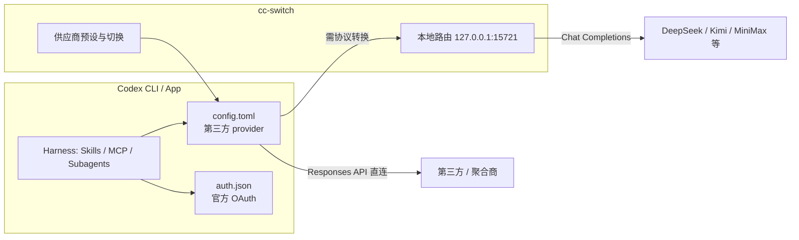

* Do not remove this line (it will not be displayed)
{:toc}

> [Codex](https://github.com/openai/codex) 是 OpenAI 打造的 AI 编程智能体（coding agent），由 ChatGPT 提供技术支持。官方定义为「助力构建并交付产品的 AI 编程智能体」—— 从常规 Pull Request 到复杂功能开发、代码重构与迁移，Codex 端到端完成；也可在后台自动化运行 Issue 分流、告警监控、CI/CD 等日常工作。相关背景可进一步阅读 [Builder.io 的深度对比分析](https://www.builder.io/blog/codex-vs-claude-code)。更多官方资源链接见本文末尾的[参考资料](#参考资料)。

# 什么是 Codex

Codex 是 OpenAI 的编程智能体，帮助开发者更快地编写、审查和交付代码。它可以配对在你的本地工具中使用，也可以委托到云端完成任务。

## 核心能力

根据[官方文档](https://developers.openai.com/codex)，Codex 能帮助你：

- **编写代码**：描述你想构建的内容，Codex 生成符合意图的代码，并适配你的项目结构与规范。
- **理解代码库**：阅读并解释复杂或遗留代码，帮助你理解团队如何组织系统。
- **审查代码**：分析代码以识别潜在 Bug、逻辑错误和未处理的边界情况。
- **调试修复**：追踪失败、诊断根因并给出有针对性的修复建议。
- **自动化开发任务**：执行重复性工作流，如重构、测试、迁移和配置任务，让你专注于更高层次的工程工作。

## 默认模型

> **注意**：GPT-4o 在 Codex 中不可用。Codex 目前默认使用 **GPT-5.1-Codex** 模型家族（Max 默认，可选 Mini）。Retired 或已移除的模型（包括 GPT-4o）无法恢复或作为 Legacy Tier 购买。可通过模型选择器（查看 "Legacy"）或 `-m` flag 或 `config.toml` 指定其他支持的模型。详细可用的模型列表见 [Models 文档](https://developers.openai.com/codex/models)。

# 接入第三方模型

Codex 默认走 ChatGPT 订阅或 OpenAI API，但 CLI 与桌面 App 均支持通过 `config.toml` 切换 **model provider**（自定义 `base_url`、模型目录与鉴权）。若希望使用 DeepSeek、Kimi、GLM、MiniMax、SiliconFlow、OpenRouter 等第三方 API，同时**保留 Codex 的完整 Harness 能力**（Skills、Plugins、Subagents、MCP、审批模式、Worktrees 等），推荐用 [cc-switch](https://github.com/farion1231/cc-switch) 统一管理供应商切换，而不是手改配置文件。

{: .prompt-info }
**与 Claude Code 的对照**：cc-switch 同样支持 Claude Code、Codex、Gemini CLI、OpenCode 等工具。在 Claude Code 里接 MiniMax 的逐步示例见站内 [MiniMax 使用指南]()；本节聚焦 **Codex** 场景。

## 原理：两份配置文件各司其职

Codex 运行时主要读写两个文件：

| 文件 | 路径 | 作用 |
| :--- | :--- | :--- |
| 官方登录缓存 | {: .filepath }`~/.codex/auth.json` | 保存 ChatGPT / Codex OAuth；Codex App 用它识别官方账号，启用**移动端遥控**与**官方 Plugins** |
| 运行时配置 | {: .filepath }`~/.codex/config.toml` | 当前 `model_provider`、`base_url`、模型目录、`experimental_bearer_token` 等 |

早期若把第三方 API Key 直接写入 `auth.json`，模型能切过去，但会**覆盖官方登录**，App 遥控与官方插件随之失效。cc-switch **v3.16.1+** 的 **Codex App Enhancements**（`Keep official login when switching third-party providers`）把二者拆开：`auth.json` 保留官方身份，`config.toml` 承载第三方 endpoint 与 Key，从而在第三方模型与 Codex 完整能力之间取得平衡。



## 前置条件

- **cc-switch v3.16.1 或更高**（macOS 可用 `brew install --cask cc-switch`，详见 [Releases](https://github.com/farion1231/cc-switch/releases)）
- 已安装 **Codex CLI** 与/或 **Codex App**（建议两者都装，便于分别验证）
- 一个可登录 Codex 的 **ChatGPT 官方账号**（Free 即可，主要用于保留 App 官方能力，**不**为第三方模型买单）
- 目标第三方的 **API Key**（DeepSeek、Kimi、GLM、MiniMax、OpenRouter、SiliconFlow 等）

## 配置步骤

### 1. 先完成官方登录

1. 打开 cc-switch，切换到顶部 **Codex** 面板。
2. 选择 **OpenAI Official**（若无则从预设添加并启用）。
3. 启动 Codex（建议先用 CLI：`codex`），按提示完成 **ChatGPT 官方登录**。
4. 登录成功后，官方缓存写入 {: .filepath }`~/.codex/auth.json`。**后续切换第三方时不要破坏此文件。**

### 2. 开启 Codex App Enhancements

在 cc-switch 中打开：

```text
Settings → General → Codex App Enhancements
```

启用：

```text
Keep official login when switching third-party providers
```

{: .prompt-warning }
该开关**默认关闭**（v3.16.0 曾默认开启，部分用户反馈后改为显式开启）。只有在你需要「第三方模型 + 官方遥控 / 官方插件」并存时才打开；关闭则回退旧行为，切换第三方时可能再次改写 `auth.json`。

### 3. 添加第三方 Codex 供应商

回到 Codex 面板，点击右上角 **+** 添加供应商。优先使用内置预设（DeepSeek、Kimi、MiniMax、GLM、SiliconFlow 等），一般只需填写 API Key；预设会自动带上 `base_url`、默认模型与**模型映射表**。

自定义聚合商时，在高级选项中确认 API 格式：

| 上游协议 | 是否需要本地路由 | 典型供应商 |
| :--- | :--- | :--- |
| OpenAI **Responses API** | 通常不需要 | 支持 GPT 的聚合网关 |
| OpenAI **Chat Completions** | **需要** | DeepSeek、Kimi、MiniMax 等 |

启用第三方后，cc-switch 会向 `config.toml` 写入类似结构（Key 由工具注入，勿手抄到公开仓库）：

```toml
model_provider = "custom"

[model_providers.custom]
name = "DeepSeek"
base_url = "https://api.deepseek.com"
wire_api = "responses"
experimental_bearer_token = "sk-..."
```

### 4. 按需开启本地路由

若供应商表单标注 **Needs Local Routing**（多为 Chat Completions 协议），在 cc-switch 中：

```text
Settings → Routing → Local Routing
```

1. 打开主路由开关（默认 `127.0.0.1:15721`）。
2. 在 **Routing Enabled** 下打开 **Codex**。

本地路由会把 Codex 发出的 **Responses** 请求转换为上游的 **Chat Completions**，再把响应转回 Codex 期望的格式，因此 DeepSeek / Kimi / MiniMax 等也能跑在 Codex Harness 上。

### 5. 切换供应商并重启 Codex

在 Codex 面板启用刚添加的第三方供应商，然后**重启 Codex**（CLI 退出重进，App 完全退出再开）。原因：

- Codex 在启动时读取 `config.toml`。
- `/model` 菜单的模型目录通常在重启后才从 `model_catalog_json` 重载。

验证清单：

- Codex App 账号区仍显示**官方 ChatGPT 账号**（预期行为，不代表请求仍走 OpenAI）。
- cc-switch 当前 Codex 供应商为第三方。
- 若开了本地路由，路由统计或日志中能看到 Codex 流量经 `127.0.0.1:15721`。
- 第三方控制台出现对应 API 调用与计费。

## 保留的 Codex 能力

走第三方 model provider 时，**Harness 层能力仍在本地 Codex 进程 / App 中执行**，与官方模型路径一致，例如：

| 能力 | 第三方模型下 |
| :--- | :--- |
| Skills / `AGENTS.md` | 支持 |
| Plugins（如 Superpowers） | 支持（依赖 `auth.json` 官方登录时，需按上文保留 OAuth） |
| Subagents、审批模式、MCP | 支持 |
| Worktrees、本地 Git 操作 | 支持 |
| `/model` 切换、`-m` 指定模型 | 支持（映射表由 cc-switch 维护） |
| Codex Cloud、GitHub 自动审查 | 通常仍依赖 **官方 OpenAI 后端**，不随第三方 provider 切换 |

{: .prompt-tip }
**推荐工作流**：本地开发与复杂 Harness 任务走 cc-switch + 第三方（省订阅额度或试用国产模型）；需要 Cloud 沙箱、GitHub App 审查或团队统一 OpenAI 合规链路时，在 cc-switch 切回 **OpenAI Official** 并使用官方模型。

## 使用示例

**CLI：指定第三方映射后的模型**

```bash
# 重启 codex 并进入交互会话后
/model          # 查看 cc-switch 写入的模型目录
codex -m deepseek-chat "为当前仓库的 README 补充安装说明"
```

**App：安装官方插件后继续用第三方推理**

1. 按上文完成官方登录并开启 Codex App Enhancements。
2. 在 App 内安装 [Superpowers](#superpowers工程化工作流插件) 等官方市场插件。
3. cc-switch 切换到 DeepSeek / MiniMax 等供应商并重启 App。
4. 正常提出需求；插件工作流与 Subagents 行为与官方模型一致，推理请求发往第三方 endpoint。

**与站内 MiniMax 指南衔接**：若上游为 MiniMax，可在 cc-switch 的 Codex 预设中选 MiniMax，按 [MiniMax 使用指南]() 申请 Key；注意 Claude Code 与 Codex 在 cc-switch 中是**独立面板**，需分别在对应 App 下添加并启用供应商。

## 注意事项与常见问题

**为什么切了第三方，App 还显示官方账号？**

账号展示来自 `auth.json`；实际模型流量由 cc-switch 当前供应商 + `config.toml`（及本地路由）决定。**不要用界面上的账号信息判断计费对象。**

**Free 官方账号够用吗？**

够用。官方登录只为保留 App 官方能力；第三方调用消耗的是你在 cc-switch 里配置的 **API Key 余额**，与 ChatGPT 订阅额度无关（除非你又切回 OpenAI Official）。

**官方插件或手机遥控失效怎么办？**

1. cc-switch 切回 **OpenAI Official**，重启 Codex 并重新官方登录一次。
2. 确认 **Codex App Enhancements** 开关已开启，再切回第三方。

**404、模型列表错误或流式响应异常？**

多为 Chat Completions 供应商未走本地路由。检查供应商表单的 **Needs Local Routing**、Settings 里主路由与 **Codex** 接管均已打开。

**修改模型映射后没生效？**

Codex 启动时加载模型目录；改完 cc-switch 映射后务必**重启 Codex**。

**计费走 Auth 还是 API？**

社区反馈（[cc-switch #3596](https://github.com/farion1231/cc-switch/issues/3596)）：在「保留官方登录」模式下，`codex doctor` 可能仍显示 ChatGPT 鉴权，部分环境下用量记在 **ChatGPT/Auth 额度**而非第三方 API 账单。部署前用 `codex doctor` 与上下游控制台**实测**；若必须严格按 API Key 计费，需评估关闭 Enhancements、改用手写 `auth.json` 的 API Key 模式（代价是可能失去 App 官方插件与遥控）。

**本地路由开启时能否切回 OpenAI Official？**

不推荐。cc-switch 会阻止在 Codex 接管激活时切官方供应商，以免经代理访问官方 API 带来账号风险。保留官方登录仅用于 `auth.json`，模型流量应走已配置的第三方。

**不想用 cc-switch 可以吗？**

可以手动编辑 {: .filepath }`~/.codex/config.toml` 与 `auth.json`，参见 [Codex CLI 配置文档](https://developers.openai.com/codex/cli)。cc-switch 的价值在于预设、一键切换、模型映射、本地路由与备份，适合在多个供应商与多款 CLI 工具间频繁切换。

# 多端使用方式

Codex 支持多种接入方式，所有方式都由同一个 ChatGPT 账号统一连接。

## Codex 应用（桌面 App）

Codex 桌面应用是「智能体式编码的指挥中心」：

- 支持 **macOS**（Apple Silicon）和 **Windows**。
- 内置 **Worktrees**（工作树）与 **云端环境**，允许多个智能体在多个项目间并行工作，将数周的开发周期缩短至数天。
- 支持 **Skills**（技能）与 **Automations**（自动化），可在后台无人值守运行。
- 自带 Git 功能，可在应用内完成分支切换、PR 创建等操作。

下载链接（[Quickstart 页面](https://developers.openai.com/codex/quickstart)）：

```bash
# macOS / Windows 下载地址
https://chatgpt.com/codex  → 下载 App
```

## CLI（命令行）

Codex CLI 是轻量级编程智能体，直接在终端运行，支持 **macOS、Linux、Windows**（Windows 为实验性支持，推荐使用 WSL）。

### 安装方式

```bash
# npm
npm install -g @openai/codex

# Homebrew
brew install codex
```

### 核心功能

CLI 支持的功能与 App 类似，具体包括（参考 [CLI 文档](https://developers.openai.com/codex/cli)）：

| 功能 | 说明 |
| :--- | :--- |
| 交互式 `TUI` (Text-based User Interface) | 运行 `codex` 启动交互式终端会话 |
| 模型切换 | 使用 `/model` 在 GPT-5.4、GPT-5.3-Codex 等模型间切换 |
| 图片输入 | 附加截图或设计稿，让 Codex 同时阅读 |
| 本地代码审查 | 在 commit 或 push 前使用独立 Codex 代理审查代码 |
| 子代理 (Subagents) | 使用子代理并行化复杂任务 |
| 网页搜索 | 让 Codex 搜索网络获取最新信息 |
| 云端任务 | 在终端内启动 Codex Cloud 任务并应用 diff |
| 脚本化 | 使用 `exec` 命令自动化重复工作流 |
| MCP 支持 | 通过 Model Context Protocol 连接第三方工具 |
| 审批模式 | 选择 Codex 执行编辑或运行命令前的审批级别 |

## IDE 插件

Codex 提供编辑器插件，支持以下 IDE：

- **VSCode**（官方扩展：[vscode:extension/openai.chatgpt](vscode:extension/openai.chatgpt)）
- **Cursor**（[cursor:extension/openai.chatgpt](cursor:extension/openai.chatgpt)）
- **Windsurf**（[windsurf:extension/openai.chatgpt](windsurf:extension/openai.chatgpt)）
- **VSCode Insiders**

安装后 Codex 扩展出现在侧边栏，默认为 Agent 模式，可读取文件、运行命令、在项目目录中写入更改。

在 Cursor 中使用 Codex 的示例：


## 网页版

直接访问 [chatgpt.com/codex](https://chatgpt.com/codex) 使用，支持：

- 连接 GitHub 仓库
- 实时监控任务进度
- 在云端隔离沙箱中运行任务
- 在 diff 视图中审查结果并直接创建 Pull Request

# 核心概念与功能

## Skills（技能）

Skills 让 Codex 超越单纯写代码，直接参与将 PR 变成产品的工作，例如代码理解、原型构建、文档编写，并与团队标准保持一致。

- 每个项目根目录可放置 `AGENTS.md` 文件，定义 Codex 在该项目中遵循的规范和上下文。
- 社区可在 [OpenAI 博客](https://developers.openai.com/blog/skills-agents-sdk) 查看用 Skills 加速开源维护的案例。

> **与 Claude Code 的 `CLAUDE.md` 的区别**：Claude Code 仅支持 `CLAUDE.md`，Codex（和 Cursor、Builder.io）支持 `AGENTS.md` 标准。如果多工具团队使用同一个指令文件，`AGENTS.md` 可避免维护多份同步文件。详见 [Builder.io 的对比分析](https://www.builder.io/blog/codex-vs-claude-code)。

## Automations（自动化）

Automations 让 Codex 无需提示即可自动运行，处理「问题分流、告警监控、CI/CD」等日常但重要的工作，使你专注于构建本身。

## Worktrees（工作树）

内置 Git worktree 支持，多个智能体可以在同一项目的不同分支上并行工作，互不干扰。

## Subagents（子代理）

使用子代理并行化复杂任务，Codex 可以同时处理多个方向的问题，再汇总结果。

## Cloud（云端环境）

Codex Cloud 提供：

- **隔离沙箱**：每个任务在独立沙箱中运行，带有你的仓库和环境配置。
- **互联网访问**：可选开启云端任务的互联网访问权限。
- **更大的虚拟机**：Business plan 可用更大规格虚拟机加速云端任务。

## GitHub 集成

Codex 的 GitHub 集成是其相对于其他编程智能体的显著优势：

- **自动代码审查**：安装 GitHub App 后，可为整个团队开启自动 PR 审查。它会在 PR 中添加内联评论，你可以要求它修复问题，并在 PR 页面直接审查和合并。
- **Issue 中 @Codex**：在任何 Issue 或 PR 中 @Codex，它会自动接手处理。
- **与 CLI 行为一致**：GitHub UI 中的提示词与 CLI 中的效果相同，相同的模型、相同的配置、相同的行为，确保一致的体验。

参考 [Builder.io 的评测](https://www.builder.io/blog/codex-vs-claude-code)：Codex 的 GitHub 集成「能发现团队会错过的真正有难度的 Bug，在行内评论，可以要求它修复问题，在后台运行，可以在 PR 中审查和更新，然后合并」，而 Claude Code 的 GitHub 集成「评论冗长但找不到明显的 Bug，无法以有效方式要求修复」。

## Slack 集成

可在 Slack 中直接 @Codex 执行任务，详见 [Slack 集成文档](https://developers.openai.com/codex/integrations/slack)。

## Plugins（插件）

Plugins 将可复用工作流打包，方便连接 Codex 到你依赖的工具和服务，并在团队间共享。Plugin 可组合一个或多个 Skills、可选的 App 集成或 MCP 服务器配置，是可安装的分发单元。详见 [Plugins 文档](https://developers.openai.com/codex/plugins)。

### Superpowers：工程化工作流插件

[Superpowers](https://github.com/obra/superpowers)（Jesse Vincent / Prime Radiant）是一套面向编程智能体的**可组合技能（Skills）框架**与**软件工程方法论**。它通过 [Codex 官方插件市场](https://github.com/openai/plugins) 分发，把「需求澄清 → 设计评审 → 计划拆解 → TDD 实现 → 子代理协作 → 代码审查 → 分支收尾」串成**强制工作流**，而不是让代理一上来就改文件。

{: .prompt-info }
**与 Codex 原生能力的关系**：Codex 自带的 [Skills](#skills技能)、[Subagents](#subagents子代理)、[Worktrees](#worktrees工作树) 提供**平台能力**；Superpowers 在其上提供**方法论与技能清单**（何时 brainstorming、如何写计划、怎样 RED-GREEN-REFACTOR）。二者互补：Superpowers 的 `subagent-driven-development` 与 `using-git-worktrees` 分别与 Codex 的子代理、worktree 能力天然对齐。更完整的技能库、口令示例与 Cursor 对照见站内 [Superpowers 使用指南]().

#### 安装（CLI 与 App）

Superpowers 在 **Codex CLI** 与 **Codex App** 中均需**单独安装**（与其他 Harness 互不同步）。当前插件版本 **5.1.0**，技能目录挂载于 `./skills/`。

**Codex CLI**（在 `codex` 交互会话内）：

```text
/plugins
```

搜索 `superpowers`，选择 **Install Plugin**。插件来自 [官方 Codex 插件市场](https://github.com/openai/plugins)。

**Codex App**：

1. 侧边栏打开 **Plugins**
2. 在 **Coding** 分类找到 **Superpowers**
3. 点击旁的 `+` 并按提示完成安装

安装后无需手动 `@` 每个技能。代理会按 `using-superpowers` 规则自动判断是否加载相关技能；你仍可通过项目根目录的 `AGENTS.md` 补充技术栈、目录约定或「禁用 TDD」等项目级偏好（用户显式指令优先于 Superpowers 技能）。

#### 标准工作流（七步）

| 步骤 | 技能 | 作用 |
| :--- | :--- | :--- |
| 1 | `brainstorming` | 苏格拉底式澄清需求，分节展示设计并征求确认 |
| 2 | `using-git-worktrees` | 设计通过后在新分支 / worktree 隔离开发 |
| 3 | `writing-plans` | 拆成 2–5 分钟一步的可执行计划 |
| 4 | `subagent-driven-development` 或 `executing-plans` | 子代理分任务执行（推荐）或当前会话逐步执行 |
| 5 | `test-driven-development` | RED-GREEN-REFACTOR，先写失败测试 |
| 6 | `requesting-code-review` | 按严重程度自检，阻断 Critical 问题 |
| 7 | `finishing-a-development-branch` | 验证测试，选择合并 / PR / 保留 / 丢弃 |

设计规格与实现计划默认落在仓库内，便于审阅与版本管理：

| 路径 | 内容 |
| :--- | :--- |
| `docs/superpowers/specs/` | brainstorming 产出的设计文档 |
| `docs/superpowers/plans/` | writing-plans 产出的实现计划 |

#### 在 Codex 中的使用示例

提出一个明确的功能需求后，观察代理是否**先进入 brainstorming**（提问、给方案）而非直接改文件——这是 Superpowers 生效的最直观信号。若代理「跑偏」（跳过设计、未看失败信息就猜修复），可在 Codex CLI / App 对话中**显式点名技能**：

```text
使用 brainstorming skill，和我一起梳理这个需求，不要直接写代码

【描述需求，例如：给 API 加按用户限流，返回 429 与 Retry-After】
```

设计确认后写计划：

```text
使用 writing-plans skill，为这个改动写一个实施计划

【说明已批准的设计；若有 spec 请写明路径，例如 docs/superpowers/specs/2026-06-15-rate-limit-design.md】
```

大改造推荐子代理执行（与 Codex [Subagents](#subagents子代理) 配合）：

```text
使用 subagent-driven-development skill，执行这个计划

【附上计划路径，例如 docs/superpowers/plans/2026-06-15-rate-limit.md】
```

#### 与 Codex 协同的注意事项

- **审批模式**：Superpowers 会频繁跑测试、改多文件；若 CLI 审批过严易卡在权限循环，可按任务调整 [审批级别](https://developers.openai.com/codex/cli)（全自动小步任务 vs 高风险命令人工确认）。
- **用量**：brainstorming 与多轮子代理会消耗更多本地消息；复杂功能可先用 Superpowers 走完设计与计划，再交给 [Codex Cloud](#cloud云端环境) 执行大块实现以分担本地额度。
- **与 `AGENTS.md` 并存**：`AGENTS.md` 写项目规范，Superpowers 写流程纪律；若二者冲突，以 `AGENTS.md` 为准。
- **更新**：Superpowers 更新随 Codex 插件市场推送，部分环境会自动升级；以 [官方 README](https://github.com/obra/superpowers/blob/main/README.md) 与 [Release Notes](https://github.com/obra/superpowers/blob/main/RELEASE-NOTES.md) 为准。

## MCP（Model Context Protocol）

Codex 支持 MCP，可连接第三方工具获取额外的上下文和功能。详细见 [MCP 文档](https://developers.openai.com/codex/mcp)。

# 定价计划

Codex 包含在标准 ChatGPT 套餐中，同时也支持纯 API 按量付费。

## 各计划包含内容

| 功能 | Plus | Pro | Business | Enterprise |
| :--- | :--- | :--- | :--- | :--- |
| 网页 / CLI / IDE / iOS 版 Codex | Yes | Yes | Yes | Yes |
| GitHub 自动代码审查 | No | No | Yes | Yes |
| Slack 集成 | No | No | Yes | Yes |
| 最新模型（GPT-5.4、GPT-5.3-Codex） | Yes | Yes | Yes | Yes |
| GPT-5.4-mini（更高用量限制） | No | Yes | No | No |
| 6 倍本地和云端任务用量限制 | No | Yes | No | No |
| 10 倍代码审查次数 | No | Yes | No | No |
| GPT-5.3-Codex-Spark（研究预览） | No | Yes | No | No |
| API 按量付费（仅 CLI/SDK/IDE） | No | No | Yes（Flexible） | Yes |
| 企业级安全控制（SCIM、EKM、RBAC） | No | No | No | Yes |
| 数据驻留与合规 API | No | No | No | Yes |
| 审核日志与用量监控 | No | No | No | Yes |

> 当前限时优惠：符合条件的 ChatGPT Business 工作区在团队成员开始使用 Codex 时可获得最高 **$500** 额度。详见[官方条款](https://help.openai.com/en/articles/20001150-codex-for-business-promotion-earn-up-to-500-in-credits)。

## 用量限制参考

Plus 用户（5 小时窗口内）：

| 模型 | 本地消息数 | 云端任务数 | 每周代码审查次数 |
| :--- | :--- | :--- | :--- |
| GPT-5.4 | 33–168 | No | No |
| GPT-5.4-mini | 110–560 | No | No |
| GPT-5.3-Codex | 45–225 | 10–60 | 10–25 |

Pro 用户（5 小时窗口内）：

| 模型 | 本地消息数 | 云端任务数 | 每周代码审查次数 |
| :--- | :--- | :--- | :--- |
| GPT-5.4 | 223–1120 | No | No |
| GPT-5.4-mini | 743–3733 | No | No |
| GPT-5.3-Codex | 300–1500 | 50–400 | 100–250 |

> 注意：本地消息与云端任务的用量共享同一个 **5 小时窗口**。详细最新的费率信息见 [Codex 定价页面](https://developers.openai.com/codex/pricing)。

## 节省用量的技巧

- 控制 Prompt 大小，只提供必要的上下文。
- 减少 `AGENTS.md` 的体积，必要时使用嵌套方式分层注入。
- 限制使用的 MCP 服务器数量，不需要时禁用。
- 日常任务切换到 GPT-5.4-mini，延长约 2.5x–3.3x 的本地消息限制。

# Codex vs Claude Code

[Builder.io 的深度对比](https://www.builder.io/blog/codex-vs-claude-code)（2026 年 4 月更新）从多个维度分析了两者：

## 各维度对比

| 维度 | 胜出 | 说明 |
| :--- | :--- | :--- |
| 智能体能力 | Tie | 三者功能趋同，Codex 行为与 Claude Code 非常接近 |
| 模型与推理控制 | Tie | Codex 提供更多推理级别选项（low/medium/high/minimal） |
| 定价与用量 | **Codex** | 相同价格下 Codex 用量更慷慨；GPT-5 Codex 效率约为 Claude Sonnet 的 2 倍 |
| UX 与权限 | Claude Code | Claude Code 的 TUI 更成熟，权限系统有所改进但仍偶有摩擦 |
| 功能深度 | Claude Code | Claude Code 在配置深度、hooks、slash commands 上更丰富 |
| 指令文件标准 | **Codex** | Claude Code 只支持 CLAUDE.md；Codex 支持 AGENTS.md（Cursor、Builder.io 也支持），多工具团队可共用同一套指令文件 |
| GitHub 集成 | **Codex** | Codex GitHub App 自动审查能发现真正有难度的 Bug；Claude Code 评论冗长但抓不住明显问题 |
| 开放性 | **Codex** | Codex CLI [完全开源](https://github.com/openai/codex)，可自由定制；Claude Code 为闭源 |

## Builder.io 的选择

Builder.io 选择使用 Codex 作为核心编码智能体，主要原因：

1. **GitHub 集成优秀**——安装后开启自动代码审查，能发现真正有难度的 Bug，支持 @Codex 在 Issue 中直接处理，形成从发现到修复的闭环。
2. **定价更有利**——$20 的 Plus 计划比 Claude 同价位更耐用，$200 的 Pro 几乎不遇到上限。
3. **同一公司训练模型**——工具和模型均由 OpenAI 打造，优化端到端体验，且没有中间商差价。
4. **指令文件统一**——使用 `AGENTS.md` 标准，与 Cursor、Builder.io 共用同一套规范。

## 推理行为的细节差异

根据 Builder.io 的实际观察：

- **Codex**：推理时间略长，但 token 输出速度让人感觉更快（可见的 tokens/s 输出）。
- **Claude Code**：推理次数略少，但可见输出 token 稍慢。在 Cursor 内切换模型也有类似感受：GPT-5 Codex 模型推理时间更长，Sonnet 推理更少但代码输出略慢，Opus 更明显。

两种风格并无绝对优劣，偏好因人而异。

## 模型感受数据

Builder.io 对比了用户情绪评分：

> 在 GPT-5 Codex、GPT-5 Mini 和 Claude Sonnet 中，GPT-5 Codex 平均获得 **40% 更高评分**。

这与效率数据吻合——在相近成本下，GPT-5 Codex 带来更好的实际体验。

## GitHub 集成：核心差异所在

这是 Builder.io 选择 Codex 的最主要原因。两者在 GitHub 上的表现差异显著：

| 方面 | Codex | Claude Code |
| :--- | :--- | :--- |
| PR 审查质量 | 能发现团队会错过的真正有难度的 Bug | 评论冗长但找不到明显的 Bug |
| 交互方式 | 行内评论，可要求修复，在后台运行，可直接合并 | 无法以有效方式要求修复 |
| Issue 处理 | 可 @Codex 在任何 Issue 或 PR 中直接接手 | 不支持 Issue 中的 @ 处理 |
| 与 CLI 一致性 | GitHub UI 与 CLI 使用相同的提示词、模型和配置 | 行为存在差异 |

Builder.io 的评价是：Codex 的 GitHub 集成「从发现问题到修复的闭环无缝衔接」，而 Claude Code 的集成「体验糟糕」。

Builder.io 的团队工作流（不局限于终端用户）：

- 设计师直接在 Builder.io 中通过提示词和类 Figma 可视化编辑器使用 Codex 更新站点和应用
- 完成后直接发送 PR，工程师审查合并
- 所有人使用相同的代码库、相同的模型、相同的 `AGENTS.md`

## 常见问题解答

**2026 年 Codex 是否仍然优于 Claude Code？**

Codex 在 GitHub 集成和定价上仍然胜出。但 Claude Code 已显著缩小差距——更好的 UX、VS Code 扩展、网页 IDE 和 Cowork 模式。如何选择取决于工作流：重度终端用户、重视 GitHub 自动化选 Codex；需要更多配置选项和 hooks 选 Claude Code。

**预算有限选哪个？**

Codex Pro 性价比更高——更低的价位获得更多用量，同时捆绑 ChatGPT、图像生成和视频生成，而不仅仅是编程计划。

**可以同时使用两者吗？**

可以，很多团队也这样做——用 Codex 处理后台 GitHub 任务，用 Claude Code 处理终端会话（需要更多 slash commands 和 hooks）。

**Cursor 仍然相关吗？**

仍然相关。Cursor 在 IDE 体验上仍然领先，对从 VS Code 转过来的开发者最熟悉。Bugbot 在代码审查上也表现出色。

**Claude Code 仍然不支持 AGENTS.md 吗？**

截至本文写作时确认，Claude Code 仅支持 `CLAUDE.md`。如果想一个指令文件通用于所有工具，为 Codex、Cursor、Builder.io 使用 `AGENTS.md`，再为 Claude Code 维护一份同步的 `CLAUDE.md`。

**三个工具可以一起用吗？**

可以。Builder.io 的做法是：在视觉层之上使用这些智能体，设计师和产品经理不需要在终端操作，通过类 Figma 编辑器与 Codex 或 Claude Code 交互，所有人最终在同一个代码库上工作，PR 从另一端出来。

## 与 Claude Code 的协同工作流（r/ClaudeCode 社区讨论）

[r/ClaudeCode 上的讨论「Best way to combine Claude Code with Codex in real workflows?」](https://www.reddit.com/r/ClaudeCode/comments/1rf645m/best_way_to_combine_claude_code_with_codex_in/) 补充了「两者如何放进同一条日常工作流」的实践与坑点，可与上文 Builder.io 的对比对照阅读。

- **常见分工**：不少实践者认为 Claude Code 更擅长**深度推理、大范围重构与复杂代码库理解**；Codex 在**快速落地实现、与 ChatGPT / OpenAI 工具链衔接**上更顺手。二者可按任务切换，也可串联成一条流水线。
- **编排器模式**：在 Claude Code 里用 **Skill** 或 `CLAUDE.md` 把 Claude 当作**编排者**——由 Claude 拆解任务，需要实现时再**显式调用 Codex CLI**，并把约束与上下文写进交接提示。若 Codex 在交互中频繁等待确认，需配合合适的审批 / 自动化策略，避免卡在权限循环。讨论中有人用类似「子代理编排」的思路类比（例如参考 [copilot-orchestra](https://github.com/ShepAlderson/copilot-orchestra) 这类编排实验）。
- **「一写一审」**：更轻量的做法是 **一个主写、另一个专审**（例如 Claude 主笔、Codex 做独立审查，或反之）；也有人再并行挂第三方的只读 CLI 做补充审查。社区经验是：审查侧宜**只读、针对 diff**，避免多工具同时改写同一工作树。
- **交接处的上下文流失**：帖子里较一致的观察是——**瓶颈常常不在「哪个模型更强」，而在「交接后上下文变窄」**：Claude 产出的详细推理与取舍，经摘要交给 Codex 后，后者容易丢失「为何否决某条路径」等细节。缓解方式包括：交接提示里**显式写出约束、风险区、已拒绝方案**；或把实现与审查固定在**同一仓库 / worktree 的步骤**里，减少口头搬运。
- **官方插件**：OpenAI 维护的 [codex-plugin-cc](https://github.com/openai/codex-plugin-cc) 可在 Claude Code 会话内通过 `/codex:review`、`/codex:rescue` 等命令把 Codex 作为「第二意见」做审查或委托，与 CLI 共用本机安装与登录状态。概述可参考社区文章 [Claude Code + Codex Plugin（DEV Community）](https://dev.to/harrison_guo_e01b4c8793a0/claude-code-codex-plugin-two-ai-brains-one-terminal-k31)。
- **其他社区提到的方向**（需自行评估维护状况与适用场景）：在同一目录分别开 Claude Code 与 Codex、**会话末同步 `CLAUDE.md` 与 `AGENTS.md`**；多后端编排类工具（如讨论中提到的 [kodo](https://github.com/ikamensh/kodo)、[claude-octopus](https://github.com/nyldn/claude-octopus)）；通过 MCP 把协作命令挂进 Claude Code（如讨论中提到的 [claude-co-commands](https://github.com/SnakeO/claude-co-commands)）；以及 [ensemble](https://github.com/michelhelsdingen/ensemble) 等多智能体在 tmux 中协作的实验项目。另有多模型审查的 [相关帖子](https://www.reddit.com/r/ClaudeCode/comments/1r9a4x2/using_gemini_codex_as_code_reviewers_inside/) 讨论在 `CLAUDE.md` 中用并行 CLI 做只读审查，可与本帖思路对照。

# 快速上手

## 第一步：选择接入方式

| 场景 | 推荐方式 |
| :--- | :--- |
| 多项目并行、团队协作 | [Codex App](#codex-应用桌面-app) |
| 终端重度用户、自动化脚本 | [Codex CLI](#cli命令行) |
| IDE 内联使用、不切换上下文 | [IDE 插件](#ide-插件) |
| 云端任务、远程协作、PR 自动化 | [网页版](#网页版) |
| 使用 DeepSeek / MiniMax 等第三方模型 | [接入第三方模型](#接入第三方模型)（cc-switch） |
| 接入自有系统 | [Codex SDK](https://developers.openai.com/codex/sdk) |

## 第二步：连接 ChatGPT 账号

所有接入方式均支持使用 ChatGPT 账号登录（Plus/Pro/Business/Edu/Enterprise）或 OpenAI API Key 登录。使用 API Key 时部分功能（如 Cloud Threads）可能不可用。

## 第三步：创建 Git 检查点

Codex 会修改代码库，建议在每个任务前后创建 Git checkpoint 方便回滚：

```bash
git checkout -b feature/codex-task-1
# 任务完成后
git checkout main && git branch -D feature/codex-task-1
```

## 第四步：编写 AGENTS.md（推荐）

在项目根目录创建 `AGENTS.md`，定义 Codex 在该项目中应遵循的规范、代码风格、常用命令等。Codex 会自动读取并遵循。例如本博客仓库的 `CLAUDE.md` 就是类似作用。详见 [Builder.io 的 AGENTS.md 指南](https://www.builder.io/blog/agents-md)。

## 第五步（可选）：安装 Superpowers 插件

若希望 Codex 在复杂功能开发时自动走「设计 → 计划 → TDD → 审查」流程，可在 CLI 或 App 中安装 [Superpowers 插件](#superpowers工程化工作流插件)（`/plugins` 搜索 `superpowers`）。端到端示例与可复制口令见 [Superpowers 使用指南]().

准备好后，前往[参考资料](#参考资料)获取所有官方资源链接。

# 参考资料

| 分类 | 内容 | 链接 |
| :--- | :--- | :--- |
| 官方 | Codex 官方首页 | [chatgpt.com/codex](https://chatgpt.com/codex) |
| 官方 | OpenAI Codex 中文页 | [openai.com/zh-Hans-CN/codex](https://openai.com/zh-Hans-CN/codex/) |
| 官方 | GitHub 仓库（CLI 开源） | [github.com/openai/codex](https://github.com/openai/codex) |
| 官方 | 开发者文档 | [developers.openai.com/codex](https://developers.openai.com/codex) |
| 官方 | 定价与用量限制 | [developers.openai.com/codex/pricing](https://developers.openai.com/codex/pricing) |
| 官方 | 快速入门指南 | [developers.openai.com/codex/quickstart](https://developers.openai.com/codex/quickstart) |
| 官方 | CLI 详细文档 | [developers.openai.com/codex/cli](https://developers.openai.com/codex/cli) |
| 官方 | App 文档 | [developers.openai.com/codex/app](https://developers.openai.com/codex/app) |
| 官方 | IDE 插件文档 | [developers.openai.com/codex/ide](https://developers.openai.com/codex/ide) |
| 官方 | GitHub 集成 | [developers.openai.com/codex/integrations/github](https://developers.openai.com/codex/integrations/github) |
| 官方 | Slack 集成 | [developers.openai.com/codex/integrations/slack](https://developers.openai.com/codex/integrations/slack) |
| 官方 | Codex SDK | [developers.openai.com/codex/sdk](https://developers.openai.com/codex/sdk) |
| 官方 | 使用条款（Plus/Pro） | [help.openai.com — your data](https://help.openai.com/en/articles/5722486-how-your-data-is-used-to-improve-model-performance) |
| 社区 | Reddit r/codex | [reddit.com/r/codex](https://www.reddit.com/r/codex/) |
| 社区 | Reddit r/ClaudeCode — 与 Claude Code 协同工作流讨论 | [reddit.com/r/ClaudeCode/comments/1rf645m/best_way_to_combine_claude_code_with_codex_in](https://www.reddit.com/r/ClaudeCode/comments/1rf645m/best_way_to_combine_claude_code_with_codex_in/) |
| 开源 | obra/superpowers（Codex 工程化工作流插件） | [github.com/obra/superpowers](https://github.com/obra/superpowers) |
| 开源 | OpenAI — codex-plugin-cc（Claude Code 内调用 Codex） | [github.com/openai/codex-plugin-cc](https://github.com/openai/codex-plugin-cc) |
| 开源 | cc-switch（多工具 API 供应商切换，含 Codex 第三方接入） | [github.com/farion1231/cc-switch](https://github.com/farion1231/cc-switch) |
| 开源 | cc-switch — Codex 保留官方登录同时接第三方 API 指南 | [codex-official-auth-preservation-guide](https://github.com/farion1231/cc-switch/blob/main/docs/guides/codex-official-auth-preservation-guide-en.md) |
| 站内 | MiniMax 使用指南（cc-switch 配置 Claude Code 示例） | [2026-02-28-minimax-in-action](/_posts/2026-02-28-minimax-in-action.markdown) |
| 站内 | Superpowers 使用指南（技能库、口令、最佳实践） | [2026-06-05-superpowers-in-action](/_posts/2026-06-05-superpowers-in-action.markdown) |
| 第三方 | Builder.io — Codex vs Claude Code 对比 | [builder.io/blog/codex-vs-claude-code](https://www.builder.io/blog/codex-vs-claude-code) |
| 博客 | Builder.io — Writing a good AGENTS.md | [builder.io/blog/agents-md](https://www.builder.io/blog/agents-md) |
| 博客 | Builder.io — Cursor Tips | [builder.io/blog/cursor-tips](https://www.builder.io/blog/cursor-tips) |
| 博客 | Builder.io — Claude Code Tips | [builder.io/blog/claude-code](https://www.builder.io/blog/claude-code) |
| 开源 | Chirpy 主题使用指南（本文参考格式） | [2026-03-21-chirpy-theme-in-action](/_posts/2026-03-21-chirpy-theme-in-action.markdown) |
