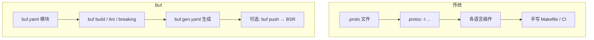
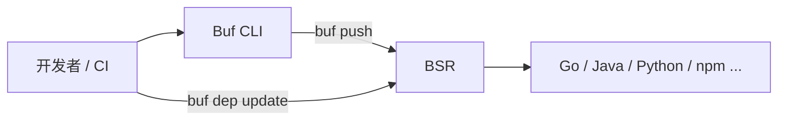

* Do not remove this line (it will not be displayed)
{:toc}

## 概述

> 本文与站内 [Protocol Buffers in Action]() 互为补充：该文侧重 `.proto` 语法、字段设计与语言绑定；本文聚焦 **如何用 Buf 管理 Schema 全生命周期**（编译、风格、兼容性、生成、发布与消费）。
{: .prompt-info }

[Buf](https://github.com/bufbuild/buf) 是面向 [Protocol Buffers](https://protobuf.dev/) 的现代工具链：用单一二进制 `buf` 替代围绕 `protoc` 拼凑的 shell 脚本，并在需要时接入 [Buf Schema Registry（BSR）](https://buf.build/docs/bsr/) 做依赖解析、远程插件与多语言 SDK 分发。官方将 Buf 定位为「与 Protobuf 协作的最佳方式」——同一套 Schema 语言，同一套 `protoc` 插件协议，更少移动部件，从本地 `.proto` 到可治理、可版本化的 API 路径更直。

Protobuf 的**线格式**天生支持向前/向后兼容，但 **`protoc` 不会告诉你某次编辑是否破坏了已有消费者**；风格、依赖、生成物分发也往往由各团队自行发明。Buf 针对这些缺口提供可重复的默认实践，并可在 CI 与注册表侧强制执行。下文按 **原理 → 安装与配置 → 常用命令 → BSR → 迁移与 CI → 最佳实践与注意事项** 展开。

# 为什么需要 Buf

二十年来，Protobuf 在 Google 之外落地时，常见痛点包括：

| 痛点 | 传统 `protoc` + 脚本 | Buf 的做法 |
| :--- | :--- | :--- |
| 发现与编译 `.proto` | 维护 `-I` 路径，导入顺序影响行为 | 在 `buf.yaml` 声明 **module**，统一发现文件、拒绝歧义导入 |
| API 风格漂移 | 靠 Code Review 或各自为政的规则 | `buf lint`，内置 40+ 规则，速度接近编译 |
| 兼容性「承诺」无保障 | 上线后生成代码失败或反序列化异常 | `buf breaking`，对比 Git/BSR/镜像等多类输入 |
| 依赖共享 | 复制粘贴、Git submodule | BSR 模块 + `buf.lock` 锁定版本 |
| 代码生成 | 每台机器装齐插件、长命令行 | `buf.gen.yaml` + 本地/**远程插件** + **Managed mode** |
| 对外分发 | 发 `.proto` 或自建 stub 仓库 | `buf push` 后消费者 `go get` / `npm install` 等安装 **生成 SDK** |



> **核心 CLI 能力无需 BSR 账号**；登录注册表后可使用远程插件、生成 SDK、私有模块依赖与服务器端策略检查等能力。详见 [What is Buf?](https://buf.build/docs/ecosystem/)。
{: .prompt-tip }

# Buf 生态：CLI 与 BSR

Buf 产品分为两层（与 [官方生态说明](https://buf.build/docs/ecosystem/) 一致）：

1. **Buf CLI**（[bufbuild/buf](https://github.com/bufbuild/buf)，Apache 2.0）：编译、格式化、Lint、破坏性变更检测、依赖管理、代码生成、调用 gRPC/Connect API（`buf curl`）等。
2. **Buf Schema Registry（BSR）**：托管 Protobuf **模块**（类似 `npm` / `crates.io` 之于 Schema），提供文档、远程插件、按语言发布的生成 SDK，以及破坏性变更等 **Schema 检查**。



相关开源项目常与 Buf 搭配：**[ConnectRPC](https://connectrpc.com/)**（基于 Protobuf 的 HTTP/gRPC/gRPC-Web）、**[Protobuf-ES](https://github.com/bufbuild/protobuf-es)**（TS/JS 运行时）、**[Protovalidate](https://github.com/bufbuild/protovalidate)**（Schema 内嵌校验规则）。一条契约可贯穿：编译 → Lint → 兼容性 → 生成 → 校验 → 调用 → 发布。

# 核心概念

## Module 与 Workspace

- **Module**：一棵 `.proto` 目录树 + 根部的 `buf.yaml`，是 Lint、Breaking、Build、Push 的基本单元。
- **Workspace（v2 配置）**：在单仓库内可声明多个 module 路径；v1 时代常用 `buf.work.yaml`，新项目建议直接使用 [v2 配置](https://buf.build/docs/configuration/v2/buf-yaml/)。

## Buf Image

`buf build` 产出的是与 `protoc` 描述符兼容的 **Image**（序列化的 `FileDescriptorSet`），可作为 `buf breaking --against` 的输入，便于在 CI 中缓存「上一版 Schema」而不必检出完整 Git 历史。

## 兼容性维度

Protobuf 的「兼容」不止一种：

| 类别 | 含义（简化） |
| :--- | :--- |
| `FILE` | 源文件级：重命名 message 等可能破坏生成代码 |
| `PACKAGE` | 包级 API 表面 |
| `WIRE` | 二进制线格式 |
| `WIRE_JSON` | JSON 映射（如字段名、`int64` 转 string 等） |

`buf breaking` 在 `buf.yaml` 的 `breaking.use` 中选择规则集；本地常用：

```bash
buf breaking --against '.git#branch=main'
```

`--against` 还支持 BSR 模块、tar/zip、本地目录或预构建 Image——笔记本、CI、发布流水线可用同一命令。

# 安装

macOS 推荐 Homebrew（同时安装 `protoc-gen-buf-breaking`、`protoc-gen-buf-lint` 及 shell 补全）：

```bash
brew install bufbuild/buf/buf
buf --version
```

其他方式见 [Installation](https://buf.build/docs/cli/installation/)：npm、Docker、二进制下载、源码构建等。CLI 自 v1.0 起在**主版本内不做破坏性变更**；`buf beta` 下命令除外。

# 快速开始：从零到可生成代码

下面是一个最小可运行布局，便于对照后续各节命令。

```text
weather-api/
├── buf.yaml
├── buf.gen.yaml
├── buf.lock          # 使用 BSR 依赖后出现
└── proto/
    └── weather/v1/weather.proto
```

**`proto/weather/v1/weather.proto`**（示例）：

```proto
syntax = "proto3";

package weather.v1;

// 查询城市当前天气
message GetWeatherRequest {
  string city = 1;
}

message GetWeatherResponse {
  string city = 1;
  double celsius = 2;
  string summary = 3;
}

service WeatherService {
  rpc GetWeather(GetWeatherRequest) returns (GetWeatherResponse);
}
```

在项目根目录依次执行（与 [GitHub README](https://github.com/bufbuild/buf#start) 一致）：

```bash
buf config init    # 已有 buf.yaml 可跳过
buf build          # 编译校验
buf format -w      # 格式化 proto
buf lint
buf breaking --against '.git#branch=main'   # 需已 git init 且有 main
buf generate
```

> 首次克隆空仓库时，`buf breaking` 可能因缺少对比基线而跳过；可在 CI 中对 `main` 分支或 BSR 上一提交运行。
{: .prompt-warning }

# 配置文件：`buf.yaml`

v2 示例（模块路径、Lint、Breaking 规则）：

```yaml
version: v2
modules:
  - path: proto
lint:
  use:
    - STANDARD
breaking:
  use:
    - FILE
```

说明：

- **`modules[].path`**：proto 根目录，避免手写 `-I`。
- **`lint.use`**：`STANDARD` 基于大规模实践的风格规则；可用 `buf config ls-lint-rules` 查看全部规则。
- **`breaking.use`**：与团队约定的严格程度对齐；对外 JSON API 常关注 `WIRE_JSON`。

从 **v1** 迁移时运行 `buf config migrate`，并阅读 [Migrate to v2](https://buf.build/docs/configuration/v2/migrate/)。

# 编译：`buf build`

`buf build` 使用 Buf 内置编译器（针对 `protoc` 描述符输出做测试），支持确定性并行编译。成功表示导入图解析正确、无循环依赖等问题。

导出 Image 供流水线缓存：

```bash
buf build -o image.binpb
buf breaking --against image.binpb
```

# 格式化：`buf format`

```bash
buf format -w          # 写回文件
buf format --diff      # 仅查看差异
```

统一格式可减少 Review 噪声，并与 Lint 规则协同。

# Lint：`buf lint`

在编辑阶段或 CI 中运行：

```bash
buf lint
buf lint --error-format=json
```

典型检查包括：枚举零值命名、`package` 与目录一致性、RPC 命名、`json_name` 建议等。可在 `buf.yaml` 中 `lint.ignore` 或按路径禁用规则；**不要**为图省事全局关闭 `STANDARD`，而应针对遗留模块渐进治理。

编辑器可配合 [Buf LSP](https://buf.build/docs/cli/lsp/)（`buf lsp serve`）在保存时获得诊断。

# 破坏性变更：`buf breaking`

CI 中推荐在 PR 阶段失败构建，而不是在生产发现不兼容：

```yaml
# .github/workflows/buf.yml 片段
- uses: bufbuild/buf-setup-action@v1
- run: buf breaking --against "https://github.com/acme/schemas.git#branch=main,subdir=proto"
```

对比源也可以是：

- Git：`'.git#branch=main'` 或带 `subdir`
- BSR：`buf.build/acme/weather`
- 本地目录、tarball、zip 或 Image 文件

> 重命名字段可能 **WIRE 仍兼容** 但 **破坏生成代码**；`FILE` / `PACKAGE` 与 `WIRE` 规则集区分这些场景。设计 API 时仍应遵循站内 [Protocol Buffers 最佳实践](#最佳实践)。
{: .prompt-info }

# 代码生成：`buf generate`

`buf generate` 兼容标准 **`protoc` 插件协议**，但把插件、输出目录、选项收敛到 **`buf.gen.yaml`**。

## 使用 BSR 远程插件（Go + Connect）

```yaml
version: v2
clean: true
managed:
  enabled: true
  override:
    - file_option: go_package_prefix
      value: github.com/acme/weather/gen/go
plugins:
  - remote: buf.build/protocolbuffers/go
    out: gen/go
    opt: paths=source_relative
  - remote: buf.build/connectrpc/gosimple
    out: gen/go
    opt:
      - paths=source_relative
      - simple
inputs:
  - directory: proto
```

要点：

- **`remote`**：无需在每台开发机/Runner 安装 `protoc-gen-go` 等二进制，版本由 BSR 插件提交锁定。
- **`managed.enabled`**：把 `go_package` 等语言选项从 `.proto` 中抽离，由生成配置统一注入，利于多仓库消费同一 Schema。
- **`clean: true`**：生成前清理输出目录，避免陈旧文件。

生成：

```bash
buf generate
```

本地插件同样支持：在 `plugins` 中写 `local: protoc-gen-go` 等，适合 air-gapped 或定制插件。

更多见 [Code generation](https://buf.build/docs/cli/code-generation/)、[Managed mode](https://buf.build/docs/cli/code-generation/managed-mode/)、[Remote plugins](https://buf.build/docs/bsr/remote-plugins/)。

# 依赖管理

在 `buf.yaml` 中声明 BSR 依赖（示例）：

```yaml
version: v2
modules:
  - path: proto
deps:
  - buf.build/googleapis/googleapis
```

然后：

```bash
buf dep update    # 拉取并写入 buf.lock
buf dep graph     # 查看依赖图
```

这替代了复制 `google/protobuf/*.proto` 或子模块 vendoring；锁定文件应提交版本库，保证 CI 与本地一致。

# Buf Schema Registry（BSR）

## 发布模块

```bash
buf registry login
buf push
```

推送后 BSR 会托管版本化 Schema、渲染可浏览文档，并可配置 **破坏性变更、唯一性、自定义 Policy** 等服务器端检查。

## 消费方式

消费者可以：

1. 在 `buf.yaml` 的 `deps` 中依赖 BSR 模块；
2. 通过 [Generated SDKs](https://buf.build/docs/bsr/generated-sdks/) 从 Go modules、Maven、npm、PyPI、NuGet、Cargo、SwiftPM 等安装**已生成**的客户端/服务端代码；
3. 在 [Buf Studio](https://buf.build/docs/bsr/studio/) 中调试 RPC（类似 Postman）。

## 调用 API：`buf curl`

基于 Schema 类型化调用 gRPC 或 Connect 服务，无需手写 `grpcurl` 参数拼装：

```bash
buf curl --schema . \
  --http2-prior-knowledge \
  https://api.example.com/weather.v1.WeatherService/GetWeather \
  --data '{"city":"Beijing"}'
```

见 [buf curl 用法](https://buf.build/docs/cli/buf-curl/usage/)。

# 从 `protoc` 迁移

Buf 刻意保持与现有生态的衔接：

| 原先 | Buf 等价 |
| :--- | :--- |
| `protoc -I... --go_out=...` | `buf.gen.yaml` + `buf generate` |
| 手写 breaking 检查 | `buf breaking` |
| 无统一 Lint | `buf lint` |
| 复制第三方 proto | `deps` + `buf dep update` |

官方指南：[Migrating from protoc](https://buf.build/docs/cli/migrating-from-protoc/)。Gradle、Bazel 等集成见 [Integrating with build systems](https://buf.build/docs/cli/build-systems/)。

仍可在特殊场景单独调用 `protoc`；日常开发建议以 `buf` 为单一入口，减少「本机插件版本与 CI 不一致」类问题——这与 [Protocol Buffers in Action]() 中「仓库只放 `.proto`，生成物由构建系统产出」的原则一致，只是把构建系统标准化为 Buf。

# CI 集成示例

```yaml
name: buf
on: [pull_request]
jobs:
  buf:
    runs-on: ubuntu-latest
    steps:
      - uses: actions/checkout@v4
      - uses: bufbuild/buf-setup-action@v1
      - run: buf build
      - run: buf lint
      - run: buf breaking --against '.git#branch=main'
      - run: buf generate
      - run: git diff --exit-code gen/   # 可选：防止未提交的生成物
```

也可使用 [Buf GitHub Action](https://buf.build/docs/bsr/ci-cd/github-action/) 推送模块或上传 breaking 基线。

# 最佳实践

1. **仓库只提交 Schema 与 Buf 配置**：`buf.yaml`、`buf.gen.yaml`、`buf.lock`、`.proto`；生成目录可进 `.gitignore` 或由 CI 生成并发布到 BSR SDK。
2. **在 PR 上强制 `buf lint` + `buf breaking`**，规则集与对外承诺一致（对外 JSON 关注 `WIRE_JSON`）。
3. **用 `buf format` 统一风格**，减少与 Lint 无关的格式争论。
4. **依赖走 BSR + lock 文件**，避免 vendored proto 分叉。
5. **优先远程插件或锁定版本的本地产物**，避免「同事机器上插件过旧」。
6. **Managed mode 管理 `go_package` / `java_package` 等**，保持 `.proto` 语言中立，便于多团队消费。
7. **与 [Google Style Guide](https://protobuf.dev/programming-guides/style/) 及站内 Proto 规范对齐**；Buf `STANDARD` Lint 是自动化补充，不能替代字段编号、`reserved`、枚举零值等业务规则。
8. **大仓库按 module 拆分**，单 module 内 proto 文件保持内聚，避免巨型单文件拖慢编译与 Review。

# 注意事项

- **Breaking 规则不等于业务兼容**：线格式兼容的变更仍可能破坏某语言的生成 API；需结合消费者测试与版本策略（SemVer、API 版本路径等）。
- **BSR 与私有模块**需要认证与网络；离线环境可仅用 CLI + 本地插件，或自建 [On-Prem BSR](https://buf.build/docs/bsr/on-prem/)。
- **`buf beta` 命令**可能随时变更，生产流水线应使用稳定子命令。
- **与 `protoc` 版本**：Buf 内置编译器追求描述符兼容；若混用 `protoc` 生成，仍需注意团队历史插件版本。
- **License 与供应链**：远程插件来自 BSR，需符合公司第三方组件政策；敏感项目可只用 `local` 插件。
- **JSON 与 `int64`**：Proto3 JSON 映射会将 `int64` 编为 string，Lint/breaking 的 JSON 规则可帮助发现相关破坏性变更。

# 总结

Buf 把 Protobuf 日常工作中分散的 **编译、格式、风格、兼容性、生成、依赖、发布** 收到统一 CLI 与可选的 BSR 中，降低「一个人维护一套 protoc 脚本直到离职」的风险。对于已采用 gRPC/Connect、多语言 SDK 或需要 API 治理的团队，值得从 `buf config init` + `buf lint` + `buf breaking` 起步，再逐步接入远程插件与 BSR 分发。

| 命令 | 作用 |
| :--- | :--- |
| `buf build` | 编译模块，可导出 Image |
| `buf format -w` | 格式化 `.proto` |
| `buf lint` | 风格与 API 形状检查 |
| `buf breaking` | 与基线对比破坏性变更 |
| `buf generate` | 按 `buf.gen.yaml` 生成代码 |
| `buf dep update` | 更新 BSR 依赖并写 lock |
| `buf push` | 发布模块到 BSR |

# 参考资源

## 官方文档（建议阅读顺序）

1. [What is Buf?](https://buf.build/docs/ecosystem/) — 生态定位、CLI 与 BSR 分工
2. [Buf CLI Quickstart](https://buf.build/docs/cli/quickstart/) — 从空目录到 Lint / Breaking / Generate
3. [Modules and workspaces](https://buf.build/docs/cli/modules-workspaces/) — `buf.yaml` v2 与多模块
4. [Linting](https://buf.build/docs/cli/lint/) / [Breaking change detection](https://buf.build/docs/cli/breaking/) — 规则类别与 CI 用法
5. [Code generation](https://buf.build/docs/cli/code-generation/) — `buf.gen.yaml`、Managed mode、排错
6. [Buf Schema Registry](https://buf.build/docs/bsr/) — 发布模块、Generated SDKs、Schema checks
7. [Migrating from protoc](https://buf.build/docs/cli/migrating-from-protoc/) — 从现有流水线迁移

## 仓库与社区

- [bufbuild/buf](https://github.com/bufbuild/buf) — CLI 源码、README 快速命令、变更日志
- [Buf Slack](https://buf.build/docs/community/) — 社区讨论（见官方文档 Community 链接）

## 站内交叉引用

- [Protocol Buffers in Action]() — 语法、字段类型、命名与组织规范
- [Kubernetes in Action]() — 集群内 gRPC/配置等场景可结合 Buf 管理 API Schema

## 延伸阅读

- [Protocol Buffers 官方文档](https://protobuf.dev/)
- [ConnectRPC 文档](https://connectrpc.com/docs/introduction/) — 与 Buf 生成配置常一起使用
- [Protovalidate](https://github.com/bufbuild/protovalidate) — Schema 驱动的跨语言校验
