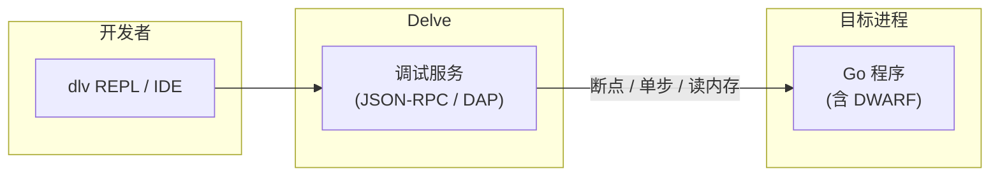
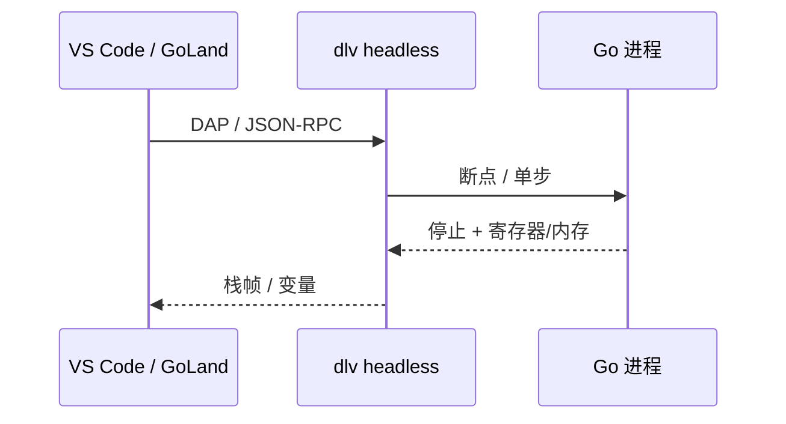

* Do not remove this line (it will not be displayed)
{:toc}

> [Delve](https://github.com/go-delve/delve)（命令行工具 `dlv`）是面向 Go 的**源码级调试器**，理解 goroutine、栈帧与运行时，也是 VS Code Go 扩展、GoLand 等 IDE 调试的后端。Go 文档不推荐用 gdb 调试 Go 程序，而应优先使用 Delve。
{: .prompt-info }

本文与站内 [How debuggers work: Part 1 - Basics]()（ptrace 与调试器原理）、[Go in Action]() 互为补充：前者讲通用调试机制，本文聚焦 Go 生态下的日常调试工作流。

## 概述

调试往往占开发时间的大头。`fmt.Println` 在简单场景下很快，但遇到**跨函数传播的错误**、**并发 goroutine**、**调用栈与变量生命周期**时，仅靠打印容易陷入「改一行、加一行 log、再跑一遍」的循环。Delve 让你在断点处暂停进程，单步执行、查看/修改变量、切换 goroutine，而不必反复改代码重编译。

本文覆盖：

- 原理与核心概念
- 安装与启动方式
- 命令行 REPL 常用命令与完整示例
- IDE 集成（VS Code / GoLand）
- 最佳实践与注意事项
- 文末 **Refer** 参考资源

## 原理与核心概念

### 为什么是 Delve 而不是 gdb

Go 有独特的运行时：goroutine 调度、defer/panic/recover、接口与逃逸分析等，都与 C/C++ 的调试模型不同。通用调试器（如 gdb）对 Go 的支持有限；[Delve](https://github.com/go-delve/delve) 从设计上只为 Go 服务，能正确展示 goroutine 列表、channel 状态，并在 panic 时停在有意义的位置。

### 源码级调试在做什么

Delve 通过操作系统提供的进程控制能力（在 Linux 上常基于 `ptrace`，与站内 [调试器基础]() 所述一致），在**可执行文件 + 调试符号（DWARF）** 与**源码行号**之间建立映射。你在 REPL 里看到的 `=>` 当前行、变量名，都来自编译时保留的调试信息。



### 子命令与调试模式

根据 [dlv 用法说明](https://github.com/go-delve/delve/blob/master/Documentation/usage/dlv.md)，常见入口如下：

| 子命令 | 典型场景 | 对应日常命令 |
|--------|----------|----------------|
| `dlv debug` | 编译并调试当前目录 `main` 包 | 类似 `go run` |
| `dlv test` | 编译并调试测试 | 类似 `go test` |
| `dlv exec` | 调试已编译的二进制 | 类似直接运行二进制 |
| `dlv attach` | 附加到正在运行的进程 | 生产/容器内进程 |
| `dlv connect` | 连接无头（headless）调试服务 | 远程 / 容器 |
| `dlv dap` | 以 DAP 协议提供 headless 服务 | IDE 后端 |

传给**被调试程序**的参数写在 `--` 之后，例如：

```bash
dlv exec ./hello -- server --config conf/config.toml
```

这与 [Debian dlv 手册](https://manpages.debian.org/unstable/delve/dlv.1.en.html) 中的说明一致。

### 无头模式与 DAP

IDE 通常不直接嵌终端 REPL，而是启动 `dlv` 的 **headless** 服务（`--headless`），通过 **Debug Adapter Protocol (DAP)** 或 JSON-RPC 与编辑器通信。你在 VS Code 里按 F5，底层往往就是 `dlv debug` 或 `dlv test` 加 DAP。

## 安装

Go 1.16+ 推荐用 `go install` 安装到 `GOPATH/bin`（或 `GOBIN`）：

```bash
go install github.com/go-delve/delve/cmd/dlv@latest
dlv version
```

{: .prompt-tip }
确保 `$(go env GOPATH)/bin` 在 `PATH` 中，否则 IDE 会报找不到 Delve。macOS 上若遇代码签名或权限问题，请参阅 [Delve 官方安装文档](https://github.com/go-delve/delve/tree/master/Documentation/installation)。
{: .prompt-tip }

也可用系统包管理器（如 `brew install delve`），便于自动更新。

## 使用方法

### 启动调试会话

```bash
# 调试当前目录 main 包（会先编译）
dlv debug
dlv debug ./cmd/myapp

# 调试测试（在含 *_test.go 的目录）
dlv test
dlv test -- -test.run TestFoo -test.v

# 调试已编译二进制
dlv exec ./bin/myapp -- -flag value

# 附加到 PID
dlv attach 12345
```

库包本身没有 `main`，无法单独 `dlv debug`；应对其 **测试** 或写一个小的 `main` 驱动程序，再用 `dlv test` / `dlv debug`。

### 为调试优化构建

默认编译会做内联与优化，单步时可能「跳过」你以为存在的行。需要更贴近源码的单步体验时：

```bash
go build -gcflags="all=-N -l" -o myapp .
dlv exec ./myapp
```

`-N` 禁用优化，`-l` 禁用内联（[Applied Go 速查](https://appliedgo.net/spotlight/delve-cheat-sheet/) 亦有说明）。

### 命令行 REPL 速查

进入 `(dlv)` 提示符后，常用命令（完整列表输入 `help`）：

| 命令 | 简写 | 作用 |
|------|------|------|
| `break` | `b` | 设断点：`b main.go:12`、`b main.main` |
| `breakpoints` | `bp` | 列出断点 |
| `clear` / `clearall` | | 删除断点 |
| `continue` | `c` | 运行到下一断点 |
| `next` | `n` | 单步越过（不进入函数） |
| `step` | `s` | 单步进入函数 |
| `stepout` | `so` | 跳出当前函数 |
| `print` | `p` | 打印变量或表达式 |
| `locals` | | 当前帧局部变量 |
| `args` | | 当前函数形参 |
| `stack` | `bt` | 调用栈 |
| `goroutines` | `grs` | 所有 goroutine |
| `goroutine` | `gr` | 切换 goroutine |
| `set` | | 修改变量值 |
| `restart` | `r` | 重启调试会话 |
| `exit` | `q` | 退出 |

Delve 还会自动设置 `runtime-fatal-throw`、`unrecoverable-panic` 等断点，便于在 panic 时检查 `runtime.curg._panic.arg`。

## 使用示例：追踪 NaN 从何而来

下面用一个小程序演示从设断点到定位 `NaN` 的完整流程（思路参考 [Debugging Go Code with Delve](https://dev.to/jpoly1219/debugging-go-code-with-delve-2l67)）。

```go
package main

import (
	"fmt"
	"math"
)

func main() {
	n1 := []float64{0.1, 0.2, 0.3, 0.4, 0.5}
	n2 := []float64{math.NaN(), 0.2, 0.3, 0.4, 0.5}

	mean1 := calcMean(n1)
	mean2 := calcMean(n2)

	fmt.Println("mean1:", mean1)
	fmt.Println("mean2:", mean2)
}

func calcMean(nums []float64) float64 {
	mean := 0.0
	for _, num := range nums {
		mean += num
	}
	mean /= float64(len(nums))
	return mean
}
```

运行 `go run main.go` 得到 `mean2: NaN`，而编译器不会报错。用 Delve 逐步查看：

```bash
cd /path/to/project
dlv debug
```

```text
(dlv) b main.go:12
Breakpoint 1 set at 0x... for main.main() ./main.go:12
(dlv) c
> main.main() ./main.go:12 ...
=>  12:         mean1 := calcMean(n1)
(dlv) n
(dlv) n
(dlv) p n2
[]float64 len: 5, cap: 5, [NaN,0.2,0.3,0.4,0.5]
(dlv) s
> main.calcMean() ./main.go:19 ...
(dlv) args
nums = []float64 len: 5, cap: 5, [...]
(dlv) display -a mean
(dlv) n
...
(dlv) p mean
NaN
```

要点：

1. **断点不会执行该行**：停在 `main.go:12` 时，`mean1` 尚未计算；`print n2` 若失败，先 `next` 一行再 `print`。
2. **`step` 进入 `calcMean`** 后可用 `args` 看形参，用 `display` 在每次停顿时自动打印 `mean`。
3. 在循环里对含 `NaN` 的切片做 `+=`，`mean` 会变成 `NaN`，再除以长度仍为 `NaN`——比 scattered 的 `fmt.Println` 更直观。

命令行熟练后，可配合 [James Sturtevant 的 CLI 教程](https://www.jamessturtevant.com/posts/Using-the-Go-Delve-Debugger-from-the-command-line/) 中的技巧：`funcs Reverse`、`b stringutil.Reverse`、`set i = 1` 做实验后 `restart` 重来。

### `dlv test` 调试单元测试

在测试目录执行：

```bash
dlv test -- -test.run TestCalcMean -test.v
```

在测试函数内 `b calc_test.go:20`，逻辑与 `dlv debug` 相同。VS Code 中对应 `launch.json` 的 `"mode": "test"` 与 `args` 里的 `-test.run`（见 [Stack Overflow 讨论](https://stackoverflow.com/questions/39058823/how-to-use-delve-debugger-in-visual-studio-code)）。

## IDE 集成

### Visual Studio Code

1. 安装官方 **Go** 扩展。
2. 命令面板执行 **Go: Install/Update Tools**，勾选 **dlv**。
3. 在 `.vscode/launch.json` 中配置，例如调试当前文件：

```json
{
  "version": "0.2.0",
  "configurations": [
    {
      "name": "Launch package",
      "type": "go",
      "request": "launch",
      "mode": "auto",
      "program": "${fileDirname}"
    },
    {
      "name": "Debug test",
      "type": "go",
      "request": "launch",
      "mode": "test",
      "program": "${workspaceFolder}/mypkg",
      "args": ["-test.run", "^TestFoo$", "-test.v"]
    }
  ]
}
```

`mode` 与 Delve 子命令对应关系（[Earthly 博文](https://earthly.dev/blog/golang-dlv/) 归纳）：`debug` → `dlv debug`，`test` → `dlv test`，`exec` → `dlv exec`（需先用 `-gcflags="all=-N -l"` 构建）。若提示找不到 Delve，检查 `PATH` 是否包含 `$(go env GOPATH)/bin`，必要时在 `env` 中设置 `GOPATH`。

### GoLand / IntelliJ

GoLand 内置 Delve，断点、变量窗、goroutine 视图开箱即用。远程调试可在 Run/Debug 配置中选择 **Go Remote**，连接 headless `dlv` 监听的地址（如 `:40000`）。

### 远程与容器内调试（简述）

在容器或远程主机上常以 headless 启动：

```bash
dlv --listen=:40000 --headless=true --api-version=2 --accept-multiclient exec ./myapp
```

本机再 `dlv connect localhost:40000`。镜像内需安装 `dlv`，且二进制建议带调试符号；详细 Dockerfile / Earthfile 示例见 [Earthly：go delve](https://earthly.dev/blog/golang-dlv/)。



## 最佳实践

1. **先复现、再下断点**：在怀疑的函数入口或返回值使用处设断点，而不是从 `main` 第一行单步几千次（[CLI 教程](https://www.jamessturtevant.com/posts/Using-the-Go-Delve-Debugger-from-the-command-line/) 的惯用法）。
2. **库代码用测试驱动**：`dlv test` 比为库单独写 `main` 更符合 Go 习惯。
3. **需要「看每一行」时关闭优化**：`-gcflags="all=-N -l"`。
4. **并发问题多看 goroutine**：`goroutines` 切换后再 `stack`，避免只盯着 main goroutine。
5. **CLI 与 IDE 互补**：服务器上 `dlv attach` / `dlv connect`；本机开发用 IDE 图形界面。
6. **与 pprof 分工**：Delve 查逻辑与状态；性能热点用 [Go Performance in Action]() 中的 pprof。

## 注意事项

| 主题 | 说明 |
|------|------|
| 仅 main / 测试可 `debug` | 纯库包需 `dlv test` 或测试用 main |
| 变量可见性 | 当前行未执行完时，本行定义的变量可能还无法 `print` |
| macOS | 可能需额外签名或安全设置，见官方 Installation |
| Go 版本 | `dlv` 可用 `--check-go-version` 检查与 Delve 版本的兼容性 |
| 生产 attach | `dlv attach` 会暂停目标进程，谨慎用于线上 |
| 多客户端 | headless 时 `--accept-multiclient` 允许多 IDE 连接 |

{: .prompt-warning }
不要在未授权的生产环境随意 `attach` 调试；优先在 staging 复现，或使用仅采集栈/日志的观测手段。
{: .prompt-warning }

## 小结

Delve 是 Go 生态事实上的标准调试器：命令行 `dlv` 适合 SSH、容器与快速排查；IDE 通过 DAP 复用同一后端。掌握 `break` / `continue` / `next` / `step`、`print` / `locals` / `stack` / `goroutines` 即可覆盖大部分日常问题；复杂场景再结合 headless 远程调试与优化构建标志。

---

# Refer

**官方与文档**

* [go-delve/delve](https://github.com/go-delve/delve) — 项目主页、安装与 Contributing
* [Documentation/usage/dlv.md](https://github.com/go-delve/delve/blob/master/Documentation/usage/dlv.md) — `dlv` 子命令总览
* [dlv(1) — Debian manpage](https://manpages.debian.org/unstable/delve/dlv.1.en.html) — 全局选项（`--headless`、`--listen`、`--build-flags` 等）

**教程与速查**

* [Debugging Go Code with Delve](https://dev.to/jpoly1219/debugging-go-code-with-delve-2l67) — 入门示例（断点、单步、NaN 排查）
* [Using the Go Delve Debugger from the command line](https://www.jamessturtevant.com/posts/Using-the-Go-Delve-Debugger-from-the-command-line/) — CLI 导航与断点技巧
* [A Delve Debugger Cheatsheet · Applied Go](https://appliedgo.net/spotlight/delve-cheat-sheet/) — 命令速查与构建标志
* [go delve - The Golang Debugger · Earthly Blog](https://earthly.dev/blog/golang-dlv/) — `dlv debug`、headless、容器与 VS Code 配置

**IDE**

* [How to use Delve debugger in Visual Studio Code](https://stackoverflow.com/questions/39058823/how-to-use-delve-debugger-in-visual-studio-code) — Go 扩展、`launch.json`、`dlv test` 参数

**站内相关**

* [How debuggers work: Part 1 - Basics]()
* [Go in Action]()
* [Go Performance in Action]()
