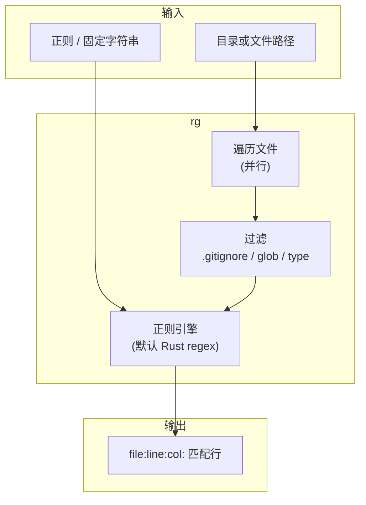
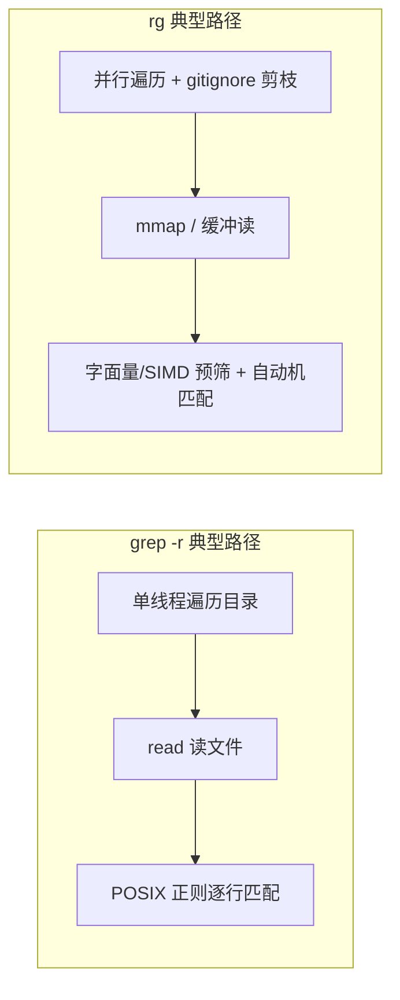

* Do not remove this line (it will not be displayed)
{:toc}

> [ripgrep](https://github.com/BurntSushi/ripgrep) 的命令名是 **`rg`**，在目录里按**正则**递归搜索**文件内容**。它是面向大型代码库的**高效版 `grep -r`**：通过并行、少搜（`.gitignore`）、mmap/缓冲读与针对搜索优化的正则引擎，整体吞吐通常明显高于传统递归 `grep`；同时默认带行号、着色与智能大小写，使用上也比手写一长串 `--exclude-dir` 更简洁。
{: .prompt-info }

本文与站内 [Bash in Action]()（管道、`grep` 别名）、[Linux in Action]() 互补：日常在仓库、日志目录里「搜一段文本」，优先用 `rg`；需要与 POSIX 脚本、极简环境或 `grep` 独有选项对齐时，再对照下文 **grep 等价写法**。

## 概述

在终端里找「哪个文件哪一行出现了某段文字」，是开发、运维的高频动作。传统做法是：

```bash
grep -rn "pattern" /path/to/project
```

还要自己排除 `node_modules`、`.git`、`vendor` 等，否则又慢又吵。`rg` 从设计上优先**搜得快、搜得准**：在 Git 仓库里自动读 `.gitignore` / `.ignore`（缩小搜索空间），默认跳过隐藏文件与二进制，多线程并行读盘与匹配，并针对字面量与常见正则走快速路径（详见下文实现原理）。

本文覆盖：

- **原理与核心概念**（为何比 `grep -r` 快、与 grep 的分工）
- **安装**
- **grep 与 rg 功能对照表**
- **场景用法**：每种场景给出 `rg` 与对应的 `grep` 写法
- **最佳实践与注意事项**
- **官方 GitHub 仓库**要点与文档速链
- 文末 **参考资源**

## 原理与核心概念

### rg 在做什么

`rg` 只做一件事：**在（一组）文件的内容里匹配正则**，把命中的行（及文件名、行号）打印到标准输出。它不替代 `find` 找文件名、不替代 `sed`/`awk` 改文件；和 `grep` 一样，核心是 **stream / file content search**。



### 为什么比 grep 快：实现原理

`rg`（ripgrep）比传统 **`grep -r` 快**，通常不是因为「正则引擎魔法」，而是**整条搜索流水线**——从算法、I/O、并行到「少搜文件」——都针对「在目录里找文本」做了优化。下面按实现原理说明；与 GNU grep 的细节以你本机 `grep --version` 为准。

#### 总览：快在哪里

两条典型路径对比如下：



| 环节 | `grep -r`（常见 GNU grep） | `rg` |
|------|---------------------------|------|
| 目录遍历 | 多为单线程 | 多线程并行搜多个文件 |
| 搜哪些文件 | 常扫到 `vendor/`、`.git/` 等 | 默认按 `.gitignore` 跳过大量路径 |
| 读文件 | `read()` 循环 | 大文件常用 mmap，减少拷贝与系统调用 |
| 正则引擎 | POSIX 正则（能力/语义不同） | Rust **regex** 库：保证线性时间、针对搜索优化 |
| 简单模式 | 仍走通用正则路径 | 可走**字面量 + SIMD** 等快速路径 |

| 维度（体验层面） | ripgrep (`rg`) | 典型 `grep -r` |
|------------------|----------------|----------------|
| 忽略规则 | 默认读 `.gitignore`、`.ignore`、`.rgignore` | 需手写 `--exclude-dir` / `--exclude` |
| 二进制 | 默认跳过，避免乱码刷屏 | 常需 `-I` 或误扫大文件 |
| 输出 | 默认带行号、彩色、智能大小写 | 需 `-n`、`-i`、`--color` 等叠加 |

#### 并行：多核同时搜多个文件

`grep -r` 一般是：**一个线程**递归目录，逐个文件打开、读、匹配。

`rg` 在目录模式下会：

1. 先收集（或流式产出）一批待搜文件路径；
2. 用**线程池**把文件分给多个 worker，每个 worker 独立读 + 搜。

磁盘若是随机读，并行不一定线性加速；但在**多文件、中小文件**、以及**代码仓库**（成千上万个小 `.go` / `.ts` 文件）这类场景里，CPU 与 I/O 能重叠，整体吞吐往往明显高于单线程 `grep -r`。

#### 少搜：`.gitignore` 与默认过滤

`rg` 默认会解析 `.gitignore`（以及 `.ignore`、`.rgignore` 等），**根本不打开**被忽略的文件。

典型 Go 仓库里，`vendor/`、构建产物、`node_modules/`、`.git/` 等可能占大量 inode；`grep -r .` 若没手写 `--exclude-dir`，会白读很多字节。这不是「匹配算法更快」，而是**搜索空间更小**——对体感速度的影响往往非常大。

#### I/O：mmap 与缓冲策略

对每个文件，`rg` 会按大小选择策略，常见包括：

- **小文件**：读进内存缓冲区，顺序扫描；
- **大文件**：**mmap** 映射到地址空间，用指针在内存里扫，减少 `read()` 次数和用户态/内核态拷贝。

`grep` 也可以用 mmap（部分实现/选项），但默认递归场景下，`rg` 把「大块连续内存 + 顺序扫描」与并行结合得更系统。

{: .prompt-tip }
mmap 不是万能：极小文件、冷缓存、网络盘上，有时普通 `read` 更合适。`rg` 会根据文件大小和平台做启发式选择（详见官方 FAQ）。
{: .prompt-tip }

#### 正则引擎：为「搜索」设计，而不是为「最强表达力」

GNU `grep` 常用 POSIX 基本/扩展正则（实现因版本而异），语义偏传统 Unix。

`rg` 使用 Rust 生态的 [**regex**](https://github.com/rust-lang/regex) crate（作者 Andrew Gallant，也是 ripgrep 作者），设计目标之一是：

- 保证匹配时间在输入长度上**线性**（避免灾难性回溯把 CPU 吃光）；
- **不支持**容易指数爆炸的特性（如回溯型 look-around 等，除非用 `-P` 走 PCRE2）；
- 针对「在文本里找 pattern」做大量编译期与运行期优化。

##### 字面量（literal）快速路径

若 pattern 其实是普通字符串（无复杂元字符），引擎会识别为**字面量搜索**，可能使用：

- **Boyer-Moore / memchr** 类算法：先快速找首字节或子串候选，再确认；
- **SIMD**：一次比较 16/32 字节（依赖 CPU 的 SSE/AVX 等），适合在长行、大文件里找固定子串。

这是 `rg` 在代码搜索场景（大量 `import "foo/bar"` 这类固定串）特别快的重要原因之一。显式固定串可用 `rg -F`。

##### 通用正则：自动机 + 预筛选

复杂一点的正则，会编译成有限状态自动机（NFA/DFA 等组合），在扫描每一行或每一块 buffer 时做状态转移。实现里还会做：

- **字面量提取**：从正则里抽出「必定出现的子串」，先用快路径缩小位置，再在候选位置跑完整自动机（「过滤 + 验证」两阶段）；
- **行锚定优化**：很多搜索按行进行，利于缓存和早停。

##### 和 GNU grep 的 PCRE 对比（概念上）

有人用 `grep -P`（PCRE）获得更强正则，但 PCRE 的通用回溯引擎在**最坏情况**下可能很慢；`rg` 的 regex crate **宁可限制表达能力，也要可预期的搜索性能**。这是产品定位差异，不是单纯「谁更先进」。需要 PCRE2 语义时，`rg -P` 与 `grep -P` 都依赖相应后端，仍应注意复杂模式的开销。

#### 编码与行处理

- `rg` 默认按 **UTF-8** 处理，并可在非法序列上采用替换/宽松策略，避免为完整 Unicode 规范化付出极高代价（除非你需要）。
- 搜索通常是**按行**或按 buffer 扫描，配合「显示行号、上下文」的流水线，内存访问模式对 CPU 缓存较友好。
- `grep` 在字节流上同样高效，但若涉及复杂多字节 locale，历史行为与选项组合更多，路径不一定为「搜代码仓库」优化。

#### 为什么不是「所有情况 rg 都更快」

| 场景 | 原因 |
|------|------|
| 单个大文件、管道输入 | 并行用不上；谁快取决于引擎与 I/O |
| 必须搜 `.git` / 被 ignore 的目录 | `rg` 要加 `--no-ignore`，「少搜」优势减弱 |
| 极简单 pattern + 已精心 exclude 的 `grep` | 两者都很快，差在毫秒级 |
| POSIX 特有语义 | `rg` 语法与 `grep -E` 不完全相同，不能无脑替换 |

> 性能并非绝对：`rg` 在**已正确排除无关目录**的小树上，与 `grep` 差距可能不大；优势主要体现在**大型 monorepo、未精心写 exclude 的递归搜索**。
{: .prompt-tip }

#### 一句话总结

`rg` 比 `grep -r` 快，往往是**乘法效应**：

1. **少搜**（gitignore / 默认跳过二进制等）；
2. **并行搜**（多文件多核）；
3. **读得快**（mmap / 缓冲）；
4. **匹配得快**（字面量 + SIMD + 线性时间正则 + 两阶段过滤）。

`grep` 作为单文件、脚本、POSIX 语义的工具依然合适；在**大型代码仓库**里做递归内容搜索，才是 `rg` 按整条流水线优化的主场。延伸阅读：[ripgrep 为何快（官方说明）](https://github.com/BurntSushi/ripgrep#why-should-i-use-ripgrep-instead-of-grep)、[regex crate 设计](https://github.com/rust-lang/regex#design)。

### 与 grep 如何分工

- **读代码库、搜日志目录**：优先 `rg`。
- **只处理 stdin 的极简管道**、**脚本要求 POSIX grep**、**系统只有 BusyBox grep**：继续用 `grep`。
- **要改文件内容**：两者都不负责；用编辑器、`sed` 或 `rg` 作者另写的 [rga](https://github.com/phracker/ripgrep-all) 等工具。

## 安装

### macOS / Linux 包管理器

```bash
# macOS
brew install ripgrep

# Debian / Ubuntu
sudo apt install ripgrep

# Fedora
sudo dnf install ripgrep

# Arch
sudo pacman -S ripgrep
```

### 发布页与版本

```bash
rg --version
```

二进制与源码发布见 [GitHub Releases](https://github.com/BurntSushi/ripgrep/releases)。安装后命令名是 **`rg`**，包名多为 `ripgrep`。

## 快速上手

在仓库根目录搜索字符串 `TODO`（递归、带行号、尊重 ignore）：

```bash
rg TODO
```

功能上接近、但通常**更慢**且更易漏排除的 `grep` 写法：

```bash
grep -rn TODO . \
  --exclude-dir=.git \
  --exclude-dir=node_modules
# 仍可能扫到 .gitignore 里已忽略但 grep 不知道的目录
```

只搜当前目录下 **Go 文件**：

```bash
rg TODO -t go
```

```bash
grep -rn TODO . --include='*.go'
```

## grep 与 rg 功能对照

下表按**常用能力**对照；「rg 默认」表示不写该选项时的行为。

| 能力 | ripgrep (`rg`) | GNU grep（递归场景） | 说明 |
|------|----------------|----------------------|------|
| 递归搜索 | 默认开启 | `grep -r` / `grep -R` | `rg` 对目录默认递归 |
| 行号 | 默认显示 `-n` | `grep -n` | |
| 忽略大小写 | `-i` | `grep -i` | |
| 智能大小写 | 默认：含大写则区分 | 无，需 `-i` | `rg` 的 **smart case** |
| 整词匹配 | `-w` | `grep -w` | |
| 固定字符串 | `-F` | `grep -F` | 不解释正则元字符 |
| 正则类型 | 默认 Rust regex；`-P` PCRE2 | 默认 BRE/ERE；`grep -E`；`-P` PCRE | |
| 反选行 | `-v` | `grep -v` | 打印**不匹配**的行 |
| 仅文件名 | `-l` | `grep -l` | 有匹配即列出文件 |
| 无匹配的文件 | `-L` | `grep -L` | |
| 统计行数 | `-c` | `grep -c` | 每文件一行计数 |
| 上下文 | `-A` / `-B` / `-C` | 同左 | |
| 最大匹配数 | `-m N` | `grep -m N` | |
| 隐藏文件 | `--hidden` | 无统一项；靠 find | 默认跳过点文件 |
| 二进制当文本 | `-a` / `--text` | `grep -a` | |
| 跳过二进制 | 默认跳过 | `grep -I` | |
| 跟随符号链接 | `-L`（大写 L） | `grep -R` 会跟；`grep -r` 一般不跟 | **注意**：`rg -L` 与 `grep -L` 含义不同 |
| 文件类型 | `-t go`、`-t py` 等 | `--include='*.go'` | `rg --type-list` 查看 |
| Glob 过滤 | `-g '*.rs' -g '!tests/*'` | `--include` / `--exclude` | |
| 尊重 gitignore | **默认** | 无 | `rg --no-ignore` 关闭 |
| 并行 | 内置 | 无 | |
| 替换/删除 | **不支持** | `grep` 也不改文件 | 用 `sed` / 编辑器 |
| JSON 输出 | `--json` | 无 | 便于工具链解析 |

{: .prompt-warning }
**选项同名不同义**：`grep -L` 列出「没有任何匹配行」的文件；`rg -L` 表示**跟随符号链接**（follow symlinks）。对照时以手册为准。
{: .prompt-warning }

## 场景用法：rg 与等价 grep

以下均在项目根目录 `.` 下举例；把 `PATTERN` 换成实际正则或固定串。

### 1. 在代码库里搜一个词（最常用）

```bash
rg PATTERN
```

```bash
grep -rn PATTERN .
```

若还要排除常见目录（仍不如 gitignore 完整）：

```bash
grep -rn PATTERN . \
  --exclude-dir=.git \
  --exclude-dir=node_modules \
  --exclude-dir=vendor \
  --exclude-dir=dist
```

### 2. 大小写不敏感

```bash
rg -i PATTERN
```

```bash
grep -rin PATTERN .
```

### 3. 整词匹配（避免 `foo` 命中 `foobar`）

```bash
rg -w foo
```

```bash
grep -rnw foo .
```

### 4. 固定字符串（路径、IP、含 `.` 的文本）

```bash
rg -F 'api.example.com/v1'
```

```bash
grep -rnF 'api.example.com/v1' .
```

### 5. 只搜某类扩展名 / 语言

```bash
rg PATTERN -t rust
rg PATTERN -g '*.md'
```

```bash
grep -rn PATTERN . --include='*.rs'
grep -rn PATTERN . --include='*.md'
```

### 6. 排除路径或目录

```bash
rg PATTERN -g '!**/tests/**' -g '!**/vendor/**'
```

```bash
grep -rn PATTERN . --exclude-dir=tests --exclude-dir=vendor
```

在 Git 仓库里，多数排除应写在 `.gitignore`，`rg` 会自动遵守，无需重复 `-g`。

### 7. 列出包含匹配的文件名

```bash
rg -l PATTERN
```

```bash
grep -rl PATTERN .
```

### 8. 列出「不包含」匹配的文件（grep 的 -L）

```bash
# grep：无匹配行的文件
grep -rL PATTERN .
```

`rg` 没有与 `grep -L` 完全同名的「反选文件列表」；可用组合，例如先 `rg -l` 再与 `find` 差集，或：

```bash
rg -L PATTERN   # 注意：这是「跟随符号链接」，不是 grep 的 -L
```

{: .prompt-danger }
不要混淆 **`grep -L`** 与 **`rg -L`**，见上表。
{: .prompt-danger }

### 9. 显示匹配次数

```bash
rg -c PATTERN
```

```bash
grep -rc PATTERN .
```

### 10. 上下文（看调用附近几行）

```bash
rg -C 3 PATTERN
rg -B 2 -A 5 PATTERN
```

```bash
grep -rnC 3 PATTERN .
grep -rn -B 2 -A 5 PATTERN .
```

### 11. 排除匹配行（看「没出现某关键字」的行）

```bash
rg -v DEBUG
```

```bash
grep -rnv DEBUG .
```

### 12. 限制目录深度

```bash
rg PATTERN --max-depth 2
```

`grep` 无 `--max-depth`，常见写法：

```bash
find . -maxdepth 2 -type f -exec grep -Hn PATTERN {} +
```

### 13. 搜索隐藏文件与 ignore 之外的文件

```bash
rg PATTERN --hidden
rg PATTERN --no-ignore
```

```bash
grep -rn PATTERN . --exclude-dir=   # 仍不会自动读 .gitignore
# 常配合 find 显式包含点文件
find . -name '.*' -prune -o -type f -print0 | xargs -0 grep -Hn PATTERN
```

### 14. PCRE2 正则（lookahead、反向引用等）

```bash
rg -P '\d+(?=px)'
```

```bash
grep -rPn '\d+(?=px)' .
```

需系统 `grep` 编译时带 PCRE（GNU grep 的 `-P`）。

### 15. 多行匹配（跨行模式）

```bash
rg -U 'struct \{[\s\S]*?name:'
```

```bash
grep -rPzo 'struct \{[\s\S]*?name:' .   # GNU grep，-z 以 NUL 分隔「行」
```

跨行搜索都需谨慎，性能与误报率更高。

### 16. 在指定文件或 stdin 中搜

```bash
rg PATTERN path/to/file.go
cat app.log | rg PATTERN
```

```bash
grep -n PATTERN path/to/file.go
grep PATTERN < app.log
```

### 17. 与 find、xargs 组合（只要文件名再 grep）

传统写法：

```bash
find . -name '*.c' -print0 | xargs -0 grep -Hn PATTERN
```

更简：

```bash
rg PATTERN -g '*.c'
```

### 18. 输出给脚本解析

```bash
rg --json PATTERN | jq .
```

`grep` 无内置 JSON；需自行解析 `file:line:content` 文本格式。

## 常用选项速查

```bash
rg --help
rg --type-list          # 内置 -t 类型
man rg                  # 若系统安装了手册页
```

| 选项 | 含义 |
|------|------|
| `-i` | 忽略大小写 |
| `-w` | 整词 |
| `-F` | 固定字符串 |
| `-n` | 行号（默认已开） |
| `-l` / `-L` | 有匹配的文件 / **跟随符号链接** |
| `-c` | 计数 |
| `-v` | 反选行 |
| `-A` / `-B` / `-C` | 上下文 |
| `-t TYPE` | 按内置类型过滤 |
| `-g GLOB` | glob，可 `!` 排除 |
| `--hidden` | 包含隐藏文件 |
| `--no-ignore` | 不读 ignore 规则 |
| `-a` | 把二进制当文本 |
| `-P` | PCRE2 |
| `-U` | 多行（`.` 含换行） |
| `--max-depth N` | 最大目录深度 |

## 最佳实践

1. **在 Git 仓库里维护好 `.gitignore`**，`rg` 会跟着省掉大量无关扫描；临时要搜被 ignore 的生成物时用 `--no-ignore` 并收窄路径。
2. **先 `-F` 再考虑正则**：搜错误码、域名、配置键时，避免 `.` `*` 被当成元字符。
3. **用 `-t` / `-g` 收窄范围**：比全仓库扫完再肉眼过滤更快。
4. **别名可选**：`alias rg='rg --smart-case'` 通常不必写，smart case 已是默认；若习惯始终彩色，可确认终端与 `rg` 的 `--color` 设置。
5. **CI / 脚本**：需要稳定、可移植时，可固定 `rg` 版本并写清 `--no-ignore` 是否使用；与仅提供 `grep` 的极简镜像兼容时保留 `grep` 路径。

## 注意事项

- **不是 grep 的 drop-in**：选项字母部分重叠，但 **`grep -L` ≠ `rg -L`**，且 `rg` 默认递归、默认 ignore。
- **不会修改文件**：只做搜索；批量替换请用 IDE、`sed` 或专用工具。
- **极老环境**：嵌入式或最小容器可能没有 `rg`，保留 `grep -r` 知识仍然必要。
- **搜索压缩包、PDF、Office**：标准 `rg` 只搜普通文件；扩展场景见 [ripgrep-all](https://github.com/phracker/ripgrep-all)。
- **性能**：在 NFS、慢盘上，过多并行可能反而抖动；可调 `RG_THREADS` 环境变量（见官方 FAQ）。

## 小结

| 场景 | 推荐 |
|------|------|
| 日常在代码库找字符串 | `rg PATTERN` |
| 大型仓库递归搜索（快 + 尊重 gitignore） | `rg` |
| 管道里只有 stdin、无 rg | `grep` |
| 脚本强调 POSIX / 最小依赖 | `grep` |
| 跨行、复杂正则（PCRE2） | `rg -P` / `grep -P`（视环境） |

把 `rg` 当成**为性能优化的 `grep -r`** 即可：速度来自**少搜 × 并行 × I/O × 匹配**整条流水线，而非单一正则技巧；顺手好用的默认选项是附加收益。对照上表的 **grep 等价命令**，可以在团队仍用 `grep` 的机器或文档里无缝切换说法。

## 官方仓库参考（GitHub）

权威说明与发布均在 [BurntSushi/ripgrep](https://github.com/BurntSushi/ripgrep)。README 对项目的定义是：

> **ripgrep** is a line-oriented search tool that recursively searches the current directory for a regex pattern. By default, ripgrep will respect gitignore rules and automatically skip hidden files/directories and binary files.

中文可概括为：**按行匹配的正则搜索工具**，默认递归当前目录，并尊重 **gitignore**、跳过隐藏项与二进制。与 The Silver Searcher（`ag`）、`ack`、`grep` 同类，但在代码仓库场景下通常更快。许可证为 **MIT / Unlicense** 双许可；支持 **Windows、macOS、Linux**，每版提供预编译二进制。

### 文档速链（仓库 README）

| 主题 | 链接 |
|------|------|
| 安装 | [README — Installation](https://github.com/BurntSushi/ripgrep#installation) |
| 用户指南 | [GUIDE.md](https://github.com/BurntSushi/ripgrep/blob/master/GUIDE.md) |
| FAQ | [FAQ.md](https://github.com/BurntSushi/ripgrep/blob/master/FAQ.md) |
| 正则语法 | [Regex syntax](https://github.com/BurntSushi/ripgrep/blob/master/GUIDE.md#regular-expression-syntax) |
| 配置文件 | [Configuration files](https://github.com/BurntSushi/ripgrep/blob/master/GUIDE.md#configuration-file) |
| Shell 补全 | [Shell completions](https://github.com/BurntSushi/ripgrep/blob/master/FAQ.md#complete) |
| 从源码构建 | [README — Building](https://github.com/BurntSushi/ripgrep#building) |
| 变更记录 | [CHANGELOG.md](https://github.com/BurntSushi/ripgrep/blob/master/CHANGELOG.md) |
| 发布包 | [Releases](https://github.com/BurntSushi/ripgrep/releases) |
| 社区文档翻译列表 | [README — Translations](https://github.com/BurntSushi/ripgrep#translations)（含中文、西班牙文等） |

### 为何选用 ripgrep（官方归纳）

README [Why should I use ripgrep?](https://github.com/BurntSushi/ripgrep#why-should-i-use-ripgrep-instead-of-grep) 中的要点，与本文「实现原理」一致，可对照阅读：

- **速度与过滤**：在保留多数 `grep` 能力的前提下通常更快；默认递归，并自动过滤 `.gitignore` / `.ignore` / `.rgignore`、隐藏文件、二进制（全部关闭过滤用 `rg -uuu`）。
- **按类型搜**：`rg -tpy foo` 只搜 Python；`rg -Tjs foo` 排除 JavaScript；可用自定义规则扩展类型（`rg --type-list`）。
- **类 grep 体验**：上下文、多 pattern、彩色高亮；**Unicode 默认开启且保持较快**（与 GNU grep 在 Unicode 场景下的表现对比，见官方 benchmark）。
- **可选 PCRE2**：`-P` / `--pcre2` 或 `--engine auto` 支持 look-around、反向引用等（默认 Rust regex 不支持）。
- **其它能力**（正文未逐条展开）：按匹配替换输出（rudimentary replacements）、`-E/--encoding` 非 UTF-8 编码、`-z/--search-zip` 搜压缩包内文本、预处理过滤器、**配置文件**、与 `rg --json` 配合的 [delta](https://github.com/dandavison/delta) 分页高亮等。

### 何时不必用 ripgrep

官方 [Why shouldn't I use ripgrep?](https://github.com/BurntSushi/ripgrep#why-shouldnt-i-use-ripgrep) 归纳：

- 需要**到处都有、符合 POSIX** 的工具 → 仍用 `grep`。
- 依赖其它工具独有、且 `rg` 尚未实现的行为（可查 FAQ / 提 issue）。
- 存在**性能边角**（某类 pattern 或语料上 `rg` 不占优；README 也提醒勿只信单次 benchmark）。
- 目标平台**无法安装** `rg`。

### 官方性能说明与 benchmark

README [Is it really faster?](https://github.com/BurntSushi/ripgrep#is-it-really-faster-than-everything-else) 将「快」归结为：

- 基于 **Rust regex**（有限自动机、SIMD、字面量优化）；可选 **PCRE2**（`-P`）。
- 在 **完整 Unicode** 下仍保持可预期性能（UTF-8 解码融入 DFA）。
- 按文件大小在 **mmap** 与**增量缓冲**间自动选择策略。
- 用 **RegexSet** 同时匹配多条 gitignore glob。
- 使用 **crossbeam** 与 **ignore**  crate 的**无锁并行**目录遍历。

作者在 Linux 内核源码树（`make defconfig && make -j8` 后）上对比 `rg`、`git grep`、`ag`、`ack`、`ugrep` 等；README 给出多组数据，例如搜 `[A-Z]+_SUSPEND`（整词）时 `rg` 约 **0.082s**，`git grep -P` 约 0.273s，`ag` 约 0.443s，`ack` 约 2.9s（**单次 benchmark 不足以下结论**，详见 [blog post on ripgrep](https://blog.burntsushi.net/ripgrep/)）。

{: .prompt-info }
官方也列出**性能悬崖**：无字面量优化机会的正则、极高匹配行数（输出成为瓶颈）、个别 pattern 下其它工具可能更快。评估时应用自己的仓库与 pattern 实测。
{: .prompt-info }

### 与其它搜索工具的功能对比

ack 作者维护的对比表（含 ack、ag、git-grep、GNU grep、ripgrep）：[beyondgrep.com — feature comparison](https://beyondgrep.com/feature-comparison/)。`rg` 近年还增加了配置文件、passthru、压缩文件搜索、多行、PCRE2 等，表中部分项可能未更新，以 [CHANGELOG](https://github.com/BurntSushi/ripgrep/blob/master/CHANGELOG.md) 为准。

同类工具简述：

| 工具 | 说明 |
|------|------|
| [The Silver Searcher](https://github.com/ggreer/the_silver_searcher)（`ag`） | 面向代码库的 C 实现搜索器 |
| [ack](https://github.com/beyondgrep/ack3) | Perl 实现的代码搜索，可编程过滤强 |
| `git grep` | 在 Git 跟踪文件内搜，与索引配合 |
| [ugrep](https://github.com/Genivia/ugrep) | 强调 Unicode 与多格式的 grep 系工具 |
| [ripgrep-all](https://github.com/phracker/ripgrep-all)（`rga`） | 在 `rg` 上扩展 PDF、Office 等 |

### 安装与构建（仓库摘要）

除本文「安装」一节外，README 还列出 **Chocolatey / Scoop / Winget**（Windows）、**Nix / Guix / cargo install** 等。Rust 用户：

```bash
cargo install ripgrep
# 或预编译二进制：cargo binstall ripgrep
```

从源码构建（需 Rust **1.85.0+**）：

```bash
git clone https://github.com/BurntSushi/ripgrep
cd ripgrep
cargo build --release
./target/release/rg --version
```

启用 PCRE2：`cargo build --release --features pcre2`。试玩无需安装可使用社区 [playground](https://codapi.org/try/rg/) 与[交互教程](https://github.com/stephengrice/ripgrep-tutorial)（非官方维护）。

### 相关生态

- **delta**：对 `rg --json` 输出做语法高亮分页，用法 `rg --json PATTERN | delta`（见 [delta 手册 — grep](https://dandavison.github.io/delta/grep.html)）。
- **安全**：漏洞报告见 README [Vulnerability reporting](https://github.com/BurntSushi/ripgrep#vulnerability-reporting)。

## 参考资源

### 官方（GitHub / 文档）

| 说明 | 链接 |
|------|------|
| **ripgrep 官方仓库** | [BurntSushi/ripgrep](https://github.com/BurntSushi/ripgrep) |
| README 总览 | [README.md](https://github.com/BurntSushi/ripgrep/blob/master/README.md) |
| 为何用 / 为何不用 | [Why ripgrep](https://github.com/BurntSushi/ripgrep#why-should-i-use-ripgrep-instead-of-grep) · [Why not](https://github.com/BurntSushi/ripgrep#why-shouldnt-i-use-ripgrep) |
| 是否更快（benchmark 摘要） | [Is it really faster?](https://github.com/BurntSushi/ripgrep#is-it-really-faster-than-everything-else) |
| 工具功能对比表（ack 站） | [Feature comparison](https://beyondgrep.com/feature-comparison/) |
| 用户指南 | [GUIDE.md](https://github.com/BurntSushi/ripgrep/blob/master/GUIDE.md) |
| FAQ | [FAQ.md](https://github.com/BurntSushi/ripgrep/blob/master/FAQ.md) |
| 变更记录 | [CHANGELOG.md](https://github.com/BurntSushi/ripgrep/blob/master/CHANGELOG.md) |
| 发布与二进制 | [Releases](https://github.com/BurntSushi/ripgrep/releases) |
| 手册页 `rg(1)` | [doc/rg.1](https://github.com/BurntSushi/ripgrep/blob/master/doc/rg.1) 或系统 `man rg` |
| 作者详细 benchmark 博文 | [Andrew Gallant — ripgrep](https://blog.burntsushi.net/ripgrep/) |
| Rust regex 库（默认引擎） | [rust-lang/regex](https://github.com/rust-lang/regex) |

### 其它

| 说明 | 链接 |
|------|------|
| GNU grep 手册 | [grep 文档](https://www.gnu.org/software/grep/manual/) |
| delta（配合 `rg --json`） | [dandavison/delta](https://github.com/dandavison/delta) |
| ripgrep-all（扩展文件类型） | [phracker/ripgrep-all](https://github.com/phracker/ripgrep-all) |
| 站内：Bash 与 grep 习惯 | [Bash in Action]() |
| 站内：Linux 运维 | [Linux in Action]() |
