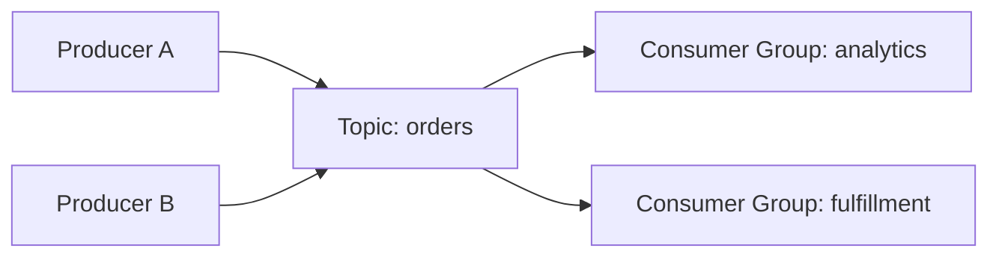
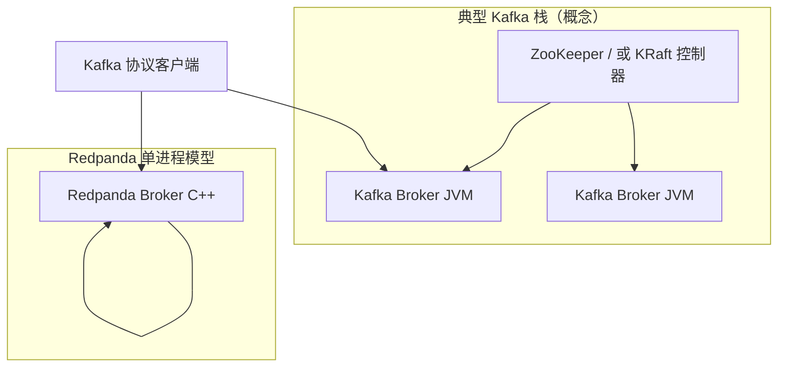
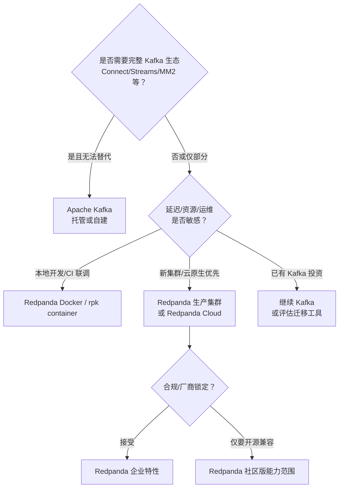
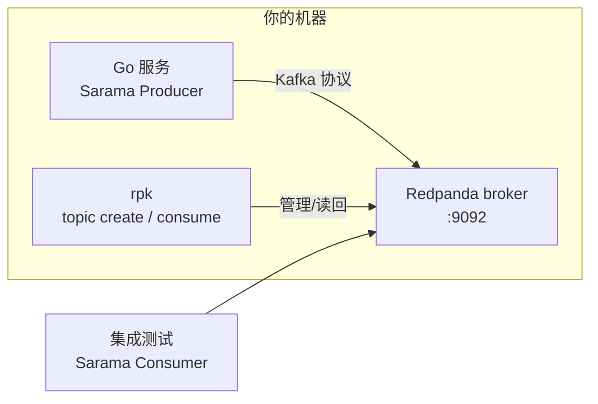
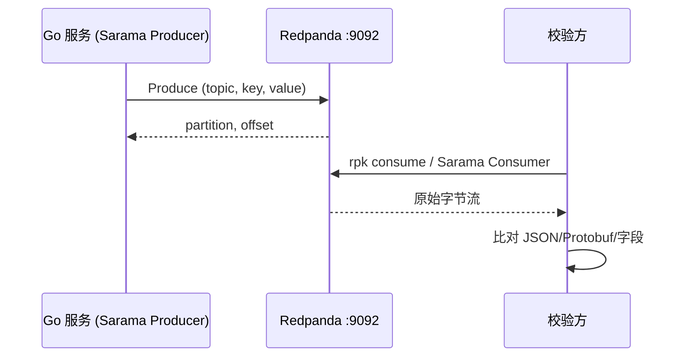

* Do not remove this line (it will not be displayed)
{:toc}

> [Redpanda](https://www.redpanda.com/) 是面向关键业务的**实时流式引擎**：Kafka® 协议兼容、**无需 ZooKeeper**、**无 JVM**、现有客户端与生态工具多数可直接复用。官方定位从笔记本上的原型到全球分布的 PB 级数据都能扩展，并在 Kafka 协议之上提供内联 WASM 变换、地理复制与分层存储等能力。Docker 镜像见 [redpandadata/redpanda](https://hub.docker.com/r/redpandadata/redpanda)；本地多节点集群推荐 [`rpk container`](https://www.redpanda.com/blog/rpk-container)。
{: .prompt-info }

## 概述

**Apache Kafka** 已成为事件驱动架构的事实标准：日志型存储、分区并行、消费者组、Exactly-once 语义（配合事务）等概念深入人心。但完整生产栈往往包含 **ZooKeeper 或 KRaft**、多个 JVM Broker、较重的内存与运维成本；本地开发还要维护 `docker-compose` 或脚本。

**Redpanda** 用 **C++** 从零实现兼容 Kafka 的 broker，把协调、元数据与数据面收敛到单一进程，并配套 CLI **`rpk`**（Redpanda Keeper）做安装调优、Topic 管理、容器化本地集群等。对你而言：

| 角色 | 典型收益 |
|------|----------|
| 应用开发者 | `docker run` 或 `rpk container start` 即可起集群，客户端仍用 `localhost:9092` |
| 平台 / SRE | 更少组件、更低延迟与内存占用，K8s 部署对象更简单 |
| 架构师 | 在「必须原生 Kafka」与「可接受兼容实现」之间多一个选型 |

## 原理与核心概念

### 流式平台在解决什么问题

业务系统产生连续事件（订单、点击、指标、CDC 变更）。流式平台把这些事件**按主题（Topic）持久化、可重放、可并行消费**，解耦生产者与消费者，并支撑实时管道（Flink、Spark Streaming）、微服务集成（Kafka Connect）与日志聚合等场景。



### 与 Kafka 对齐的名词

Redpanda 在协议与语义上对齐 Kafka，下列概念可直接沿用既有知识：

| 概念 | 含义 |
|------|------|
| **Broker** | 接收、存储、复制分区数据的节点 |
| **Topic** | 逻辑消息流名称 |
| **Partition** | Topic 的物理分片，决定并行度与顺序边界（分区内有序） |
| **Replica** | 分区副本，用于高可用 |
| **Consumer Group** | 同组内分区分配，实现水平扩展消费 |
| **Offset** | 分区内消息位置，消费进度以此提交 |

### Redpanda 架构要点（与 Kafka 的差异根源）

传统 Kafka 集群（尤其仍依赖 ZK 的部署）在逻辑上可拆成多层：



Redpanda 将**元数据管理、Raft 共识、存储引擎**整合进同一 broker 进程，不再单独部署 ZooKeeper；也无需为 broker 准备 JVM 堆。存储侧采用**线程-per-core**、顺序写与零拷贝等设计，官方宣称在多种工作负载下相较传统 Kafka 有显著延迟与吞吐优势（具体倍数取决于硬件、副本数、压缩与消息大小，选型时应以你的压测为准）。

在 Kafka 协议之外，Redpanda 还提供（视版本与许可证而定）例如：

- **内联 WASM Transform**：在 broker 路径上对记录做轻量变换，减少外部流处理作业
- **分层 / 云存储（Tiered Storage、Cloud Topics 等）**：冷热数据分离、跨地域复制，面向更大规模与成本优化

开发测试阶段通常只需关心 **Kafka API 兼容** 与 **`rpk`**；高级特性在确定上生产 Redpanda 后再深入官方文档即可。

## 与 Apache Kafka 的对比

### 架构与运维

| 维度 | Apache Kafka | Redpanda |
|------|----------------|----------|
| 实现语言 | Java（broker） | C++ |
| 协调 / 元数据 | ZK（旧版）或 KRaft（新方向） | 内置 Raft，无 ZK |
| 进程模型 | JVM + GC 调优 | 原生进程，`rpk redpanda tune` 可协助 OS 调优 |
| 本地开发重量 | 常需 compose 多容器或较重镜像 | 单容器即可监听 `9092` |
| 客户端 | Kafka 协议 | **Kafka 协议兼容**，多数客户端无需改代码 |
| 生态 | Connect、Streams、MirrorMaker 等最完整 | 兼容主流客户端；部分 Kafka 专属生态需逐项验证 |
| 运维工具 | kafka-topics.sh、Cruise Control 等 | **`rpk`** 统一集群/Topic/容器 |

### 性能与资源（如何理解「10x」）

官方宣传中的「更快、更省资源」来自：无 JVM GC 停顿、更少的跨进程 RPC、针对 NVMe 的存储路径优化等。**不应**把营销数字直接当作 SLA；应在与生产相近的消息大小、压缩、副本因子、`acks` 配置下做基准测试。

### 兼容性边界

Redpanda 目标为 **Kafka 协议兼容**，使现有 Producer/Consumer、多数 CLI 与监控集成能工作。但需注意：

- **Kafka Connect 连接器、Kafka Streams、特定 Admin API 或极新 KIP 特性**可能滞后或行为略有差异，上线前要在预发环境验证。
- **事务、幂等生产者、exactly-once** 等高级语义：Redpanda 持续补齐；关键业务路径必须按官方兼容性矩阵与版本说明测试。
- **版本锁定**：生产应固定 Redpanda 版本，并关注 [发布说明](https://github.com/redpanda-data/redpanda/releases) 与 Kafka 协议级别。

## 方案选型



| 场景 | 更倾向 | 说明 |
|------|--------|------|
| 笔记本 / CI 需要 Kafka 协议联调 | **Redpanda** | 一条 `docker run` 或 `rpk container start`，内存占用远低于完整 Kafka+ZK |
| Go 服务用 **Sarama** 发事件、无测试环境 Kafka | **Redpanda + 本机消费校验** | `bootstrap` 指向 `127.0.0.1:9092`，用 `rpk` 或 Sarama Consumer 核对 payload |
| 已有大量 Kafka Streams / Connect 作业 | **Kafka** | 迁移成本高，除非逐项验证 Redpanda |
| 新建事件骨干、K8s 上希望组件少 | **Redpanda** | 单镜像、Helm/Operator 或 StatefulSet 部署 |
| 超大规模、仅采购 Kafka 托管服务 | **Confluent Cloud / MSK 等** | 运维外包；Redpanda 作为替代需单独商务与技术评估 |
| 强依赖某一 Kafka 专有 KIP | **Kafka** | 以官方兼容性文档为准 |

{: .prompt-tip }
**实践建议**：当文档或教程写着「启动 Kafka 做测试」且机器能跑 Docker 时，用 **Redpanda 监听 9092** 往往更轻；应用侧 `bootstrap.servers=127.0.0.1:9092` 通常无需改代码。
{: .prompt-tip }

## 安装与快速开始

### 前置条件

- **Docker**：Linux 上 [Docker Engine](https://docs.docker.com/engine/install/)，macOS 上 [Docker Desktop](https://www.docker.com/products/docker-desktop/)
- 可选：安装 **`rpk`**（与 Redpanda 同发版），用于 Topic 管理、`rpk container` 多节点集群等 — 见 [Quick Start](https://docs.redpanda.com/docs/get-started/quick-start/)

### 单节点：Docker（推荐用于 Kafka 协议测试）

官方镜像 [`redpandadata/redpanda`](https://hub.docker.com/r/redpandadata/redpanda)（早期社区镜像名为 `vectorized/redpanda`，现已迁移到 `redpandadata` 组织）。在开发机上一行启动单 broker，对外暴露 **9092**：

```bash
docker run --rm -p 9092:9092 redpandadata/redpanda:latest \
  redpanda start \
  --overprovisioned \
  --smp 1 \
  --memory 512M \
  --reserve-memory 0M \
  --node-id 0 \
  --check=false \
  --kafka-addr 0.0.0.0:9092 \
  --advertise-kafka-addr 127.0.0.1:9092
```

参数含义简述：

| 参数 | 作用 |
|------|------|
| `--overprovisioned` | 开发/容器环境，放宽对 CPU/磁盘的假设 |
| `--smp 1` | 使用 1 个 CPU 核（与轻量测试匹配） |
| `--memory 512M` | 限制 broker 可用内存 |
| `--kafka-addr` / `--advertise-kafka-addr` | 监听地址与返回给客户端的地址（本机用 `127.0.0.1:9092`） |
| `--check=false` | 跳过部分生产环境检查，便于本地快速起 |

容器运行后，将任意 Kafka 客户端的 `bootstrap.servers` 指向 **`127.0.0.1:9092`** 即可。

### 多节点本地集群：`rpk container`

[`rpk container`](https://www.redpanda.com/blog/rpk-container) 在 Docker 之上自动拉取镜像、组网并映射端口，**无需手写 compose**。首次会下载镜像，稍等片刻：

```bash
# 3 节点集群
rpk container start -n 3

# 查看集群（示例输出中的 broker 地址以实际为准）
rpk cluster info --brokers 127.0.0.1:65279,127.0.0.1:65287,127.0.0.1:65286

# 创建 Topic
rpk topic create demo -p 3 -r 3 \
  --brokers 127.0.0.1:65279,127.0.0.1:65287,127.0.0.1:65286

# 停止 / 清空
rpk container stop
rpk container purge   # 删除数据，需改节点数时先 purge
```

{: .prompt-info }
`rpk container start` 再次执行时，若已有集群会**复用**原节点与端口；要改 `-n` 节点数，需先 `rpk container purge`。
{: .prompt-info }

### 常用 `rpk` 命令（单节点已用 Docker 时）

若已安装 `rpk` 且 broker 在 `127.0.0.1:9092`：

```bash
rpk cluster info
rpk topic create events -p 6 -r 1
rpk topic list
rpk topic describe events
rpk topic produce events -k 'key1' -v 'hello'
rpk topic consume events -n 1
```

## 使用示例

### 命令行验证管道

终端 1 保持 Docker 或 `rpk container` 运行；终端 2：

```bash
rpk topic create hello -p 1 -r 1
echo '{"msg":"world"}' | rpk topic produce hello
rpk topic consume hello -n 1
```

### 使用场景：IBM Sarama 上报与本地校验

#### 背景：没有测试环境 Kafka 时要验证什么

许多 Go 服务用 [IBM/sarama](https://github.com/IBM/sarama)（**Sarama is a Go library for Apache Kafka**）把业务事件写到 Kafka：例如订单状态、审计日志、指标快照。`SyncProducer.SendMessage` 返回 **partition / offset** 只说明 broker **收下了这条记录**，并不保证：

- Topic 名、**Partition Key** 是否符合设计（是否进错分区）；
- Value 序列化后的**字节**是否正确（JSON 字段名、Protobuf oneof、时间格式等）；
- Headers、压缩、`RequiredAcks` 等配置在真实链路上是否可用。

若公司**没有**可随时使用的测试/预发 Kafka，常见做法是：

| 做法 | 局限 |
|------|------|
| 只写单元测试 + **`sarama/mocks`** | 能断言「是否调用了 SendMessage、参数是什么」，但**不经网络、不经真实 Topic**，发现不了与 broker 交互类问题 |
| 本地起 **ZooKeeper + Kafka** | 资源占用大、compose 重，笔记本上常懒得开 |
| 等联调环境 | 反馈慢，Topic 未建、ACL 未开时难以区分是代码还是环境 |

**Redpanda 在这里的角色**：在本机提供**兼容 Kafka 协议**的 broker（默认 `127.0.0.1:9092`），让 Sarama 走与线上一致的 Produce 路径；配套 **`rpk`**（或上文单容器 `docker run`）负责**起 broker、建 Topic、消费核对**，无需部署 ZK/JVM。应用代码里仍只需配置 broker 列表（如 `KAFKA_BROKERS`），**不必为本地单独换 SDK**。



典型闭环：**Docker 或 `rpk container` 起 Redpanda** → **`rpk topic create`** 对齐线上 Topic 名 → **跑服务或测试触发上报** → 用 **`rpk topic consume`** 或 **Sarama Consumer** 读回 value，与预期 JSON/Protobuf 比对。下文按该顺序展开。

#### Sarama 与 Redpanda 如何对接

Sarama 是 MIT 协议的 Go Kafka 客户端（现由 IBM 维护）。业务里常用 **`SyncProducer`** 在请求路径末尾写 Topic，或用 **`AsyncProducer`** 做旁路日志。Sarama 只认 **Kafka 协议** 与 broker 地址，**不区分**背后是 Apache Kafka 还是 Redpanda——把 `bootstrap.servers` / `KAFKA_BROKERS` 指到本机 Redpanda 即可，**无需改上报代码**。



#### 1. 准备本地 broker 与 Topic

终端 A 启动 Redpanda（见上文 `docker run`）。终端 B 创建与线上一致的 Topic 名（分区数本地可先用 1）：

```bash
export KAFKA_BROKERS=127.0.0.1:9092

rpk topic create app-events -p 1 -r 1
rpk topic describe app-events
```

{: .prompt-tip }
建议用环境变量统一 broker 地址，便于 CI 与本地切换：`KAFKA_BROKERS` 或项目惯用的 `KAFKA_PEERS`（Sarama 官方 [http_server 示例](https://github.com/IBM/sarama/tree/main/examples/http_server) 使用后者）。
{: .prompt-tip }

#### 2. 最小 SyncProducer（与生产代码同构）

下列代码与多数线上 Sarama 配置一致：`Return.Successes` 为 true 时，`SendMessage` 返回的 **partition / offset** 可作为单条消息的唯一标识（与 Sarama 示例注释一致）。

```go
package main

import (
	"encoding/json"
	"log"
	"os"
	"strings"

	"github.com/IBM/sarama"
)

const topic = "app-events"

func main() {
	brokers := strings.Split(envOr("KAFKA_BROKERS", "127.0.0.1:9092"), ",")

	cfg := sarama.NewConfig()
	cfg.Producer.Return.Successes = true
	cfg.Producer.RequiredAcks = sarama.WaitForLocal // 本地单副本；生产可改为 WaitForAll

	producer, err := sarama.NewSyncProducer(brokers, cfg)
	if err != nil {
		log.Fatal(err)
	}
	defer producer.Close()

	payload, _ := json.Marshal(map[string]any{
		"event": "order_created",
		"id":    "ord-1001",
	})

	partition, offset, err := producer.SendMessage(&sarama.ProducerMessage{
		Topic: topic,
		Key:   sarama.StringEncoder("ord-1001"), // 同 key 进同一分区，便于顺序消费
		Value: sarama.ByteEncoder(payload),
	})
	if err != nil {
		log.Fatal(err)
	}
	log.Printf("ok topic=%s partition=%d offset=%d payload=%s",
		topic, partition, offset, payload)
}

func envOr(key, def string) string {
	if v := os.Getenv(key); v != "" {
		return v
	}
	return def
}
```

运行：

```bash
go mod init demo && go get github.com/IBM/sarama@latest
KAFKA_BROKERS=127.0.0.1:9092 go run .
```

若 `SendMessage` 成功并打印 offset，说明 **Producer 配置、网络、Topic 权限** 均正常；下一步是确认 **写入的字节与预期一致**（见下节）。

#### 3. 不依赖远端 Kafka 时，如何验证「上报内容」正确

| 方式 | 是否需要真实 broker | 验证什么 |
|------|---------------------|----------|
| **`rpk topic consume`** | 需要本机 Redpanda | 最快：肉眼或 `jq` 看 JSON |
| **Sarama Consumer 集成测试** | 需要本机 Redpanda（或 CI 起容器） | 自动化断言 key/value/headers |
| **`sarama/mocks`** | **不需要** broker | 单元测试：是否调用了正确的 Topic/消息体 |
| **Sarama 自带 examples / tools** | 视工具而定 | 诊断、批量收发，见仓库 `examples/`、`tools/` |

**方式 A：命令行快速核对（推荐先跑通）**

```bash
# 从最早可读 offset 拉一条（新建 topic 后）
rpk topic consume app-events -n 5 --offset start

# 或只关心最新写入
rpk topic consume app-events -n 1
```

对照服务日志里的 `payload` 与 consume 输出；若使用 Protobuf，可先把 value 落盘再 `protoc --decode` 或写一小段 Go 反序列化脚本。

**方式 B：用 Sarama 消费端做自动化断言（集成测试）**

在仓库中增加 `//go:build integration` 测试文件，默认 `go test ./...` 跳过；本地或 CI 在 Redpanda 已启动时执行：

```bash
KAFKA_BROKERS=127.0.0.1:9092 go test -tags=integration ./internal/kafka/...
```

示例：生产后从 **partition 0、offset 0** 起读（本地单分区 Topic）；生产环境应使用 **Consumer Group** 与 `OffsetNewest`/`OffsetOldest` 策略，与线上一致。

```go
//go:build integration

package kafka_test

import (
	"encoding/json"
	"os"
	"strings"
	"testing"
	"time"

	"github.com/IBM/sarama"
)

func TestProduceAndConsumeAppEvent(t *testing.T) {
	brokers := strings.Split(os.Getenv("KAFKA_BROKERS"), ",")
	if len(brokers) == 0 || brokers[0] == "" {
		t.Skip("KAFKA_BROKERS not set; start Redpanda and export KAFKA_BROKERS=127.0.0.1:9092")
	}
	const topic = "app-events"

	// --- produce (被测代码可替换为对包函数的调用) ---
	cfg := sarama.NewConfig()
	cfg.Producer.Return.Successes = true
	producer, err := sarama.NewSyncProducer(brokers, cfg)
	if err != nil {
		t.Fatal(err)
	}
	defer producer.Close()

	want := map[string]any{"event": "order_created", "id": "ord-1001"}
	body, _ := json.Marshal(want)
	_, _, err = producer.SendMessage(&sarama.ProducerMessage{
		Topic: topic,
		Key:   sarama.StringEncoder("ord-1001"),
		Value: sarama.ByteEncoder(body),
	})
	if err != nil {
		t.Fatal(err)
	}

	// --- consume & assert ---
	consumer, err := sarama.NewConsumer(brokers, nil)
	if err != nil {
		t.Fatal(err)
	}
	defer consumer.Close()

	pc, err := consumer.ConsumePartition(topic, 0, sarama.OffsetOldest)
	if err != nil {
		t.Fatal(err)
	}
	defer pc.Close()

	select {
	case msg := <-pc.Messages():
		if string(msg.Key) != "ord-1001" {
			t.Fatalf("key: got %q", msg.Key)
		}
		var got map[string]any
		if err := json.Unmarshal(msg.Value, &got); err != nil {
			t.Fatal(err)
		}
		if got["id"] != want["id"] || got["event"] != want["event"] {
			t.Fatalf("value mismatch: got %#v", got)
		}
	case <-time.After(10 * time.Second):
		t.Fatal("timeout waiting for message")
	}
}
```

**方式 C：无 broker 的单元测试（`sarama/mocks`）**

若当前目标仅是验证「组装 `ProducerMessage` 是否正确、是否发到指定 Topic」，可用官方 [**mocks**](https://github.com/IBM/sarama/tree/main/mocks) 子包模拟 broker，**不启动 Redpanda**。适合 CI 中不占端口的快速测试；**不能**替代对序列化、压缩、大消息体与 broker 限制的端到端验证。

```go
import (
	"testing"

	"github.com/IBM/sarama"
	"github.com/IBM/sarama/mocks"
)

func TestReporterSend(t *testing.T) {
	cfg := sarama.NewConfig()
	cfg.Producer.Return.Successes = true

	mock := mocks.NewSyncProducer(t, cfg)
	defer mock.Close()

	mock.ExpectSendMessageAndSucceed()

	// 调用你的封装：report(mock, ...)
	_, _, err := mock.SendMessage(&sarama.ProducerMessage{
		Topic: "app-events",
		Value: sarama.ByteEncoder(`{"event":"ping"}`),
	})
	if err != nil {
		t.Fatal(err)
	}
}
```

#### 4. AsyncProducer 与错误通道

异步生产者需处理 **`Errors()`** 与 **`Successes()`** 通道（或在关闭前 `Close()` 刷盘）。Sarama [http_server 示例](https://github.com/IBM/sarama/blob/main/examples/http_server/http_server.go) 展示了 **SyncProducer（强一致路径）** 与 **AsyncProducer（高吞吐 access log）** 的组合。本地用 Redpanda 调试 Async 路径时，同样先确认 `rpk topic consume` 能收到消息，再在测试里监听 `producer.Errors()` 是否为空。

#### 5. 与「真实 Kafka 测试环境」的差异

| 项 | 本地 Redpanda | 公司测试/预发 Kafka |
|----|----------------|---------------------|
| 认证 | 常无 SASL/TLS | 常有 SCRAM、证书 |
| 副本 / `acks` | 单副本，`WaitForLocal` 即可 | 需 `WaitForAll`、多副本 Topic |
| 消息版本 | 设置 `config.Version` 与集群接近 | 与运维确认 broker 版本 |

上线前仍应在**目标 Kafka 版本**上跑一轮集成测试；Redpanda 用于 **开发与 MR 阶段** 快速验证 Sarama 上报逻辑，减少「等测试环境 Kafka」的阻塞。

### 其他 Go 客户端（`segmentio/kafka-go`）

与连接 Kafka 相同，仅改 `bootstrap` 地址。示例：生产与消费各一次（需本机 `go mod init` 与 `go get github.com/segmentio/kafka-go`）：

```go
package main

import (
	"context"
	"fmt"
	"log"
	"time"

	"github.com/segmentio/kafka-go"
)

const (
	broker = "127.0.0.1:9092"
	topic  = "hello-go"
)

func main() {
	ctx := context.Background()

	w := &kafka.Writer{
		Addr:     kafka.TCP(broker),
		Topic:    topic,
		Balancer: &kafka.LeastBytes{},
	}
	defer w.Close()

	if err := w.WriteMessages(ctx, kafka.Message{
		Key:   []byte("k1"),
		Value: []byte("from redpanda"),
	}); err != nil {
		log.Fatal(err)
	}

	r := kafka.NewReader(kafka.ReaderConfig{
		Brokers: []string{broker},
		Topic:   topic,
		GroupID: "demo-group",
	})
	defer r.Close()

	ctx, cancel := context.WithTimeout(ctx, 10*time.Second)
	defer cancel()

	m, err := r.ReadMessage(ctx)
	if err != nil {
		log.Fatal(err)
	}
	fmt.Printf("partition=%d offset=%d key=%s value=%s\n",
		m.Partition, m.Offset, string(m.Key), string(m.Value))
}
```

{: .prompt-warning }
首次运行前用 `rpk topic create hello-go`（或让 `kafka-go` 在支持自动创建 Topic 的策略下运行）。生产环境应**显式创建 Topic** 并设置分区数、副本因子与 `retention`。
{: .prompt-warning }

### 与现有 Kafka 教程的对应关系

| Kafka 教程中的步骤 | Redpanda 本地替代 |
|--------------------|-------------------|
| 启动 ZK + Kafka | `docker run … redpandadata/redpanda` 或 `rpk container start` |
| `kafka-topics.sh --create` | `rpk topic create` |
| `kafka-console-producer` | `rpk topic produce` |
| Java `KafkaProducer` / `KafkaConsumer` | 相同 API，改 `bootstrap.servers` |
| Go [IBM/sarama](https://github.com/IBM/sarama) `SyncProducer` | `KAFKA_BROKERS=127.0.0.1:9092`，校验见下文 **Sarama 上报与本地校验** |

## 最佳实践

1. **开发/CI 统一用 Redpanda 减配**：固定上述 `docker run` 命令或 compose 片段写入仓库 `scripts/`，避免每人一套 ZooKeeper 端口。
2. **显式 Topic 治理**：分区数、副本数、`cleanup.policy`、`retention.ms` 纳入 IaC 或 `rpk topic create` 脚本，禁止依赖 auto-create 默认值上生产。
3. **监控指标对齐 Kafka**：Prometheus 抓取 Redpanda 指标，Grafana 大盘可复用大量 Kafka 运维经验（延迟、under-replicated partitions、consumer lag）。
4. **客户端配置保持一致**：`acks=all`、幂等生产者、压缩（`lz4`/`zstd`）等按业务语义配置；在 Redpanda 上仍应压测验证。
5. **版本与升级**：生产集群升级前阅读 [升级指南](https://docs.redpanda.com/)，在 staging 用同版本 `rpk container` 或快照恢复演练。
6. **生产调优**：裸机或 VM 上运行正式集群时，执行 `rpk redpanda tune` 并按文档调整内核与磁盘；容器内 `--overprovisioned` **仅用于开发**。

## 注意事项

- **许可证与功能**：社区版与企业/云功能不同，WASM、分层存储、跨云复制等以 [Redpanda 文档](https://docs.redpanda.com/) 与商务条款为准。
- **镜像名称**：旧文提及 `vectorized/redpanda`，请改用 **`redpandadata/redpanda`**（见 [Docker Hub](https://hub.docker.com/r/redpandadata/redpanda)）。
- **advertise 地址**：客户端若在 Docker 网络外，需把 `--advertise-kafka-addr` 设为客户端能访问的 IP/主机名，否则 metadata 会返回不可达地址。
- **数据持久化**：上述 `docker run --rm` 不落盘；需要保留数据时去掉 `--rm` 并挂载 volume，或使用 `rpk container` 的持久化行为。
- **不是银弹**：强依赖 Kafka Connect 特定插件、Kafka Streams 内部主题或极新版本 Admin API 时，应保留 Kafka 对照环境做回归。

## 小结

Redpanda 以 **Kafka 协议兼容** 降低学习与迁移成本，以 **无 ZK、无 JVM** 简化架构与本地环境，适合作为**开发测试默认后端**、**新事件平台候选**或**资源敏感场景**的备选。选型时在「生态完整度（Kafka）」与「运维简洁/性能（Redpanda）」之间按上表决策，并用真实 workload 做基准与兼容性验证。

当教程要求「起一个 Kafka」时，若机器能跑 Docker，优先：

```bash
docker run --rm -p 9092:9092 redpandadata/redpanda:latest \
  redpanda start --overprovisioned --smp 1 --memory 512M --reserve-memory 0M \
  --node-id 0 --check=false \
  --kafka-addr 0.0.0.0:9092 --advertise-kafka-addr 127.0.0.1:9092
```

需要多副本与分区高可用演练时，再使用 **`rpk container start -n 3`**。

# Refer

**官方**

* [Redpanda 文档](https://docs.redpanda.com/) — Quick Start、Docker Compose、升级与调优
* [redpandadata/redpanda — Docker Hub](https://hub.docker.com/r/redpandadata/redpanda) — 镜像说明与标签
* [Introducing rpk container](https://www.redpanda.com/blog/rpk-container) — 本地多节点集群
* [redpanda-data/redpanda — GitHub](https://github.com/redpanda-data/redpanda) — 源码与 Release

**对比与选型**

* [Apache Kafka 文档](https://kafka.apache.org/documentation/) — 概念与配置基准
* [Redpanda vs Kafka](https://www.redpanda.com/compare/apache-kafka) — 厂商对比页（阅读时注意营销表述，以自测为准）

**Go 客户端**

* [IBM/sarama](https://github.com/IBM/sarama) — Go Kafka 客户端；[`examples/`](https://github.com/IBM/sarama/tree/main/examples)、[`mocks/`](https://github.com/IBM/sarama/tree/main/mocks)、[pkg.go.dev](https://pkg.go.dev/github.com/IBM/sarama)
* [segmentio/kafka-go](https://github.com/segmentio/kafka-go) — 另一常用 Go 客户端（本文 kafka-go 示例）
