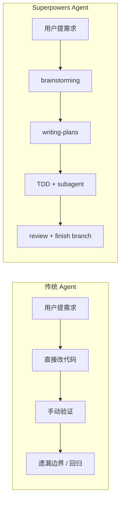
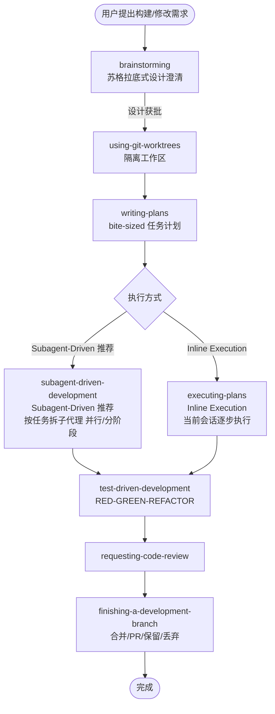
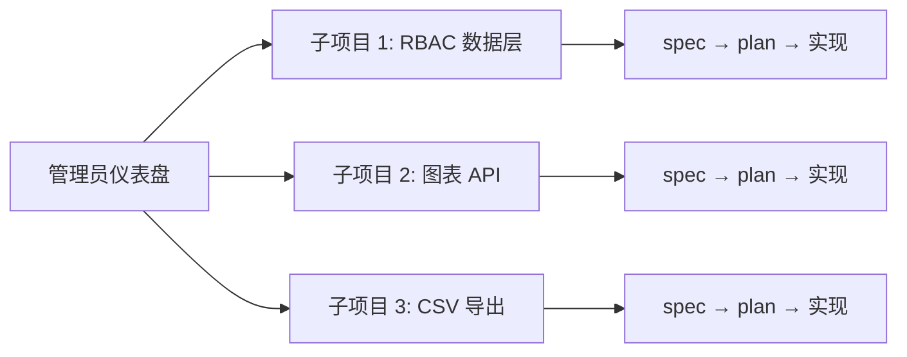

* Do not remove this line (it will not be displayed)
{:toc}

> [Superpowers](https://github.com/obra/superpowers) 由 Jesse Vincent（[Prime Radiant](https://primeradiant.com)）发起，是一套面向 **AI 编程代理（Coding Agent）** 的**可组合技能（Skills）框架**与**软件工程方法论**。它不把「写代码」当作起点，而是把**需求澄清 → 设计评审 → 计划拆解 → TDD 实现 → 子代理协作 → 代码审查 → 分支收尾**串成**强制工作流**，让代理在数小时内也能稳定推进复杂任务。本文基于官方仓库 v5.1.0 与公开技能文档整理，侧重 **Cursor** 场景下的上手与最佳实践。

若你已读过站内 [Agentic Design Patterns 读书笔记]() 或 [AI Coding in Action]()，可把 Superpowers 理解为：**把书中「规划—工具—记忆—协作」等模式，落成一套可安装、可自动触发的代理技能库**。

# 资源链接

| 说明 | 链接 |
| :--- | :--- |
| 官方仓库 | [obra/superpowers](https://github.com/obra/superpowers) |
| 首发公告 | [Superpowers — Jesse Vincent](https://blog.fsck.com/2025/10/09/superpowers/) |
| 最新 Release | [v5.1.0](https://github.com/obra/superpowers/releases) |
| Issues / 社区 | [GitHub Issues](https://github.com/obra/superpowers/issues)、[Discord](https://discord.gg/35wsABTejz) |
| Cursor 插件 | 在 Agent 对话中执行 `/add-plugin superpowers` |

# 为什么需要 Superpowers

普通 AI 编程对话常见三类问题：

1. **过早写代码**：需求还没对齐就开始改文件，返工成本高。
2. **缺乏可验证性**：「看起来能跑」就宣布完成，没有测试与根因分析。
3. **上下文污染**：长会话里计划漂移、遗漏边界、重复造轮子。

Superpowers 的应对策略很直接：**用技能（Skill）覆盖关键决策点，代理在行动前必须先加载对应技能并按清单执行**。技能不是「建议」，而是**强制工作流**——例如实现功能前必须走 TDD 的 RED-GREEN-REFACTOR，修 Bug 前必须完成四阶段根因调查。



{: .prompt-info }
**定位**：Superpowers 是**方法论 + 技能包**，不是替代 Cursor / Claude Code / Codex 的 IDE。它运行在各类 **Harness（承载环境）** 之上，通过插件市场分发。

# 核心概念

## Skills：可组合的技能单元

每个 Skill 是一个 `SKILL.md` 文件，包含：

- **YAML 元数据**：`name`、`description`（描述**何时**应触发）
- **正文指令**：步骤清单、反模式、示例、与其他技能的衔接

代理在收到用户消息后，按 `using-superpowers` 技能的规则：**只要存在约 1% 可能性某技能适用，就必须先调用该技能**，再回复或执行操作。

**指令优先级**（高 → 低）：

1. 用户显式指令（`CLAUDE.md`、`AGENTS.md`、对话中的要求）
2. Superpowers 技能
3. 平台默认系统提示

若你在项目里写了「不要用 TDD」，代理会服从项目规则；Superpowers 不会覆盖用户的工程偏好。

## Harness：承载环境

同一套技能可在多种代理环境中安装，但**各环境需分别安装**：

| Harness | 安装方式（摘要） |
| :--- | :--- |
| **Cursor** | Agent 对话：`/add-plugin superpowers` |
| Claude Code | `/plugin install superpowers@claude-plugins-official` |
| Codex CLI / App | `/plugins` 搜索 `superpowers` |
| Gemini CLI | `gemini extensions install https://github.com/obra/superpowers` |
| GitHub Copilot CLI | `copilot plugin install superpowers@superpowers-marketplace` |
| OpenCode | 按 `.opencode/INSTALL.md` 指引 |

## 设计产物目录约定

Superpowers 默认把协作产物落在仓库内，便于审阅与版本管理：

| 路径 | 内容 |
| :--- | :--- |
| `docs/superpowers/specs/` | 设计规格（brainstorming 产出） |
| `docs/superpowers/plans/` | 实现计划（writing-plans 产出） |

用户可在项目规则中覆盖这些路径。

# 标准工作流

官方定义的 **Basic Workflow** 是七步闭环。下图是技能触发顺序与衔接关系：



## 1. brainstorming — 先设计，后写码

**触发**：任何「创建功能、改行为、加组件」类创意工作。

关键约束：

- **禁止**在设计获批前写实现代码或调用实现类技能。
- 一次只问**一个问题**，优先选择题。
- 提出 **2–3 种方案**并给出推荐。
- 设计分节展示，**每节后征求确认**。
- 写入 `docs/superpowers/specs/YYYY-MM-DD-<topic>-design.md` 并提交。
- 终端状态：调用 `writing-plans`，而非直接实现。

{: .prompt-warning }
反模式：「这个功能太简单，不需要设计」。官方明确指出：Todo 应用、单函数工具、配置改动**都必须**走设计门 —— 简单项目往往因未检验的假设浪费最多时间。

## 2. using-git-worktrees — 隔离开发

设计通过后，在**新分支 + 独立 worktree** 中开发，避免污染 `main`，并验证测试基线干净。与 `finishing-a-development-branch` 配合，在合并或丢弃时按来源清理 worktree。

## 3. writing-plans — 可执行的实现计划

计划面向「**零项目上下文、品味一般、不爱写测试的初级工程师**」仍可执行。要求：

- 任务粒度 **2–5 分钟一步**（写失败测试 → 跑失败 → 最小实现 → 跑通过 → commit）。
- **禁止占位符**（`TBD`、`适当处理错误`、`类似 Task 3` 等）。
- 每步含**完整代码**、**精确文件路径**、**命令与期望输出**。
- 计划头必须声明执行子技能：`subagent-driven-development`（Subagent-Driven，推荐）或 `executing-plans`（Inline Execution）。

计划保存至 `docs/superpowers/plans/YYYY-MM-DD-<feature>.md`。计划完成后，代理会请你二选一执行方式（见下节）。

## 4. 执行计划：两种方式

`writing-plans` 产出计划后，进入实现阶段有两种路径，**都在当前 Harness 会话内完成**，区别在于是主代理逐步做，还是按任务派发子代理：

| 方式 | 技能 | 特点 | 更适合 |
| :--- | :--- | :--- | :--- |
| **Subagent-Driven（推荐）** | `subagent-driven-development` | 按计划把 Task **拆成多个子代理**执行，可并行或分阶段推进；每 Task 后 **Spec 合规 + 代码质量**双阶段评审 | 跨工具链、目录迁移、协议边界等大改造；任务多、上下文易膨胀 |
| **Inline Execution** | `executing-plans` | **当前会话**里由主代理按 plan **逐步执行**，节奏集中，检查点由你人工把关 | 范围清晰的中小型改动；希望全程在同一对话里跟进度 |

### Subagent-Driven — `subagent-driven-development`

**推荐执行模式**：每个任务派发**全新子代理**（不继承主会话历史），任务完成后进行**两阶段评审**：

1. **Spec 合规评审**：是否多做/少做？
2. **代码质量评审**：结构、测试、可维护性

子代理状态：`DONE` / `DONE_WITH_CONCERNS` / `NEEDS_CONTEXT` / `BLOCKED` —— 主代理必须按状态处理，不能强行跳过。Task 之间可连续推进，无需每个 Task 都停下来问你「是否继续」。

{: .prompt-tip }
**模型选型**：机械性单文件任务用快模型；多文件集成用标准模型；架构与评审用最强大模型 —— 在质量与成本间折中。

### Inline Execution — `executing-plans`

主代理在**当前会话**中按 Task 顺序执行 plan，在预设**检查点**暂停供你审阅；每步仍遵循 TDD。对话上下文会随 Task 累积，**长计划、多文件改动**时更容易接近上下文上限，需你更频繁地在检查点纠偏。

## 5. test-driven-development — 铁律

```
NO PRODUCTION CODE WITHOUT A FAILING TEST FIRST
```

- 先写失败测试并**亲眼看到失败**。
- 写**最小**实现使测试通过。
- 通过后 REFACTOR；若实现先于测试，**删除实现重来**（不是「保留作参考」）。

## 6. requesting-code-review — 任务间审查

按严重程度列出问题；**Critical** 问题阻塞后续任务。

## 7. finishing-a-development-branch — 收尾

测试全部通过后，检测是否在 worktree，向用户呈现**固定选项**（本地合并 / 推 PR / 保留 / 丢弃），并按选项清理环境。

# 技能库全景

除工作流技能外，Superpowers 还提供调试、协作与元技能：

| 分类 | 技能 | 用途 |
| :--- | :--- | :--- |
| **测试** | `test-driven-development` | RED-GREEN-REFACTOR，含测试反模式参考 |
| **调试** | `systematic-debugging` | 四阶段根因分析 |
| | `verification-before-completion` | 完成前验证确实修好 |
| **协作** | `brainstorming` | 设计澄清 |
| | `writing-plans` | 实施计划拆解 |
| | `subagent-driven-development` | Subagent-Driven：子代理 + 双阶段评审 |
| | `executing-plans` | Inline Execution：当前会话逐步执行 |
| | `dispatching-parallel-agents` | 并行子代理 |
| | `requesting-code-review` / `receiving-code-review` | 发起与响应评审 |
| | `using-git-worktrees` | 隔离分支 |
| | `finishing-a-development-branch` | 合并/PR 决策 |
| **元** | `using-superpowers` | 技能发现与调用规则 |
| | `writing-skills` | 编写新技能（贡献者向） |

### systematic-debugging 四阶段摘要

| 阶段 | 关键活动 | 完成标准 |
| :--- | :--- | :--- |
| 1. 根因调查 | 读错误信息、稳定复现、查近期变更、跨组件取证 | 弄清 WHAT 与 WHY |
| 2. 模式分析 | 找可工作示例、完整读参考实现、对比差异 | 定位差异点 |
| 3. 假设验证 | 单一假设、最小改动验证 | 假设成立或换新假设 |
| 4. 实施修复 | 先写失败测试、单点修复、验证 | Bug 消失且测试通过 |

铁律：**未完成阶段 1，不得提出修复方案**。连续 3 次修复失败时，应质疑架构而非继续打补丁。

# 安装与启用（Cursor）

在 **Cursor Agent** 对话中任选其一：

```text
/add-plugin superpowers
```

或在插件市场搜索 **superpowers** 安装。当前插件版本 **5.1.0**，技能目录挂载于 `./skills/`。

{: .prompt-tip }
安装后无需手动 `@` 每个技能。代理会在对话开始时按 `using-superpowers` 自动判断是否加载相关技能。你可通过项目根目录的 `AGENTS.md` / `.cursor/rules` 补充**项目级约束**（技术栈、目录约定、禁用 TDD 等）。

验证是否生效：提出一个明确的功能需求（见下文示例），观察代理是否**先进入 brainstorming**（提问、给方案）而非直接改文件。

# 常用触发示例（可复制口令）

Superpowers 安装后，多数场景会**自动**加载对应技能。若代理「跑偏」——例如跳过设计直接改文件、未看失败信息就猜修复——可用下面口令**显式点名技能**，强制进入正确工作流。在 Cursor Agent 对话中**整段复制发送**即可；把「这个需求 / 这个功能 / 这个计划」换成你的具体描述，必要时附上文件路径、报错日志或 spec/plan 文件链接。

| 技能 | 适用时机 | 可复制口令 |
| :--- | :--- | :--- |
| `brainstorming` | 新功能、改行为、架构取舍；**禁止先写代码** | 见下方 |
| `writing-plans` | 设计/spec 已确认，要拆成可执行任务 | 见下方 |
| `subagent-driven-development` | 大改造、多 Task；**推荐**，子代理 + 双阶段评审 | 见下方 |
| `executing-plans` | 中小型改动；**当前会话逐步执行**（Inline Execution） | 见下方 |
| `test-driven-development` | 实现或修 Bug；**必须先写失败测试** | 见下方 |
| `systematic-debugging` | 测试失败、异常行为、构建/集成问题 | 见下方 |
| `requesting-code-review` | 一批改动完成，合并或 PR 前自检 | 见下方 |

## brainstorming — 梳理需求，不要写代码

```text
使用 brainstorming skill，和我一起梳理这个需求，不要直接写代码

【在此描述需求，例如：给博客搜索加按标签过滤，结果要分页】
```

**代理应做**：查看项目上下文 → 逐条澄清问题 → 给出 2–3 种方案 → 分节展示设计并征求确认 → 写入 `docs/superpowers/specs/`。**不应**创建业务代码或调用实现类技能。

## writing-plans — 写实施计划

```text
使用 writing-plans skill，为这个改动写一个实施计划

【在此说明已批准的设计或改动范围；若有 spec 文件请写明路径，例如 docs/superpowers/specs/2026-06-05-xxx-design.md】
```

**代理应做**：产出 `docs/superpowers/plans/YYYY-MM-DD-<feature>.md`，任务粒度 2–5 分钟一步，含完整测试代码、文件路径、命令与期望输出，**无 TBD/占位符**。完成后询问执行方式：**Subagent-Driven（推荐）** 或 **Inline Execution**。

## subagent-driven-development — Subagent-Driven（推荐）

```text
使用 subagent-driven-development skill，执行这个计划

【附上计划路径，例如 docs/superpowers/plans/2026-06-05-migration.md】
```

**代理应做**：按 Task 派发**全新子代理**（可并行或分阶段），每 Task 完成后 Spec 合规评审 → 代码质量评审 → 下一 Task。适合**跨工具链、目录迁移、协议边界**等任务多、改动面大的计划。

## executing-plans — Inline Execution（当前会话逐步执行）

```text
使用 executing-plans skill，执行这个计划

【附上计划路径，例如 docs/superpowers/plans/2026-06-05-rate-limit.md】
```

**代理应做**：在**当前会话**中由主代理按 Task **逐步**执行，在检查点暂停供你审阅；每步遵循 TDD。节奏集中，适合范围清晰的中型改动；**长任务**时注意上下文压力，必要时改选 Subagent-Driven。

{: .prompt-info }
**怎么选**：大改造、多 Task、怕主会话上下文爆掉 → **Subagent-Driven**；想全程在同一对话里跟紧每一步 → **Inline Execution**（`executing-plans`）。

## test-driven-development — 先写失败测试

```text
使用 test-driven-development skill，实现这个功能，先写失败测试

【描述要实现的行为或接口，例如：submitForm 在 email 为空时返回 { error: 'Email required' }】
```

**代理应做**：RED（写失败测试）→ 亲眼看 FAIL → GREEN（最小实现）→ 亲眼看 PASS → REFACTOR。若已有「先写的实现代码」，应删除后从测试重来。

## systematic-debugging — 排查根因

```text
使用 systematic-debugging skill，排查这个测试失败的根因

【粘贴失败测试名、命令输出或报错栈；说明如何稳定复现】
```

**代理应做**：四阶段流程 — 读错误、稳定复现、查近期变更、跨组件取证 → 对比可工作示例 → 单一假设最小验证 → **先写失败测试再修复**。未完成根因调查前**不得**抛出一串「可能修复」。

## requesting-code-review — 准备代码审查

```text
使用 requesting-code-review skill，帮我准备一次代码审查

【说明审查范围：本次 PR 的改动、或相对 main 的 diff；可附 plan/spec 路径】
```

**代理应做**：对照计划与 spec 做合规检查，按严重程度列出问题（Critical 阻塞合并），给出可操作的修改建议，便于你或他人做正式 Review。

### 口令串联示例（完整小功能）

按官方推荐顺序，一次小功能可依次发送（每步等上一步完成后再发下一条）：

```text
1. 使用 brainstorming skill，和我一起梳理这个需求，不要直接写代码
   → 【需求描述】

2. 使用 writing-plans skill，为这个改动写一个实施计划
   → spec 已确认，路径：docs/superpowers/specs/...

3. 使用 subagent-driven-development skill，执行这个计划
   → 计划路径：docs/superpowers/plans/...
   （中小型、希望逐步跟进度时，可改为 executing-plans）

4. 使用 requesting-code-review skill，帮我准备一次代码审查
   → 审查相对 main 的本分支改动
```

修 Bug 时可把第 1–3 步替换为：

```text
使用 systematic-debugging skill，排查这个测试失败的根因
→ 【失败信息】

使用 test-driven-development skill，实现这个功能，先写失败测试
→ 【用失败测试锁定的正确行为】
```

{: .prompt-tip }
口令里的技能名与仓库目录一致（`brainstorming`、`writing-plans` 等）。在 Cursor 中一般**不必** `@` 技能文件；点名技能名即可让代理加载对应 `SKILL.md`。若项目 `AGENTS.md` 与技能冲突（例如禁用 TDD），以**你的项目规则为准**。

# 端到端使用示例

以下三个场景展示「用户说什么 → 代理应做什么 → 你可如何配合」。

## 示例 A：从零实现 API 限流中间件

**你对 Cursor Agent 说：**

```text
给现有 Express 服务加一个可配置的 per-IP 限流中间件，超限返回 429。
```

**预期代理行为（Superpowers 启用后）：**

1. **brainstorming**
   - 查看项目结构、`package.json`、现有中间件模式。
   - 逐问：限流窗口（固定窗口 / 滑动窗口 / 令牌桶）？存储（内存 / Redis）？默认配额？
   - 给出 2–3 方案，例如：
     - **A**：内存固定窗口（简单，单实例）
     - **B**：`rate-limiter-flexible` + Redis（多实例）
     - **C**：仅依赖反向代理层限流（运维向）
   - 分节展示设计：接口形状、`req.ip` 获取方式、错误体格式、测试策略。
   - 写入 `docs/superpowers/specs/2026-06-05-rate-limit-design.md`。

2. **你确认**：「用方案 A，10 req/s，超限 JSON `{ error: "Too Many Requests" }`。」

3. **writing-plans** 产出计划片段（示意）：

````markdown
### Task 1: Rate limiter core

**Files:**
- Create: `src/middleware/rateLimit.ts`
- Test: `tests/middleware/rateLimit.test.ts`

- [ ] **Step 1: Write the failing test**

```typescript
test('returns 429 when IP exceeds limit', () => {
  const limiter = createRateLimiter({ max: 2, windowMs: 1000 });
  const req = { ip: '1.2.3.4' } as Request;
  const res = mockResponse();

  limiter(req, res, next);
  limiter(req, res, next);
  limiter(req, res, next);

  expect(res.status).toHaveBeenCalledWith(429);
});
```

- [ ] **Step 2: Run test to verify it fails**

Run: `npm test -- rateLimit.test.ts`
Expected: FAIL — `createRateLimiter` not defined
````

4. **subagent-driven-development**（或中小型改动时用 **executing-plans** Inline 执行）：按 Task 推进，Subagent 模式下每 Task 新子代理 → Spec 评审 → 质量评审。

5. **finishing-a-development-branch**：全绿后问你：本地合并、开 PR、保留还是丢弃。

**你可主动加速的口令：**

- 设计阶段：「方案 A，开始写 spec。」
- 计划阶段：「用 subagent-driven 执行计划。」
- 收尾：「选项 2，推 PR。」

## 示例 B：修复「空邮箱能通过校验」的 Bug

**你说：**

```text
注册表单空邮箱仍能提交，帮我修。
```

**预期流程：**

1. 加载 `systematic-debugging`（而非直接改 `if`）。
2. **阶段 1**：复现步骤、读校验链路、查最近改动。
3. **阶段 4 + TDD**：

```typescript
// RED
test('rejects empty email', async () => {
  const result = await submitForm({ email: '' });
  expect(result.error).toBe('Email required');
});

// 确认 FAIL: expected 'Email required', got undefined

// GREEN — 最小修复
function submitForm(data: FormData) {
  if (!data.email?.trim()) {
    return { error: 'Email required' };
  }
  // ...
}
```

4. 跑全量测试，再进入 `finishing-a-development-branch`（若已在功能分支上）。

## 示例 C：大功能拆解 — 用户后台仪表盘

**你说：**

```text
做一个带图表、表格导出、权限过滤的管理员仪表盘。
```

**brainstorming 应先做范围判断**：多子系统（图表、导出、RBAC）→ **拆分子项目**，每个子项目独立 spec → plan → 实现循环，而不是一份巨型计划。



你先批准 **子项目 1** 的设计，再进入实现；避免代理一次吞下无法评审的大泥球。

# 最佳实践

## 对人（Human Partner）

1. **把需求说清楚，但允许代理追问**  
   Superpowers 刻意「慢启动」。brainstorming 的单问单答是在买后续自动化执行的确定性。

2. **在检查点做决策，而不是微操每一行**  
   设计节、spec 文件、计划文件、PR 选项 —— 这些是为你准备的**可读检查点**。

3. **用项目规则表达硬约束**  
   在 `AGENTS.md` 或 `.cursor/rules` 写明：测试框架、目录结构、禁止动哪些目录、是否允许 TDD 例外。用户规则优先级最高。

4. **大功能坚持拆子项目**  
   一个 spec 对应一个可独立交付、可独立测试的增量。

5. **收尾时认真选 finishing 选项**  
   开 PR 会**保留 worktree** 便于改评审意见；本地合并或丢弃才会清理 worktree。

## 对代理工作流

1. **技能先行的纪律**  
   `using-superpowers` 列出多种「合理化跳过技能」的念头（「先看一下代码」「问题很简单」）—— 都应视为红旗。

2. **计划严禁占位符**  
   计划里的每一步都应是代理或子代理**无需猜测即可执行**的指令。

3. **TDD 与调试联动**  
   修 Bug 在 `systematic-debugging` 阶段 4 仍要用 TDD 写失败测试；「先修再补测」在技能层面属于违规。

4. **子代理隔离上下文**  
   实现子代理不应读取整份计划文件；主代理应提取**当前 Task 全文 + 场景说明**再派发。

5. **评审顺序不可颠倒**  
   先 Spec 合规 ✅，再代码质量评审；任一审有问题则打回实现者循环，不得带问题进入下一 Task。

## 与自有 Cursor Skills 共存

本博客仓库已有 `.cursor/skills-cursor/` 等技能（如 `create-rule`、`create-skill`）。二者关系：

- **Superpowers**：通用软件工程工作流（设计、计划、TDD、调试、分支）。
- **项目/产品技能**：领域或工具专属（如 Cursor Automations、SDK 集成）。

代理按 `using-superpowers` 的优先级：**流程类技能先于实现类技能**（先 brainstorming / debugging，再 domain skill）。

# 注意事项与常见误区

| 误区 | 实际情况 |
| :--- | :--- |
| 「装上就全自动，不用管」 | 设计门、spec 审阅、finishing 选项仍需人确认 |
| 「技能只是提示词建议」 | 技能设计为**强制工作流**；跳过等于放弃 Superpowers 的价值 |
| 「我可以后补测试， spirit 一样」 | TDD 技能明确：后写测试通过**不能证明**测试有效 |
| 「简单 Bug 不用四阶段调试」 | 简单问题也有根因；系统化通常 **15–30 分钟** vs 随机修补 **2–3 小时** |
| 「子代理可以并行改同一批文件」 | 官方禁止并行派发多个实现子代理，避免冲突 |
| 「在 main 上直接让代理开干」 | 应用 worktree 隔离；finishing 也假设功能在分支上 |

{: .prompt-danger }
**安全**：Superpowers 强化工程流程，**不**替代密钥审查、依赖审计与沙箱策略。涉及生产配置、凭证、强制推送时，仍需人工把关 —— 与站内 [OpenClaw]() 一文强调的「沙盒与权限」思路一致。

**贡献**：官方欢迎修 Bug 与跨 Harness 改进，但**一般不接纳随意新增技能**；新技能须按 `writing-skills` 方法论并保证多平台可用。贡献请走 `dev` 分支与 PR 模板。

# 与同类方案对比（简表）

| 维度 | Superpowers | 仅依赖 IDE 默认 Agent | 纯自定义 Rules |
| :--- | :--- | :--- | :--- |
| 工作流完整性 | 七步闭环 + 调试/TDD 专技能 | 依模型与提示词，易漂移 | 取决于作者维护力度 |
| 可移植性 | 多 Harness 插件 | 绑定单一产品 | 常绑定 Cursor Rules |
| 执行粒度 | 2–5 分钟任务 + 子代理评审 | 常大块改多文件 | 不统一 |
| 学习成本 | 需接受「先设计后写码」 | 低 | 中高（自写自维护） |

Superpowers **不是** LangChain/CrewAI 式运行时框架；它与 [Agentic 设计模式]() 互补：**模式讲「是什么」，Superpowers 讲「代理每天应按什么顺序做」**。

# 快速上手检查清单

- [ ] 在 Cursor Agent 中安装 `superpowers` 插件
- [ ] 仓库根目录准备 `AGENTS.md`（可选但推荐）：技术栈、测试命令、分支策略
- [ ] 创建 `docs/superpowers/specs/` 与 `docs/superpowers/plans/`（或由代理首次运行时创建）
- [ ] 收藏「常用触发示例」口令，代理跑偏时显式点名技能
- [ ] 用**小功能**走通一遍：需求 → 设计确认 → 计划 → 实现 → PR
- [ ] 用**一个真实 Bug** 走通 `systematic-debugging` + TDD
- [ ] 熟悉 finishing 四选项，避免误删 worktree 或分支

# 参考资源

- 官方仓库：[obra/superpowers](https://github.com/obra/superpowers)
- 首发文章：[Superpowers — Jesse Vincent (2025-10-09)](https://blog.fsck.com/2025/10/09/superpowers/)
- Release Notes：[RELEASE-NOTES.md](https://github.com/obra/superpowers/blob/main/RELEASE-NOTES.md)
- 技能源码目录：[skills/](https://github.com/obra/superpowers/tree/main/skills)
- Cursor 插件清单：[.cursor-plugin/plugin.json](https://github.com/obra/superpowers/blob/main/.cursor-plugin/plugin.json)
- 站内延伸：[AI Coding in Action]()、[Agentic Design Patterns Reading]()、[OpenClaw]()

---

*本文随上游技能与插件版本演进，若你发现某技能文件名或安装命令有变，以 [官方 README](https://github.com/obra/superpowers/blob/main/README.md) 为准。*
