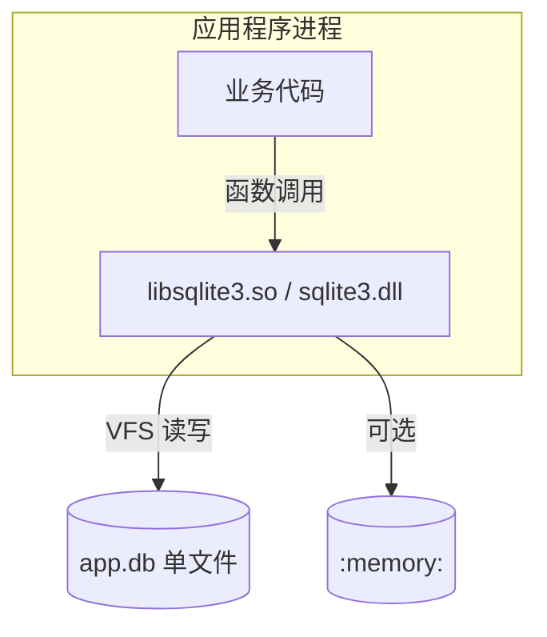
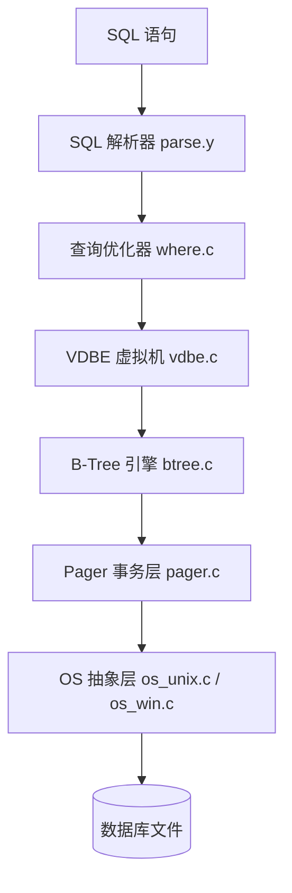
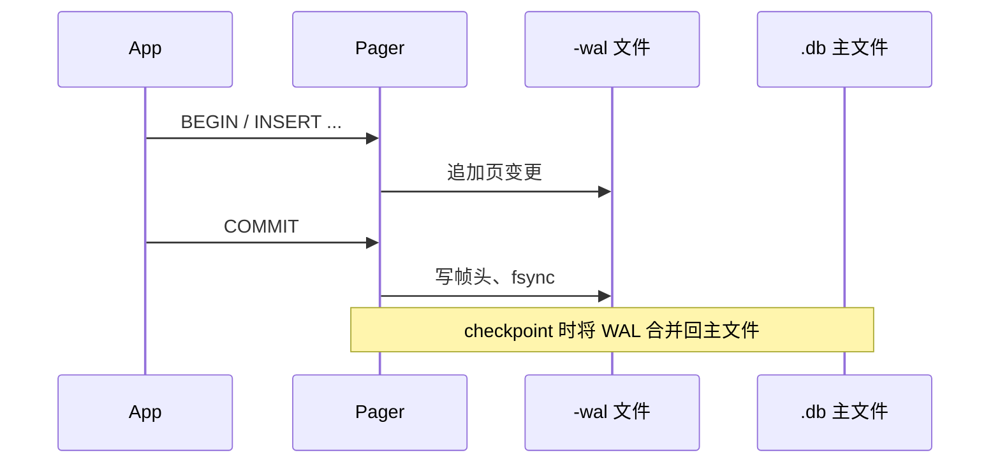
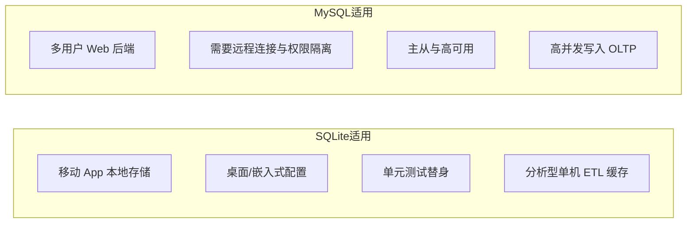
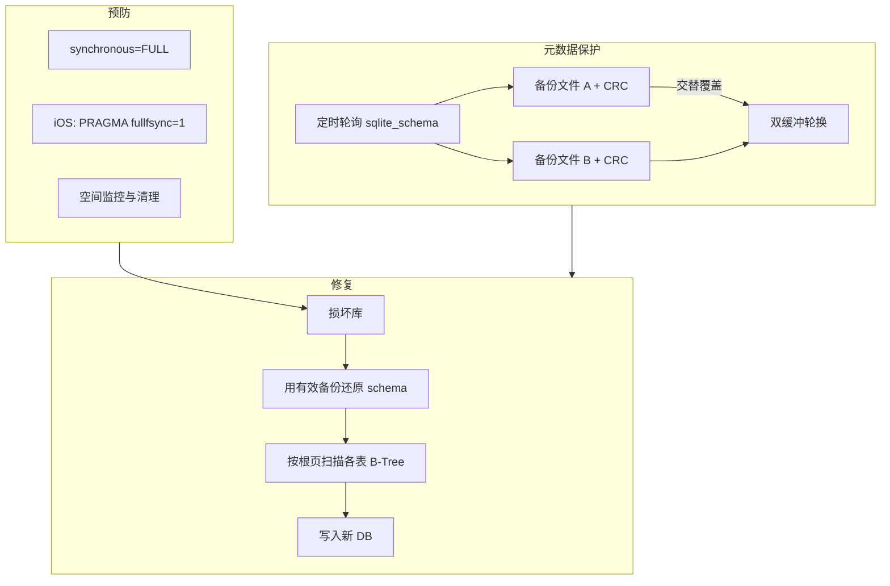

* Do not remove this line (it will not be displayed)
{:toc}

## 概述

> [SQLite](https://sqlite.org/) 是由 D. Richard Hipp 于 2000 年发布的 C 语言嵌入式关系型数据库引擎。它不是独立运行的数据库服务，而是以库的形式链接进应用程序——官网标语 **「Small. Fast. Reliable. Choose any three.」** 概括了其设计取向。源码进入公有领域（public domain），当前稳定版为 [3.53.2（2026-06-03）](https://sqlite.org/changes.html)；官方 Git 镜像见 [sqlite/sqlite](https://github.com/sqlite/sqlite)。
{: .prompt-info }

本文将从以下几个方面对 SQLite 进行全面解析：

- 原理与核心架构
- Linux 安装与命令行 CRUD 入门
- 日常使用与编程接口
- 与 MySQL 的功能对比
- 数据丢失与损坏风险
- 检测、备份与恢复方法
- 最佳实践与注意事项

## 什么是 SQLite {#what-is-sqlite}

SQLite 属于 **嵌入式（embedded）**、**无服务器（serverless）** 关系型数据库：

| 维度 | SQLite | 典型客户端–服务器数据库（如 MySQL） |
|------|--------|-------------------------------------|
| 部署形态 | 单个 `.db` 文件或 `:memory:` | 独立守护进程 + 网络端口 |
| 进程模型 | 库函数调用，无 IPC | 应用通过 TCP/Unix Socket 连接服务 |
| 配置 | 零配置（zero-configuration） | 需安装、启停、账号权限等 |
| 访问控制 | 依赖操作系统文件权限 | `GRANT`、角色、网络 ACL |
| 典型场景 | 移动端、桌面应用、边缘设备、测试、本地缓存 | 多用户 Web 服务、集中式 OLTP |

据 [Wikipedia](https://en.wikipedia.org/wiki/SQLite) 与官网统计，SQLite 可能是全球部署量最大的数据库引擎：内置于 Android、iOS、Windows 10+、Firefox/Chrome 等浏览器与 countless 桌面应用中；美国国会图书馆亦将 SQLite 3 列为长期数据集存储的推荐格式之一。



> 提示：SQLite 读作 **S-Q-L-ite**（如矿石 sqlite）或 **sequel-ite**，两种发音均被作者认可。
{: .prompt-tip }

## 核心原理与架构 {#architecture}

理解 SQLite 的可靠性讨论，需要先弄清其内部分层。官方 [架构说明](https://sqlite.org/arch.html) 与 [源码树](https://github.com/sqlite/sqlite) 将核心模块概括如下。

### 分层结构



| 模块 | 职责 |
|------|------|
| **Parser** | 将 SQL 解析为语法树；由 Lemon 生成 `parse.c` |
| **VDBE** | 虚拟机执行编译后的字节码（类似 Prepared Statement 的中间表示） |
| **B-Tree** | 表与索引的存储；每个表/索引对应一棵 B+ 树 |
| **Pager** | 页缓存、日志、事务与 ACID；协调回滚日志或 WAL |
| **VFS** | 可插拔虚拟文件系统，屏蔽不同 OS 的 I/O 差异 |

### 单文件格式

整个数据库（表定义、索引、数据）通常存放在 **一个跨平台文件** 中（扩展名 `.db`、`.sqlite`、`.sqlite3` 等）。文件头 16 字节魔数为 ASCII `SQLite format 3`（见 [文件格式](https://sqlite.org/fileformat.html)）。默认页大小 4096 字节；理论单库上限约 **281 TB**。

元数据集中在 **`sqlite_schema`**（旧称 `sql_master`）表：记录每张表的名称、根页号、建表 SQL 等。该表本身也是一棵 B+ 树，**第 0 页即其根节点**——这一点在损坏恢复中至关重要（后文详述）。

### 事务、日志与 WAL

SQLite 提供 **ACID** 事务。持久化策略由 `PRAGMA synchronous` 与日志模式决定：

| 模式 | 说明 | 并发读 | 典型 `synchronous` |
|------|------|--------|----------------------|
| **DELETE**（默认回滚日志） | 事务提交时写回滚日志，提交后删除 | 写时阻塞读 | `FULL` / `NORMAL` |
| **WAL**（Write-Ahead Logging） | 3.7+；变更先写入 `-wal` 文件 | 读不阻塞写、写不阻塞读 | 常配合 `NORMAL` |



> 警告：SQLite 依赖 **文件系统锁** 协调多进程写；高并发写入场景应优先选 MySQL/PostgreSQL 等服务端数据库。官网 [Appropriate Uses For SQLite](https://sqlite.org/whentouse.html) 明确列出了适用与不适用的边界。
{: .prompt-warning }

### 类型系统与 SQL 兼容性

SQLite 采用 **动态类型**（值带类型标签），列声明的 `INTEGER`/`TEXT` 等是 **类型亲和性（affinity）** 而非严格约束——可将字符串写入整型列（会尝试转换）。2021 年起 **`STRICT` 表** 可启用静态类型检查。

SQL 实现以 PostgreSQL 为参照（「What would PostgreSQL do」），覆盖大部分 SQL-92，但 **不支持** 存储过程、完整 `ALTER TABLE`、物化视图、对普通视图的 DML 等（可用 `INSTEAD OF` 触发器部分弥补）。完整差异见 [SQL Features That SQLite Does Not Implement](https://sqlite.org/omitted.html)。

**外键** 自 3.6.19 起支持，但 **默认关闭**，需：

```sql
PRAGMA foreign_keys = ON;
```

## 使用方法 {#usage}

### Linux 环境安装 {#linux-install}

多数 Linux 发行版仓库中的包名均为 **`sqlite`**（命令行工具）与 **`sqlite-devel`** / **`libsqlite3-dev`**（C 头文件与 `libsqlite3.so`，供编译链接）。安装后终端执行 `sqlite3 --version` 应输出版本号（如 `3.45.x` 或更高；与 [官网最新版](https://sqlite.org/download.html) 可能略有差距，一般学习与小工具足够）。

**Debian / Ubuntu / Linux Mint**

```bash
sudo apt update
sudo apt install -y sqlite3 libsqlite3-dev
```

**Fedora / RHEL 9+ / CentOS Stream**

```bash
sudo dnf install -y sqlite sqlite-devel
```

**openSUSE**

```bash
sudo zypper install -y sqlite3 sqlite3-devel
```

**Arch Linux / Manjaro**

```bash
sudo pacman -S --needed sqlite
```

**Alpine Linux**（容器镜像中常见）

```bash
apk add sqlite
```

**验证安装**

```bash
sqlite3 --version
# 示例输出：3.45.1 2024-01-30 16:01:20 ...
```

> 信息：若需要 **与官网同步的最新版**（而非发行版冻结版本），可从 [sqlite.org/download.html](https://sqlite.org/download.html) 下载 `sqlite-autoconf-*.tar.gz` 自行编译，或使用 Snap / 第三方 PPA。生产环境更常见做法是直接依赖发行版包，并通过 `libsqlite3` 供应用链接。
{: .prompt-info }

**从源码编译（可选）**

```bash
curl -LO https://www.sqlite.org/2024/sqlite-autoconf-3450100.tar.gz
tar xzf sqlite-autoconf-3450100.tar.gz
cd sqlite-autoconf-3450100
./configure --prefix=/usr/local
make -j"$(nproc)"
sudo make install
/usr/local/bin/sqlite3 --version
```

### 命令行工具 sqlite3

发行版附带 **`sqlite3`** 交互式 Shell（见 [Command Line Shell](https://sqlite.org/cli.html)）：

```bash
# 创建或打开数据库
sqlite3 myapp.db

# 常用点命令
.tables
.schema users
.mode column
.headers on
SELECT * FROM users LIMIT 5;

# 执行文件中的 SQL
sqlite3 myapp.db < init.sql

# 导出
.dump > backup.sql
```

### 快速入门：增删改查（CRUD） {#crud-example}

下面用一张 **`books`** 表，在 Linux 终端完成建表、插入、查询、更新、删除的完整流程。数据库文件为当前目录下的 `demo.db`（首次 `sqlite3 demo.db` 时自动创建）。

**1. 建表（Create）**

```bash
sqlite3 demo.db <<'SQL'
PRAGMA foreign_keys = ON;

CREATE TABLE IF NOT EXISTS books (
    id    INTEGER PRIMARY KEY AUTOINCREMENT,
    title TEXT    NOT NULL,
    author TEXT   NOT NULL,
    price REAL    DEFAULT 0,
  created_at TEXT DEFAULT (datetime('now', 'localtime'))
);
SQL
```

或在交互式 Shell 中：

```bash
sqlite3 demo.db
```

```sql
.headers on
.mode column
.schema books
```

**2. 插入（Insert）**

```bash
sqlite3 demo.db <<'SQL'
INSERT INTO books (title, author, price) VALUES
  ('SQLite 权威指南', 'Mike Owens', 59.0),
  ('深入理解计算机系统', 'Randal E. Bryant', 139.0),
  ('数据库系统概念', 'Abraham Silberschatz', 99.0);
SQL
```

单条插入并返回自增主键：

```sql
INSERT INTO books (title, author, price) VALUES ('算法导论', 'Thomas H. Cormen', 128.0);
SELECT last_insert_rowid();
```

**3. 查询（Select）**

```bash
sqlite3 -header -column demo.db \
  "SELECT id, title, author, price FROM books ORDER BY price DESC;"
```

常见查询写法：

```sql
-- 条件过滤
SELECT title, price FROM books WHERE price < 100;

-- 模糊匹配
SELECT * FROM books WHERE title LIKE '%SQLite%';

-- 聚合
SELECT author, COUNT(*) AS cnt, AVG(price) AS avg_price
FROM books GROUP BY author;

-- 分页（LIMIT / OFFSET）
SELECT id, title FROM books ORDER BY id LIMIT 2 OFFSET 1;
```

**4. 更新（Update）**

```bash
sqlite3 demo.db \
  "UPDATE books SET price = price * 0.9 WHERE title = 'SQLite 权威指南';"
```

带条件的安全更新（先 `SELECT` 确认影响行数）：

```sql
BEGIN;
UPDATE books SET price = 88.0 WHERE id = 2;
SELECT changes();   -- 返回上一语句修改的行数
COMMIT;
```

**5. 删除（Delete）**

```bash
sqlite3 demo.db \
  "DELETE FROM books WHERE id = 3;"
```

删除前建议预览：

```sql
SELECT id, title FROM books WHERE price > 120;
DELETE FROM books WHERE price > 120;
```

**6. 一条命令串联演示**

```bash
rm -f demo.db
sqlite3 demo.db "
  CREATE TABLE books (id INTEGER PRIMARY KEY, title TEXT, qty INTEGER);
  INSERT INTO books VALUES (1, 'Item A', 10);
  INSERT INTO books VALUES (2, 'Item B', 5);
  SELECT * FROM books;
  UPDATE books SET qty = qty - 1 WHERE id = 1;
  DELETE FROM books WHERE qty = 0;
  SELECT '--- after changes ---';
  SELECT * FROM books;
"
```


> 提示：批量写入时用 `BEGIN;` … `COMMIT;` 包成事务，比逐条自动提交快一个数量级以上。命令行中可用 `sqlite3 demo.db ".read script.sql"` 执行脚本文件。
{: .prompt-tip }

### 连接字符串与内存库

```text
文件库：sqlite3_open("path/to/app.db")
内存库：sqlite3_open(":memory:")
临时库：sqlite3_open("")   # 连接关闭后自动删除
```

### 编程语言绑定

主流语言均有官方或社区绑定：Python 标准库 `sqlite3`、Node `better-sqlite3`/`sql.js`、Go `database/sql` + `modernc.org/sqlite`、Java JDBC（`org.xerial:sqlite-jdbc`）、.NET `Microsoft.Data.Sqlite` 等。典型模式为 **预编译语句（Prepared Statement）** + 参数绑定，避免 SQL 注入并复用查询计划。

**Python 示例**：

```python
import sqlite3

conn = sqlite3.connect("myapp.db")
conn.execute("PRAGMA foreign_keys = ON")
conn.execute("""
    CREATE TABLE IF NOT EXISTS users (
        id INTEGER PRIMARY KEY,
        name TEXT NOT NULL,
        email TEXT UNIQUE
    ) STRICT
""")

conn.execute("INSERT INTO users(name, email) VALUES (?, ?)", ("Alice", "a@example.com"))
conn.commit()

for row in conn.execute("SELECT id, name FROM users WHERE name LIKE ?", ("A%",)):
    print(row)

conn.close()
```

**C 示例（核心 API）**：

```c
sqlite3 *db;
sqlite3_open("myapp.db", &db);
sqlite3_exec(db, "CREATE TABLE t(x INT);", NULL, NULL, NULL);

sqlite3_stmt *stmt;
sqlite3_prepare_v2(db, "INSERT INTO t VALUES(?)", -1, &stmt, NULL);
sqlite3_bind_int(stmt, 1, 42);
sqlite3_step(stmt);  /* SQLITE_DONE */
sqlite3_finalize(stmt);
sqlite3_close(db);
```

### 常用 PRAGMA

| PRAGMA | 作用 |
|--------|------|
| `journal_mode=WAL` | 启用 WAL，改善并发读 |
| `synchronous=FULL` / `NORMAL` / `OFF` | 控制 fsync 强度与性能权衡 |
| `foreign_keys=ON` | 启用外键约束 |
| `busy_timeout=5000` | 锁冲突时等待毫秒数 |
| `integrity_check` | 完整性检测 |
| `quick_check` | 更快的抽样完整性检查 |

```sql
PRAGMA journal_mode=WAL;
PRAGMA synchronous=NORMAL;
PRAGMA busy_timeout=5000;
PRAGMA integrity_check;
```

### 扩展能力

- **FTS5**：全文检索（[FTS5 Extension](https://sqlite.org/fts5.html)）
- **JSON / JSONB**：`json1` 默认启用；JSONB 减少重复解析（[JSON Functions](https://sqlite.org/json1.html)）
- **R-Tree / Geopoly**：空间索引
- **sqlite3_rsync**：3.50+ 增量同步工具

## 与 MySQL 功能对比 {#sqlite-vs-mysql}

下表从工程选型角度对比两者；MySQL 指 InnoDB 引擎下的常见部署。

| 能力 | SQLite | MySQL |
|------|--------|-------|
| **架构** | 嵌入式库，单文件 | 客户端–服务器，多实例/主从 |
| **并发写** | 单写者（WAL 下多读） | 行级锁，高并发 OLTP |
| **网络访问** | 无（需应用内嵌或中间层） | 原生 TCP，远程连接 |
| **用户与权限** | 文件系统权限 | `GRANT`、角色、SSL |
| **复制 / 高可用** | 无内置（需 litestream、应用层同步） | 主从、Group Replication、InnoDB Cluster |
| **分区 / 分库** | 单文件，ATTACH 多库 | 分区表、分片中间件 |
| **存储过程 / 触发器** | 无存储过程；触发器部分支持 | 完整存储过程、触发器 |
| **`ALTER TABLE`** | 能力有限（3.35+ 有 DROP COLUMN 等） | 功能完整 |
| **数据类型** | 动态 + 可选 STRICT | 严格静态类型 |
| **全文搜索** | FTS5 扩展 | `FULLTEXT` 索引 |
| **JSON** | 一等公民函数 + JSONB | `JSON` 类型与函数 |
| **备份** | 文件拷贝 + `.backup` API；热备需注意 WAL | `mysqldump`、物理备份、binlog PITR |
| **监控** | 轻量，无内置仪表盘 | Performance Schema、慢查询日志 |
| **许可** | 公有领域 | GPL / 商业许可 |
| **适用规模** | 单用户～低并发、本地、边缘 | 中大型 Web、多租户 SaaS |



> 信息：Django、Rails 等框架可用 SQLite 作为开发默认库，生产环境通常切换至 PostgreSQL/MySQL。SQLite 官方亦强调：**不要把它当作通过网络挂载的 NFS 上的多写数据库**。
{: .prompt-info }

## 数据丢失与损坏风险 {#data-loss-risks}

SQLite 在断电、磁盘满、同步策略不当等场景下仍可能损坏。官网 [How To Corrupt An SQLite Database File](https://sqlite.org/howtocorrupt.html) 列举了典型原因；[微信终端团队](https://cloud.tencent.com/developer/article/1005623) 在移动端大规模实践中将其归纳为三类主因。

### 常见损坏原因

| 原因 | 机制 | 典型场景 |
|------|------|----------|
| **存储空间不足** | 分配新页或扩展 WAL 失败，文件处于不一致状态 | 手机存储满、容器卷满 |
| **设备断电 / 强杀** | 提交过程中未完整 fsync | 笔记本断电、移动端 OOM 杀进程 |
| **文件 sync 失败** | `synchronous` 过低或 OS/存储重排序 | 默认 `NORMAL` + 部分移动文件系统 |
| **文件锁缺陷** | NFS、部分网络文件系统锁语义不完整 | 多主机共享 `.db` |
| **误操作** | 覆盖、截断、用文本编辑器改二进制 | 运维事故 |
| **内存损坏** | 罕见；官方测试覆盖断电模拟 | 硬件故障 |

微信团队曾报告约 **0.02%** 的现网损坏率，且早期官方 `.recover` 类算法成功率仅约 **30%**——对聊天记录等无法云端重建的数据，这意味着必须 **预防 + 工程化修复** 双管齐下。

### 与「丢失」相关的非损坏场景

- **未提交事务**：进程崩溃时自动回滚，数据回到上一提交点（ACID 保证）。
- **WAL 未 checkpoint**：主 `.db` 可能滞后，但 `-wal`/`-shm` 齐全时仍一致；**只拷贝 `.db` 而遗漏 WAL** 会造成「看起来丢数据」。
- **`synchronous=OFF`**：最快，但 OS 崩溃可能损坏库；生产环境慎用。
- **删除库文件**：无备份则无法恢复——SQLite 不提供 binlog 式时间点恢复。

## 完整性检测 {#integrity-check}

定期或故障后应运行：

```sql
PRAGMA integrity_check;
-- 或更快：
PRAGMA quick_check;
```

命令行：

```bash
sqlite3 corrupted.db "PRAGMA integrity_check;"
```

返回 `ok` 表示未发现结构问题；否则列出损坏的页或 B-Tree 节点。

## 备份策略 {#backup}

### 1. 在线热备（推荐 API）

使用 **Backup API** 或 Shell 的 `.backup`，在 WAL 模式下可安全复制逻辑一致快照：

```bash
sqlite3 source.db ".backup 'backup.db'"
```

或在 SQL 中：

```sql
.backup main 'backup.db'
```

### 2. 文件级拷贝

在 **无活跃写入** 或已执行 `PRAGMA wal_checkpoint(FULL)` 后，可复制 `app.db` 及（若存在）`-wal`、`-shm`。切勿在未知写入状态下只复制主文件。

### 3. 逻辑导出

```bash
sqlite3 myapp.db .dump > myapp.sql
```

适合跨版本迁移；大库恢复较慢。

### 4. 持续保护

- [Litestream](https://litestream.io/)：将变更流式复制到 S3 等对象存储
- 应用层双写、定时 `.backup`
- 微信方案：**预分配备份空间**、**双份元数据备份** + CRC（见下节）

## 恢复方法 {#recovery}

### 官方 `.recover` 与 `sqlite3_recover`

SQLite 3.29+ 命令行提供 **`.recover`**，尝试扫描所有页、重建 `sqlite_schema` 并导出可读的表数据：

```bash
sqlite3 corrupted.db ".recover" | sqlite3 recovered.db
```

其思路与官网修复算法一致：从 `sqlite_schema` 读取表根节点，逐表 `SELECT` 能读多少算多少，写入新库。**弱点**：`sqlite_schema` 根在第 0 页，若元数据区损坏则整库失败——这正是微信团队指出的官方成功率低的原因。

### 使用 `sqldiff` 与重建

若部分表完好，可 `.dump` 单表或对比差异：

```bash
sqldiff old.db new.db
```

### 工程化增强：元数据备份（微信实践）

[微信 SQLite 数据库修复实践](https://cloud.tencent.com/developer/article/1005623) 的核心思路可抽象为：



要点：

1. **`sqlite_schema` 仅在 CREATE/DROP TABLE 时变化**，普通 INSERT 不改变根页，可定时轮询备份。
2. **双备份 + CRC**：优先覆盖已损坏副本；新备份未校验前仍用旧有效副本（类似 MVCC 思路）。
3. **预分配 32KB（按 32KB 倍数增长）**，避免空间不足时备份扩展失败。
4. 配合 **WCDB**（WeChat Database）等封装，将上述策略产品化。

### 第三方与取证工具

- **sqlite3_analyzer**：分析页布局与空闲空间
- 商业/取证工具：对严重损坏页进行 carving（按 B-Tree 结构盲扫）
- 只读挂载：部分情况下 `PRAGMA read_uncommitted` 无法修复物理损坏，仍需 `.recover` 或专用工具

### 恢复后验证

```bash
sqlite3 recovered.db "PRAGMA integrity_check;"
sqlite3 recovered.db "SELECT COUNT(*) FROM critical_table;"
```

与备份或业务日志交叉核对行数、校验和。

## 最佳实践 {#best-practices}

1. **选对场景**：单机、低并发、嵌入式优先 SQLite；多写、远程、HA 用 MySQL/PostgreSQL。
2. **启用 WAL + 合理 synchronous**：桌面/服务器常 `journal_mode=WAL` + `synchronous=NORMAL`；移动关键数据可参考微信的 `FULL` + `fullfsync`。
3. **永远打开外键**：`PRAGMA foreign_keys=ON`（每个连接都要设）。
4. **使用预编译语句与事务**：批量写入包在 `BEGIN…COMMIT` 中，减少 fsync 次数。
5. **设置 busy_timeout**：多线程/多进程访问同一文件时减少 `SQLITE_BUSY`。
6. **定期 `.backup` 与 integrity_check**：自动化任务，而非依赖「拷贝还在用的 db 文件」。
7. **不要把库放在 NFS 上多进程写**；若必须共享，用服务端数据库或 Litestream 等单写者复制。
8. **升级前备份**；关注 [发布说明](https://sqlite.org/changes.html) 中文件格式变更。
9. **关键元数据双备份**：对「丢不起」的嵌入式场景，借鉴微信的 schema 备份策略。
10. **测试断电恢复**：官方测试套件模拟 power loss；业务侧可用副本做 kill -9 演练。

## 注意事项 {#caveats}

> 危险：`PRAGMA synchronous=OFF` 与忽略 `SQLITE_BUSY` 会显著提高损坏概率；仅在可重建的临时数据上使用。
{: .prompt-danger }

- **线程安全**：SQLite 编译为 `SQLITE_THREADSAFE`；多线程共享连接需序列化访问或使用连接池每线程一个连接。
- **大小限制**：默认 `SQLITE_MAX_LENGTH` 等编译上限；单表过大时 VACUUM 与查询计划需关注。
- **Unicode**：默认大小写折叠对非 ASCII 不完整，可选 ICU 扩展。
- **许可**：SQLite 为公有领域，但官方 **不接受未签署贡献声明的外部 patch**（见 [Copyright](https://sqlite.org/copyright.html)）。
- **GitHub 镜像**：正式开发以 [Fossil](https://sqlite.org/src) 为准，Git 仅为镜像。

## 参考资源 {#references}

### 官方文档

| 主题 | 链接 |
|------|------|
| SQLite 首页 | [sqlite.org](https://sqlite.org/) |
| 入门指南 | [sqlite.org/getstarted.html](https://sqlite.org/getstarted.html) |
| 下载与安装 | [sqlite.org/download.html](https://sqlite.org/download.html) |
| 架构概览 | [sqlite.org/arch.html](https://sqlite.org/arch.html) |
| 文件格式 | [sqlite.org/fileformat.html](https://sqlite.org/fileformat.html) |
| 何时使用 SQLite | [sqlite.org/whentouse.html](https://sqlite.org/whentouse.html) |
| 损坏原因说明 | [sqlite.org/howtocorrupt.html](https://sqlite.org/howtocorrupt.html) |
| 命令行 Shell | [sqlite.org/cli.html](https://sqlite.org/cli.html) |
| C/C++ API | [sqlite.org/cintro.html](https://sqlite.org/cintro.html) |
| 发布与变更 | [sqlite.org/changes.html](https://sqlite.org/changes.html) |
| 源码仓库（Fossil） | [sqlite.org/src](https://sqlite.org/src) |

### 社区与延伸阅读

| 主题 | 链接 |
|------|------|
| Wikipedia | [SQLite](https://en.wikipedia.org/wiki/SQLite) |
| GitHub 镜像 | [github.com/sqlite/sqlite](https://github.com/sqlite/sqlite) |
| 微信 SQLite 修复实践 | [腾讯云开发者社区](https://cloud.tencent.com/developer/article/1005623) |
| WCDB | [Tencent/wcdb](https://github.com/Tencent/wcdb) |
| Litestream 实时备份 | [litestream.io](https://litestream.io/) |

### 站内相关

- 分布式协调与存储选型时可对照 [etcd in Action]() 中的一致性场景讨论。
