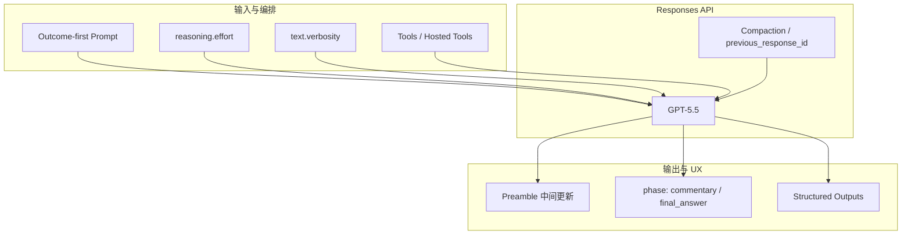
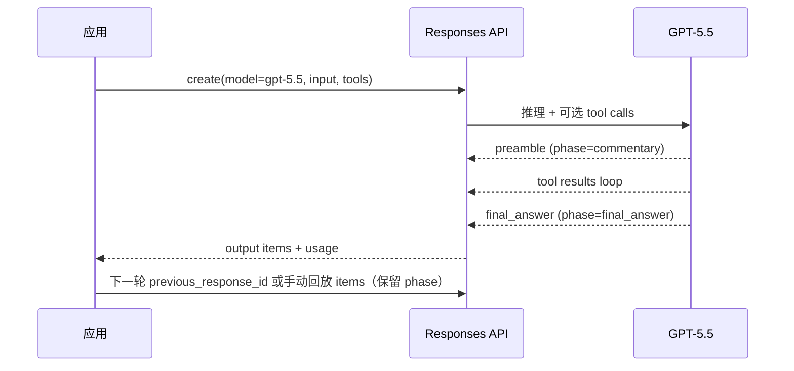
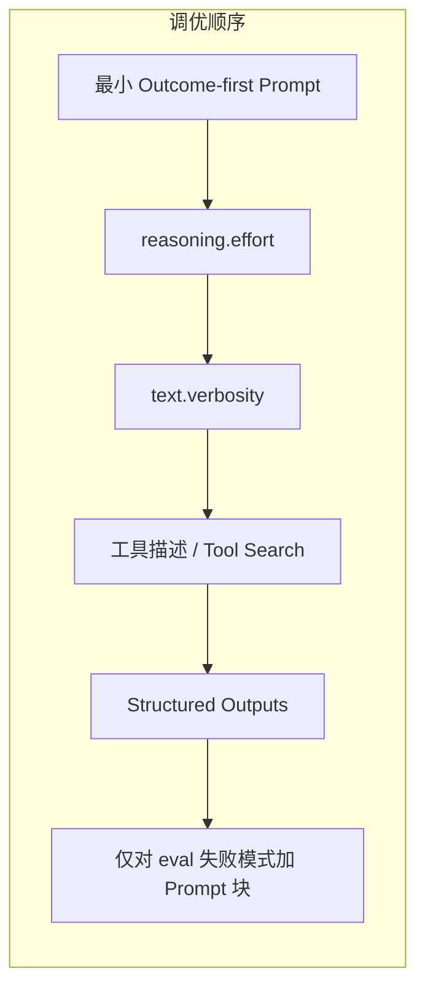

* Do not remove this line (it will not be displayed)
{:toc}

> [GPT-5.5](https://developers.openai.com/api/docs/models/gpt-5.5) 是 OpenAI GPT-5 模型家族的最新成员，面向复杂生产工作流——编码智能体、工具密集型 Agent、长上下文检索、产品规格到执行计划、以及面向客户的高质量对话。官方文档见 [Using GPT-5.5](https://developers.openai.com/api/docs/guides/latest-model) 与 [Prompt guidance](https://developers.openai.com/api/docs/guides/prompt-guidance)。若你已在用 [Codex]() 或 Agents SDK 构建 Agent，本文可作为迁移与调 Prompt 的参考。

# 概述

GPT-5.5 将复杂生产任务的基线能力整体抬高，但并非 `gpt-5.2` / `gpt-5.4` 的「即插即用」替代品。官方建议把它当作**新的模型家族**来调优：从最小可行 Prompt 出发，再针对代表性样本调整 `reasoning.effort`、`text.verbosity`、工具描述与输出格式。

## 适用场景

| 场景 | 说明 |
| :--- | :--- |
| 编码与工程 | 需要规划、工具调用、代码库导航、验证与多步执行的复杂开发任务 |
| 工具密集型 Agent | 大工具面、多步服务编排、长时运行任务 |
|  grounded 助手 | 检索、引用、证据约束下的问答与决策 |
| 长上下文 | 多文档分析、RAG、跨会话状态管理 |
| 产品规格 → 计划 | 从意图到可执行下一步的转化 |
| 面向客户的工作流 | 对执行质量与回复 polish 有较高要求的场景 |

GPT-5.5 支持 GPT-5.4 已有的 API 能力：**Prompt Caching**、Hosted Tools、Tool Search、Compaction，以及手动回放 assistant items 时的 **`phase` 处理**。



# 核心变化

## 相对前代的主要提升

- **更高效的推理**：在相同 `reasoning.effort` 下，往往用更少的 reasoning tokens 达到相近或更好的效果；工具链、多步工作流中 token 节省会累积。
- **Outcome-first 执行更强**：更善于从清晰目标出发，保留约束，把产品意图转化为具体下一步；应描述**期望结果、成功标准、允许的副作用、证据规则与输出形态**，而非逐步流程（除非路径本身必须固定）。
- **工具调用更精准**：在大工具目录、多步服务流程、长时 Agent 任务上表现突出，工具选择与参数填写更可靠。
- **默认风格更 polished 且更直接**：回复往往更 warm、可读，且所需 Prompt 脚手架更少。

## 五项关键行为变化

### 1. 推理力度默认 `medium`

GPT-5.5 默认 `reasoning.effort = medium`，建议将其作为**质量、可靠性、延迟与成本**的平衡起点。

| 档位 | 适用场景 |
| :--- | :--- |
| `none` | 极低延迟、无需推理或多链工具调用的轻量任务（语音短轮、快速检索、分类） |
| `low` | 延迟敏感但仍需工具、规划、搜索或多步决策时，优先于 `none` 评估 |
| `medium` | **默认推荐**；多数生产负载的平衡点 |
| `high` / `xhigh` | 复杂 Agent、异步重任务或评测边界；仅在 eval 证明质量增益值得额外延迟与成本时使用 |

{: .prompt-warning }
**注意**：更高 reasoning effort 并不总是更好。指令冲突、停止条件模糊、工具访问过于开放时，提高 effort 可能导致过度思考、无谓搜索或输出质量回退。应基于 eval 数据调档，而非直觉。

### 2. 图像输入保留更多视觉细节

默认图像处理策略更新，以提升 computer use 等视觉任务表现：

| `image_detail` | 行为概要 |
| :--- | :--- |
| 未设置 / `auto` | 使用 `original` 行为：最高约 10,240,000 像素或 6,000px 边长，不放大 resize |
| `high` | 最高约 2,500,000 像素或 2,048px 边长 |
| `low` | 侧重上下文效率，对超过 512px 边长的图像更积极缩小 |

详见 [Images and vision](https://developers.openai.com/api/docs/guides/images-vision)。

### 3. 指令遵循更字面、更彻底

模型会**按字面理解** Prompt。长时、工具密集或需收集证据的工作流中，应明确**成功标准与停止规则**。这与 Outcome-first 写法天然契合。

### 4. 默认更简洁直接

默认输出 efficient、direct、task-oriented。面向客户或强 conversational 体验时，需显式补充 personality、warmth、理由说明与格式要求。`text.verbosity` 默认 `medium`；追求简洁时 **`low` 往往是更好的起点**——在 GPT-5.5 上，`low` 比 GPT-5.4 的 `low` 会**更显著地缩短**最终答案。

### 5. 编码工作流需要更强编排

GPT-5.5 适合需要规划、工具、导航、验证、多步执行的复杂编码。对编码 Agent 应明确：复用策略、子 Agent 委派、测试期望、验收标准，以及何时继续推进 vs 何时请求帮助。

# 迁移快速上手

## 用 Codex 自动迁移

OpenAI 提供 **OpenAI Docs Skill**，可在 Codex 等 Agent 中执行：

```bash
openai-docs migrate this project to gpt-5.5
```

Skill 可从 [OpenAI skills 仓库](https://github.com/openai/skills) 下载，用于其他编码 Agent。

## API 与模型参数

| 项 | 建议 |
| :--- | :--- |
| 模型 slug | `gpt-5.5` |
| API | 凡涉及推理、工具调用或多轮对话，优先 **Responses API** |
| `reasoning.effort` | 从 `medium` 或 `low` 起测；见上表 |
| `text.verbosity` | 需要更短回复时设 `low` |
| `phase` | 工具密集 / 长时工作流：验证应用是否正确处理 preambles 与 assistant-item 回放 |
| 评测 | 对比 accuracy、token 消耗、端到端延迟 |

### Responses API 最小示例

```python
from openai import OpenAI

client = OpenAI()

response = client.responses.create(
    model="gpt-5.5",
    reasoning={"effort": "medium"},
    text={"verbosity": "low"},
    input="Summarize the migration checklist for GPT-5.5 in three bullets.",
)

print(response.output_text)
```

多轮状态推荐使用 `previous_response_id`；Zero Data Retention 等无状态场景，则每轮传回相关 output items。详见 [Passing context from the previous response](https://developers.openai.com/api/docs/guides/conversation-state#passing-context-from-the-previous-response)。

### Prompt 迁移清单

- 写出**期望结果与成功标准**，而非冗长步骤。
- **删除** Prompt 里可交给 Structured Outputs 的 JSON schema 描述。
- 优化缓存：**静态内容在前，动态用户上下文在后**；重复流量可对 common prefix 使用一致的 `prompt_cache_key`。
- **去掉当前日期**：模型已知 UTC 当前日期；仅在有业务时区、政策生效日、用户本地日等非 UTC 需求时再注入。
- 工具说明尽量写在 **tool description** 里（用途、时机、必填参数、副作用、重试安全、常见错误），跨工具的 operating policy 才放进 system instructions。



# Prompting 指南

以下模式摘自官方 [GPT-5.5 Prompting Guide](https://developers.openai.com/api/docs/guides/prompt-guidance)，并结合生产实践做了归纳。核心原则：**更短、更 outcome-oriented 的 Prompt 通常优于流程堆叠**；从 GPT-5.4 迁过来时，不要原样搬运旧指令栈。

## 相对 GPT-5.4 的 Prompt 侧变化

- 更短、以结果为先的 Prompt 往往效果更好。
- 推理更高效 → 升级 `high` / `xhigh` 前先重评 `low` / `medium`。
- Preamble、`phase` 回放对工具型 Responses 工作流仍然关键。
- 面向客户与 Agent UX 时，显式 personality、检索预算、验证规则更有价值。

## Personality 与协作风格

默认风格：efficient、direct、task-oriented。面向客户助手、支持流程、教练型产品时，区分两类短块：

- **Personality**：语气、warmth、直接度、正式程度、幽默、共情、 polish 程度。
- **Collaboration style**：何时提问、何时假设、主动性、上下文量、何时自检、如何处理不确定性或风险。

两者都应简短，**不能替代**清晰目标、成功标准、工具规则与停止条件。

**任务型助手示例**（节选）：

```text
# Personality
You are a capable collaborator: approachable, steady, and direct. Assume the user is competent
and acting in good faith. Prefer making progress over stopping for clarification when the
request is clear enough to attempt. Ask only when missing information would materially change
the answer or create meaningful risk. Stay concise without becoming curt.
```

**表达型协作助手**可额外加入 warmth、curiosity、观点与 tradeoff 说明，但仍保持块短小。

## Preamble：改善首 token 可见时间

流式场景下，用户会感知「多久才看到第一个字」。GPT-5.5 可能在 reasoning、规划或准备 tool call 后才输出可见文本。对多步、工具型、长时 Agent 任务，可要求**先输出 1–2 句 preamble**：

```text
Before any tool calls for a multi-step task, send a short user-visible update that
acknowledges the request and states the first step. Keep it to one or two sentences.
```

编码 Agent 若区分 analysis channel，可更明确：在 analysis channel 任何内容或 tool call 之前，必须先有 intermediary update。

这与 [Codex]() 等产品的「中间进度更新」UX 一致，并与下文 `phase: "commentary"` 配合。

## Outcome-first 与停止条件

**推荐写法**——描述目的地，而非每一步：

```text
Resolve the customer's issue end to end.

Success means:
- the eligibility decision is made from the available policy and account data
- any allowed action is completed before responding
- the final answer includes completed_actions, customer_message, and blockers
- if evidence is missing, ask for the smallest missing field
```

**避免**除非确有必要，否则不要写：

```text
First inspect A, then inspect B, then compare every field, then think through
all possible exceptions, then decide which tool to call...
```

### 绝对化用语

旧 Prompt 里大量 `ALWAYS` / `NEVER` / `must` / `only` 是为约束弱模型。GPT-5.5 上应保留给**真不变量**（安全、必填字段、禁止动作）；对「何时搜索、何时澄清、是否继续迭代」等判断，改用**决策规则**。

### 停止条件与缺失证据

```text
Resolve the user query in the fewest useful tool loops, but do not let loop minimization
outrank correctness, accessible fallback evidence, calculations, or required citation tags.

After each result, ask: "Can I answer the user's core request now with useful evidence?"
If yes, answer.

Use the minimum evidence sufficient to answer correctly, cite it precisely, then stop.
```

## 输出格式与 `text.verbosity`

GPT-5.5 对格式与结构高度可控。API 层用 `text.verbosity`；Prompt 层描述输出形态、受众与长度预算。

**默认 conversational 格式**（节选）：

```text
Let formatting serve comprehension. Use plain paragraphs as the default. Use headers, bold,
bullets, and numbered lists sparingly—when the user requests them, when comparison/ranking
needs structure, or when prose would be harder to scan.
```

**业务受众 + 长度**：

```text
Write for a senior business audience. Keep the answer under 400 words. Prioritize the
conclusion first, then reasoning, then caveats.
```

**润色类任务**：先声明要保留的 artifact、长度、结构与体裁，再要求 quietly 改善 clarity，避免擅自扩写或加 claim。

{: .prompt-tip }
**实践建议**：最终答案长度与 reasoning 质量是两条轴。需要稳定 UI 产物时，配合 **Structured Outputs**，而不是在 Prompt 里重复 JSON schema。

## Grounding、引用与检索预算

Grounded 回答应在 Prompt 中定义：什么需要证据、何谓足够、缺证据时如何行为。**没有证据 ≠ 事实性「否」**。

**检索预算**（ stopping rules for search）示例：

```text
For ordinary Q&A, start with one broad search using short, discriminative keywords.
If the top results contain enough citable support, answer from those results instead of
searching again.

Make another retrieval call only when:
- The top results do not answer the core question.
- A required fact, parameter, owner, date, ID, or source is missing.
- The user asked for exhaustive coverage, a comparison, or a comprehensive list.
- A specific document, URL, or artifact must be read.
- The answer would otherwise contain an important unsupported factual claim.

Do not search again to improve phrasing, add examples, or cite nonessential details.
```

更多 citation 格式见 [Citation formatting](https://developers.openai.com/api/docs/guides/citation-formatting)。

## 创意起草护栏

幻灯片、发布文案、客户摘要、talk track 等场景，区分**有来源的事实**与**创意措辞**：

```text
- Use retrieved or provided facts for concrete product, customer, metric, and roadmap claims; cite them.
- Do not invent specific names, metrics, customer outcomes, or capabilities to sound stronger.
- If there is little citable support, write a useful generic draft with placeholders or
  clearly labeled assumptions rather than unsupported specifics.
```

## 前端工程与视觉品味

前端任务可参考官方 frontend 示例：产品与用户上下文、设计系统对齐、首屏可用性、熟悉控件、各状态（loading / empty / error）、响应式，以及避免 generic hero、嵌套 card、装饰渐变、可见 instructional 文案、 broken layout 等生成 UI 常见缺陷。

## 要求模型「检查自己的工作」

在可验证场景给模型工具与 explicit 验证指令。

**编码 Agent**：

```text
After making changes, run the most relevant validation available:
- targeted unit tests for changed behavior
- type checks or lint checks when applicable
- build checks for affected packages
- a minimal smoke test when full validation is too expensive

If validation cannot be run, explain why and describe the next best check.
```

**视觉产物**：要求 render 后检查 layout、clipping、spacing、缺失内容与视觉一致性。

**工程 / 计划类**：implementation plan 应可追溯——需求映射、涉及资源、状态流转、验证命令、失败行为、安全隐私、开放问题。

## `phase` 参数

自 GPT-5.4 起，长时或工具密集的 Responses 工作流可用 assistant item 的 `phase` 区分中间更新与最终答案；GPT-5.5 沿用同一模式。

| 场景 | 做法 |
| :--- | :--- |
| 使用 `previous_response_id` | API 自动保留 assistant 状态 |
| 手动回放 output items | **原样保留**每条 assistant 的 `phase` |
| `phase: "commentary"` | 中间、用户可见的更新（含 preamble） |
| `phase: "final_answer"` | 完成态答案 |
| user messages | **不要**加 `phase` |

若集成未正确保留 `phase`，常见问题包括：中间更新被当作最终答案、工具链状态断裂。详见 [Phase parameter](https://developers.openai.com/api/docs/guides/phase-parameter)。

## 建议的 Prompt 结构

复杂 Prompt 可用下列骨架，每节保持简短，只在能改变行为处加细节：

```text
Role: [1-2 sentences: function, context, job]

# Personality
[tone and collaboration style]

# Goal
[user-visible outcome]

# Success criteria
[what must be true before the final answer]

# Constraints
[policy, safety, evidence, side-effect limits]

# Output
[sections, length, tone]

# Stop rules
[when to retry, fallback, abstain, ask, or stop]
```

# 推理模型与 API 能力协同

GPT-5.5 的最佳实践往往分布在 **Prompt 之外**的 API 与编排层。从 GPT-4.1、o3 或更早 GPT-5 迁移时，建议一并审视：

| 能力 | 要点 |
| :--- | :--- |
| **Responses API** | 多轮用 `previous_response_id`；无状态则每轮传回相关 output items |
| **Structured Outputs** | 不要在 Prompt 里描述 schema；用 API 校验 |
| **Prompt caching** | 稳定前缀 + 动态后缀；跟踪 `usage.prompt_tokens_details.cached_tokens` |
| **Tool calling** | 工具级指导进 description；Hosted Tools（web search、file search、code interpreter 等）优先于自研编排 |
| **Tool search** | 大工具目录时延迟加载相关子集 |
| **Compaction** | 长时 Agent 压缩状态时保留：已完成动作、活跃假设、ID、工具结果、未解 blocker、下一具体目标 |
| **Agents SDK** | 新 Agent 系统优先 SDK 的 orchestration、tracing、handoffs，而非从零写编排 |
| **当前日期** | 无需在 system 里写 UTC 日期；业务时区/政策日等例外再注入 |



# 最佳实践

1. **从 eval 出发，而非从旧 Prompt 出发**：选代表性任务集，对比 GPT-5.4 / GPT-5.5 的准确率、token、延迟与 UX。
2. **一次只改一类变量**：先换模型 slug 与 API 参数，再精简 Prompt；避免同时改十处无法归因。
3. **工具说明下沉到 tool definition**：GPT-5.5 在大工具面上收益明显；system prompt 只保留跨工具 policy。
4. **流式产品务必设计 preamble + phase**：改善首 token 感知，并保证客户端区分 commentary 与 final_answer。
5. **检索与 Agent 必写停止规则**：防止无限 search loop 或「为了措辞再搜一轮」。
6. **编码 Agent 写清验收与验证命令**：与 [Superpowers]() 等工程化工作流插件的 TDD / 审查节奏可对齐。
7. **谨慎使用 `xhigh`**：仅用于异步、eval 或质量瓶颈已证实的任务。

# 注意事项

- **非 drop-in 替换**：从 `gpt-5.4` 迁移时，旧有的 process-heavy Prompt 可能引入噪声；应删繁就简后再测。
- **`none` 不是默认省钱档**：仍需要工具或轻量规划时，优先试 `low` 而非 `none`。
- **verbosity 与 reasoning 独立**：缩短最终答案不等于降低推理质量；两者分别用 `text.verbosity` 与 `reasoning.effort` 控制。
- **图像与 computer use**：若依赖视觉细节，检查 `image_detail` 是否符合成本与质量预期。
- **手动 state 管理**：不用 `previous_response_id` 时，`phase` 丢失会导致 subtle 的 UX 与工具链 bug。
- **日期与时区**：模型知 UTC「今天」；财务报表截止日、用户本地「今天」等需显式传入。
- **安全与合规**：Personality 块不能替代安全、隐私与权限边界；高影响动作仍需 verification loop。

# 参考资料

| 类型 | 链接 |
| :--- | :--- |
| 官方 | [Using GPT-5.5（Latest model guide）](https://developers.openai.com/api/docs/guides/latest-model) |
| 官方 | [Prompt guidance（GPT-5.5 Prompting Guide）](https://developers.openai.com/api/docs/guides/prompt-guidance) |
| 官方 | [Reasoning models](https://developers.openai.com/api/docs/guides/reasoning) |
| 官方 | [Responses API](https://developers.openai.com/api/docs/guides/responses) |
| 官方 | [Structured Outputs](https://developers.openai.com/api/docs/guides/structured-outputs) |
| 官方 | [Prompt caching](https://developers.openai.com/api/docs/guides/prompt-caching) |
| 官方 | [Phase parameter](https://developers.openai.com/api/docs/guides/phase-parameter) |
| 官方 | [Citation formatting](https://developers.openai.com/api/docs/guides/citation-formatting) |
| 官方 | [OpenAI skills 仓库（含 Docs Skill）](https://github.com/openai/skills) |
| 站内 | [Codex in Action]() |
| 站内 | [Superpowers 使用指南]() |
