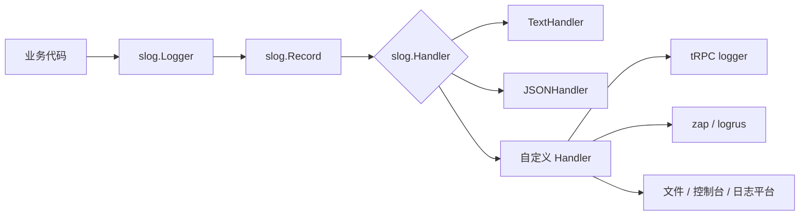
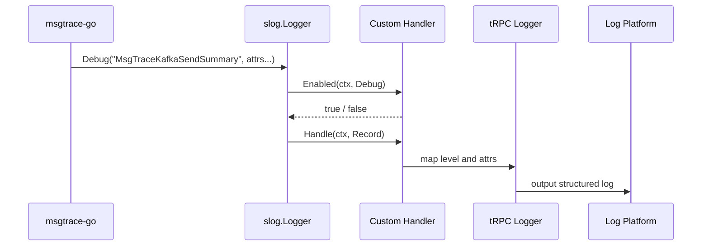
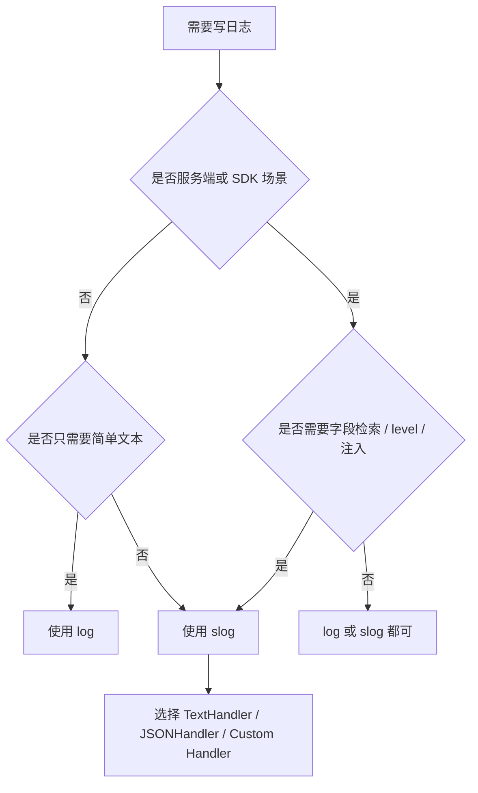

* Do not remove this line (it will not be displayed)
{:toc}

Go 标准库里的日志能力现在可以粗略分成两代：早期的 `log` 负责把一行文本稳定地写出去，Go 1.21 引入的 `log/slog` 则提供了标准化的结构化日志 API。前者非常适合小工具和简单程序，后者更适合服务端、SDK、云原生和日志平台检索场景。

一句话概括：

```text
log  = 简单文本日志工具
slog = 标准结构化日志接口
```

`slog` 并不是为了删除或废弃 `log`，而是补齐现代服务端日志需要的 level、字段、handler、group、过滤和扩展能力。小程序继续用 `log` 没问题；服务端 SDK、框架、中间件和可观测性组件更适合用 `slog` 作为标准抽象。
{: .prompt-tip }

# 背景：为什么 Go 需要 slog

早期 Go 程序对日志的要求很直接：能把信息打印出来，能带时间，能写到标准错误或文件。标准库 `log` 正好解决这个问题：

```go
log.Print("server started")
log.Printf("listen addr=%s", addr)
log.Println("request completed")
log.Fatal("failed to start")
log.Panic("unexpected state")
```

这种 API 简单、稳定、依赖少，几乎所有 Go 开发者都熟悉。但当程序进入服务端和云原生环境后，日志不再只是“给人看的一行文本”，而是可观测性系统里的数据源：需要按字段检索、按级别过滤、被采集器解析、和 trace / metric / alert 串起来。

例如一条消息投递日志，如果用 `log.Printf`，通常会变成一行拼好的字符串：

```go
log.Printf("MsgTraceKafkaSendSummary topic=%s partition=%d offset=%d count=%d",
    topic, partition, offset, count)
```

这对人类阅读还可以，但日志平台想按 `topic`、`partition`、`offset` 做过滤和聚合时，就要依赖正则或采集端解析规则。字段名称变了、顺序变了、格式多一个空格，都可能影响后续检索。

`slog` 的目标不是让打印日志这件事更酷，而是给 Go 生态提供一个官方的结构化日志接口：

```go
slog.Info("MsgTraceKafkaSendSummary",
    slog.String("topic", topic),
    slog.Int("partition", partition),
    slog.Int64("offset", offset),
    slog.Int("count", count),
)
```

日志从“文本”变成了“记录”：消息、级别、时间、字段、调用位置都可以被统一表达，再交给不同的 `Handler` 输出为文本、JSON、文件、控制台或第三方日志框架。

# 两代标准日志能力

## log：传统标准库日志

`log` 很早就存在，定位非常清晰：把一行文本输出到一个 `io.Writer`。它的核心类型是 `log.Logger`，默认 logger 写到 `os.Stderr`，并带有日期和时间前缀。

常用 API 包括：

```go
log.Print(...)
log.Printf(...)
log.Println(...)
log.Fatal(...)
log.Panic(...)
```

如果需要创建独立 logger，可以使用：

```go
logger := log.New(os.Stdout, "msgtrace: ", log.LstdFlags|log.Lshortfile)
logger.Printf("topic=%s count=%d", topic, count)
```

`log` 也提供了一个容易被忽略但很重要的方法：`Output(calldepth, msg)`。通过 `calldepth`，封装日志函数时可以手动调整 caller 层级：

```go
func Infof(format string, args ...any) {
    _ = logger.Output(2, fmt.Sprintf("[INFO] "+format, args...))
}
```

这也是很多早期 Go 项目在 `log` 之上封装 `Infof`、`Warnf`、`Errorf` 的基础。

## slog：Go 1.21 的结构化日志

`log/slog` 是 Go 1.21 引入的标准结构化日志包。它把日志拆成几层概念：

- `Logger`：业务代码使用的入口，例如 `Info`、`Debug`、`Warn`、`Error`。
- `Record`：一条日志记录，包含时间、级别、消息、PC 和 attrs。
- `Attr`：结构化字段，例如 `slog.String("topic", topic)`。
- `Handler`：真正负责判断是否启用、格式化和输出日志。
- `Group`：字段分组，适合组织嵌套对象或避免字段冲突。

默认可以直接使用包级函数：

```go
slog.Info("server started", slog.String("addr", addr))
slog.Warn("queue almost full", slog.Int("len", n))
slog.Error("send failed", slog.Any("error", err))
```

更常见的服务端写法是显式创建 logger，并选择 `TextHandler` 或 `JSONHandler`：

```go
logger := slog.New(slog.NewJSONHandler(os.Stdout, &slog.HandlerOptions{
    Level: slog.LevelInfo,
}))

logger.Info("request completed",
    slog.String("method", "GET"),
    slog.String("path", "/api/messages"),
    slog.Int("status", 200),
)
```

JSON 输出更适合日志平台采集：

```json
{
  "time": "2026-06-29T16:09:21.000+08:00",
  "level": "INFO",
  "msg": "request completed",
  "method": "GET",
  "path": "/api/messages",
  "status": 200
}
```

如果希望所有日志自动带上公共字段，可以使用 `With`：

```go
logger := slog.Default().With(
    slog.String("service", "msgtrace-go"),
    slog.String("component", "producer"),
)

logger.Info("producer started")
```

如果字段天然属于同一个对象，可以使用 `Group`：

```go
logger.Info("kafka send summary",
    slog.Group("kafka",
        slog.String("topic", topic),
        slog.Int("partition", partition),
        slog.Int64("offset", offset),
    ),
    slog.Int("count", count),
)
```

# 核心架构

理解 `slog` 的关键，是不要把它看成“增强版 `Printf`”。它更像一套标准接口：业务代码只依赖 `slog.Logger`，具体输出交给 `Handler`。



这个模型的价值在于解耦：库和 SDK 不需要强制业务使用某个第三方日志框架，只要接受 `*slog.Logger` 或 `slog.Handler`，业务侧就可以按自己的基础设施适配。

# log 与 slog 的核心差异

| 维度 | `log` | `slog` |
|---|---|---|
| 日志格式 | 文本行 | 结构化记录 |
| 日志级别 | 无内置 level | Debug / Info / Warn / Error |
| 字段 | 手动拼字符串 | 原生 `slog.Attr` |
| 过滤 | 需要自己封装 | `Handler.Enabled` |
| 扩展 | 主要是换 writer | 自定义 `Handler` |
| 检索友好 | 一般 | 更好 |
| 性能优化 | 比较有限 | 可通过 `Enabled` 避免构造开销 |
| caller / source | `log.Output(calldepth, ...)` | `Record.PC` / Handler 处理 |
| 兼容性 | 最老最稳 | Go 1.21+ |

这个表格背后的重点不是“哪个更高级”，而是“日志数据最终要服务谁”。如果日志主要给开发者临时排错看，文本行足够；如果日志要进入 ELK、Loki、Datadog、Cloud Logging、SLS 等平台做长期检索和分析，结构化字段会明显更稳定。

# log 的优点与限制

## 优点

`log` 最大的优点是简单。它几乎不需要解释，也不会带来额外抽象。对于命令行工具、一次性脚本、小型守护进程、学习示例，`log.Printf` 往往就是最合适的选择。

它的兼容性也最好。只要是 Go 程序，基本都能使用 `log`，不需要考虑 Go 1.21 版本门槛。对于仍需兼容旧版本 Go 的库，`log` 仍然是低成本选择。

另外，`log.Output(calldepth, msg)` 让封装 caller 成为可能。很多简单日志封装只需要调整 `calldepth`，就能让输出位置指向真正的业务调用方。

## 限制

`log` 的限制也来自它的定位：它只负责输出文本，不负责理解日志语义。

首先，它没有标准 level。`Info`、`Warn`、`Error`、`Debug` 都要自己约定，例如在字符串前面拼 `[INFO]`。不同库的约定不一致时，采集端很难统一识别。

其次，它没有结构化字段。字段只能拼到字符串里：

```go
log.Printf("topic=%s partition=%d offset=%d", topic, partition, offset)
```

这使日志平台只能把整行当文本处理，后续按字段过滤、聚合、统计都依赖额外解析。

最后，debug 日志的成本也更难控制。如果调用前已经完成字符串拼接或复杂对象格式化，即使最终不输出，成本也已经发生：

```go
log.Printf("debug payload=%s", expensiveString(payload))
```

当然可以自己加 `if debugEnabled`，但这会把过滤逻辑散落到业务代码里。

# slog 的优点与限制

## 优点

`slog` 的第一个价值是标准化。Go 生态过去已经有很多优秀日志库，例如 zap、zerolog、logrus，但库作者如果直接依赖其中一个，就会把使用者绑到某个实现上。`slog` 出现后，SDK 可以暴露标准入口：

```go
func SetLogger(logger *slog.Logger) {
    if logger == nil {
        logger = slog.Default()
    }
    defaultLogger = logger
}
```

业务侧可以选择默认 handler、JSON handler，也可以写 adapter 转接到现有日志系统。

第二个价值是结构化字段。字段不再依赖字符串约定，而是以 `Attr` 形式存在：

```go
logger.Debug("MsgTraceKafkaSendSummary",
    slog.String("topic", topic),
    slog.Int("partition", partition),
    slog.Int64("offset", offset),
    slog.Int("count", count),
)
```

这类日志天然适合在平台里按 `topic`、`partition`、`count` 检索或聚合。

第三个价值是低级别日志过滤。`Handler.Enabled` 可以在构造完整 `Record` 前判断当前级别是否启用。对于高频 debug summary、消息投递明细、采样日志，这一点很重要。

```go
if logger.Enabled(ctx, slog.LevelDebug) {
    logger.DebugContext(ctx, "debug summary",
        slog.Any("summary", buildSummary()),
    )
}
```

如果字段构造本身很便宜，可以直接调用 `Debug`；如果字段需要遍历大对象、序列化 payload、计算摘要，显式 `Enabled` 判断更稳妥。
{: .prompt-info }

## 限制

`slog` 的 API 比 `log` 稍复杂。它引入了 `Logger`、`Handler`、`Record`、`Attr`、`Value`、`Group` 等概念，简单程序可能会觉得“为了打印一行日志多了很多东西”。

它也有 Go 版本要求。标准库 `log/slog` 从 Go 1.21 开始可用，如果项目还要兼容更老版本，就需要升级工具链，或使用 `golang.org/x/exp/slog` 的历史方案并承担迁移成本。

另外，caller / source 是否准确依赖 handler 实现。标准 `HandlerOptions{AddSource: true}` 可以输出 source，但自定义 adapter 如果没有正确处理 `Record.PC`，就可能出现调用位置丢失、偏移不准或统一指向 adapter 的问题。

与已有日志框架集成时，也通常需要写 adapter。adapter 要处理 level 映射、字段展开、group 表达、错误字段、source、上下文等细节，否则可能出现字段丢失、level 不准、caller 偏移等问题。
{: .prompt-warning }

# 使用方法

## 继续使用 log 的场景

如果程序只是一个小工具，输出内容主要给人看，直接使用 `log` 是合理的：

```go
package main

import "log"

func main() {
    log.Println("start cleanup")
    log.Printf("removed files=%d", 12)
}
```

需要写到文件时，更换 writer 即可：

```go
file, err := os.OpenFile("app.log", os.O_CREATE|os.O_WRONLY|os.O_APPEND, 0o644)
if err != nil {
    log.Fatal(err)
}
defer file.Close()

logger := log.New(file, "cleanup: ", log.LstdFlags|log.Lshortfile)
logger.Println("job started")
```
{: file="main.go" }

## 使用 slog 输出 JSON

服务端程序通常更适合 JSON：

```go
package main

import (
    "log/slog"
    "os"
)

func main() {
    logger := slog.New(slog.NewJSONHandler(os.Stdout, &slog.HandlerOptions{
        Level: slog.LevelInfo,
    }))

    logger.Info("server started",
        slog.String("addr", ":8080"),
        slog.String("env", "prod"),
    )
}
```
{: file="main.go" }

## 在 SDK 中暴露 slog 注入点

SDK 不应该轻易规定业务必须使用某个日志库。更稳妥的方式是默认使用 `slog.Default()`，同时允许业务注入：

```go
package msgtrace

import "log/slog"

var logger = slog.Default()

func SetLogger(l *slog.Logger) {
    if l == nil {
        logger = slog.Default()
        return
    }
    logger = l
}
```
{: file="logger.go" }

内部使用时只依赖 `slog`：

```go
logger.Debug("MsgTraceKafkaSendSummary",
    slog.String("topic", topic),
    slog.Int("partition", partition),
    slog.Int64("offset", offset),
    slog.Int("count", count),
)
```

业务侧可以将它转接到自己的日志体系：

```go
handler := NewTRPCHandler(trpcLogger)
msgtrace.SetLogger(slog.New(handler))
```

这样 SDK 保持标准库依赖，业务基础设施也不会被强行替换。

# msgtrace-go 场景：为什么 slog 更合适

放到 `msgtrace-go` 这种旁路观测 SDK 场景，`log` 的问题会被放大：

- SDK 日志没有标准 level，`Info/Warn/Error/Debug` 都需要自定义接口。
- debug summary 不好统一控制，调用方很难只打开某类低级别日志。
- `Topic/Partition/Offset/Count` 只能拼字符串，不利于日志平台按字段过滤。
- 业务想注入 tRPC logger 时，需要 SDK 自己定义 `Infof/Warnf/Errorf` 这类接口。
- 不同业务线的日志框架不同，SDK 绑定任何一个具体框架都不合适。

切到 `slog` 后，模型更自然：

- `msgtrace-go` 内部统一使用 `slog`。
- 默认使用 `slog.Default()`，不破坏简单接入体验。
- 业务通过 `SetLogger(*slog.Logger)` 注入自己的 logger。
- `jlibgo` 或业务基础库通过 `slog.Handler` 转接到 tRPC logger。
- `MsgTraceKafkaSendSummary` 可以天然作为 Debug 日志。
- `Topic/Partition/Offset/Count` 可以作为结构化字段输出。



这里的核心收益不是“换了一个日志包”，而是 SDK 的日志契约从私有接口变成了 Go 官方标准接口。业务可以保留自己的日志后端，SDK 可以保留自己的结构化语义。

# 选型建议

## 优先选择 log

以下场景优先使用 `log`：

- 小型命令行工具、脚本、学习示例。
- 日志只给人临时查看，不进入复杂日志平台。
- 项目需要兼容非常老的 Go 版本。
- 只需要输出简单文本，不需要 level、字段、过滤和 adapter。

## 优先选择 slog

以下场景优先使用 `slog`：

- 服务端应用、微服务、云原生程序。
- SDK、框架、中间件，需要暴露标准日志注入模型。
- 日志会被采集到平台，并按字段检索、聚合、告警。
- 需要标准 level，尤其需要控制 debug 日志成本。
- 希望将 Go 标准接口转接到 zap、logrus、tRPC logger 或内部日志系统。



# 最佳实践

## SDK 接口暴露 *slog.Logger，而不是自定义 Infof

如果 SDK 自己定义：

```go
type Logger interface {
    Infof(format string, args ...any)
    Warnf(format string, args ...any)
    Errorf(format string, args ...any)
}
```

短期看很简单，长期会遇到几个问题：没有 `Debug` 的标准语义，没有结构化字段，没有 `Enabled`，也不容易表达 group 和 context。用 `*slog.Logger` 可以少发明一套接口。

## 高基数字段要谨慎

结构化日志很适合字段检索，但不代表所有东西都应该成为字段。用户 ID、请求 ID、topic、partition 这类字段通常有价值；完整 payload、大对象、过长错误堆栈则要谨慎，避免增加日志成本和存储压力。

## Debug 日志中昂贵字段先判断 Enabled

对于高频日志，尤其是 summary、批量明细、序列化结果，建议先判断：

```go
if logger.Enabled(ctx, slog.LevelDebug) {
    logger.DebugContext(ctx, "MsgTraceKafkaSendSummary",
        slog.Any("summary", buildExpensiveSummary()),
    )
}
```

这能避免 debug 关闭时仍然构造昂贵字段。

## 自定义 Handler 要认真处理映射

adapter 不是简单地把 `msg` 拼成字符串。至少要明确处理：

- `slog.Level` 到目标日志库 level 的映射。
- `Attr`、`Group`、`Any`、`error` 的展开方式。
- `Record.PC` 和 source / caller 的处理。
- `context.Context` 中 trace id、request id 等信息的注入。
- 字段名冲突和保留字段，例如 `time`、`level`、`msg`。

## 日志字段命名保持稳定

日志字段是面向平台和排障流程的接口。字段名一旦被仪表盘、告警、查询语句依赖，就应该像 API 一样谨慎修改。例如 `msg_name`、`topic`、`partition`、`offset`、`count` 这类字段应保持小写、稳定、可读。

# 注意事项

`slog` 默认并不会让所有第三方日志库自动变成结构化日志系统。只有 handler 正确实现，字段、level、source 才能完整保留下来。

`slog.Any("error", err)` 可以输出错误，但很多团队更习惯统一字段名为 `err` 或 `error`。字段命名最好在项目内统一，避免查询时一半搜 `err`，一半搜 `error`。

`AddSource: true` 很方便，但会带来额外开销。生产环境是否开启 source，要结合日志量、排障需求和性能预算决定。

不要把 `slog` 当成 trace 的替代品。日志适合记录事件和上下文，链路关系仍应由 OpenTelemetry 等 tracing 体系表达；两者可以通过 trace id / span id 关联。

如果库需要支持 Go 1.20 或更低版本，直接依赖标准库 `log/slog` 会提高使用门槛。此时要么继续使用 `log`，要么调整库的最低 Go 版本要求。
{: .prompt-warning }

# 总结

`log` 和 `slog` 是 Go 标准库中面向不同阶段需求的两代日志能力。`log` 解决的是“稳定输出一行文本”，它简单、直接、兼容性好；`slog` 解决的是“用标准接口表达结构化日志”，它支持 level、attr、handler、group 和提前过滤，更适合服务端和可观测性场景。

对于普通小程序，`log.Printf` 依然是好选择。对于服务端 SDK、框架、中间件，尤其是像 `msgtrace-go` 这种旁路观测组件，`slog` 更适合作为统一日志抽象：SDK 内部获得结构化表达，业务侧保留自己的日志后端，日志平台也能更稳定地按字段检索和分析。

简短结论：**`log` 适合简单输出，`slog` 适合服务端 SDK 和可观测性场景。**

# 延伸阅读

- [Go 标准库 log 文档](https://pkg.go.dev/log)
- [Go 标准库 log/slog 文档](https://pkg.go.dev/log/slog)
- [Structured Logging with slog - The Go Blog](https://go.dev/blog/slog)
- [Go slog package design discussion](https://go.googlesource.com/proposal/+/master/design/56345-structured-logging.md)
- [Go in Action]()
- [Using Go Modules]()
