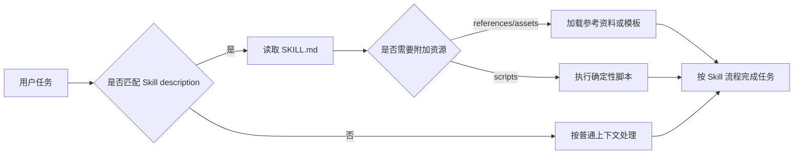

* Do not remove this line (it will not be displayed)
{:toc}

Agent Skills 是把“如何完成一类任务”的经验沉淀成可复用资产的一种方式。它不像普通提示词那样散落在聊天记录里，也不像 MCP 工具那样一定要提供外部能力；它更像一个轻量的、可版本化的操作手册：在需要时被 Agent 读取，然后指导 Agent 按稳定流程完成任务。

OpenAI Codex 文档对 Skills 和 Plugins 的边界说得很清楚：**Skills 是可复用工作流的作者格式，Plugins 是在 Codex 中可安装、可分发的打包单元**。如果你还在一个仓库或一个人的工作流里迭代，先写本地 Skill；当它需要跨团队安装、绑定 MCP、Hooks、App 集成或展示元数据时，再升级成 Plugin。

需要特别注意的是，[`openai/skills`](https://github.com/openai/skills) 仓库目前已经标记为 **deprecated**。它仍然可以作为了解早期 Skills Catalog 的历史参考，但不应再作为新项目的主要实现依据。新建 Skills 或 Plugins 时，应优先参考 [OpenAI Codex Agent Skills](https://developers.openai.com/codex/skills)、[Build Plugins](https://developers.openai.com/codex/plugins/build) 和当前的 [`openai/plugins`](https://github.com/openai/plugins) 示例仓库。
{: .prompt-warning }

> Skills 的价值不在于“多写一段提示词”，而在于把团队反复执行、容易遗漏、需要上下文的流程变成可审查、可测试、可演进的工程资产。
{: .prompt-tip }

# Agent Skills 是什么

一个 Skill 本质上是一个目录，最小形态只需要一个 `SKILL.md`：

```text
my-skill/
├── SKILL.md
├── scripts/
├── references/
├── assets/
└── agents/
    └── openai.yaml
```

其中只有 `SKILL.md` 是必需的，`scripts/`、`references/`、`assets/` 和 `agents/openai.yaml` 都是可选增强。

`SKILL.md` 需要包含 `name` 和 `description`，后面才是 Agent 要遵循的具体说明：

```markdown
---
name: release-notes
description: Generate release notes from merged pull requests and grouped commits.
---

When asked to prepare release notes, inspect merged PRs, group changes by user impact,
call out breaking changes first, and produce a concise Markdown changelog.
```
{: file=".agents/skills/release-notes/SKILL.md" }

Codex 使用 Skills 时采用 **progressive disclosure**，也就是渐进式披露：启动时只把每个 Skill 的名称、描述和路径放进上下文；当任务匹配某个 Skill 时，才读取完整 `SKILL.md`。这让一个环境可以安装很多 Skills，而不必一开始就把所有说明塞进上下文窗口。



# Skills、Rules、MCP、Plugins 的边界

在新项目里最容易犯的错误，是把所有东西都塞进一个 Skill。更好的方式是先分清它和其他机制的职责：

- **Rules / AGENTS.md**：适合放“这个仓库一直成立”的约束，例如代码风格、测试命令、目录约定、安全边界。
- **Skills**：适合放“当执行某类任务时才需要”的流程，例如发版说明、迁移计划、安全审计、客服工单归纳。
- **MCP**：适合提供外部系统能力，例如查询 Jira、读取 Datadog、访问内部文档、调用数据库只读接口。
- **Plugins**：适合把 Skills、MCP 配置、Hooks、App 集成和展示信息一起打包，分发给团队或组织。

简单判断标准是：如果它是长期背景知识，放规则；如果它是触发式工作流，放 Skill；如果它要连接外部系统，考虑 MCP；如果它要让别人安装，考虑 Plugin。

# 在新项目中正确使用 Skills

假设新项目是一个 SaaS 后端服务，团队希望让 Codex 在处理 PR、发布、数据库迁移时更稳定。推荐从三个层次开始。

## 第一步：先写仓库级 Skill

仓库内 Skills 可以放在 `.agents/skills` 下。Codex 会从当前工作目录向上扫描到仓库根目录，因此根目录的 `.agents/skills` 适合放整个项目通用的工作流。

```text
.agents/
└── skills/
    ├── pr-review/
    │   └── SKILL.md
    ├── db-migration/
    │   ├── SKILL.md
    │   └── references/
    │       └── migration-checklist.md
    └── release-notes/
        └── SKILL.md
```

例如先创建一个 PR Review Skill：

```markdown
---
name: pr-review
description: Review pull requests in this repository for correctness, tests, migrations, security risks, and compatibility. Use when the user asks for PR review or code review.
---

Review the current branch as a senior backend engineer.

1. Start with high-risk behavior changes, data migrations, authorization, and external API contracts.
2. Check whether tests cover the changed behavior, not just changed files.
3. Verify database migrations have forward-only behavior and safe rollout notes.
4. Report findings first, ordered by severity, with concrete file references.
5. If no issues are found, say so and call out any residual test gaps.
```
{: file=".agents/skills/pr-review/SKILL.md" }

这个 Skill 的重点不是“请认真 review”，而是明确输入、顺序、检查项和输出格式。这样 Agent 以后看到“帮我 review 这个 PR”时，就更容易触发正确的流程。

## 第二步：把可确定的动作交给脚本

官方最佳实践建议：**优先写 instructions，只有在需要确定性行为或外部工具时才加入 scripts**。比如发版说明的主体可以由 Agent 归纳，但收集 commit 和 tag 的步骤更适合脚本。

```text
.agents/skills/release-notes/
├── SKILL.md
└── scripts/
    └── collect_changes.sh
```

```markdown
---
name: release-notes
description: Prepare release notes from git history, tags, merged pull requests, and issue references.
---

Use this skill when the user asks to draft release notes, changelogs, or upgrade notes.

Workflow:

1. Run `scripts/collect_changes.sh` to collect candidate commits and tags.
2. Group changes into Breaking Changes, Features, Fixes, Documentation, and Internal.
3. Explain migration steps before ordinary feature notes.
4. Keep user-facing language concise and avoid implementation-only details.
5. Include unresolved risks if the git history is ambiguous.
```
{: file=".agents/skills/release-notes/SKILL.md" }

脚本不应该偷偷做发布、推送、删库、改配置这类有副作用的动作。它更适合收集、校验、格式化、生成中间数据。

> Skill 内的脚本越多，维护成本和安全审查成本越高。能用清晰步骤表达的流程，先不要急着写脚本。
{: .prompt-warning }

## 第三步：补充 UI 元数据和依赖

如果希望 Skill 在 Codex App 里更清晰，或控制是否允许隐式触发，可以增加 `agents/openai.yaml`：

```yaml
interface:
  display_name: "Repository PR Review"
  short_description: "Review backend PRs for correctness, rollout risk, and test gaps."
  default_prompt: "Review the current branch using the repository PR review workflow."

policy:
  allow_implicit_invocation: true
```
{: file=".agents/skills/pr-review/agents/openai.yaml" }

如果一个 Skill 依赖 MCP 工具，也可以在这里声明依赖，让使用者更容易理解它需要哪些外部能力。对安全敏感的 Skill，可以把 `allow_implicit_invocation` 设为 `false`，要求用户显式使用 `$skill-name` 才触发。

# Skill 的触发设计

Skills 可以被显式调用，也可以被隐式调用。

- 显式调用：用户在提示里直接提到某个 Skill，例如 `$release-notes`。
- 隐式调用：Codex 根据 `description` 判断当前任务是否匹配。

因此 `description` 是 Skill 的“入口设计”。它应该短、准、靠前包含触发词，并说明边界。

不推荐：

```yaml
description: Helps with project tasks.
```

推荐：

```yaml
description: Prepare release notes from git tags, merged pull requests, and issue references. Use for changelog, release notes, and upgrade notes tasks.
```

更好的描述通常包含三件事：要做什么、什么时候用、什么时候不用。对于容易误触发的 Skill，描述里可以写清“only use when...”或在 `agents/openai.yaml` 里关闭隐式调用。

# 什么时候升级为 Plugin

当 Skill 只服务于当前仓库，直接放在 `.agents/skills` 就够了。以下情况再考虑 Plugin：

- 需要让多个仓库或多个团队安装同一套 Skills。
- 需要把多个 Skills 作为一个套件分发。
- 需要同时分发 MCP server 配置、Hooks、App 映射或品牌展示信息。
- 需要通过 marketplace 管理安装策略、版本、分类和展示文案。

一个最小 Plugin 结构如下：

```text
my-plugin/
├── .codex-plugin/
│   └── plugin.json
└── skills/
    └── release-notes/
        └── SKILL.md
```

```json
{
  "name": "engineering-workflows",
  "version": "0.1.0",
  "description": "Reusable engineering workflow skills for release notes and PR review.",
  "skills": "./skills/"
}
```
{: file="my-plugin/.codex-plugin/plugin.json" }

Plugin 的路径要相对 plugin root，并以 `./` 开头。官方文档也强调，`.codex-plugin/plugin.json` 是入口，`skills/`、`hooks/`、`assets/`、`.mcp.json`、`.app.json` 等应该放在 plugin 根目录，而不是放进 `.codex-plugin/` 里。

如果要在仓库内提供本地 marketplace，可以增加：

```json
{
  "name": "local-engineering-plugins",
  "interface": {
    "displayName": "Local Engineering Plugins"
  },
  "plugins": [
    {
      "name": "engineering-workflows",
      "source": {
        "source": "local",
        "path": "./plugins/engineering-workflows"
      },
      "policy": {
        "installation": "AVAILABLE",
        "authentication": "ON_INSTALL"
      },
      "category": "Productivity"
    }
  ]
}
```
{: file=".agents/plugins/marketplace.json" }

这个 marketplace 可以先只暴露一个本地 Plugin，后续逐步扩展成团队 curated list。

# 最佳实践

## 一个 Skill 只解决一个工作

不要创建“backend-helper”这种万能 Skill。它会让触发边界变模糊，也会让 Agent 在无关任务里加载过多说明。更好的拆法是：

- `api-contract-review`：检查 API 兼容性和错误码。
- `db-migration-plan`：生成迁移、回滚和灰度计划。
- `release-notes`：根据历史记录写发布说明。
- `incident-summary`：从日志、时间线和修复记录生成事故复盘。

一个 Skill 越聚焦，越容易测试，也越容易被另一个项目复用。

## 把步骤写成命令式流程

Skill 是给 Agent 执行的，不是给人看的宣传页。建议多用“先做什么、再做什么、输出什么”的命令式写法。

```markdown
1. Identify the changed public API surface.
2. Compare request and response compatibility with the previous version.
3. Flag breaking changes before minor issues.
4. Include a migration note for each breaking change.
```

避免大量抽象原则，例如“保持高质量”“考虑性能”“注意安全”。这些话没有错，但无法稳定改变 Agent 的行为。把原则落成检查项、输入、输出和停止条件，效果更好。

## 给 Skill 配参考资料，而不是塞满主文件

`SKILL.md` 应该保持短而可执行。长篇规范、术语表、模板、历史案例可以放在 `references/` 或 `assets/`，并在 Skill 中说明何时读取。

```markdown
If the task involves database schema changes, read `references/migration-checklist.md`
before proposing a migration plan.
```

这样既能保留完整知识，也不会让每次触发都加载一大段低相关内容。

## 为触发行为写测试提示

创建 Skill 后，至少用几类 prompt 测试它是否正确触发：

- 应该触发：`帮我写这次发布的 release notes`。
- 应该触发：`根据这些 PR 生成 changelog`。
- 不该触发：`解释一下 semver 的概念`。
- 不该触发：`帮我修复一个构建失败`。

如果误触发，就收窄 `description`；如果该触发却没触发，就把关键触发词前置。

## 版本化和代码评审

团队级 Skills 应该像代码一样进入版本控制和 review。尤其要关注：

- 是否引入了有副作用的脚本。
- 是否要求 Agent 读取敏感文件或访问外部系统。
- 是否把临时项目细节写成了长期规则。
- 是否复制了过期流程。
- 是否明确了输出格式和验收标准。

对高风险 Skill，建议要求显式调用，或者把 destructive 操作改成“生成计划并等待用户确认”。

# 实际使用中的注意事项

## 不要把 Skill 当成权限系统

Skill 是行为指导，不是安全边界。它可以提醒 Agent “不要推送代码”“先确认再执行迁移”，但真正的权限控制仍然要依赖工具审批、沙箱、代码 review、CI、云端 IAM 和组织策略。

## 不要在 Skill 里写密钥或私有凭据

即使 Skill 只在本地使用，也不应该包含 token、cookie、数据库密码、生产环境连接串。Skill 应该描述“如何获取授权”或“使用哪个 MCP server”，而不是保存秘密本身。

## 谨慎使用隐式触发

隐式触发很方便，但适合低风险、边界清晰的任务。以下 Skill 更适合显式触发：

- 会调用外部系统或写入远端状态。
- 会运行复杂脚本。
- 会影响安全、合规、发布、计费或生产数据。
- 名称和描述容易与普通任务混淆。

## scripts 要可审计、可重复、可失败

脚本应满足几个基本要求：

- 默认只读，除非用户明确要求写操作。
- 输出结构化结果或清晰文本，便于 Agent 后续处理。
- 失败时返回非零状态和明确错误。
- 不依赖隐藏的本机状态。
- 不在脚本里绕过用户确认或工具审批。

## 注意上下文预算

Codex 会限制初始 Skills 列表占用的上下文。如果安装了大量 Skills，描述可能被截短，甚至部分 Skills 不进入初始列表。实践上要做到：

- `description` 开头就写关键触发词。
- 避免冗长描述。
- 删除不用的实验 Skill。
- 把个人 Skill 和仓库 Skill 分开管理。

# 推荐的新项目落地清单

新项目可以按这个顺序落地：

1. 先写 `AGENTS.md` 或项目规则，记录长期不变的工程约束。
2. 找出团队每周重复三次以上、且容易遗漏步骤的任务。
3. 为每类任务创建一个 `.agents/skills/<name>/SKILL.md`。
4. 让 `description` 明确触发词和边界。
5. 先用纯 instructions 跑通，再考虑 `references/`、`assets/` 或 `scripts/`。
6. 用真实任务 prompt 测试触发和输出。
7. 把 Skill 纳入代码评审。
8. 当多个项目都需要同一套 Skill 时，再封装为 Plugin。

如果你在 Cursor、Codex 或其他支持 Agent Skills 的工具中工作，也可以参考我之前写的 ，把项目规则、工作流技能和代码上下文结合起来，而不是把所有要求都放在一次性 prompt 里。

# 参考资源

- [OpenAI Codex Agent Skills](https://developers.openai.com/codex/skills)
- [OpenAI Codex Build Plugins](https://developers.openai.com/codex/plugins/build)
- [openai/skills](https://github.com/openai/skills)：已废弃的历史 Skills Catalog，仅建议作为历史背景参考，不建议作为新项目实现依据。
- [openai/plugins](https://github.com/openai/plugins)：Codex Plugin 示例集合。
- [Agent Skills Overview](https://agentskills.io/home)：Agent Skills 开放格式与生态说明。
- [Agent Skills Specification](https://agentskills.io/specification)
