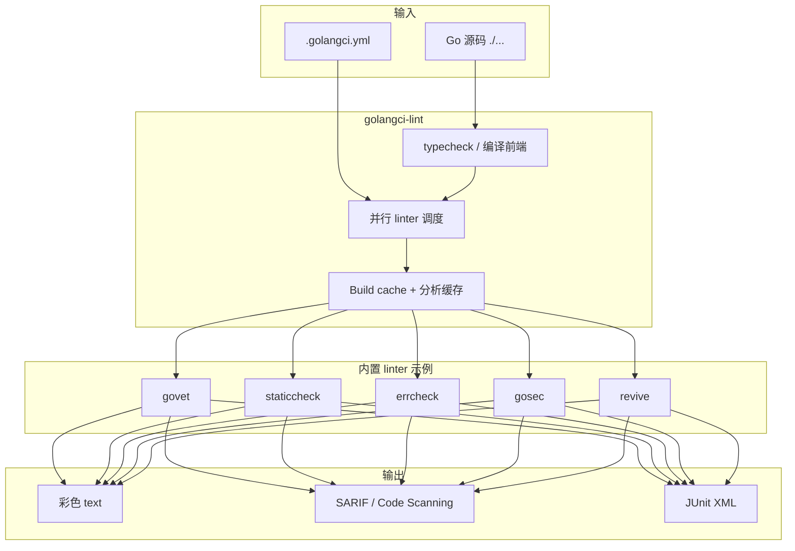
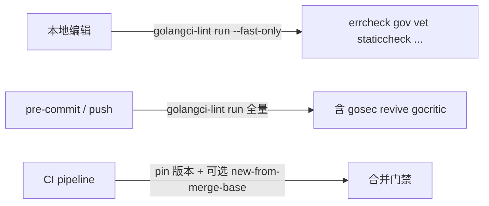

* Do not remove this line (it will not be displayed)
{:toc}

Go 项目做静态检查时，常见路径是 `go vet ./...` 加上 [Staticcheck](https://staticcheck.io/)。两者覆盖「编译器级可疑写法」和「高信噪比 correctness 规则」，但团队一旦需要统一风格、安全、复杂度、测试规范，往往还要再装 revive、gosec、errcheck 等十几个工具，各自配置、各自输出格式，CI 里串起来既慢又难维护。

[golangci-lint](https://golangci-lint.run/) 的定位就是 **Go 静态分析聚合器（linters runner）**：并行跑上百个 linter，复用 Go build cache 与自身分析缓存，用一份 YAML 配置统一开关与排除规则，输出格式可选 text、JSON、SARIF、JUnit 等。官方仓库见 [golangci/golangci-lint](https://github.com/golangci/golangci-lint)；当前主线为 **v2.x**（本文以 **v2.12.2** 为准）。

站内若已读过 [Go 实战]() 里 2019 年的简短介绍，或 [100 Go Mistakes]() 对 `go vet` / golangci-lint 的提及，本文会从零展开配置与落地实践，并补充 v2 迁移与替代方案讨论。
{: .prompt-info }

# 它解决什么问题



| 能力 | 说明 |
| :--- | :--- |
| **聚合** | 一次命令跑多个 linter，不必逐个安装、逐个写 CI step |
| **并行与缓存** | 多核并行；复用 `GOCACHE` 与 golangci-lint 专用缓存，二次运行明显更快 |
| **配置集中** | `.golangci.yml` 控制 enable/disable、单 linter 参数、路径排除、`nolint` 策略 |
| **格式化** | v2 起 `golangci-lint fmt` 统一 gofmt / goimports / gofumpt / gci 等 |
| **生态集成** | GitHub Actions、GitLab CI、GoLand、VS Code、pre-commit 等均有成熟用法 |

与「只跑 `staticcheck ./...`」相比，golangci-lint **不是**在算法上比 Staticcheck 更聪明，而是 **编排层**：把 Staticcheck、govet、errcheck 等打包、并行、可配置。许多团队仍把 Staticcheck 当作 correctness 金标准，再用 golangci-lint 管「团队规范」——二者互补，而非二选一。
{: .prompt-tip }

# 安装

官方 **强烈推荐使用发布页二进制**，而不是 `go install` 拉源码编译——后者使用的 Go 版本、依赖树与官方测试过的发行包不一致，容易踩坑。详见 [Local Installation](https://golangci-lint.run/docs/welcome/install/local/)。

## macOS / Linux（推荐）

```bash
# 安装到 $(go env GOPATH)/bin
curl -sSfL https://golangci-lint.run/install.sh | sh -s -- -b $(go env GOPATH)/bin v2.12.2

golangci-lint --version
```

## Homebrew

```bash
brew install golangci-lint
brew upgrade golangci-lint
```

注意：Homebrew 构建时用的 Go 版本可能与官方预编译包不同；追求与 CI 完全一致时，优先 pin 安装脚本版本号。

## Docker

```bash
docker run --rm -v "$(pwd)":/app -w /app golangci/golangci-lint:v2.12.2 golangci-lint run
```

持久化缓存可挂载 `GOCACHE`、`GOMODCACHE` 与 `~/.cache/golangci-lint`，见官方 Docker 示例。

# 快速开始

##  Lint

```bash
# 等价于 golangci-lint run ./...
golangci-lint run

# 指定目录（目录默认不递归，需加 /...）
golangci-lint run ./cmd/... ./internal/...

# 单文件（须与同 package 其他文件一起能编译）
golangci-lint run path/to/file.go
```

**零配置** 时默认启用（v2 `standard` 集）：

| Linter | 作用 |
| :--- | :--- |
| `errcheck` | 未检查的错误返回值 |
| `govet` | 近似 `go vet` 的可疑写法 |
| `ineffassign` | 无效赋值 |
| `staticcheck` | Staticcheck 规则集（含原 gosimple、stylecheck） |
| `unused` | 未使用的常量、变量、函数、类型 |

命令行临时开关：

```bash
# 仅启用 errcheck，关闭默认集
golangci-lint run --default=none -E errcheck

# 在默认集上追加 gosec
golangci-lint run -E gosec

# 编辑器/本地快速反馈：只跑标记为 fast 的 linter
golangci-lint run --fast-only
```

## Format

v2 将格式化从 linter 列表拆到 `formatters` 段，CLI 为：

```bash
golangci-lint fmt              # 格式化当前模块
golangci-lint fmt ./pkg/...    # 指定路径
golangci-lint fmt --stdin      # 供编辑器管道输入
```

更多见 [Quick Start](https://golangci-lint.run/docs/welcome/quick-start/)。

# 配置文件

golangci-lint 按以下顺序查找配置（从当前目录向上直到根目录，再到用户主目录）：

- `.golangci.yml` / `.golangci.yaml` / `.golangci.toml` / `.golangci.json`

不确定实际加载了哪一份时，加 `-v` 查看。完整字段见 [.golangci.reference.yml](https://github.com/golangci/golangci-lint/blob/main/.golangci.reference.yml) 与 [Configuration File](https://golangci-lint.run/docs/configuration/file/)。

## v2 顶层结构

```yaml
version: "2"          # v2 必填，唯一合法值

linters:
  default: standard   # standard | all | none | fast
  enable: []
  disable: []
  settings: {}
  exclusions: {}

formatters:
  enable: []
  settings: {}
  exclusions: {}

issues: {}
output: {}
run: {}
severity: {}
```

配置文件中的选项与命令行等价；**各 linter 的细粒度参数只能写在配置文件里**，不能全部通过 CLI 传递。

## 示例 1：团队基线（推荐起点）

在默认 `standard` 上追加安全、错误处理与 revive 风格检查，并对测试文件放宽部分规则：

```yaml
version: "2"

run:
  timeout: 5m
  tests: true
  modules-download-mode: readonly

linters:
  default: standard
  enable:
    - bodyclose
    - errorlint
    - gosec
    - misspell
    - revive
    - sloglint
  disable:
    - unused          # 若与 IDE 实时分析重复，可按需关闭
  settings:
    revive:
      rules:
        - name: exported
          disabled: false
        - name: package-comments
          severity: warning
    gosec:
      excludes:
        - G104          # 与 errcheck 重叠时可排除
  exclusions:
    presets:
      - std-error-handling
      - common-false-positives
    rules:
      - path: _test\.go
        linters:
          - gosec
          - errcheck
          - funlen

issues:
  max-issues-per-linter: 0
  max-same-issues: 0
```

`max-issues-per-linter: 0` 表示不截断报告条数（默认每条 linter 最多 50 条），适合 CI 一次看全量问题。

## 示例 2：严格模式（新项目 / 绿色field）

```yaml
version: "2"

linters:
  default: none
  enable:
    - errcheck
    - govet
    - staticcheck
    - unused
    - ineffassign
    - bodyclose
    - errorlint
    - gocritic
    - gosec
    - misspell
    - revive
    - unparam
    - copyloopvar
    - durationcheck
    - noctx
    - rowserrcheck
    - sqlclosecheck
  settings:
    gocritic:
      enabled-tags:
        - diagnostic
        - style
      disabled-checks:
        - hugeParam     # 按团队口味调整
    funlen:
      lines: 120
      statements: 80

issues:
  fix: true            # 支持 auto-fix 的 linter 自动修复

formatters:
  enable:
    - gofumpt
    - goimports
```

本地可 `golangci-lint run --fix` 或配置 `issues.fix: true` 应用可自动修复项；提交前仍应人工 review diff。

## 示例 3：存量大仓库「只卡新代码」

官方 FAQ 推荐：**不要一次性修完历史 issue**，CI 只失败于新引入的问题。

```yaml
version: "2"

linters:
  default: standard
  enable:
    - gosec
    - revive

issues:
  new-from-merge-base: main
  whole-files: true    # 变更文件内、非 diff 行上的 issue 也报告（更严）
```

等价命令行：

```bash
golangci-lint run --new-from-merge-base=main
# 或对比上一 commit
golangci-lint run --new-from-rev=HEAD~1
```

`--new` 在有 unstaged 变更时只分析工作区改动，适合 pre-commit；CI 更稳妥的是 `--new-from-merge-base=main` 或 `--new-from-rev=HEAD~1`。

## 示例 4：模块边界与依赖治理

```yaml
version: "2"

linters:
  enable:
    - depguard
    - gomoddirectives
    - gomodguard
  settings:
    depguard:
      rules:
        main:
          deny:
            - pkg: github.com/sirupsen/logrus
              desc: "use log/slog or internal logger"
            - pkg: github.com/pkg/errors
              desc: "use fmt.Errorf with %w"
          files:
            - "!$test"
```

结合站内 [Go log 与 slog]() 一文，可在 `depguard` 里禁止旧式日志库，推动结构化日志统一。

## 示例 5：CI 输出 SARIF（GitHub Code Scanning）

```yaml
version: "2"

output:
  formats:
    sarif:
      path: golangci-lint.sarif
  path-mode: abs
```

```bash
golangci-lint run
# 将 golangci-lint.sarif 上传至 GitHub Security → Code scanning
```

# 行内忽略：nolint

与 Staticcheck 类似，可在行或块上标注：

```go
//nolint:errcheck // legacy API, error ignored by design
func legacy() {
    _ = doSomething()
}

//nolint:gosec // G404: weak random acceptable for non-crypto ID
id := rand.Int()
```

建议：

- 写清 **原因**（`// reason` 或独立注释），便于 review；
- 启用 `nolintlint` linter，防止滥用或过期 directive；
- **无法** 用 `nolint` 跳过 `typecheck`（见下文 FAQ）。

# 最佳实践

## 1. Pin 版本，避免 CI 突然全红

[CI Installation](https://golangci-lint.run/docs/welcome/install/ci/) 明确警告：`linters.default: all` 或上游 linter 升级时，**未 pin 版本** 的 CI 可能在同一时刻集体失败。做法：

- 本地与 CI 使用 **相同版本号**（如 `v2.12.2`）；
- 配置里用 `standard` 或显式 `enable` 列表，慎用 `default: all`；
- 升级 golangci-lint 时在 MR 中单独 bump，并阅读 [Changelog](https://github.com/golangci/golangci-lint/blob/main/CHANGELOG.md)。

## 2. 分层：本地快、CI 全



VS Code / GoLand 集成时官方建议加 `--fast-only`，否则全量分析可能 **卡住编辑器**。见 [Integrations](https://golangci-lint.run/docs/welcome/integrations/)。

## 3. 先保证能编译

golangci-lint 依赖 typecheck（Go 编译器前端）。代码或依赖不完整时，只会看到 `typecheck` 报错，其他 linter **不会** 产出报告。排查顺序：

1. `golangci-lint version` — Go 版本是否匹配；
2. `go mod tidy`；
3. `go build ./...` 或 `go test ./...`；
4. 不要对缺依赖的单文件孤立分析。

## 4. 测试文件单独策略

生产代码严格、测试代码适度放宽是常见做法（见示例 1 的 `path: _test\.go` exclusions）。`testpackage`、`paralleltest`、`testifylint` 等适合只在 `_test.go` 或测试目录启用。

## 5. 与 gofmt / goimports 分工

格式化交给 `golangci-lint fmt` 或 `formatters.enable`；lint 阶段专注逻辑与风格。避免在 CI 里既跑 `gofmt -l` 又跑重复 formatter linter。

## 6. 大仓库落地路径

| 阶段 | 动作 |
| :--- | :--- |
| 第 1 周 | 零配置或 `standard` 本地跑，收集 noise |
| 第 2 周 | 提交 `.golangci.yml`，CI 用 `--new-from-merge-base=main` |
| 第 3 周起 | 按模块逐步收紧 enable 列表；历史债务 backlog 与 MR 门禁分离 |

# CI 与编辑器集成

## GitHub Actions

官方推荐 [golangci-lint-action](https://github.com/golangci/golangci-lint-action)（内置缓存与 PR annotation）：

```yaml
- uses: actions/checkout@v4
- uses: actions/setup-go@v5
  with:
    go-version: stable
- name: golangci-lint
  uses: golangci/golangci-lint-action@v8
  with:
    version: v2.12.2
    args: --timeout=5m
```

## GitLab / Buildkite

GitLab 可使用 [Code Quality 组件](https://golangci-lint.run/docs/welcome/install/ci/)；Buildkite 有 [golangci-lint 插件](https://github.com/buildkite-plugins/golangci-lint-buildkite-plugin)。

## VS Code（Go 扩展）

```json
"go.lintTool": "golangci-lint",
"go.lintFlags": [
  "--path-mode=abs",
  "--fast-only"
],
"go.formatTool": "custom",
"go.alternateTools": {
  "customFormatter": "golangci-lint"
},
"go.formatFlags": ["fmt", "--stdin"]
```

golangci-lint 会 **自动发现** 当前文件对应的 `.golangci.yml`，一般不必在 VS Code 里重复写 linter 列表。

GoLand 2025.1+ 已内置 golangci-lint 支持（v1 / v2 均可）。

# 从 v1 迁移到 v2

v2 是 **配置破坏性升级**，必写 `version: "2"`。官方提供迁移命令：

```bash
golangci-lint migrate
# 原文件备份为 .golangci.yml.bck.yml
```

关键变更（详见 [Migration guide](https://golangci-lint.run/docs/product/migration-guide/)）：

| v1 | v2 |
| :--- | :--- |
| `linters.disable-all: true` | `linters.default: none` |
| `linters.enable-all: true` | `linters.default: all` |
| `linters.presets: [style, ...]` | 迁移为显式 `linters.enable` 列表 |
| `gofmt` / `goimports` 在 linters 里 | 移到 `formatters.enable` |
| `gosimple` / `stylecheck` 单独启用 | 合并进 `staticcheck` |
| `linters.fast: true` | `linters.default: fast` 或 CLI `--fast-only` |
| 若干 deprecated linter | 已移除（如 `exportloopref`、`golint`） |

迁移不会保留 YAML 注释，需手工补回。

# 替代方案与选型

Reddit 等社区讨论中，常见诉求是 **golangci-lint 全量跑太慢**（大 monorepo 冷启动数秒到数十秒）。下列工具 **生态与成熟度各不相同**，生产环境请自行 benchmark，勿盲目替换。

| 工具 | 定位 | 特点 |
| :--- | :--- | :--- |
| **[Staticcheck](https://staticcheck.io/)** | correctness 分析 | 误报极低；`staticcheck ./...` 即可；golangci-lint 已内置其规则 |
| **`go vet`** | 编译器配套 | 零依赖、极快；覆盖有限 |
| **[vint](https://github.com/vint-go/vint)** | golangci-lint 替代 | 宣称同规则下显著更快；配置统一；仍在快速演进 |
| **[woofmt](https://github.com/GWinfinity/woofmt)** | Rust 实现 lint+fmt | 强调增量与并行；benchmark 声称数量级加速 |
| **[krait](https://github.com/krait-go/krait)** | 代码健康扫描 | 死代码、重复、复杂度、架构分层一体；零配置 `krait check` |
| **[gox](https://github.com/mentasystems/gox)** | LLM 生成代码门禁 | 规则少而严、默认 error；与 golangci-lint 互补而非替代 |

务实组合：

- **默认**：golangci-lint（`standard` + 少量 enable）+ pin 版本 + CI `new-from-merge-base`；
- **极致速度本地反馈**：编辑器 `--fast-only` 或单独跑 Staticcheck；
- **探索新工具**：在子模块试点 vint / woofmt，对比 issue 集合与 CI 时间后再决定。

社区帖：[Alternatives to golangci-lint that are fast](https://www.reddit.com/r/golang/comments/1jepzes/alternatives_to_golangcilint_that_are_fast/)（讨论速度、增量分析与新项目成熟度，阅读时注意发布时间与环境差异）。

# FAQ

以下整理自 [官方 FAQ](https://golangci-lint.run/docs/welcome/faq/) 与日常落地问题。

## 支持哪些 Go 版本？

与 Go 团队策略一致：**最近两个 minor 版本**。golangci-lint 能分析的 Go 语法上限，取决于 **编译该二进制时使用的 Go 版本**。升级 Go 后应同步升级 golangci-lint 发行包。

## CI 里怎么用？

安装 **固定版本**，执行 `golangci-lint run`，**非零 exit code 即失败**。不要每次 CI 拉 `@latest`。

## 为什么会出现 typecheck 错误？

`typecheck` **不是 linter**，而是编译错误的展示标签（缺少 import、语法错误、单文件分析导致 package 不完整等）。存在 typecheck 时，其他 linter 通常 **不会有输出**。

**不能** 通过 `nolint` 或 exclusions 忽略 typecheck——必须先让 `go build ./...` 通过。

排查 checklist：

1. `golangci-lint version` 与 `go version`；
2. `go mod tidy`；
3. 全 package 构建；
4. CGO / 私有 module 的 `GOPROXY`、`GOSUMDB`、git 凭据；
5. 分析范围是否过小（应用 `./...` 或完整 package 路径）。

## 为什么 `--new-from-*` 有时「漏报」？

这些选项通过 **git diff 行号** 过滤 issue：issue 所在行若不在 diff 范围内会被跳过。若希望 **变更文件内所有 issue** 都上报，加 `--whole-files` 或配置 `issues.whole-files: true`。

## `--fast-only` 第一次为什么仍慢？

首次运行要填充类型信息缓存，后续会快很多。适合本地已编译过的迭代开发。

## 如何减少误报？

- 使用 `linters.exclusions.presets`（如 `common-false-positives`）；
- 按 `path` / `text` / `linters` 写 `exclusions.rules`；
- 调单 linter 的 `settings`（如 gosec `excludes`、revive `rules`）；
- 查阅各 linter 的 [False Positives](https://golangci-lint.run/docs/linters/false-positives/) 文档。

## Homebrew / go install 与官方二进制不一致？

Homebrew 与 `go install` 可能用不同 Go 版本编译，依赖树也未经过官方 release 测试。团队 CI 与本地开发应统一用 **install.sh 相同 version 字符串**。

## 能否自定义 linter？

可以：官方提供 [Module Plugin System](https://golangci-lint.run/docs/plugins/module-plugins/) 与 [Go Plugin System](https://golangci-lint.run/docs/plugins/go-plugins/)。维护成本较高，一般团队优先用现有 linter + `depguard` / `forbidigo` 表达架构约束。

# 常用命令速查

| 命令 | 说明 |
| :--- | :--- |
| `golangci-lint run` | 分析当前模块 |
| `golangci-lint run ./...` | 递归所有 package |
| `golangci-lint run -v` | 打印使用的配置文件路径 |
| `golangci-lint run --fix` | 应用可自动修复的问题 |
| `golangci-lint run --fast-only` | 仅 fast linter |
| `golangci-lint run -E gosec -D errcheck` | 临时增删 linter |
| `golangci-lint fmt` | 格式化 |
| `golangci-lint linters` | 列出所有 linter |
| `golangci-lint help linters` | 默认启用集说明 |
| `golangci-lint migrate` | v1 配置迁移 v2 |
| `golangci-lint completion bash` | Shell 补全 |

# 注意事项

- **分析范围**：目录参数须加 `/...` 才递归；不能混用不同 package 的单文件。
- **并发锁**：默认不允许多个 golangci-lint 同时写同一缓存；CI 并行 job 可设 `run.allow-parallel-runners: true`。
- **timeout**：v2 默认 **无** timeout；大仓库建议在 `run.timeout` 或 CLI `--timeout=5m` 显式设置。
- **generated code**：v2 对 generated 文件默认 `strict` 排除策略，与 v1 `lax` 不同；迁移时注意 `migrate` 会保留旧行为。

# 参考资源

| 说明 | 链接 |
| :--- | :--- |
| 官网与文档 | [golangci-lint.run](https://golangci-lint.run/) |
| GitHub 仓库 | [golangci/golangci-lint](https://github.com/golangci/golangci-lint) |
| Quick Start | [Quick Start](https://golangci-lint.run/docs/welcome/quick-start/) |
| FAQ | [FAQ](https://golangci-lint.run/docs/welcome/faq/) |
| 配置文件参考 | [Configuration File](https://golangci-lint.run/docs/configuration/file/) |
| v1 → v2 迁移 | [Migration guide](https://golangci-lint.run/docs/product/migration-guide/) |
| CI 安装 | [CI Installation](https://golangci-lint.run/docs/welcome/install/ci/) |
| 编辑器集成 | [Integrations](https://golangci-lint.run/docs/welcome/integrations/) |
| Staticcheck 官方 | [staticcheck.io](https://staticcheck.io/docs/) |
| 站内 · Go 实战（含早期 golangci-lint 片段） | [Go in Action]() |
| 站内 · slog 与日志规范 | [Go log 与 slog]() |
| 社区 · 更快替代方案讨论 | [r/golang — alternatives that are fast](https://www.reddit.com/r/golang/comments/1jepzes/alternatives_to_golangcilint_that_are_fast/) |
