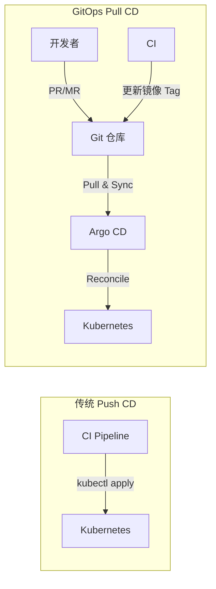
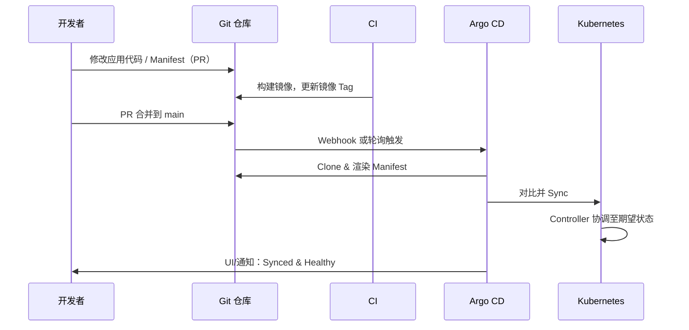
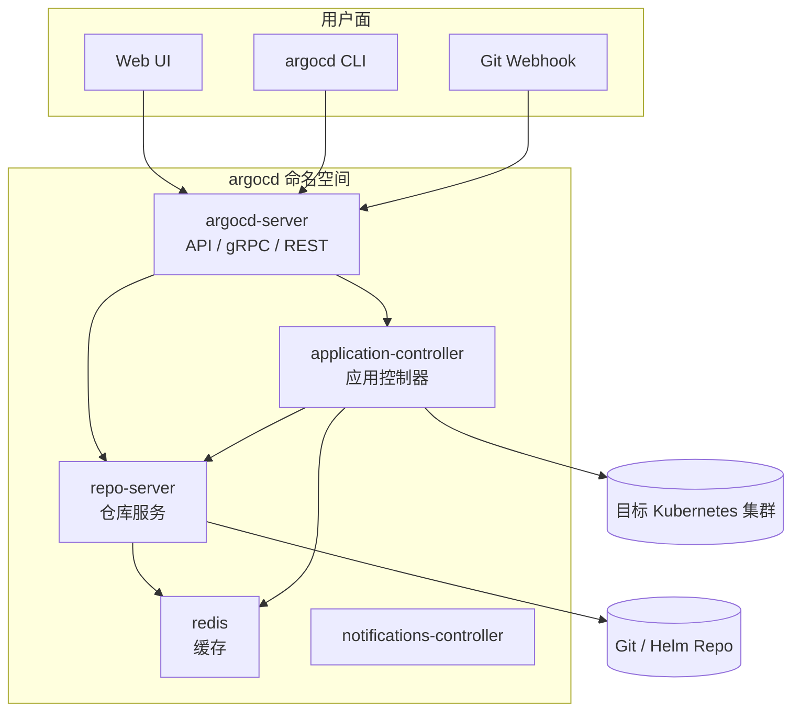
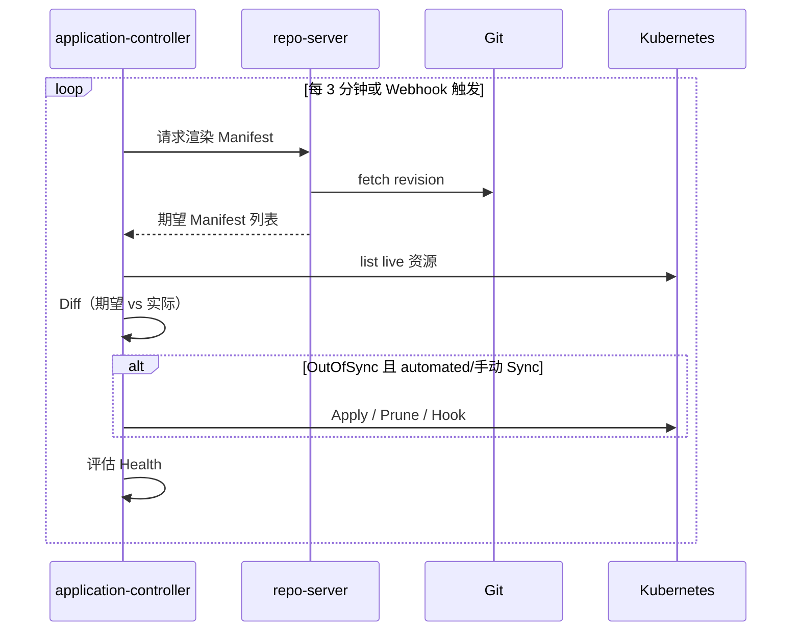
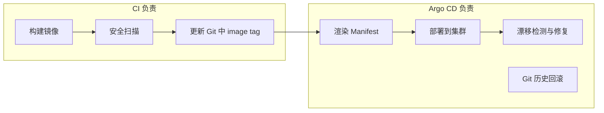

* Do not remove this line (it will not be displayed)
{:toc}

## 概述

> [Argo CD](https://argo-cd.readthedocs.io/en/stable/) 是 CNCF 毕业项目，面向 Kubernetes 的**声明式 GitOps 持续交付**工具。它以 Git 仓库为唯一事实来源（Single Source of Truth），持续对比集群**期望状态**与**实际状态**，并在偏差时报告或自动修复。
>
> 官方定义：*Argo CD is a declarative, GitOps continuous delivery tool for Kubernetes.*
{: .prompt-info }

本文与站内 [Helm in Action]()（Chart 渲染与 Release 管理）、[Kubernetes in Action]()（集群基础概念）互为补充：Helm/Kustomize 负责**生成** Manifest，Argo CD 负责**从 Git 拉取并持续同步**到集群。

本文覆盖：

- GitOps 与 Argo CD 基础介绍
- 核心概念与 CRD
- 安装与快速上手示例
- 架构与实现原理
- 最佳实践
- 常见问题与排查

---

## 什么是 Argo CD {#what-is-argo-cd}

### 为什么需要 GitOps

传统 CI/CD 往往是 **Push 模式**：CI 流水线构建镜像后，由 Jenkins、GitLab CI 等工具**主动**向集群执行 `kubectl apply` 或 `helm upgrade`。这种模式存在几个问题：

| 问题 | 说明 |
|------|------|
| 权限集中 | CI 需要集群高权限凭证，泄露风险大 |
| 状态不可审计 | 集群当前配置与 Git 历史难以一一对应 |
| 配置漂移 | 运维或开发者用 `kubectl edit` 改现场，Git 与集群不一致 |
| 回滚困难 | 回滚依赖 CI 重新跑流水线，而非 Git revert |

**GitOps** 将 Git 作为期望状态的唯一来源：变更通过 PR/MR 评审合并，由集群内的 **GitOps Agent**（如 Argo CD）**拉取（Pull）** 并应用。CI 只负责构建镜像、更新 Manifest 中的镜像 Tag，不再直接操作生产集群。



### Argo CD 能做什么

根据 [官方 Overview](https://argo-cd.readthedocs.io/en/stable/) 与 [GitHub 仓库](https://github.com/argoproj/argo-cd)，Argo CD 主要能力包括：

- 自动或手动将应用部署到指定 Kubernetes 集群
- 支持 **Kustomize**、**Helm**、Plain YAML/JSON、Jsonnet 及自定义 Config Management Plugin
- 多集群管理与 RBAC 多租户（AppProject）
- 检测配置漂移（OutOfSync）并可视化 Diff
- 回滚到 Git 中任意历史 Commit
- Web UI、CLI、Webhook（GitHub/GitLab/Bitbucket）、Prometheus 指标
- PreSync / Sync / PostSync 钩子，配合 [Argo Rollouts](https://argo-rollouts.readthedocs.io/) 实现金丝雀、蓝绿发布

> **与 CI 的分工**：CI 构建并推送镜像、更新 Git 中的 Manifest；CD 由 Argo CD 完成。详见官方 [Automation from CI Pipelines](https://argo-cd.readthedocs.io/en/stable/user-guide/ci_automation/)。
{: .prompt-tip }

---

## 核心概念 {#core-concepts}

### GitOps 工作流

典型端到端流程如下（参考 [Octopus — Understanding Argo CD](https://octopus.com/devops/argo-cd/)）：



### 关键 CRD

Argo CD 通过自定义资源扩展 Kubernetes API，核心对象如下：

| 资源 | 作用 |
|------|------|
| **Application** | 描述一个应用的 Git 源、目标集群/命名空间、同步策略 |
| **AppProject** | 项目边界：允许的 Git 仓库、目标集群、资源类型、RBAC |
| **ApplicationSet** | 基于 Generator（Git 目录、Cluster、List 等）批量生成 Application |
| **Repository** / **Cluster** Secret | 存储 Git 与集群凭据（也可在 Application 中内联） |

### 应用状态

Argo CD 为每个 Application 维护两类核心状态（见 [Core Concepts](https://argo-cd.readthedocs.io/en/stable/core_concepts/)）：

| 维度 | 可能值 | 含义 |
|------|--------|------|
| **Sync Status** | `Synced` / `OutOfSync` | Git 期望状态与集群 live 状态是否一致 |
| **Health Status** | `Healthy` / `Progressing` / `Degraded` / `Missing` / `Suspended` 等 | 资源是否满足健康规则 |

> **OutOfSync 不等于故障**：新建 Application 在首次 Sync 前通常为 `OutOfSync` + `Missing`，属于正常现象。
{: .prompt-info }

### 同步策略（Sync Policy）

| 模式 | 行为 |
|------|------|
| **Manual** | 仅手动或 CLI/UI 触发 Sync |
| **Automated** | Git 变更后自动 Sync；可配 `prune`（删除 Git 中已移除的资源）、`selfHeal`（撤销集群内非 Git 变更） |

Automated 示例：

```yaml
syncPolicy:
  automated:
    prune: true
    selfHeal: true
  syncOptions:
    - CreateNamespace=true
```

### 支持的 Manifest 来源

- Plain 目录 YAML/JSON
- [Kustomize](https://kustomize.io)
- [Helm](https://helm.sh) Chart（与站内 [Helm 指南]() 配合使用）
- Jsonnet / Ksonnet
- 任意 [Config Management Plugin](https://argo-cd.readthedocs.io/en/stable/operator-manual/config-management-plugins/)

### 跟踪策略（Tracking）

Application 的 `targetRevision` 可指向分支、Tag 或固定 Commit，详见 [Tracking Strategies](https://argo-cd.readthedocs.io/en/stable/user-guide/tracking_strategies/)。生产环境建议 **Pin 到 Tag 或 Commit**，避免 `HEAD` 漂移。

---

## 安装 Argo CD {#installation}

安装前需具备 [kubectl](https://kubernetes.io/docs/tasks/tools/install-kubectl/)、可用的 kubeconfig，以及集群内 CoreDNS（本地集群如 microk8s 需 `microk8s enable dns`）。详见 [Understand The Basics](https://argo-cd.readthedocs.io/en/stable/understand_the_basics/)。

### 安装方式对比

| 方式 | 适用场景 | 说明 |
|------|----------|------|
| **Multi-Tenant（标准）** | 平台团队服务多开发团队 | 含 API Server + UI，最常见 |
| **HA Multi-Tenant** | 生产环境 | 多副本，见 [ha/install.yaml](https://github.com/argoproj/argo-cd/blob/stable/manifests/ha/install.yaml) |
| **Core** | 仅需 Controller、无 UI/多租户 | [core-install.yaml](https://github.com/argoproj/argo-cd/blob/stable/manifests/core-install.yaml)，`argocd login --core` |
| **Kustomize / Helm** | 需定制补丁或 Values | 官方推荐 Kustomize 引用 remote manifest 再 patch |
| **namespace-install** | 仅命名空间权限、主要部署外部集群 | 需单独安装 CRD |

### 快速安装（非 HA，评估/开发）

```bash
kubectl create namespace argocd
kubectl apply -n argocd --server-side --force-conflicts \
  -f https://raw.githubusercontent.com/argoproj/argo-cd/stable/manifests/install.yaml
```

> **为何 `--server-side --force-conflicts`？** 部分 CRD（如 ApplicationSet）体积超过 client-side `kubectl apply` 的 annotation 限制（262KB）；Server-Side Apply 可避免此问题。生产环境建议 Pin 到具体版本 Tag（如 `v3.4.5`），而非 `stable` 浮动分支。
{: .prompt-warning }

生产环境应使用 [HA 安装清单](https://argo-cd.readthedocs.io/en/stable/operator-manual/installation/#high-availability) 或通过 [argo-helm/charts/argo-cd](https://github.com/argoproj/argo-helm/tree/main/charts/argo-cd) 部署。

### 访问 UI 与 CLI

**安装 CLI**（macOS）：

```bash
brew install argocd
```

**端口转发访问 UI**（[Getting Started — Access](https://argo-cd.readthedocs.io/en/stable/getting_started/#3-access-argo-cd)）：

```bash
kubectl port-forward svc/argocd-server -n argocd 8080:443
# 浏览器打开 https://localhost:8080
```

**初始 admin 密码**：

```bash
argocd admin initial-password -n argocd
argocd login localhost:8080 --insecure
argocd account update-password
```

修改密码后应删除 `argocd-initial-admin-secret`，避免明文密码长期留存。

### 版本与 Kubernetes 兼容性

| Argo CD 版本 | 测试过的 Kubernetes 版本 |
|--------------|--------------------------|
| 3.4 | v1.35, v1.34, v1.33, v1.32 |
| 3.3 | v1.35, v1.34, v1.33, v1.32 |
| 3.2 | v1.34, v1.33, v1.32, v1.31 |

来源：[Installation — Tested versions](https://argo-cd.readthedocs.io/en/stable/operator-manual/installation/#tested-versions)

---

## 使用示例 {#usage-examples}

以下示例基于官方 [Getting Started](https://argo-cd.readthedocs.io/en/stable/getting_started/) 与 [argocd-example-apps](https://github.com/argoproj/argocd-example-apps) 仓库中的 Guestbook 应用。

### 示例 1：CLI 创建 Application 并 Sync

```bash
kubectl config set-context --current --namespace=argocd

argocd app create guestbook \
  --repo https://github.com/argoproj/argocd-example-apps.git \
  --path guestbook \
  --dest-server https://kubernetes.default.svc \
  --dest-namespace default

argocd app get guestbook
argocd app sync guestbook
```

首次 `app get` 典型输出：`Sync Status: OutOfSync`，`Health Status: Missing`。Sync 成功后变为 `Synced` / `Healthy`。

### 示例 2：声明式 Application 清单

将 Application 本身也放入 Git，实现 **App of Apps** 或 **Git 管理 Argo CD**（[Declarative Setup](https://argo-cd.readthedocs.io/en/stable/operator-manual/declarative-setup/)）：

```yaml
apiVersion: argoproj.io/v1alpha1
kind: Application
metadata:
  name: guestbook
  namespace: argocd
spec:
  project: default
  source:
    repoURL: https://github.com/argoproj/argocd-example-apps.git
    targetRevision: HEAD
    path: guestbook
  destination:
    server: https://kubernetes.default.svc
    namespace: default
  syncPolicy:
    automated:
      prune: true
      selfHeal: true
    syncOptions:
      - CreateNamespace=true
```

```bash
kubectl apply -f guestbook-application.yaml
```

### 示例 3：Helm 源

与 [Helm Chart 结构](#基本概念) 对应，Application 可指向 Chart 仓库：

```yaml
spec:
  source:
    repoURL: https://charts.example.com
    chart: my-app
    targetRevision: 1.2.0
    helm:
      valueFiles:
        - values-prod.yaml
      parameters:
        - name: replicaCount
          value: "3"
```

Helm 参数也可在 UI 中覆盖，详见 [Parameter Overrides](https://argo-cd.readthedocs.io/en/stable/user-guide/parameters/)。

### 示例 4：Kustomize 源

```yaml
spec:
  source:
    repoURL: https://github.com/org/k8s-manifests.git
    targetRevision: main
    path: overlays/production
    kustomize:
      images:
        - myregistry.io/app:v1.2.3
```

### 示例 5：多集群部署

部署到 Argo CD 所在集群时使用 `https://kubernetes.default.svc`。外部集群需先注册：

```bash
kubectl config get-contexts -o name
argocd cluster add <CONTEXT_NAME>
```

`cluster add` 会在目标集群创建 `argocd-manager` ServiceAccount 并绑定 ClusterRole。可按最小权限收窄规则，但集群级 `get/list/watch` 仍为必需。

### 示例 6：ApplicationSet 批量创建应用

适合「一个 Git 目录对应一个微服务」或「每个集群一份部署」：

```yaml
apiVersion: argoproj.io/v1alpha1
kind: ApplicationSet
metadata:
  name: guestbook-apps
  namespace: argocd
spec:
  generators:
    - git:
        repoURL: https://github.com/argoproj/argocd-example-apps.git
        revision: HEAD
        directories:
          - path: guestbook
  template:
    metadata:
      name: '{{path.basename}}'
    spec:
      project: default
      source:
        repoURL: https://github.com/argoproj/argocd-example-apps.git
        targetRevision: HEAD
        path: '{{path}}'
      destination:
        server: https://kubernetes.default.svc
        namespace: default
```

详见 [Generating Applications with ApplicationSet](https://argo-cd.readthedocs.io/en/stable/user-guide/application-set/)。

### 示例 7：Sync Waves 与 Hooks

复杂发布可结合 [Sync Waves](https://argo-cd.readthedocs.io/en/stable/user-guide/sync-waves/) 与 [Resource Hooks](https://argo-cd.readthedocs.io/en/stable/user-guide/resource_hooks/)：

```yaml
metadata:
  annotations:
    argocd.argoproj.io/sync-wave: "1"
```

PreSync Job 做数据库迁移，Sync 阶段部署 Deployment，PostSync Job 做冒烟测试——顺序由 wave 与 hook 类型控制。

---

## 架构与实现原理 {#architecture}

### 组件架构

Argo CD 以 Kubernetes Controller 模式运行，持续 Reconcile。官方架构如下（详见 [Architecture](https://argo-cd.readthedocs.io/en/stable/operator-manual/architecture/)）：



| 组件 | 职责 |
|------|------|
| **argocd-server** | API、认证授权（OIDC/LDAP/SAML 等）、RBAC、Webhook 接入、Sync/Rollback 操作 |
| **repo-server** | Clone Git、缓存 Manifest；执行 Kustomize build / Helm template / 插件渲染 |
| **application-controller** | 对比 live vs desired；执行 Sync；评估 Health；触发 Hooks |
| **redis** | 缓存与会话，减轻 repo-server 压力 |
| **notifications-controller** | 对接 Slack、Email 等（可选） |

核心协调逻辑在 [gitops-engine](https://github.com/argoproj/argo-cd/tree/master/gitops-engine) 中实现：使用类 `kubectl apply` 的三向合并，并支持 [Resource Tracking](https://argo-cd.readthedocs.io/en/stable/user-guide/resource_tracking/)（默认 label `app.kubernetes.io/instance`，或 annotation `argocd.argoproj.io/tracking-id`）。

### Reconcile 循环



**selfHeal**：若有人在集群内 `kubectl edit` 改了字段，Controller 检测到 live 偏离 Git，会在下次 Reconcile 时改回，Application 显示 `OutOfSync` 后自动修复。

**prune**：Git 中删除某资源后，Sync 时从集群删除对应对象（需谨慎，建议配合 [AppProject 资源白名单](https://argo-cd.readthedocs.io/en/stable/operator-manual/project-specification/)）。

### 与 CI 的边界



CI **不应**再持有集群 admin kubeconfig 直接 `kubectl apply` 生产环境；仅更新 Git 即可触发 Argo CD。镜像 Tag 更新可用 [Argo CD Image Updater](https://argocd-image-updater.readthedocs.io/) 等工具自动化。

---

## 最佳实践 {#best-practices}

综合 [官方 Best Practices](https://argo-cd.readthedocs.io/en/stable/user-guide/best_practices/)、[Octopus Argo CD Best Practices](https://octopus.com/devops/argo-cd/) 与生产经验：

### 1. 源码仓库与配置仓库分离

| 做法 | 原因 |
|------|------|
| 应用代码一个 Repo，K8s Manifest 另一个 Repo | 改副本数不必触发应用构建；审计日志更清晰；权限可分离 |
| 微服务各自 Manifest Repo 或目录 | 发布节奏不同，避免 mono-repo 里 CI 循环触发 |

### 2. 选择合适的配置仓库粒度

| 组织规模 | 建议 |
|----------|------|
| 小团队 | 单配置 mono-repo 可接受 |
| 中型 | 每团队一个 Repo |
| 大型 | 每服务或每域一个 Repo，配合 ApplicationSet |

### 3. 生产环境 Pin 版本

```yaml
source:
  targetRevision: v1.4.2        # Tag
  # 或 targetRevision: abc1234  # Commit SHA
```

避免生产跟踪 `HEAD` 或浮动分支导致不可预期升级。

### 4. 启用 Automated Sync 时理解 prune / selfHeal

- **selfHeal**：防止配置漂移，但会覆盖合法的临时扩缩容（若 replicas 写在 Git 里）
- **prune**：删除 Git 中不存在的资源；误删 Manifest 可能导致生产资源被删

建议：生产先 **Manual Sync + PR 评审**，稳定后再开 `automated`；关键应用使用 [Sync Windows](https://argo-cd.readthedocs.io/en/stable/user-guide/sync-windows/) 限制维护时段。

### 5. 使用 AppProject 做多租户隔离

限制每个 Project 可访问的 Git 仓库、命名空间、集群与 API Group：

```yaml
apiVersion: argoproj.io/v1alpha1
kind: AppProject
metadata:
  name: team-a
  namespace: argocd
spec:
  sourceRepos:
    - 'https://github.com/org/team-a-config.git'
  destinations:
    - namespace: team-a-*
      server: https://kubernetes.default.svc
  clusterResourceWhitelist:
    - group: ''
      kind: Namespace
```

### 6. Secret 不要明文进 Git

使用 [External Secrets Operator](https://external-secrets.io/)、[Sealed Secrets](https://github.com/bitnami-labs/sealed-secrets)、[Argo CD Vault Plugin](https://argocd-vault-plugin.readthedocs.io/) 或云厂商 Secret Manager。参见官方 [Secret Management](https://argo-cd.readthedocs.io/en/stable/operator-manual/secret-management/)。

### 7. 提交前本地验证 Manifest

```bash
# Kustomize
kustomize build overlays/prod | kubeconform -summary

# Helm
helm template myrelease ./chart -f values-prod.yaml | kubeconform -summary
```

避免无效 YAML 进入 Git 后在 Sync 阶段才发现失败。

### 8. 结构化健康检查与通知

- 为 CRD 配置 [Resource Health](https://argo-cd.readthedocs.io/en/stable/operator-manual/health/) 自定义规则
- 配置 [Notifications](https://argo-cd.readthedocs.io/en/stable/operator-manual/notifications/) 在 `Degraded` / `SyncFailed` 时告警
- 暴露 [Prometheus Metrics](https://argo-cd.readthedocs.io/en/stable/operator-manual/metrics/) 给 Grafana

### 9. 用 ApplicationSet 代替手工创建大量 Application

减少 UI 点击与人为不一致，Git 目录结构即应用拓扑。

### 10. 集群自举（Cluster Bootstrapping）

Argo CD 安装完成后，第一个 Application 指向「元配置」Repo，由该 Repo 管理其余 Application（App of Apps 模式）。见 [Cluster Bootstrapping](https://argo-cd.readthedocs.io/en/stable/operator-manual/cluster-bootstrapping/)。

> **进阶发布**：金丝雀、蓝绿可结合 [Argo Rollouts](https://argo-rollouts.readthedocs.io/)，与 Argo CD 同属 Argo 生态。
{: .prompt-tip }

---

## 常见问题与排查 {#faq}

### 1. Application 长期 OutOfSync，但 Sync 成功

**可能原因**：

- 集群默认字段与 Git 不一致（如 Service 的 `clusterIP`）
- 使用了 mutating webhook 注入 sidecar
- Helm/Kustomize 渲染结果非确定性

**处理**：使用 [Compare Options](https://argo-cd.readthedocs.io/en/stable/user-guide/compare-options/) 忽略差异字段，例如：

```yaml
spec:
  ignoreDifferences:
    - group: apps
      kind: Deployment
      jsonPointers:
        - /spec/replicas
```

### 2. Sync 失败：`permission denied` / RBAC

检查 `argocd-application-controller` 与 `argocd-server` 的 ServiceAccount 权限；多集群场景检查 `argocd-manager` RoleBinding。AppProject 的 `destinations` 是否包含目标 NS。

### 3. 无法连接 Git 私有仓库

在 Argo CD 中添加 Repository Credential（SSH key 或 HTTPS token）：

```bash
argocd repo add https://github.com/org/private.git \
  --username git --password <token>
```

或通过 Sealed Secret 声明式管理。

### 4. Helm 依赖构建失败

repo-server Pod 需能访问 Chart 仓库；subchart 在 `Chart.lock` 锁定版本。可在 repo-server 启用 [Helm 缓存与自定义 repo](https://argo-cd.readthedocs.io/en/stable/user-guide/helm/)。

### 5. CRD 安装失败 / annotation too long

使用 `--server-side --force-conflicts` 安装；ApplicationSet CRD 单独 apply：

```bash
kubectl apply --server-side --force-conflicts \
  -k 'https://github.com/argoproj/argo-cd/manifests/crds?ref=stable'
```

### 6. 资源一直 Progressing

检查 Pod 事件与 [Health 规则](https://argo-cd.readthedocs.io/en/stable/operator-manual/health/)：Deployment 需 ReadyReplicas 达标；Ingress 可能等待 LB 分配 IP。

### 7. 误删资源如何恢复

- **Git 回滚**：`git revert` 后 Sync，或 UI **History and Rollback** 到先前 Git revision
- 若启用了 `prune` 且 Manifest 已删：从 Git 历史恢复 YAML 再 Sync

### 8. 与 Flux 选哪个？

| 维度 | Argo CD | Flux |
|------|---------|------|
| UI | 功能完整的 Web UI | 以 CLI/CR 为主（Weave GitOps UI 可选） |
| 多租户 | AppProject + RBAC 成熟 | 依赖 Flux CR 与 RBAC 组合 |
| 生态 | ApplicationSet、Image Updater、Rollouts | 与 Flagger、Helm Controller 等组合 |

两者都是成熟的 GitOps 工具，选型取决于团队对 UI、多集群与现有 Argo 生态的偏好。

### 9. 调试命令

```bash
# 应用详情与 Diff
argocd app get <app> --show-params
argocd app diff <app>

# Controller 日志
kubectl logs -n argocd deploy/argocd-application-controller -f

# Repo 渲染错误
kubectl logs -n argocd deploy/argocd-repo-server -f
```

官方 [Troubleshooting Tools](https://argo-cd.readthedocs.io/en/stable/operator-manual/troubleshooting/) 还包含 `argocd admin` 子命令用于导出集群内 Application 状态。

### 10. 安全注意事项

- 修改默认 admin 密码，接入 SSO（[User Management](https://argo-cd.readthedocs.io/en/stable/operator-manual/user-management/)）
- 限制谁可创建 Cluster 级 Application
- 阅读 [Security Considerations](https://argo-cd.readthedocs.io/en/stable/security_considerations/)
- 生产使用 TLS Ingress，避免长期 `--insecure`

---

## 注意事项 {#caveats}

> **不要在生产直接使用非 HA `install.yaml`**：评估可用，生产请用 HA 清单或 Helm Chart，并 Pin 版本。
{: .prompt-danger }

- **CI 与 CD 职责分离**：CI 更新 Git，Argo CD 部署；避免双写集群。
- **Automated prune 有风险**：配合分支保护、PR 评审与备份策略。
- **本地示例 Guestbook 可能为 AMD64 镜像**：ARM 节点需确认镜像架构（见 Getting Started Note）。
- **自定义 namespace 安装**：需 patch `ClusterRoleBinding` 中的 ServiceAccount namespace（[Installation — Custom Namespace](https://argo-cd.readthedocs.io/en/stable/operator-manual/installation/#installing-argo-cd-in-a-custom-namespace)）。
- **升级前阅读 [Upgrading Overview](https://argo-cd.readthedocs.io/en/stable/operator-manual/upgrading/overview/)**：CRD 与 RBAC 变更可能影响现有 Application。

---

## 参考资源 {#references}

### 官方文档

| 说明 | 链接 |
|------|------|
| 文档首页 / Overview | [argo-cd.readthedocs.io](https://argo-cd.readthedocs.io/en/stable/) |
| Getting Started | [getting_started](https://argo-cd.readthedocs.io/en/stable/getting_started/) |
| Installation | [operator-manual/installation](https://argo-cd.readthedocs.io/en/stable/operator-manual/installation/) |
| Core Concepts | [core_concepts](https://argo-cd.readthedocs.io/en/stable/core_concepts/) |
| Architecture | [operator-manual/architecture](https://argo-cd.readthedocs.io/en/stable/operator-manual/architecture/) |
| Best Practices | [user-guide/best_practices](https://argo-cd.readthedocs.io/en/stable/user-guide/best_practices/) |
| Application 规范 | [application-specification](https://argo-cd.readthedocs.io/en/stable/user-guide/application-specification/) |
| FAQ | [faq](https://argo-cd.readthedocs.io/en/stable/faq/) |
| GitHub 源码 | [github.com/argoproj/argo-cd](https://github.com/argoproj/argo-cd) |
| 项目官网 | [argoproj.github.io/cd](https://argoproj.github.io/cd/) |
| 在线 Demo | [cd.apps.argoproj.io](https://cd.apps.argoproj.io/) |

### 社区与视频

| 说明 | 链接 |
|------|------|
| Octopus — Understanding Argo CD | [octopus.com/devops/argo-cd](https://octopus.com/devops/argo-cd/) |
| Argo CD Overview Demo（SIG Apps） | [YouTube — aWDIQMbp1cc](https://youtu.be/aWDIQMbp1cc) |
| Introduction to Argo CD | [YouTube — 4N23CGCNCJ8](https://www.youtube.com/watch?v=4N23CGCNCJ8) |
| GitOps Deployment and Kubernetes | [YouTube — nYVir5kY5kA](https://www.youtube.com/watch?v=nYVir5kY5kA) |
| Getting Started with ArgoCD | [YouTube — 8AJlVQy6Cx0](https://www.youtube.com/watch?v=8AJlVQy6Cx0) |
| Awesome Argo 资源列表 | [GitHub — awesome-argo](https://github.com/terrytangy/awesome-argo) |

### 站内延伸阅读

| 主题 | 文章 |
|------|------|
| Helm Chart 与 Release | [Helm in Action]() |
| Kubernetes 基础 | [Kubernetes in Action]() |
| 配置管理 | [Kubernetes ConfigMap 完全指南]() |
| 可观测性 | [OpenTelemetry in Action]() |
