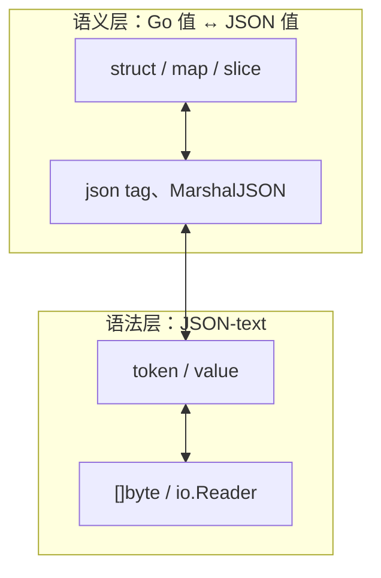
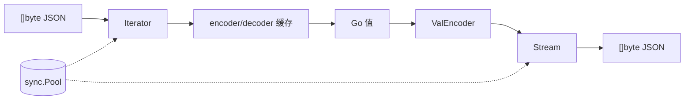
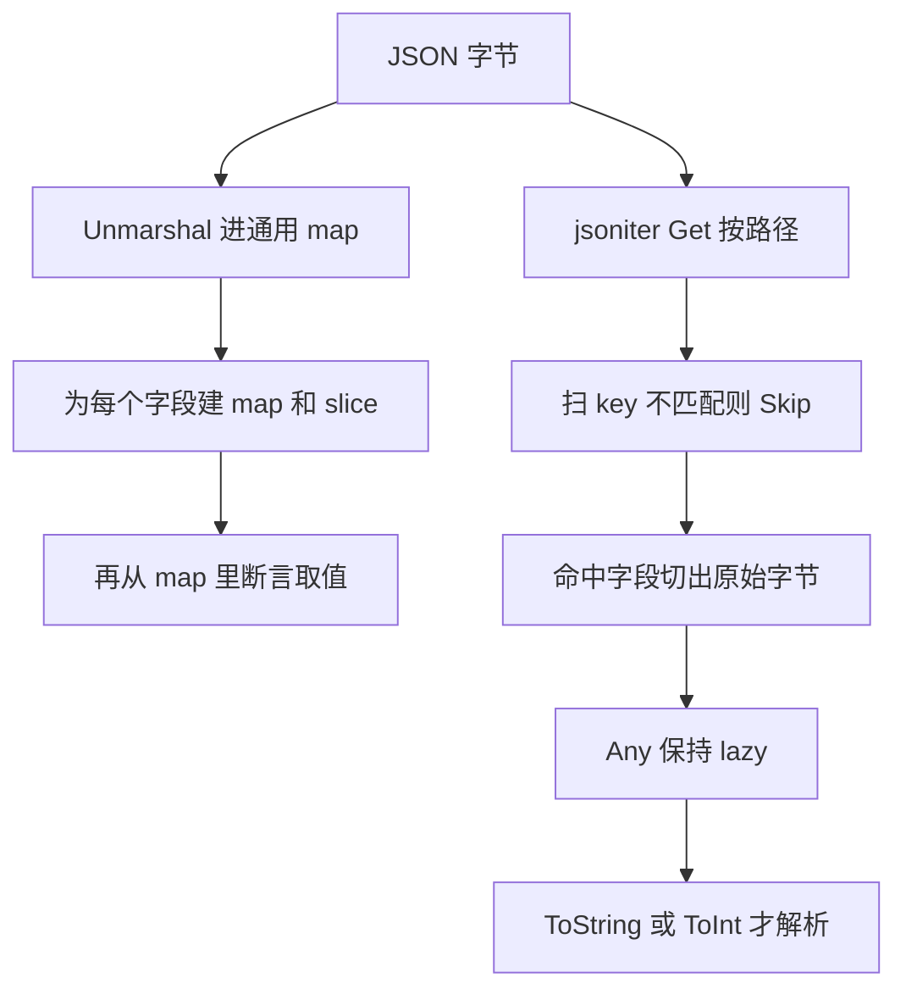
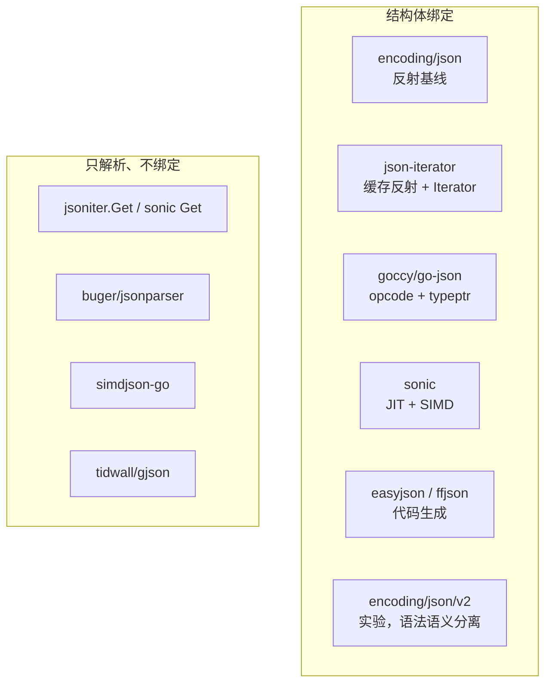
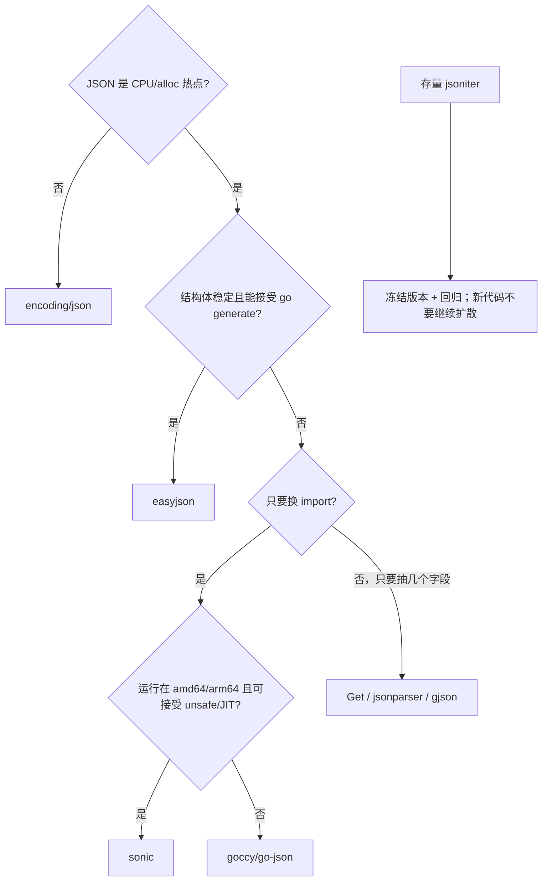

* Do not remove this line (it will not be displayed)
{:toc}

> 本文对照 [json-iterator/go](https://github.com/json-iterator/go)、[从标准库迁移](https://jsoniter.com/migrate-from-go-std.html)、以及若干社区评测（[腾讯云开发者社区](https://cloud.tencent.com/developer/article/1966308)、[javasgl](https://javasgl.github.io/go-json-iterator/)、[SegmentFault](https://segmentfault.com/a/1190000013022780)）整理。站内 [Go Reflect]() 解释反射为何慢，[Go Performance]() 讨论分配与 GC；本文聚焦 JSON 这一高频路径。
{: .prompt-info }

JSON 是 Go 服务里最常见的数据交换格式：HTTP API、消息队列、配置文件、RPC payload 几乎都会经过 `Marshal` / `Unmarshal`。[Go 官方博客](https://go.dev/blog/jsonv2-exp) 指出 `encoding/json` 已是全生态导入量第五的包。对大多数程序它够用；一旦日志解析、网关转发、广告竞价这类路径变成 CPU 热点，反射、分配、字符串转义就会同时出现在 pprof 里。

社区因此走出两条路：**保持 `encoding/json` API、换更快实现**（jsoniter、goccy/go-json、sonic），以及 **用代码生成彻底去掉运行时反射**（easyjson、ffjson）。json-iterator 是前一条路上用得最广的库：号称 100% 兼容标准库、无需 `go generate`，Kubernetes 等项目也曾引入。2025 年 12 月仓库被归档，选型时必须把「存量代码怎么迁」和「新项目还要不要用」分开看。

本文将覆盖：

- 原理：标准库慢在哪里，jsoniter 快在哪里
- 用法：drop-in 替换、`Get` 路径读取、三套 Config
- 示例：结构体绑定、流式编解码、自定义编码器
- 对比：主流库的策略、兼容性与公开基准
- 最佳实践与注意事项（含归档现状与 `json/v2`）

# 原理与核心概念 {#principles}

## JSON 编解码的两层工作

一次 JSON 往返可以拆成两层，这也是 Go 1.25 实验包 [`encoding/json/jsontext`](https://pkg.go.dev/encoding/json/jsontext) 与 [`encoding/json/v2`](https://pkg.go.dev/encoding/json/v2) 刻意分开的边界：

| 层次 | 关心的问题 | 典型 API |
|------|------------|----------|
| **语法（encode / decode）** | 字节流是否合法 JSON：token、字符串转义、数字扫描 | `Decoder.Token`、jsoniter `Iterator` / `Stream` |
| **语义（marshal / unmarshal）** | JSON 值如何对应 Go 值：结构体 tag、`omitempty`、`MarshalJSON` | `json.Marshal`、`json.Unmarshal` |



标准库把两层揉在同一个包里，实现简单，但 `MarshalJSON` / `UnmarshalJSON` 的契约会强迫实现方先拼出完整 `[]byte`，再由库二次校验、再解析——嵌套自定义类型时复杂度接近二次。第三方库要么绕开这套接口（jsoniter 的 `RegisterTypeEncoder`），要么重新设计流式接口（`json/v2` 的 `MarshalJSONTo`）。

## 标准库为什么会成为热点

`encoding/json` 用反射在运行时发现类型：字段名、tag、嵌套关系、`json.Marshaler` 是否实现。反射本身不便宜（见 [Go Reflect in Action]()），再叠上下面几件事，热点就更明显：

1. **每次调用都要走类型分支**。热路径上同一类型会被反复 `reflect.TypeOf` / `Value.Field`。
2. **`MarshalJSON` 强制分配**。方法签名返回 `[]byte`，库还要校验并按缩进重排。
3. **`UnmarshalJSON` 要先切出完整值**。库解析一遍定位边界，用户方法再解析一遍。
4. **Encoder/Decoder 并不真正流式**。即便对着 `io.Reader`，也会把整个 JSON 值缓冲进内存。
5. **默认行为偏宽松、偏安全**。HTML 转义、map key 排序、大小写不敏感匹配，都会换性能。

这些限制大部分写进了公开 API，Go 1 兼容承诺下很难在 `encoding/json` 里直接改掉，这也是后来要做 `json/v2` 的原因。

> 结构体字段必须导出，标准库才能用反射写入。这是 [100 Go Mistakes]() 里讨论可见性时专门列出的例外。
{: .prompt-tip }

## json-iterator 的加速策略

[json-iterator/go](https://github.com/json-iterator/go) 由滴滴开源，定位是 **high-performance、100% compatible drop-in replacement**。它不走 easyjson 那套静态代码生成，而是在运行时把「这个类型该怎么编解码」做成可缓存的编解码器：

1. **类型元数据只反射一次**。第一次遇到 `*ColorGroup` 时构建字段描述符（名字、offset、elem 类型），之后复用。
2. **Iterator / Stream 分离语法层**。读走 `Iterator`，写走 `Stream`，避免标准库那种「先整段缓冲再语义化」的路径。
3. **小结构体用 switch 而不是 map**。字段数较少时，按 hash 做 `switch-case` 分发，比 `map[string]field` 更便宜（也因此存在 hash 碰撞讨论，见 [goccy/go-json README](https://github.com/goccy/go-json)）。
4. **对象池**。`BorrowIterator` / `BorrowStream` 把扫描器和写缓冲放进 `sync.Pool`，降低分配。
5. **可配置的「少做一点」**。`ConfigFastest` 关掉 HTML 转义、用 6 位浮点、假设 object key 是简单字符串，用正确性换吞吐。



和标准库一样，它仍承认 `json.Marshaler` / `json.Unmarshaler`、`NewEncoder` / `NewDecoder`、非 string key 的 map。官方迁移文档强调：**现有实现了这两个接口的类型，以及 `Unmarshal` / `NewEncoder` / `NewDecoder`，都可以原样工作**。

> 仓库已于 **2025-12-15 归档**（read-only）。最新正式版仍是 2021 年的 `v1.1.12`。它适合理解「缓存反射 + Iterator」这条技术路线，以及维护存量代码；**新项目不应再把它当作默认依赖**。
{: .prompt-warning }

# 使用方法 {#usage}

## 安装与 drop-in 替换

```bash
go get github.com/json-iterator/go
```

最小迁移来自 [Migrate from go standard library](https://jsoniter.com/migrate-from-go-std.html)：把 import 换成 jsoniter，再用兼容配置包一层 `json` 变量，调用点不用改。

```go
import jsoniter "github.com/json-iterator/go"

var json = jsoniter.ConfigCompatibleWithStandardLibrary
```

之后 `json.Marshal`、`json.Unmarshal`、`json.NewEncoder`、`json.NewDecoder` 的用法与标准库相同。若只替换函数名而不包一层变量，也可以直接 `jsoniter.Marshal`，但默认配置 **不会** 排序 map key，字节级结果可能和标准库不同。

## 三套预置 Config

`Config` 经 `Froze()` 变成不可变的 `API`。源码里三套预置如下：

| 配置 | 行为要点 | 适用 |
|------|----------|------|
| `ConfigDefault` | `EscapeHTML: true` | 一般替换，不追求字节级一致 |
| `ConfigCompatibleWithStandardLibrary` | HTML 转义 + **排序 map key** + 校验 `RawMessage` | 要和标准库输出对齐、单测比黄金文件 |
| `ConfigFastest` | 不转义 HTML；float 只保留 6 位有效数字；object key 当简单字符串 | 吞吐优先、可接受精度与转义差异 |

```go
type Config struct {
    IndentionStep                 int
    MarshalFloatWith6Digits       bool
    EscapeHTML                    bool
    SortMapKeys                   bool
    UseNumber                     bool
    DisallowUnknownFields         bool
    TagKey                        string
    OnlyTaggedField               bool
    ValidateJsonRawMessage        bool
    ObjectFieldMustBeSimpleString bool
    CaseSensitive                 bool
}
```

> `ConfigFastest` 的浮点是有损的。金额、地理坐标、科学计算不要用这档；需要 100% 兼容时用 `ConfigCompatibleWithStandardLibrary`。
{: .prompt-danger }

也可以自己 `Config{...}.Froze()`，例如打开 `DisallowUnknownFields`、改 `TagKey`，或设 `CaseSensitive: true` 避免标准库那种大小写不敏感匹配。

## 一行读取：`Get` 与 `Any`

不必定义结构体时，用 `Get` 按路径取值，比先 `Unmarshal` 进 `map[string]interface{}` 更便宜、也更好读：

```go
val := []byte(`{"ID":1,"Name":"Reds","Colors":["Crimson","Red","Ruby","Maroon"]}`)
jsoniter.Get(val, "Colors", 0).ToString() // "Crimson"
```

路径参数是 `interface{}`：

- `string`：进 object
- `int`：进 array
- `"*"`：映射到 array 每个元素或 object 每个 key

返回值是 `Any`，可 `ToString` / `ToInt` / `ToBool` 或继续 `Get`。适合日志里只抽一两个字段、网关只读 `code`/`msg` 的场景。若字段很多且类型稳定，结构体绑定仍然更快、更安全。

### 为什么 Get 比 map[string]interface{} 快 {#get-vs-map}

两条路径做的不是同一份工作。`Unmarshal` 进 `map[string]interface{}` 是先把整份 JSON **建成一棵通用 DOM**，再从树里取字段；`Get` 是在字节流上 **按路径定位，路过的节点只 skip、不解码**。官方迁移文档也写了这一点：比解析进 `map[string]interface{}` 更快，也更好读。源码在 [`locatePath` / `locateObjectField`](https://github.com/json-iterator/go/blob/v1.1.12/any.go)。



以 `Get(val, "Colors", 0)` 为例，Iterator 会：

1. 扫顶层 object 的 key。不是 `Colors` 的，对整段 value 调 `Skip()`：按括号配对跳过字符串、数字、嵌套结构，**不分配 Go 值**。
2. 碰到 `Colors`，用 `SkipAndReturnBytes()` 把这段 value 的原始字节切出来，再在数组里数到下标 `0`。
3. 只把这一个元素读成 `Any`。object / array / number 往往还是 lazy 的 `*objectLazyAny` 等，内部仍是 `[]byte`，直到 `ToString()` / `ToInt()` 才解析。

`locateObjectField` 的逻辑可以直接读成「匹配才留下字节，否则 skip」：

```go
func locateObjectField(iter *Iterator, target string) []byte {
    var found []byte
    iter.ReadObjectCB(func(iter *Iterator, field string) bool {
        if field == target {
            found = iter.SkipAndReturnBytes()
            return false
        }
        iter.Skip()
        return true
    })
    return found
}
```

`map[string]interface{}` 则每一层都要付完整语义转换的代价：

| 开销 | `Unmarshal` → `map[string]interface{}` | `Get` 按路径 |
|------|----------------------------------------|--------------|
| 扫描范围 | 整份文档 | 路径上的 key，以及为找路径而 skip 的兄弟节点 |
| 分配 | 每个 object 一张 map、每个 array 一个 slice、每个 string 一份拷贝 | 基本只有命中路径上的那几段 |
| `interface{}` 装箱 | 每个数字 / bool 都装箱上堆 | 目标值才装箱，或 `ToInt` 直接成标量 |
| 嵌套 | 深层结构整棵树都建好 | 未走到的子树保持原始字节 |
| 取完之后 | 还要断言 `m["Colors"].([]interface{})[0].(string)` | `ToString()` 直接取出 |

所以快的本质是：**少做语义转换，多做字节级跳过**。jsoniter 主页把这套 `Any` 称为 lazy parsing：没读到的部分保持 JSON 原文，性能会明显好于 `Map<String, Object>` 那种通用 DOM。

两个边界：

- 目标字段在很大的 object **末尾**时，前面的 key 仍要扫一遍。skip 比解码便宜，但不是零成本。
- 随后对 `Any` 调 `GetInterface()`、`Keys()`，或把整棵树走完，lazy 优势就没了，接近又做了一次通用解码。

> 只抽一两个字段时用 `Get`（以及 jsonparser、gjson）。字段几乎都要用，还是具体结构体更快、更安全，不要为了「不用定义类型」先 Unmarshal 成 `map[string]any`。
{: .prompt-tip }

## 复用 Iterator / Stream

官方「绝对性能」清单里，除了 `ConfigFastest`，就是把底层实例还回池子：

```go
iter := jsoniter.ConfigFastest.BorrowIterator(buf)
defer jsoniter.ConfigFastest.ReturnIterator(iter)
iter.ReadVal(&out)
```

```go
stream := jsoniter.ConfigFastest.BorrowStream(nil)
defer jsoniter.ConfigFastest.ReturnStream(stream)
stream.WriteVal(v)
b := append([]byte(nil), stream.Buffer()...)
```

`Marshal` 内部已经在借还 Stream；热点路径若自己拼 JSON 或反复解析同一形状的报文，显式借还可以少几次 pool miss。**必须成对 Return**，否则等于泄漏缓冲。

## 自定义编解码：少用 `MarshalJSON`

标准库接口会多一次拷贝与校验。jsoniter 提供 `RegisterTypeEncoder` / `RegisterTypeDecoder`，直接写 `Stream` / `Iterator`：

```go
jsoniter.RegisterTypeEncoderFunc("time.Time", func(ptr unsafe.Pointer, stream *jsoniter.Stream) {
    t := *((*time.Time)(ptr))
    stream.WriteString(t.UTC().Format(time.RFC3339Nano))
}, func(ptr unsafe.Pointer) bool {
    return (*time.Time)(ptr).IsZero()
})
```

这是典型的「为性能放弃一点可移植性」：编码器绑在 jsoniter 上，换回标准库就失效。新代码若还要兼容 `encoding/json`，继续实现 `MarshalJSON` 更稳妥。

# 使用示例 {#examples}

## 结构体 Marshal / Unmarshal

```go
package main

import (
    "fmt"
    "log"

    jsoniter "github.com/json-iterator/go"
)

var json = jsoniter.ConfigCompatibleWithStandardLibrary

type ColorGroup struct {
    ID     int
    Name   string
    Colors []string
}

func main() {
    group := ColorGroup{
        ID:     1,
        Name:   "Reds",
        Colors: []string{"Crimson", "Red", "Ruby", "Maroon"},
    }
    b, err := json.Marshal(group)
    if err != nil {
        log.Fatal(err)
    }
    fmt.Println(string(b))

    var out ColorGroup
    if err := json.Unmarshal(b, &out); err != nil {
        log.Fatal(err)
    }
    fmt.Printf("%+v\n", out)
}
```

输出应与 `encoding/json` 一致：

```text
{"ID":1,"Name":"Reds","Colors":["Crimson","Red","Ruby","Maroon"]}
```

## 兼容性差异：map key 是否排序

```go
m := map[string]interface{}{
    "3": 3,
    "1": 1,
    "2": 2,
}

b1, _ := jsoniter.Marshal(m) // ConfigDefault：key 顺序不稳定
b2, _ := jsoniter.ConfigCompatibleWithStandardLibrary.Marshal(m)
```

单测若用 `bytes.Equal` 对比黄金 JSON，必须用兼容配置，否则会随机失败。

## 流式 Encoder / Decoder

```go
enc := json.NewEncoder(os.Stdout)
enc.SetIndent("", "  ")
_ = enc.Encode(group)

dec := json.NewDecoder(bytes.NewReader(payload))
for {
    var item ColorGroup
    if err := dec.Decode(&item); err == io.EOF {
        break
    } else if err != nil {
        log.Fatal(err)
    }
}
```

API 形状与标准库相同，便于网关、NDJSON 日志这类「一条一条吐」的场景。

## 只取路径，不绑定结构体

```go
raw := []byte(`{"user":{"id":42,"roles":["admin","ops"]},"ok":true}`)
id := jsoniter.Get(raw, "user", "id").ToInt()
role0 := jsoniter.Get(raw, "user", "roles", 0).ToString()
```

适合 schema 不稳定、或只关心几个字段的遥测数据。底层为何比 `map[string]interface{}` 便宜，见上文 [为什么 Get 比 map[string]interface{} 快](#get-vs-map)。错误路径上 `Any` 会变成 invalid，调用方应检查 `LastError()` / `ValueType()`，不要默认 `ToInt()` 的零值就是业务零。

# 主流编解码库对照 {#landscape}

社区里常见的库可以按「要不要结构体绑定」和「快从哪里来」分组：



| 库 | 策略 | 与 `encoding/json` | 生成代码 | 维护状态（2026） |
|----|------|---------------------|----------|------------------|
| [`encoding/json`](https://pkg.go.dev/encoding/json) | 反射 | 自身 | 否 | 标准库，持续演进 |
| [`json-iterator/go`](https://github.com/json-iterator/go) | 缓存反射 + Iterator | 宣称 100%，实际 [有差异](https://github.com/json-iterator/go/issues/229) | 否 | **已归档** |
| [`mailru/easyjson`](https://github.com/mailru/easyjson) | 静态生成 `MarshalJSON` | 刻意砍掉部分特性换速度 | 是 | 仍常用 |
| [`pquerna/ffjson`](https://github.com/pquerna/ffjson) | 静态生成 | 接近标准库 | 是 | 基本停滞 |
| [`goccy/go-json`](https://github.com/goccy/go-json) | typeptr 缓存 + opcode VM | 目标完全兼容 | 否 | 活跃，推荐的 drop-in 之一 |
| [`bytedance/sonic`](https://github.com/bytedance/sonic) | JIT + SIMD | 大体兼容；HTML 转义、SortKeys 等有差异 | 否 | 活跃；限 amd64/arm64 |
| [`segmentio/encoding/json`](https://github.com/segmentio/encoding/tree/master/json) | 优化反射 | 部分兼容（Decoder.Token 等不全） | 否 | 仍维护 |
| [`buger/jsonparser`](https://github.com/buger/jsonparser) | 按路径解析 | 非绑定库，无 Marshal | 否 | 解析专用 |
| [`minio/simdjson-go`](https://github.com/minio/simdjson-go) | SIMD 解析 | 仅 decode | 否 | 解析专用 |
| [`encoding/json/v2`](https://go.dev/blog/jsonv2-exp) | 语法/语义分离、真流式 | 行为有意修正（UTF-8、重复 key 等） | 否 | Go 1.25+ 实验 |

## encoding/json：默认且正确的起点

没有证据表明 JSON 是热点时，标准库是正确选择：零额外依赖、行为被全生态测试、安全补丁跟 Go 版本走。Go 版本迭代里标准库也在变快，早期「jsoniter 快 3～4 倍」的数字不能直接套到今天。

## easyjson / ffjson：编译期换运行时

两者都在 `go generate` 时写出具体类型的编解码函数，运行时几乎不反射。[hatlonely 的 2018 评测](https://segmentfault.com/a/1190000013022780) 里 easyjson 序列化大约快 1 倍、反序列化大约快 3 倍，综合最优；ffjson 提升较小。近年独立基准里 easyjson 在「已知结构体」上仍经常是数量级领先，代价是：

- 结构体一改就要重新生成
- 放弃部分标准库行为（key 大小写不敏感等）
- 生成代码进入 diff，评审噪音大

ffjson 已接近停止维护，新项目没有理由再选它。

## goccy/go-json：更认真的 drop-in

[goccy/go-json](https://github.com/goccy/go-json) 明确把「兼容 `encoding/json`」写成目标，并指出 jsoniter 在不少边界上并不兼容且长期未修。实现上用 `typeptr` 找到类型专用编码器，把结构体编码编成 opcode 序列（类似小型 VM），用 `switch` 解释以减少间接调用，再用 opcode 融合减少分支。替换方式比 jsoniter 更直：

```go
- import "encoding/json"
+ import "github.com/goccy/go-json"
```

适合「API 不能动、还想从归档的 jsoniter 迁走」的代码库。

## sonic：JIT + SIMD 的上限

[bytedance/sonic](https://github.com/bytedance/sonic) 用 JIT 为具体类型生成机器码，用 SIMD 并行扫引号、反斜杠、UTF-8。官方 medium payload（约 13KB）绑定编码约 2 GB/s，标准库约 0.8 GB/s，jsoniter 约 0.65 GB/s。约束同样明确：

- Go 1.18–1.26，OS 为 Linux/macOS/Windows，CPU 为 amd64 或 arm64（arm64 需 Go 1.20+）
- 不支持的平台回退到 `encoding/json`
- 默认 HTML 转义、可选 SortKeys 与 RFC 8259 / 标准库不完全一致
- 依赖 `unsafe` 与链接器细节（Go 1.24.0 需避开或加 `-ldflags="-checklinkname=0"`）

网关、序列化 QPS 极高、且运行在 amd64/arm64 上时，sonic 通常是目前最快的绑定库之一。

## 只解析：jsonparser、simdjson-go、Get

[hatlonely](https://segmentfault.com/a/1190000013022780) 就把 jsonparser 排除在「序列化库」之外：它只提供按路径取值，每次调用都要重新扫描，没有 Marshal。日志管道、协议嗅探、只读 `$.status` 时，这类库（以及 jsoniter `Get`、sonic Get、gjson）往往比整包 Unmarshal 更合适。

## encoding/json/v2：标准库自己的下一代

Go 1.25 以 `GOEXPERIMENT=jsonv2` 放出实验 API，见 [A new experimental Go API for JSON](https://go.dev/blog/jsonv2-exp)。它要修的不只是速度，还有行为：拒绝非法 UTF-8 与重复 key、nil slice/map 默认编成空数组/对象、大小写敏感匹配、真正的流式 Encoder/Decoder。公开接口不稳定，**生产默认路径仍应使用 `encoding/json`**；关心长期演进的团队可以在实验开关下跑回归，给 [proposal](https://github.com/golang/go/issues/71497) 反馈。

# 性能对比 {#benchmarks}

数字高度依赖 payload、Go 版本和机器。下面几组来自不同年代，用来看**量级和趋势**，不要直接当容量规划。

## 官方 medium payload（jsoniter README）

来源：[json-iterator/go Benchmark](https://github.com/json-iterator/go#benchmark)，easyjson 需要静态生成。

| 操作 | ns/op | B/op | allocs/op |
|------|------:|-----:|----------:|
| std decode | 35510 | 1960 | 99 |
| easyjson decode | 8499 | 160 | 4 |
| **jsoniter decode** | **5623** | **160** | **3** |
| std encode | 2213 | 712 | 5 |
| easyjson encode | 883 | 576 | 3 |
| **jsoniter encode** | **837** | **384** | **4** |

解码大约是标准库的 6 倍快、分配次数从 99 降到 3；编码大约 2.6 倍。这是 jsoniter 对外宣传的核心数字。

## 字符串数组 Unmarshal（腾讯云社区，2022）

[jsoniter 与原生 json 对比](https://cloud.tencent.com/developer/article/1966308) 测的是 `[]string`（元素长度约 10）：

| 长度 | std ns/op | jsoniter ns/op | 大约倍数 |
|------|----------:|---------------:|--------:|
| 10 | 7230 | 2921 | ~2.5× |
| 1000 | 426381 | 122974 | ~3.5× |
| 100000 | 43.0 ms | 16.1 ms | ~2.7× |

allocs/op 几乎相同（大数组时都是「一个元素一次分配」量级）。作者结论：**时间能快 3～4 倍，内存分配差不大**；分配爆炸仍要靠缓存或预分配，而不是换 JSON 库。

## 早期综合评测（2017–2018）

[javasgl（2017）](https://javasgl.github.io/go-json-iterator/) 数组 Unmarshal：json 2748 ns/op vs jsoniter 676 ns/op，分配 14 次 vs 3 次。

[hatlonely（2018）](https://segmentfault.com/a/1190000013022780) Marshal / Unmarshal 相对标准库：

| 库 | Marshal | Unmarshal | 备注 |
|----|--------:|----------:|------|
| easyjson | ~2× | ~4× | 需预编译，综合最优 |
| jsoniter | ~1.4× | ~4× | 无预编译，接近 easyjson |
| ffjson | 提升有限 | ~2× | 生成代码 |
| codec-json | 相近或更差 | 差 | 使用复杂 |
| jsonparser | — | 提升有限 | 仅解析 |

当时的建议是：**综合选 jsoniter；极致性能选 easyjson**。这个判断在「只要 drop-in」的年代是对的；2026 年要把归档事实和 sonic / go-json / `json/v2` 加进去。

## 较新的绑定库对比（sonic 官方，~13KB）

摘自 [sonic README](https://github.com/bytedance/sonic) Binding 场景（单线程，darwin/amd64）：

| 库 | Encode MB/s | Decode MB/s |
|----|------------:|------------:|
| sonic | ~2079 | ~400 |
| go-json | ~1568 | ~454 |
| jsoniter | ~650 | ~371 |
| stdlib | ~793 | ~117 |

绑定解码上 jsoniter 仍明显快于标准库，但编码已被 sonic、go-json 超过；解码 sonic / go-json 与 jsoniter 同量级，sonic Fast 模式分配更少。**「jsoniter 永远最快」已经不是事实。**

> 务必用自己的结构体和真实 payload 跑 `go test -bench`。官方和博客数字只能用来排除明显不合适的选项。
{: .prompt-warning }

# 最佳实践 {#best-practices}

## 先测量，再换库

在 pprof 里确认 `encoding/json.Marshal` / `Unmarshal`（或对应的 `jsoniter` 符号）占 CPU 或 alloc 的显著比例，再谈替换。CPU 只有 2% 时，换库的复杂度、行为差异和供应链风险都不划算。测量方法见 [Go Performance in Action]()。

## 按场景选型，而不是按博客标题



| 场景 | 建议 |
|------|------|
| 内部工具、配置、低 QPS API | `encoding/json` |
| 已有 jsoniter、行为已锁定 | 继续用兼容配置；加回归；规划迁到 go-json 或 sonic |
| 新服务、要 drop-in 加速 | 优先 `goccy/go-json` 或 `sonic`（看平台与安全策略） |
| 类型极少、QPS 极高 | easyjson |
| 日志/网关只读若干 key | `Get`、jsonparser、gjson、sonic Get |
| 跟进标准库长期方向 | 实验环境试用 `json/v2`，不要当生产默认 |

## 用兼容配置包一层，避免项目里混用三种 JSON

```go
package jsonx

import jsoniter "github.com/json-iterator/go"

var JSON = jsoniter.ConfigCompatibleWithStandardLibrary
```

业务代码只依赖 `jsonx.JSON`。将来迁到 `github.com/goccy/go-json` 或等 `json/v2` 稳定，改一处即可。不要一部分包用 `jsoniter.Marshal`（默认不排序 key），另一部分用标准库，否则缓存、签名、黄金文件会对不上。

## 减少反射与分配，比换库更常赚到

换库解决的是「同一份工作做得更快」。下面这些改动往往效果更大：

- 不要 `map[string]interface{}` 来回转；用具体结构体（与 [100 Go Mistakes]() 里「能具体就不要 any」同一思路）
- 切片预分配，避免 Unmarshal 后再 `append` 扩容
- 热路径复用 `bytes.Buffer` / 对象池，或 jsoniter 的 Borrow API
- 能抽字段就不要整包解析
- 避免在 `MarshalJSON` 里再调 `json.Marshal` 造成二次解析

## 行为要对齐测试，而不只对齐文档

替换之后至少覆盖：

- `null` vs 空数组 / 空对象
- `omitempty`、匿名嵌套、冲突字段名
- `time.Time`、`json.Number`、`json.RawMessage`
- 未知字段（是否 `DisallowUnknownFields`）
- HTML 字符 `<>&`
- 浮点精度（尤其开了 `ConfigFastest`）
- 非 UTF-8、重复 key（安全相关）

标准库、jsoniter、sonic 在上述几点上并不完全一致。契约测试比「官方说 100% 兼容」可靠。

# 注意事项 {#caveats}

**jsoniter 已归档。** 2025-12-15 之后仓库只读，issue 与 Go 新版本（`go:linkname`、reflect 内部布局）不会再有官方修复。存量项目应 pin 已知可用版本，并准备迁移；新模块不要新增这个依赖。

**「100% 兼容」是营销语言。** 默认不排序 map key；`ConfigFastest` 有损浮点、不转义 HTML；[goccy 列举的差异](https://github.com/goccy/go-json#json-library-comparison) 和 [issue 229](https://github.com/json-iterator/go/issues/229) 说明边界行为与标准库有缺口，且归档后不会补。

**`unsafe` 与 `go:linkname`。** jsoniter 依赖 `modern-go/reflect2` 直调 runtime。Go 1.18 改过 `mapiterinit` 签名，旧组合（如 jsoniter v1.1.10 + reflect2 v1.0.1）会在升级后 **运行时 panic**。升级 Go 时必须同步升级这对依赖。sonic 在 Go 1.24.0 上也有类似链接器限制。

**不要用 ConfigFastest 处理钱和科学数值。** 6 位有效数字会静默改数据。

**MarshalJSON 仍可能把优势吃掉。** 类型若大量实现标准库接口，jsoniter 仍要走拷贝路径。热点类型更适合 `RegisterTypeEncoder`，或换本身就优化这条路径的库。

**分配次数不一定下降。** 腾讯云那组 `[]string` 基准里，allocs/op 几乎持平。大 slice、大 map 的元素分配是算法问题，换 JSON 库解决不了，该缓存还是要缓存。

**平台与二进制体积。** sonic 的 JIT/SIMD 在不支持的架构上会静默回退；easyjson 会把生成代码推进仓库。选库时把 CI 矩阵、审计要求和二进制大小算进去。

**安全默认值。** 标准库 `json/v2` 打算拒绝重复 key 和非法 UTF-8；旧 jsoniter / 标准库 v1 更宽松。对外暴露的解析入口，应用层要自己限制深度、大小和未知字段。

# 总结 {#summary}

json-iterator 证明了一件事：在不牺牲 `encoding/json` 手感的前提下，靠缓存反射、Iterator/Stream 和可切换配置，可以把 JSON 从「随便用」变成「还能再快几倍」。它降低了换库门槛，也把 Kubernetes 等项目带进了这条路。

2026 年看，它的历史任务已经完成：仓库归档，标准库本身在变快，`json/v2` 在修 API 层面的结构性问题，goccy/go-json 把 drop-in 做得更严，sonic 把绑定性能推到 JIT/SIMD。对新代码，jsoniter 不再是默认答案；对老代码，它仍是必须读懂的一层依赖。

可执行的结论：

1. **默认用 `encoding/json`**，用 pprof 证明热点再优化。
2. **存量 jsoniter 用 `ConfigCompatibleWithStandardLibrary` 包一层**，加契约测试，停止扩散。
3. **新的 drop-in 加速看 `goccy/go-json` 或 `sonic`**；类型极稳、要极限再上 easyjson。
4. **只读几个字段用路径解析**，不要为了方便 Unmarshal 成 `map[string]any`。
5. **数字以自己的负载为准**；跨年、跨库的 ns/op 不能直接比较。

# 参考资源 {#references}

### 官方与源码

- [json-iterator/go](https://github.com/json-iterator/go) — 仓库（已归档）、官方基准与 drop-in 示例
- [Migrate from go standard library](https://jsoniter.com/migrate-from-go-std.html) — 兼容替换、`Get`、三套 Config、Borrow API
- [jsoniter Any / locatePath 源码](https://github.com/json-iterator/go/blob/v1.1.12/any.go) — 路径查找时对未命中字段 `Skip`，命中值可 lazy 保留 `[]byte`
- [encoding/json](https://pkg.go.dev/encoding/json) — 标准库文档
- [A new experimental Go API for JSON](https://go.dev/blog/jsonv2-exp) — `json/v2` 与 `jsontext` 设计动机
- [goccy/go-json](https://github.com/goccy/go-json) — opcode / typeptr 实现说明与库对比表
- [bytedance/sonic](https://github.com/bytedance/sonic) — JIT/SIMD、平台限制与 Binding 基准
- [mailru/easyjson](https://github.com/mailru/easyjson) — 代码生成路线

### 社区评测（文中引用）

- [jsoniter 与原生 json 对比（腾讯云开发者社区）](https://cloud.tencent.com/developer/article/1966308) — `[]string` 规模扫描
- [json-iterator：更快的 json 解析库（javasgl）](https://javasgl.github.io/go-json-iterator/) — 2017 年 Marshal/Unmarshal 对照，提及 K8s 引入
- [golang json 性能分析（hatlonely / SegmentFault）](https://segmentfault.com/a/1190000013022780) — ffjson / easyjson / jsoniter / codec / jsonparser
- [Go json-iterator 相关整理（CSDN）](https://blog.csdn.net/gitblog_01165/article/details/153161847)
- [Go JSON Performance Showdown（Saraikin）](https://saraikin.com/posts/golang-json-marshalling/) — 含 sonic、go-json、easyjson 的较新对照

### 站内交叉引用

- [Go Reflect in Action]() — 反射开销
- [Go Performance in Action]() — pprof 与分配
- [100 Go Mistakes]() — 导出字段与 JSON、避免过度 `any`
- [Go in Action]() — 语言与标准库基础
